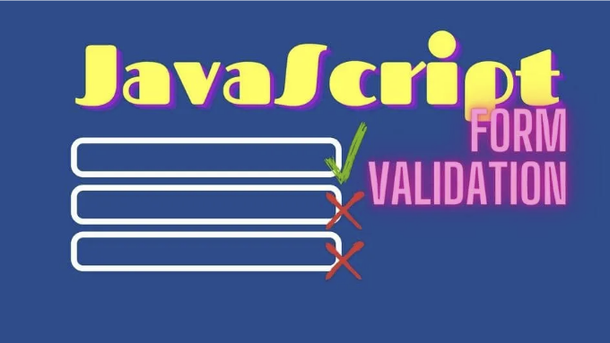
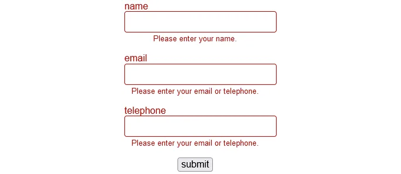
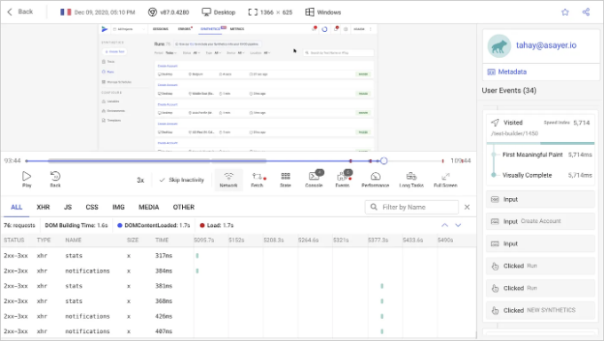

## JavaScript의 내장 API를 사용하여 훌륭한 폼 유효성 검사 만드는 방법 배우기



폼 유효성 검사는 클라이언트 측 JavaScript를 사용하는 주요 이유 중 하나입니다. 이를 통해 앱이 서버로 데이터를 제출하기 전에 사용자 입력 오류를 방지할 수 있습니다. 하지만...

항상 서버에서 들어오는 사용자 데이터를 확인하세요. 모든 요청이 브라우저에서 올 것이라는 보장은 없으며, 모든 브라우저가 유효성 검사 코드를 실행할 것도 아닙니다. 클라이언트 측 유효성 검사는 시스템을 사용하기 더 편리하게 만드는 기능일 뿐입니다.

<!-- ui-log 수평형 -->
<ins class="adsbygoogle"
  style="display:block"
  data-ad-client="ca-pub-4877378276818686"
  data-ad-slot="9743150776"
  data-ad-format="auto"
  data-full-width-responsive="true"></ins>
<component is="script">
(adsbygoogle = window.adsbygoogle || []).push({});
</component>

그렇다면, 간단한 양식 유효성 검사에 JavaScript가 필요하지 않을 수 있습니다...

# HTML5 필드 유효성 검사

현대의 HTML5 브라우저는 JavaScript 없이도 필드를 유효성 검사할 수 있습니다. 타입 속성은 제약 조건을 설정하고 표준 입력 필드의 UI를 변경할 수 있습니다:

- button: 기본 동작이 없는 버튼
- checkbox: 체크박스
- color: 색상 선택기
- date: 연도, 월, 일을 위한 날짜 선택기
- datetime-local: 날짜 및 시간 선택기
- email: 이메일 입력
- file: 파일 선택기
- hidden: 숨겨진 필드
- image: src 속성에 정의된 이미지를 표시하는 버튼
- month: 월 및 연도 선택기
- number: 숫자 입력
- password: 비밀번호 입력 (가려진 텍스트)
- radio: 라디오 버튼
- range: 슬라이더 컨트롤
- reset: 모든 양식 입력을 기본값으로 재설정합니다 (피해주세요)
- search: 검색 입력
- submit: 양식 전송 버튼
- tel: 전화번호
- text: 텍스트 입력
- time: 시간 선택기 (시간대 없음)
- url: URL 입력
- week: 주 번호 및 연도 선택기

<!-- ui-log 수평형 -->
<ins class="adsbygoogle"
  style="display:block"
  data-ad-client="ca-pub-4877378276818686"
  data-ad-slot="9743150776"
  data-ad-format="auto"
  data-full-width-responsive="true"></ins>
<component is="script">
(adsbygoogle = window.adsbygoogle || []).push({});
</component>

브라우저는 지원되지 않는 형식 속성을 생략하거나 사용할 때 텍스트를 가정합니다. 이는 오래된 브라우저에서 사용자가 자동으로 유효성을 검증할 수 없는 경우에도 무언가를 입력할 수 있도록 허용해야 합니다.

다른 제약 제어 속성에는 다음이 포함됩니다:

- 파일 업로드 유형을 나타내는 `accept`
- 이미지에 대한 `alt` 속성
- 자동 완성 힌트인 `autocomplete`
- 필드에 초점을 맞추는 `autofocus`
- 미디어 캡처 방법을 보여주는 `capture`
- 체크된 상태인지 나타내는 `checked` (체크박스나 라디오)
- 통과되지 않은 필드를 비활성화하는 `disabled` (유효성을 검증하거나 제출되지 않음)
- 이 id를 사용하여 양식과 연결하는 `form`
- 제출을 위한 URL을 지정하는 `formaction` (제출 및 이미지 버튼)
- 데이터 유형 힌트인 `inputmode` (none, text, tel, url, email, numeric, decimal, search)
- `datalist`의 id인 `list`
- 최대값을 나타내는 `max`
- 최대 문자열 길이를 나타내는 `maxlength`
- 최소값을 나타내는 `min`
- 최소 문자열 길이를 나타내는 `minlength`
- 서버로 제출되는 컨트롤의 이름인 `name`
- 유효성을 검증하는 패턴 정규 표현식인 `pattern` (예: [1-3]+ 1부터 3까지의 숫자 중 하나 이상)
- 빈 필드에 대한 플레이스홀더 텍스트인 `placeholder`
- 편집할 수 없는 필드인 `readonly` (검증 및 제출)
- 필수 필드를 나타내는 `required`
- 일반적으로 CSS에서 재정의되는 컨트롤의 크기인 `size`
- 맞춤법 검사 여부를 설정하는 `spellcheck` (true 또는 false)
- 이미지 URL인 `src`
- 숫자 및 범위의 증가값을 나타내는 `step`
- 초기 값인 `value`

# 입력 인터페이스

<!-- ui-log 수평형 -->
<ins class="adsbygoogle"
  style="display:block"
  data-ad-client="ca-pub-4877378276818686"
  data-ad-slot="9743150776"
  data-ad-format="auto"
  data-full-width-responsive="true"></ins>
<component is="script">
(adsbygoogle = window.adsbygoogle || []).push({});
</component>

필드 유형과 제약 속성은 브라우저의 UI 동작을 변경할 수 있어요. 숫자 입력란은 모바일 기기에서 숫자 키보드를 보여주며 스피너를 표시하거나 상하 커서를 눌러 값을 증가 및 감소할 수 있어요.

가장 명백한 유형을 사용하지만 신용 카드와 같은 특수 경우에 주의해야 해요. 이들은 숫자이지만 스피너와 키보드 커서 키가 도움이 되지 않아요. 표준 텍스트 입력란을 사용하는 것이 좋아요:

```js
<input
  type="text"
  name="ccnumber"
  inputmode="numeric"
  autocomplete="cc-number"
/>
```

브라우저는 자동 완성 유형을 만날 때 카메라 스캔이나 SMS 확인과 같은 기능을 제공할 수 있어요.

<!-- ui-log 수평형 -->
<ins class="adsbygoogle"
  style="display:block"
  data-ad-client="ca-pub-4877378276818686"
  data-ad-slot="9743150776"
  data-ad-format="auto"
  data-full-width-responsive="true"></ins>
<component is="script">
(adsbygoogle = window.adsbygoogle || []).push({});
</component>

# 내장 유효성 검사

브라우저는 type, min, max, step, minlength, maxlength, pattern, required 속성에 정의된 제약 조건을 준수하는 값을 보장합니다:

```js
<input type="number" min="1" max="100" required />
```

빈 값, 유효하지 않은 값 또는 범위를 벗어난 값으로 제출하려고 시도하면 양식 제출이 중지되고 일반 오류 메시지가 표시됩니다.

<!-- ui-log 수평형 -->
<ins class="adsbygoogle"
  style="display:block"
  data-ad-client="ca-pub-4877378276818686"
  data-ad-slot="9743150776"
  data-ad-format="auto"
  data-full-width-responsive="true"></ins>
<component is="script">
(adsbygoogle = window.adsbygoogle || []).push({});
</component>


브라우저의 기본 유효성 검사를 중지하려면:

- `form`에 novalidate 속성을 추가하거나
- 제출 버튼/이미지 `input`에 formnovalidate 속성을 추가하면 됩니다.

# CSS 유효성 검사 스타일

<!-- ui-log 수평형 -->
<ins class="adsbygoogle"
  style="display:block"
  data-ad-client="ca-pub-4877378276818686"
  data-ad-slot="9743150776"
  data-ad-format="auto"
  data-full-width-responsive="true"></ins>
<component is="script">
(adsbygoogle = window.adsbygoogle || []).push({});
</component>

다음 가상 클래스들을 사용하면 입력 요소를 상태에 따라 스타일링할 수 있어요:

- :focus: 포커스가 있는 필드
- :focus-within: 포커스가 있는 필드를 포함하는 엘리먼트
- :focus-visible: 키보드 탐색으로 인해 포커스를 가진 엘리먼트
- :required: 필수 속성이 있는 필드
- :optional: 필수 속성이 없는 필드
- :valid: 유효성 검사를 통과한 필드
- :invalid: 유효성 검사를 통과하지 못한 필드
- :user-valid: 사용자 상호작용 후 유효성 검사를 통과한 필드 (Firefox 전용)
- :user-invalid: 사용자 상호작용 후 유효성 검사를 통과하지 못한 필드 (Firefox 전용)
- :in-range: 숫자나 범위 입력 값이 범위 내에 있는 경우
- :out-of-range: 숫자나 범위 입력 값이 범위를 벗어난 경우
- :disabled: 비활성화된 속성을 가진 필드
- :enabled: 비활성화된 속성이 없는 필드
- :read-only: 읽기 전용 속성을 가진 필드
- :read-write: 읽기 전용 속성이 없는 필드
- :checked: 체크된 체크박스나 라디오 버튼
- :indeterminate: 중간 상태인 체크박스나 라디오 상태
- :default: 기본 제출 버튼이나 이미지

이러한 선택자들은 동일한 우선순위를 가지므로 순서가 중요할 수 있어요. 예를 들어:

\```js
input:invalid { color: red; }
input:enabled { color: blue; }
\```

<!-- ui-log 수평형 -->
<ins class="adsbygoogle"
  style="display:block"
  data-ad-client="ca-pub-4877378276818686"
  data-ad-slot="9743150776"
  data-ad-format="auto"
  data-full-width-responsive="true"></ins>
<component is="script">
(adsbygoogle = window.adsbygoogle || []).push({});
</component>

잘못된 입력은 빨간색 텍스트로 표시됩니다 — 하지만 이는 모든 비비활성화된 입력들이 파란색으로 재정의되기 때문에 무효화됩니다.

또한 브라우저가 페이지를 로드할 때 유효성 스타일을 적용한다는 점에 유의해야 합니다. 다음 예시는 사용자가 양식과 상호 작용하기 전에 모든 필드를 빨간색 텍스트와 빨간 테두리로 표시하는 것을 보여줍니다:

```js
:invalid {
  color: red;
  border-color: red;
}
```

일반적으로 사용자가 필드와 상호 작용하거나 전체 양식을 제출하려고 시도한 후에 오류 메시지와 색상을 표시하는 것이 좋습니다.

<!-- ui-log 수평형 -->
<ins class="adsbygoogle"
  style="display:block"
  data-ad-client="ca-pub-4877378276818686"
  data-ad-slot="9743150776"
  data-ad-format="auto"
  data-full-width-responsive="true"></ins>
<component is="script">
(adsbygoogle = window.adsbygoogle || []).push({});
</component>

# 제약 검증 API

제약 검증 API는 표준 HTML5 필드 검사 동작을 개선하거나 수정할 수 있는 사용자 정의 옵션을 제공합니다. 사용자 상호 작용 후에 유효성 검사를 수행하거나 특정 오류 메시지를 표시하거나 프로그래밍 방식의 유효성 검사를 구현할 수 있습니다. 예를 들어:

- 새 비밀번호와 확인 비밀번호 필드가 일치하는지 확인
- 날짜 하나가 다른 날짜보다 뒤에 있는지 확인
- 사용자가 전화 번호, 이메일 주소 또는 둘 다를 입력했는지 확인

다음 섹션에서는 제약 검증 API를 사용하여 귀하의 코드에서 일반적인 접근 방식을 설명합니다.

<!-- ui-log 수평형 -->
<ins class="adsbygoogle"
  style="display:block"
  data-ad-client="ca-pub-4877378276818686"
  data-ad-slot="9743150776"
  data-ad-format="auto"
  data-full-width-responsive="true"></ins>
<component is="script">
(adsbygoogle = window.adsbygoogle || []).push({});
</component>

## 1. 기본 폼 유효성 검사 비활성화하기

당신의 코드는 `form`의 noValidate 속성을 true로 설정하여 기본 HTML5 폼 유효성 검사와 오류 메시지를 비활성화해야 합니다.

예시:
```js
const myform = document.getElementById('myform');
myform.noValidate = true;
```

## 2. 폼 이벤트 핸들러 추가하기

<!-- ui-log 수평형 -->
<ins class="adsbygoogle"
  style="display:block"
  data-ad-client="ca-pub-4877378276818686"
  data-ad-slot="9743150776"
  data-ad-format="auto"
  data-full-width-responsive="true"></ins>
<component is="script">
(adsbygoogle = window.adsbygoogle || []).push({});
</component>

그런 다음 필요에 따라 form 제출 또는 개별 필드 변경에 대한 이벤트 핸들러를 추가해야 합니다. 예를 들면,

```js
// 폼 제출 시 폼 유효성 검사
myform.addEventListener('submit', validateForm);
```

핸들러 함수는 form 요소 메서드를 사용하여 전체 form이 유효한지 확인할 수 있습니다:

- checkValidity() - 모든 하위 컨트롤이 제약 조건 유효성을 준수하고 제약 조건을 충족하는 경우 true를 반환
- reportValidity() - 하위 컨트롤이 제약 조건 유효성의 대상이 아니거나 제약 조건을 충족하는 경우 true를 반환합니다.

<!-- ui-log 수평형 -->
<ins class="adsbygoogle"
  style="display:block"
  data-ad-client="ca-pub-4877378276818686"
  data-ad-slot="9743150776"
  data-ad-format="auto"
  data-full-width-responsive="true"></ins>
<component is="script">
(adsbygoogle = window.adsbygoogle || []).push({});
</component>

양식이 제출될 때 두 가지 방법 모두 모든 잘못된 필드에서 잘못된 이벤트를 트리거합니다. 이는 버블링되지 않으므로 필요한 모든 필드에 대해서 핸들러를 설정해야 합니다.

이 간단한 핸들러 함수는 하나 이상의 필드가 잘못된 경우 양식 제출을 중지시킵니다:

```js
// 제출시 양식 유효성 검사
function validateForm(e) {
  const form = e.target;
  if (!form.checkValidity()) {
    // 양식이 유효하지 않음 - 제출 취소
    e.preventDefault();
    e.stopImmediatePropagation();
  }
};
```

## 3. 개별 필드 유효성 검사

<!-- ui-log 수평형 -->
<ins class="adsbygoogle"
  style="display:block"
  data-ad-client="ca-pub-4877378276818686"
  data-ad-slot="9743150776"
  data-ad-format="auto"
  data-full-width-responsive="true"></ins>
<component is="script">
(adsbygoogle = window.adsbygoogle || []).push({});
</component>

개별 필드는 다음 제약 유효성 속성과 메소드를 가지고 있어요:

- willValidate — 요소가 제약 유효성에 따를 때 true를 반환합니다.
- validationMessage — 유효성 메시지 — 필드가 유효할 때는 빈 문자열입니다.
- validity — 유효성 상태 객체로 유효 속성이 true 또는 false로 설정돼 있어요. 유효하지 않은 필드는 다음 항목 중 하나 이상의 속성이 true로 설정돼 있어요:
 - badInput: 브라우저가 입력을 이해할 수 없을 때
 - customError: 사용자 정의 유효성 메시지가 설정돼 있을 때
 - patternMismatch: 값이 지정된 패턴 속성과 일치하지 않을 때
 - rangeOverflow: 값이 최댓값 속성보다 큰 경우
 - rangeUnderflow: 값이 최솟값 속성보다 작은 경우
 - stepMismatch: 값이 단계 속성 규칙에 맞지 않을 때
 - tooLong: 문자열 길이가 최대 길이 속성보다 큰 경우
 - tooShort: 문자열 길이가 최소 길이 속성보다 작은 경우
 - typeMismatch: 값이 유효한 이메일이나 URL이 아닐 때
 - valueMissing: 필수값이 비어 있는 경우
- setCustomValidity(message) — 유효하지 않은 필드에 오류 메시지를 설정합니다. 필드가 유효할 때는 빈 문자열을 전달하거나 영원히 유효하지 않도록 유지하세요.
- checkValidity() — 입력이 유효할 때 true를 반환합니다. 이는 valitity.valid 속성을 확인하는 것과 유사하지만 필요한 경우 필드에서 유효하지 않은 이벤트를 트리거합니다.

validateForm() 핸들러 함수는 각 필드를 루프하고 부모 요소에 유효하지 않은 클래스를 적용할 수 있어요:

```js
function validateForm(e) {
  const
    form = e.target,
    field = Array.from(form.elements);
  // 유효하지 않은 클래스 적용/제거
  field.forEach(i => {
    if (i.checkValidity()) {
      // 필드가 유효할 때 - 클래스 제거
      i.parentElement.classList.remove('invalid');
    }
    else {
      // 필드가 유효하지 않을 때 - 클래스 추가
      i.parentElement.classList.add('invalid');
    }
  });
  if (!form.checkValidity()) {
    // 폼이 유효하지 않다면 - 전송 취소
    e.preventDefault();
    e.stopImmediatePropagation();
  }
};
```

<!-- ui-log 수평형 -->
<ins class="adsbygoogle"
  style="display:block"
  data-ad-client="ca-pub-4877378276818686"
  data-ad-slot="9743150776"
  data-ad-format="auto"
  data-full-width-responsive="true"></ins>
<component is="script">
(adsbygoogle = window.adsbygoogle || []).push({});
</component>

만약 HTML5 폼에서 필수 이메일 필드를 정의했다면:

```js
<div>
  <label for="email">이메일</label>
  <input type="email" id="email" name="email" required />
  <p class="help">유효한 이메일 주소를 입력해주세요.</p>
</div>
```

스크립트는 이메일이 유효하지 않을 때 컨테이너 `div`에 잘못된 클래스를 적용합니다. CSS를 사용하여 스타일을 변경하고 오류 메시지를 표시하거나 숨길 수 있습니다:

```js
.help { display: none; }
.invalid .help { display: block; }
.invalid label, .invalid input, .invalid .help {
  color: red;
  border-color: red;
}
```

<!-- ui-log 수평형 -->
<ins class="adsbygoogle"
  style="display:block"
  data-ad-client="ca-pub-4877378276818686"
  data-ad-slot="9743150776"
  data-ad-format="auto"
  data-full-width-responsive="true"></ins>
<component is="script">
(adsbygoogle = window.adsbygoogle || []).push({});
</component>


## 4. 사용자 정의 필드 유효성 검사 추가

이 CodePen 데모는 이름(필수), 이메일 및 전화번호 필드가 있는 연락처 양식의 예제를 보여줍니다. 유효성 검사는 제출 시에 발생하며 이름과 이메일 또는 전화번호 중 하나 이상이 유효한 값을 갖고 있을 때 양식이 유효한 것으로 간주됩니다:



<!-- ui-log 수평형 -->
<ins class="adsbygoogle"
  style="display:block"
  data-ad-client="ca-pub-4877378276818686"
  data-ad-slot="9743150776"
  data-ad-format="auto"
  data-full-width-responsive="true"></ins>
<component is="script">
(adsbygoogle = window.adsbygoogle || []).push({});
</component>

아래에 있는 validateForm() 함수는:

- 각 필드의 유효성 메시지와 부모 오류 스타일을 재설정합니다.
- 이메일 및 전화번호 필드가 모두 정의되지 않은 경우에는 .setCustomValidity() 메서드에 빈 문자열을 전달합니다.
- 유효하지 않은 필드의 상위 요소에 invalid 클래스를 적용합니다.

```js
// 폼 유효성 검사
function validateForm(e) {
  const
    form = e.target,
    field = Array.from(form.elements);
  // 필드 재설정
  field.forEach(i => {
    i.setCustomValidity('');
    i.parentElement.classList.remove('invalid');
  });
  // 이메일 또는 전화번호가 설정되어 있는지 확인
  const err = form.email.value || form.tel.value ? '' : 'error';
  form.email.setCustomValidity(err);
  form.tel.setCustomValidity(err);
  if (!form.checkValidity()) {
    // 폼이 유효하지 않은 경우 - 제출 취소
    e.preventDefault();
    e.stopImmediatePropagation();
    // invalid 클래스 적용
    field.forEach(i => {
      if (!i.checkValidity()) {
        // 필드가 유효하지 않은 경우 - 클래스 추가
        i.parentElement.classList.add('invalid');
      }
   });
  }
}
```

# 오픈 소스 세션 재생

<!-- ui-log 수평형 -->
<ins class="adsbygoogle"
  style="display:block"
  data-ad-client="ca-pub-4877378276818686"
  data-ad-slot="9743150776"
  data-ad-format="auto"
  data-full-width-responsive="true"></ins>
<component is="script">
(adsbygoogle = window.adsbygoogle || []).push({});
</component>

웹 애플리케이션을 프로덕션 환경에서 디버깅하는 것은 도전적이고 시간이 많이 소요될 수 있습니다. OpenReplay은 FullStory, LogRocket 및 Hotjar의 오픈 소스 대안입니다. 사용자가 하는 모든 작업을 모니터링하고 재생할 수 있으며 앱이 각 문제에 대해 어떻게 작동하는지 보여줍니다. 마치 사용자의 어깨 너머를 espi로 보는 것처럼 브라우저의 inspector를 열어두는 것과 같습니다. 현재 OpenReplay는 유일한 오픈 소스 대안입니다.



현대 프론트엔드 팀을 위한 즐거운 디버깅 - 지금부터 무료로 웹 앱 모니터링을 시작하세요.

# Summary

<!-- ui-log 수평형 -->
<ins class="adsbygoogle"
  style="display:block"
  data-ad-client="ca-pub-4877378276818686"
  data-ad-slot="9743150776"
  data-ad-format="auto"
  data-full-width-responsive="true"></ins>
<component is="script">
(adsbygoogle = window.adsbygoogle || []).push({});
</component>

양식 유효성 검사는 지루할 수 있지만 필수적인 웹 개발 활동입니다. 그러나 자체 이메일 정규 표현식 및 숫자 확인기를 작성해야하는 날은 이미 지나갔습니다. 표준 HTML 입력 유형을 사용한 다음 필요할 때 Constraint Validation API로 JavaScript 향상 기능을 적용하십시오.

마지막으로: 서버에서 사용자 데이터를 유효성 검사하는 것을 잊지 마세요!

원문은 2022년 1월 10일에 https://blog.openreplay.com에서 게시되었습니다.