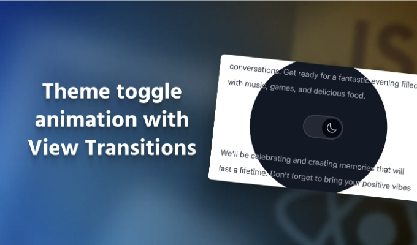
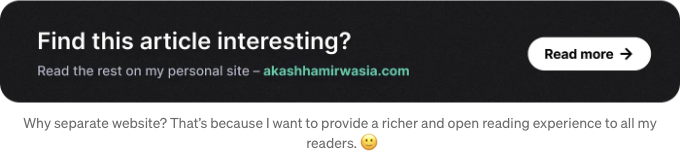

# 블로그의 비디오 버전

텔레그램 앱은 다크 모드 토글에 매우 흥미로운 애니메이션이 있습니다. 다크 테마가 스위치에서 나와 앱의 나머지 부분을 덮는 애니메이션입니다. 이 작업이 하부에서 어떻게 작동하는지, 웹에서 어떻게 복제할 수 있는지 항상 궁금해했습니다. 브라우저에 올라오는 View Transitions API 덕분에 이제 이것이 웹에서 가능해졌다는 것을 기쁘게 생각합니다.

본 게시물에서는 View Transitions API를 사용하여 다크 테마 토글 스위치에 다음과 같은 애니메이션을 구현하는 방법을 살펴볼 것입니다. 이를 React 프로젝트에서 수행할 것이지만, View Transitions API는 브라우저에서 기본적으로 작동하기 때문에 순수 JavaScript나 사용자의 선택에 따라 다른 프레임워크/라이브러리를 사용할 수 있습니다.

<!-- ui-log 수평형 -->
<ins class="adsbygoogle"
  style="display:block"
  data-ad-client="ca-pub-4877378276818686"
  data-ad-slot="9743150776"
  data-ad-format="auto"
  data-full-width-responsive="true"></ins>
<component is="script">
(adsbygoogle = window.adsbygoogle || []).push({});
</component>

# 뷰 전환 API는 어떻게 작동합니까?

여기서 구축 중인 상호작용은 뷰 전환 API가 내부적으로 어떻게 작동하는지 살펴보면 이해하기 쉬울 것입니다:

- API가 접근되어 뷰 전환을 시작하면 브라우저가 페이지의 현재 상태를 스크린샷으로 캡처합니다. 이를 "이전" 페이지 상태라고 합니다.
- 그런 다음 API는 페이지를 다음 상태로 업데이트하는 코드를 실행합니다. 이전 페이지 상태에서 애니메이션을 적용해야 하는 다음 상태로 업데이트합니다.
- 이제 브라우저가 다음 상태를 준비했으므로 해당 상태를 또 다른 스크린샷으로 캡처합니다. 이를 "새로운" 페이지 상태라고 합니다. 이 시점에서 사용자는 여전히 "이전" 페이지 상태를 보고 있으며 이 "새로운" 상태로의 모든 업데이트는 메모리에서만 발생했지만 아직 디스플레이에 렌더링되지 않았습니다.
- 페이지의 "이전" 및 "새로운" 스크린샷이 브라우저에 ::view-transition-old 및 ::view-transition-new 가상 요소로 로드됩니다.
- 마지막으로, 이 두 개의 가상 요소 간에 CSS 애니메이션이 실행되어 ::view-transition-new 가상 요소가 표시됩니다.
- 애니메이션이 종료되면 이러한 가상 요소가 제거되고 브라우저는 이미로드된 "새로운" 페이지 상태(3단계에서)를 화면에 렌더링하기 시작합니다.

위 단계를 설명하는 인터랙티브 데모를 확인해보세요.

<!-- ui-log 수평형 -->
<ins class="adsbygoogle"
  style="display:block"
  data-ad-client="ca-pub-4877378276818686"
  data-ad-slot="9743150776"
  data-ad-format="auto"
  data-full-width-responsive="true"></ins>
<component is="script">
(adsbygoogle = window.adsbygoogle || []).push({});
</component>

# 리액트에서 애니메이션 구현하기

다음 코드는 다크 테마 토글 스위치의 기본 구현입니다. 이 코드는 React 상태 변수에 스위치의 상태를 저장하고 스위치의 상태에 따라 `html` 요소에 dark 클래스를 토글하는 관련 효과를 가지고 있습니다. 토글 스위치 구성 요소는 간단히 Radix UI를 사용하여 구현되었지만 사용자가 가지고 있는 컴포넌트 라이브러리/사용자 정의 스위치 컴포넌트를 사용해도 됩니다.

```js
import { useState, useEffect } from 'react';
import * as Switch from './Switch';
import { IconMoon, IconSun } from './Icons';

export default function App() {
  const [isDarkMode, setIsDarkMode] = useState(false);

  const toggleDarkMode = (isDarkMode) => {
    setIsDarkMode(isDarkMode);
    // 애니메이션 코드를 여기에 추가
  };

  useEffect(() => {
    if (isDarkMode) {
      document.documentElement.classList.add('dark');
    } else {
      document.documentElement.classList.remove('dark');
    }
  }, [isDarkMode]);

  return (
    <div className="h-screen w-screen flex items-center justify-center bg-white dark:bg-gray-950">
      <Switch.Root checked={isDarkMode} onCheckedChange={toggleDarkMode}>
        <Switch.Thumb>
          {isDarkMode ? <IconMoon /> : <IconSun />}
        </Switch.Thumb>
      </Switch.Root>
    </div>
  );
}
```

뷰 트랜지션 API를 사용하려면 document.startViewTransition() 함수를 호출하고 페이지가 다음 상태로 업데이트되는 방식을 정의하는 콜백을 전달해야 합니다(View Transitions API 동작 단계 2).

<!-- ui-log 수평형 -->
<ins class="adsbygoogle"
  style="display:block"
  data-ad-client="ca-pub-4877378276818686"
  data-ad-slot="9743150776"
  data-ad-format="auto"
  data-full-width-responsive="true"></ins>
<component is="script">
(adsbygoogle = window.adsbygoogle || []).push({});
</component>

우리의 초기 직관은 간단히 setIsDarkMode 호출을 이 콜백 함수 안으로 옮기는 것입니다. 결국, 이것이 페이지를 어두운 테마로 업데이트하는 것을 트리거하는 것입니다. 이것은 올바른 방향이지만, 우리의 이해에 작은 결함이 있습니다. React는 상태 업데이트 후 즉시 DOM을 업데이트하지 않습니다. DOM 업데이트는 비동기적으로 발생할 수 있으며 setState 호출 이후에도 발생할 수 있습니다. 따라서 setIsDarkMode(isDarkMode) 호출 후에는 callback 함수인 doucment.startViewTransition()가 끝날 때 DOM이 새 상태 (예: 이 예제에서는 어두운 테마 상태)에 있는 것이 보장되지 않습니다.

이것은 문제입니다. startViewTransition()은 애니메이션을 수행할 수 있도록 페이지의 새 상태가 필요합니다. 그렇다면 이 문제를 어떻게 해결할 수 있을까요?

