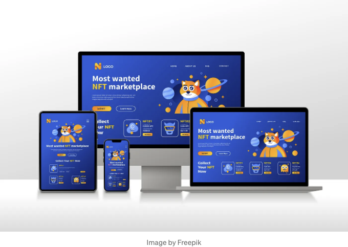

## 반응형 디자인 101

여러 기기에서 멋지게 보이고 잘 작동하는 웹사이트를 만드는 것은 중요합니다. 이를 달성하기 위해 사용하는 도구 중 하나는 CSS 미디어 쿼리입니다. 그렇다면 CSS 미디어 쿼리란 무엇이고 어떻게 작동하는 걸까요? 간단히 알아보겠습니다.



# CSS 미디어 쿼리란?

<!-- ui-log 수평형 -->
<ins class="adsbygoogle"
  style="display:block"
  data-ad-client="ca-pub-4877378276818686"
  data-ad-slot="9743150776"
  data-ad-format="auto"
  data-full-width-responsive="true"></ins>
<component is="script">
(adsbygoogle = window.adsbygoogle || []).push({});
</component>

CSS 미디어 쿼리는 화면 크기, 기기 방향 또는 기기 기능과 같은 다양한 요인에 따라 웹 페이지에 다른 스타일을 적용할 수 있는 강력한 기능입니다.

# 미디어 쿼리가 왜 중요한가요?

스마트폰, 태블릿, 노트북 및 데스크톱 컴퓨터의 등장으로 웹 사이트는 다양한 화면 크기와 해상도에 적응해야 합니다. 미디어 쿼리를 사용하면 이러한 다양한 기기에 신속하게 대응하는 반응형 디자인을 만들 수 있어 사용자에게 최상의 경험을 제공할 수 있습니다.

# 미디어 쿼리는 어떻게 작동하나요?

<!-- ui-log 수평형 -->
<ins class="adsbygoogle"
  style="display:block"
  data-ad-client="ca-pub-4877378276818686"
  data-ad-slot="9743150776"
  data-ad-format="auto"
  data-full-width-responsive="true"></ins>
<component is="script">
(adsbygoogle = window.adsbygoogle || []).push({});
</component>

미디어 쿼리는 미디어 유형과 특정 조건을 확인하는 하나 이상의 표현식으로 구성됩니다. 예를 들어, 화면 너비가 특정 값보다 크거나 작을 때만 특정 스타일이 적용되도록 지정할 수 있습니다.

다음은 기본적인 예시입니다:

```js
/* 600픽셀 미만의 화면에 대한 스타일 */
@media only screen and (max-width: 600px) {
 body {
 font-size: 14px;
 }
}

/* 600픽셀 이상의 화면에 대한 스타일 */
@media only screen and (min-width: 601px) {
 body {
 font-size: 16px;
 }
}
```

이 예시에서는 화면 너비에 따라 글꼴 크기를 조정합니다. 화면 너비가 600픽셀 이하이면 글꼴 크기가 14픽셀이 되고, 600픽셀보다 넓으면 글꼴 크기가 16픽셀이 됩니다.

<!-- ui-log 수평형 -->
<ins class="adsbygoogle"
  style="display:block"
  data-ad-client="ca-pub-4877378276818686"
  data-ad-slot="9743150776"
  data-ad-format="auto"
  data-full-width-responsive="true"></ins>
<component is="script">
(adsbygoogle = window.adsbygoogle || []).push({});
</component>

# 공통 미디어 쿼리 기능:

- 화면 크기: 기기 화면의 너비 또는 높이에 따라 스타일을 조절할 수 있습니다. 이 기능은 대형 데스크톱 모니터와 작은 스마트폰 화면 양쪽에서 잘 작동하는 레이아웃을 만들 때 특히 유용합니다.
- 기기 방향: 미디어 쿼리를 사용하여 기기가 세로 모드 또는 가로 모드인지 감지할 수 있어 디자인을 해당 방향에 맞게 사용자 정의할 수 있습니다. 예를 들어 사용자가 전화기를 회전시킬 때 탐색 메뉴의 레이아웃을 조정하고 싶을 수 있습니다.
- 픽셀 밀도: 일부 기기는 레티나 디스플레이와 같이 더 높은 픽셀 밀도를 가지고 있습니다. 미디어 쿼리를 사용하여 이러한 특정 기기를 대상으로 하여 더 날카로운 이미지와 깨끗한 텍스트를 제공할 수 있습니다.
- 콘텐츠 숨기기 또는 표시: 때로는 작은 화면에서는 덜이 더할 수 있습니다. 미디어 쿼리를 사용하면 화면 크기에 따라 웹사이트의 특정 요소를 숨기거나 표시할 수 있어 가장 중요한 콘텐츠에 중점을 두고 사용자 경험을 개선할 수 있습니다.

# 미디어 쿼리 사용 팁:

- 작게 시작: 기본 요소(글꼴 크기 또는 간격 등)를 조정하는 간단한 미디어 쿼리로 시작하세요.
- 테스트, 테스트, 테스트: 웹사이트를 다양한 기기에서 테스트하여 어디서나 멋지게 보이는지 확인하는 것을 잊지 마세요.
- 다른 사람으로부터 배우기: 영감을 주기 위해 미디어 쿼리를 사용하는 웹사이트를 탐색하고 조사하세요.

<!-- ui-log 수평형 -->
<ins class="adsbygoogle"
  style="display:block"
  data-ad-client="ca-pub-4877378276818686"
  data-ad-slot="9743150776"
  data-ad-format="auto"
  data-full-width-responsive="true"></ins>
<component is="script">
(adsbygoogle = window.adsbygoogle || []).push({});
</component>

여러분, 여기에 있습니다! 기억하세요, 반응형 웹 디자인은 사용자가 사용하는 기기와 관계없이 매끄러운 경험을 제공하는 것이 중요합니다. 그러니 앞으로 실험해보고, 재미있게 멋진 웹사이트를 만들어보세요!

웹 개발의 멋진 세계에 대한 더 많은 통찰력을 기대해주세요. 즐겁게 코딩하세요!