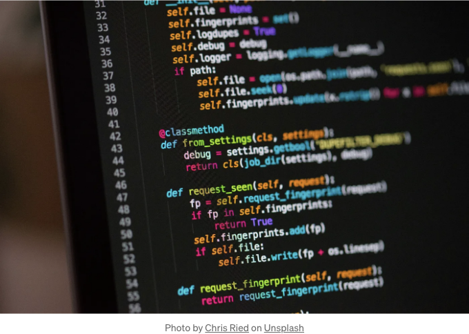

반응형 웹사이트를 처음 만들 때 CSS Grid와 Flexbox에 익숙하지 않았고, 불필요한 미디어 쿼리를 작성하고 있다는 것을 알고 있었어요. 코딩에 아직 많이 익숙하지 않지만, CSS의 Grid와 Flexbox 기능을 사용하여 미디어 쿼리를 간소화하는 데 도움이 되는 몇 가지 요소를 공유하고자 합니다.

먼저 Grid 기반 레이아웃으로 시작하는 것이 도움이 되었어요. 이는 확장성 있는 프레임워크를 생성하여 다양한 화면 크기에 적응할 수 있도록 해줍니다. 이러한 점으로 인해 포괄적인 미디어 쿼리 없이도 작업할 수 있게 되었죠.

```js
<!DOCTYPE html>
<html lang="en">
  <head>
    <meta charset="UTF-8">
    <title>CSS: Using media queries and grid CSS to reflow columns</title>
    <style>

    /* Reflow Styling */
    header[role="banner"]       { grid-area: header; }
    main[role="main"]           { grid-area: main; }
    aside[role="complementary"] { grid-area: aside; }
    footer[role="contentinfo"]  { grid-area: footer; }

    .grid,
    .subgrid {
      display: grid;
      grid-template-columns: minmax(0, 1fr);
    }

    .grid {
      grid-template-areas:
      'header'
      'main'
      'aside'
      'footer';
      width: 100%;
    }

    .subgrid {
      width: calc(100% + 2rem);
      margin: 0 -1rem;
    }

    .grid-item,
    .subgrid-item {
      padding: 1rem;
    }

    @media all and (min-width: 576px) {
      .subgrid {
        grid-template-columns: minmax(0, 1fr) minmax(0, 1fr);
        margin-bottom: 1rem;
      }
      .subgrid-item {
        padding-bottom: 0.25rem;
      }
    }

    @media all and (min-width: 992px) { 
      .grid {
        grid-template-areas:
          'header header header'
          'main main aside'
          'footer footer footer';
        grid-template-columns: minmax(0, 1fr) minmax(0, 1fr) minmax(0, 1fr);
      }
    }

    </style>

  </head>

  <body class="grid">

    <header role="banner" class="grid-item">
      ...
    </header>

    <main role="main" class="grid-item">        
      ...
      ...
      <div class="subgrid">
        <div class="subgrid-item">
          ...
        </div>
        <div class="subgrid-item">
          ...
        </div>
      </div>
    </main>

    <aside role="complementary" class="grid-item">
      ...
    </aside>

    <footer role="contentinfo" class="grid-item">
      ...
    </footer>

  </body>
</html>
```

<!-- ui-log 수평형 -->
<ins class="adsbygoogle"
  style="display:block"
  data-ad-client="ca-pub-4877378276818686"
  data-ad-slot="9743150776"
  data-ad-format="auto"
  data-full-width-responsive="true"></ins>
<component is="script">
(adsbygoogle = window.adsbygoogle || []).push({});
</component>

그리드의 내재된 반응성을 통해 그리드 항목의 유동적인 크기 조정과 재배치가 가능해지며, 이는 미디어 쿼리에서 빈번한 조정이 필요한 고정 너비 레이아웃의 양을 줄여줍니다.

반면에 플렉스박스는 컨테이너 내 항목의 정렬 및 분배를 가로 또는 세로로 효과적으로 제어할 수 있습니다. 그리드 셀이나 영역 내에서 플렉스박스를 사용하면 추가 미디어 쿼리를 사용하지 않고도 개별 요소의 위치를 미세 조정할 수 있습니다. 이를 통해 뷰포트 크기에 자동으로 반응하는 유연한 레이아웃을 만들 수 있습니다.

```js
<!DOCTYPE html>
<html lang="en">
<head>
<meta charset="UTF-8">
<meta name="viewport" content="width=device-width, initial-scale=1.0">
<title>최소 미디어 쿼리로 구성된 그리드 기반 레이아웃</title>
<style>
    .grid-container {
        display: grid;
        grid-template-columns: repeat(auto-fill, minmax(200px, 1fr)); /* 최소 200px 폭의 반응형 그리드 */
        grid-gap: 20px; /* 그리드 항목 사이의 간격 */
        padding: 20px;
    }
    .grid-item {
        display: flex;
        background-color: #f0f0f0;
        padding: 20px;
        text-align: center;
    }
</style>
</head>
<body>

<div class="grid-container">
    <div class="grid-item">1</div>
    <div class="grid-item">2</div>
    <div class="grid-item">3</div>
    <div class="grid-item">4</div>
    <div class="grid-item">5</div>
    <div class="grid-item">6</div>
    <div class="grid-item">7</div>
    <div class="grid-item">8</div>
    <div class="grid-item">9</div>
</div>

</body>
</html>
```

그리드와 플렉스박스를 결합함으로써 미디어 쿼리에서의 코드 수정을 최소화하면서도 높은 수준의 반응성과 유연성을 유지할 수 있습니다. 이 협업적인 접근법을 통해 현재의 디지털 랜드스케이프에서 다양한 디바이스와 화면 해상도에 적응하는 반응형 디자인을 쉽게 구축할 수 있습니다.