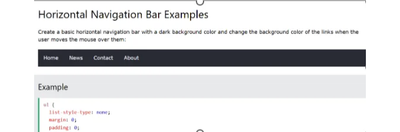
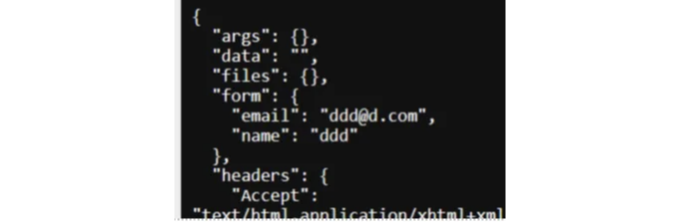

Markdown

Markdown은 간단한 마크업 언어로, 웹 페이지를 작성하는 데 사용되는 표준 마크업 언어입니다. HTML은 페이가의 구조와 콘텐츠를 정의하기 위해 태그를 사용합니다.

일반적인 HTML 태그 몇 가지를 소개해 드리겠습니다:

- `html`: HTML 문서의 루트 요소
- `head`: 문서에 대한 메타데이터를 포함하는 HTML 문서의 head
- `title`: 브라우저 타이틀 바에 표시되는 문서의 제목
- `body`: 주요 콘텐츠를 포함하는 HTML 문서의 본문
- `h1` ~ `h6`: 서로 다른 크기의 제목
- `img`: 이미지
- `div`: HTML 요소를 담는 컨테이너
- `a`: 다른 웹 페이지나 동일한 페이지의 특정 위치로 연결되는 링크
- `form`: 사용자 입력을 받는 폼
- `input`: 사용자 입력을 받는 폼 컨트롤
- `p`: 단락
- `li`: 목록 항목
- `ol`: 순서가 지정된 목록
- `ul`: 순서가 지정되지 않은 목록
- `script`: 주로 JavaScript를 위해 사용되는 스크립트

<!-- ui-log 수평형 -->
<ins class="adsbygoogle"
  style="display:block"
  data-ad-client="ca-pub-4877378276818686"
  data-ad-slot="9743150776"
  data-ad-format="auto"
  data-full-width-responsive="true"></ins>
<component is="script">
(adsbygoogle = window.adsbygoogle || []).push({});
</component>

# CSS

CSS는 Cascading Style Sheets의 약자로, 웹 페이지의 HTML 요소에 스타일을 적용하는 데 사용됩니다. CSS를 사용하면 페이지의 레이아웃, 색상, 글꼴 및 다른 다양한 모양을 제어할 수 있습니다.

일반적인 CSS 속성 몇 가지는 다음과 같습니다:

- background-color: 요소의 배경색
- border-color: 요소의 테두리 색상
- border-style: 요소의 테두리 스타일 (예: solid, dotted, dashed)
- border-width: 요소의 테두리 너비
- color: 요소 내 텍스트의 색상
- font-family: 요소 내 텍스트에 사용된 글꼴 패밀리 (예: Arial, Times New Roman, Verdana)
- font-size: 요소 내 텍스트에 사용된 글꼴 크기
- height: 요소의 높이
- width: 요소의 너비

<!-- ui-log 수평형 -->
<ins class="adsbygoogle"
  style="display:block"
  data-ad-client="ca-pub-4877378276818686"
  data-ad-slot="9743150776"
  data-ad-format="auto"
  data-full-width-responsive="true"></ins>
<component is="script">
(adsbygoogle = window.adsbygoogle || []).push({});
</component>

예시:

1) HTML 페이지를 만들어보세요. 이것은 가장 기본적인 형식입니다. 설정 정보는 head에, 페이지의 본문은 body 태그 안에 들어갑니다:

```html
<html>
<head>
<title>고양이 웹사이트</title>
<meta name="viewport" content="width=device-width">
<meta name="description" content="이 웹페이지는 고양이에 관한 것입니다">
</head>
<body> </body>
</html>
```

메타 태그는 페이지의 내용을 설명합니다. 예를 들어 "description"은 컨텐츠를 설명합니다. 뷰포트는 페이지의 너비를 정의합니다.

<!-- ui-log 수평형 -->
<ins class="adsbygoogle"
  style="display:block"
  data-ad-client="ca-pub-4877378276818686"
  data-ad-slot="9743150776"
  data-ad-format="auto"
  data-full-width-responsive="true"></ins>
<component is="script">
(adsbygoogle = window.adsbygoogle || []).push({});
</component>

2) 정보를 배치하기 위해 `p` 태그의 단락, `h1` 태그의 헤더 등과 같이 태그를 추가할 수 있어요.

```js
<html>
<head>
<title>Cat website</title>
<meta name="viewport" content="width=device-width">
<meta name="description" content="이 웹페이지는 고양이에 관한 것입니다">
</head>
<body>
<h1>내 고양이 웹사이트</h1>
<p>고양이...블라 블라...위키피디아에서 무언가를 얻다</p>
</body>
</html>
```

3) CSS Tutorial (w3schools.com)의 일부를 사용하여 인라인 스타일링을 통해 페이지의 일부를 디자인할 수 있어요.

```js
<p style="color:red"></p>
```

<!-- ui-log 수평형 -->
<ins class="adsbygoogle"
  style="display:block"
  data-ad-client="ca-pub-4877378276818686"
  data-ad-slot="9743150776"
  data-ad-format="auto"
  data-full-width-responsive="true"></ins>
<component is="script">
(adsbygoogle = window.adsbygoogle || []).push({});
</component>

4) 페이지 상단에 스타일을 추가하여 페이지 전체에 스타일을 적용할 수도 있어요:

```js
<style>
/* h1에 대한 새로운 스타일 생성 */
h1 {
font-family: Cambria, Cochin, Georgia, Times, 'Times New Roman', serif;
}
</style>
```

5) 직접 스타일을 만들고 클래스 속성을 사용하여 적용할 수도 있어요. 예를 들어, 헤더 스타일에서 추가한 스타일을 클래스 속성을 사용해 적용하려면 이름 앞에 .을 붙이세요. 예를 들어 .ginger-cats:

```js
<style>
.doggy-style {
background-color: grey;
font-family: Cambria, Cochin, Georgia, Times, 'Times New Roman', serif;
}
/* h1에 대한 새로운 스타일 생성 */
h1 {
font-family: Cambria, Cochin, Georgia, Times, 'Times New Roman', serif;
}
</style>
```

<!-- ui-log 수평형 -->
<ins class="adsbygoogle"
  style="display:block"
  data-ad-client="ca-pub-4877378276818686"
  data-ad-slot="9743150776"
  data-ad-format="auto"
  data-full-width-responsive="true"></ins>
<component is="script">
(adsbygoogle = window.adsbygoogle || []).push({});
</component>

그런 다음 페이지의 섹션에 이 스타일을 적용해 주세요.

```js
<div class="doggy-style">
<h1>My cat website</h1>
</div>
```

이미지를 추가하려면 이미지를 루트 디렉터리에 넣고 이미지 태그를 추가하세요.

```js
</img>
```

<!-- ui-log 수평형 -->
<ins class="adsbygoogle"
  style="display:block"
  data-ad-client="ca-pub-4877378276818686"
  data-ad-slot="9743150776"
  data-ad-format="auto"
  data-full-width-responsive="true"></ins>
<component is="script">
(adsbygoogle = window.adsbygoogle || []).push({});
</component>

```css
img {
    max-width: 100%;
    height: auto;
    border-radius: 10px;
}
``` 

7) 헤더에 스타일을 적용하면 코드가 복잡해질 수 있으므로 HTML에는 최소한의 코드만 유지하는 것이 좋습니다. 따라서 CSS 클래스(스타일 태그 없이)를 모두 style.css 파일로 이동하십시오.

그런 다음 해당 CSS를 사용할 모든 페이지의 링크 태그에 가져와야 합니다. 이렇게 하면 모든 페이지에 동일한 스타일을 적용할 수 있습니다:```

<!-- ui-log 수평형 -->
<ins class="adsbygoogle"
  style="display:block"
  data-ad-client="ca-pub-4877378276818686"
  data-ad-slot="9743150776"
  data-ad-format="auto"
  data-full-width-responsive="true"></ins>
<component is="script">
(adsbygoogle = window.adsbygoogle || []).push({});
</component>

```js
<link href="style.css" rel="stylesheet" type="text/css"/>
```

8) 이제 이 모든 CSS 스타일을 사용해 사용자 정의 또는 기본 클래스에서 사용할 수 있는지 확인해보세요 (시험을 위해 이것들을 알아야 합니다):

- background-color: 요소의 배경색
- border-color: 요소의 테두리 색상
- border-style: 요소의 테두리 스타일 (예: solid, dotted, dashed)
- border-width: 요소의 테두리 너비
- color: 요소의 텍스트 색상
- font-family: 요소의 텍스트에 사용된 글꼴 패밀리 (예: Arial, Times New Roman, Verdana)
- font-size: 텍스트의 글꼴 크기
- height: 요소의 높이
- width: 요소의 너비

9) 이제 고양이에 관한 다른 페이지를 추가하고 싶습니다. CSS를 가져오는 새로운 HTML 페이지를 만드세요. 고양이에 관한 멋진 정보와 이미지를 넣어보세요.

<!-- ui-log 수평형 -->
<ins class="adsbygoogle"
  style="display:block"
  data-ad-client="ca-pub-4877378276818686"
  data-ad-slot="9743150776"
  data-ad-format="auto"
  data-full-width-responsive="true"></ins>
<component is="script">
(adsbygoogle = window.adsbygoogle || []).push({});
</component>

아래 내비게이션을 사용하여 두 페이지 사이를 이동할 수 있도록 멋진 내비게이션을 만들어야 해요. 여기 CSS 수평 내비게이션 바(w3schools.com)를 사용하면 되며, 물론 원하는 스타일의 내비게이션 바를 선택하셔도 됩니다. 당신이 선택하시면 됩니다...



당신은 style.css 파일에 스타일 클래스를 복사해야 합니다:

```js
ul { 
 list-style-type: none; 
 margin: 0; 
 padding: 0; 
 overflow: hidden; 
 background-color: #333; 
} 
 
li { 
 float: left; 
} 
 
li a { 
 display: block; 
 color: white; 
 text-align: center; 
 padding: 14px 16px; 
 text-decoration: none; 
} 
 
/* 링크 호버 시 링크 색상을 #111(검정)으로 변경합니다. */ 
li a:hover { 
 background-color: #111; 
}
```

<!-- ui-log 수평형 -->
<ins class="adsbygoogle"
  style="display:block"
  data-ad-client="ca-pub-4877378276818686"
  data-ad-slot="9743150776"
  data-ad-format="auto"
  data-full-width-responsive="true"></ins>
<component is="script">
(adsbygoogle = window.adsbygoogle || []).push({});
</component>

"li a" 스타일은 "li" 안에 있는 "a" 태그에만 스타일을 적용하는 것을 의미합니다.

그런 다음 각 페이지를 업데이트해야 합니다 (다음에 contact.html을 추가할 것입니다!):

```js
- Cats
- Dogs
- Contact
```

시험에서 나올 수 있으니 "ul" (정렬되지 않은 목록)과 "ol" (순서가 지정된 목록)이 무엇을 의미하는지 알아두는 것이 좋습니다. 이것들은 번호가 매겨지거나 매겨지지 않은 목록을 생성합니다.

<!-- ui-log 수평형 -->
<ins class="adsbygoogle"
  style="display:block"
  data-ad-client="ca-pub-4877378276818686"
  data-ad-slot="9743150776"
  data-ad-format="auto"
  data-full-width-responsive="true"></ins>
<component is="script">
(adsbygoogle = window.adsbygoogle || []).push({});
</component>

10) contact.html 페이지를 만들고 내비게이션 코드를 추가하고 style.css를 임포트한 다음 다음과 같이 폼을 만드세요:

```js
<form action="https://httpbin.org/anything" method="POST">
<label for="name">이름:</label>
<input type="text" id="name" name="name" required>
<br>
<label for="email">이메일:</label>
<input type="email" id="email" name="email" required>
<br>
<input type="submit" value="세부 정보 제출">
</form>
```

폼을 사용하면 사용자로부터 입력을 받아 데이터베이스로 제출할 수 있습니다. 데이터는 인터넷을 통해 다양한 방법으로 교환될 수 있는데, 그 중 하나는 JSON과 HTTP 요청을 통해 이루어집니다.

HTTP 요청은 POST, GET, DELETE, UPDATE와 같은 CRUD 작업(생성, 읽기, 업데이트, 삭제)을 수행할 수 있습니다.

<!-- ui-log 수평형 -->
<ins class="adsbygoogle"
  style="display:block"
  data-ad-client="ca-pub-4877378276818686"
  data-ad-slot="9743150776"
  data-ad-format="auto"
  data-full-width-responsive="true"></ins>
<component is="script">
(adsbygoogle = window.adsbygoogle || []).push({});
</component>

ACTION 속성은 데이터를 POST할 위치를 정의하며, 이는 METHOD 속성에 의해 설정됩니다.

폼 안에는 많은 다른 유형의 입력을 가질 수 있습니다. 우리는 이메일과 텍스트를 사용할 것입니다.

라벨은 for="name"을 사용하여 입력란과 일치시켜야 합니다. 이는 동일한 이름을 가진 입력란과 함께 사용됩니다.

name 속성은 보낸 데이터를 명명하는 데 사용되며, 이는 JSON 응답입니다:

<!-- ui-log 수평형 -->
<ins class="adsbygoogle"
  style="display:block"
  data-ad-client="ca-pub-4877378276818686"
  data-ad-slot="9743150776"
  data-ad-format="auto"
  data-full-width-responsive="true"></ins>
<component is="script">
(adsbygoogle = window.adsbygoogle || []).push({});
</component>



JSON은 인터넷을 통해 데이터를 교환하는 한 가지 방법입니다. 키(예: form)와 사전 또는 값으로 구성되어 있습니다. "forms" 키는 다음과 같은 사전을 반환합니다.

```js
{ 
 "email": "ddd@d.com", 
 "name": "ddd" 
 }
```

그럼 이메일 값을 얻고 싶다면 "email" 키를 사용하여 ddd@d.com을 반환받을 수 있습니다. 이것은 양식에서 보낸 데이터를 풀어내어 데이터베이스에 저장하려고 할 때 매우 유용합니다.

<!-- ui-log 수평형 -->
<ins class="adsbygoogle"
  style="display:block"
  data-ad-client="ca-pub-4877378276818686"
  data-ad-slot="9743150776"
  data-ad-format="auto"
  data-full-width-responsive="true"></ins>
<component is="script">
(adsbygoogle = window.adsbygoogle || []).push({});
</component>

11) 마지막으로 자바스크립트는 페이지를 상호작용할 수 있게 하는 방법입니다. 필드의 유효성을 검사하는 등 간단한 작업부터 애니메이션 및 서버에 게시하는 등 복잡한 작업까지 가능합니다.

우리는 버튼을 클릭하면 메시지를 표시하는 JS 함수를 호출하는 간단한 예제를 만들어볼 것입니다:

당신의 contact.html 페이지에 다음을 추가하세요:

```js
<button onclick="validate()">인사</button>
```

<!-- ui-log 수평형 -->
<ins class="adsbygoogle"
  style="display:block"
  data-ad-client="ca-pub-4877378276818686"
  data-ad-slot="9743150776"
  data-ad-format="auto"
  data-full-width-responsive="true"></ins>
<component is="script">
(adsbygoogle = window.adsbygoogle || []).push({});
</component>

그런 다음 본문 뒤에 다음 스크립트 태그와 코드를 추가해주세요:

```js
<script>
function validate(){
let name = document.getElementById("name").value;
alert("Hello "+name)
}
</script>
```

또한 JAVASCRIPT를 script.js 파일에 넣고 다음 태그를 사용하여 어떤 웹페이지에서도 가져올 수 있습니다:

```js
<script src="script.js"></script>
```

<!-- ui-log 수평형 -->
<ins class="adsbygoogle"
  style="display:block"
  data-ad-client="ca-pub-4877378276818686"
  data-ad-slot="9743150776"
  data-ad-format="auto"
  data-full-width-responsive="true"></ins>
<component is="script">
(adsbygoogle = window.adsbygoogle || []).push({});
</component>

여기 중요한 점은 웹페이지에서 데이터를 가져오는 방법입니다. document 객체와 getElementByID 함수를 사용하여 우리가 원하는 속성의 "이름" id를 전달합니다. 그런 다음 .value를 사용하여 이름 텍스트 상자의 값을 가져옵니다.

그런 다음, 당신의 이름과 인사가 포함된 경고 상자를 표시하기 위해 alert를 사용합니다.