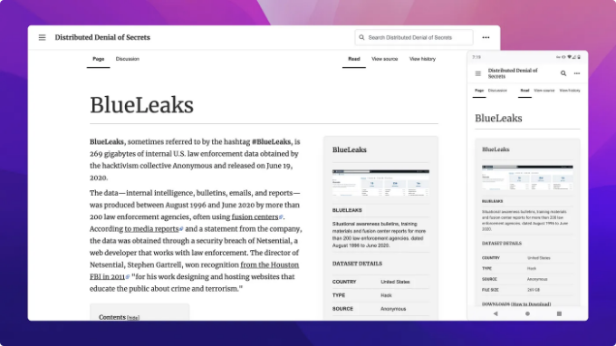
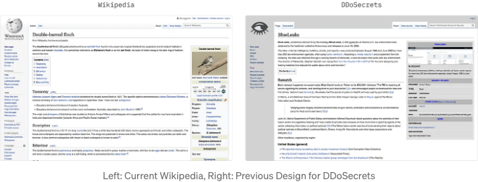
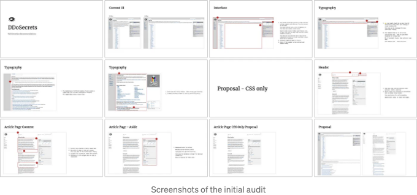
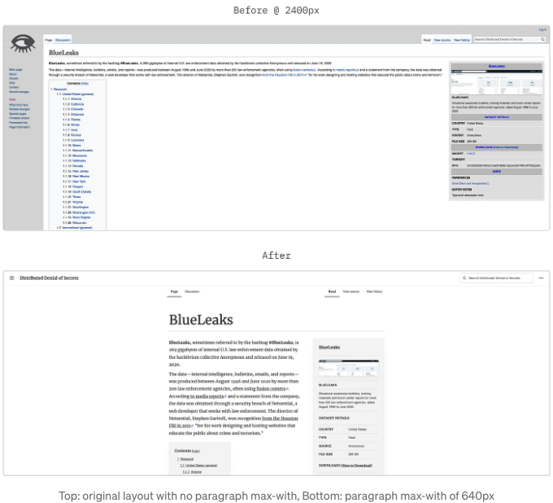
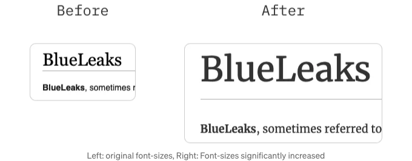
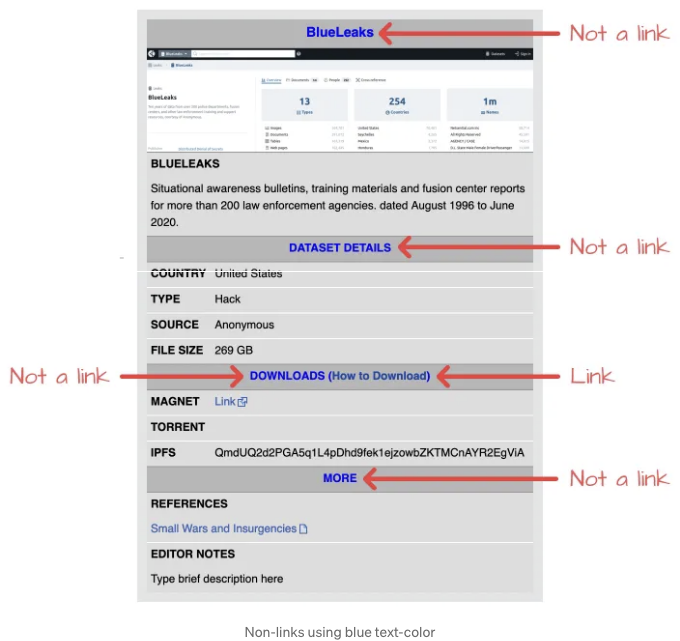
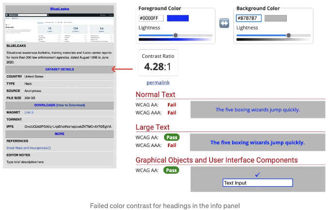
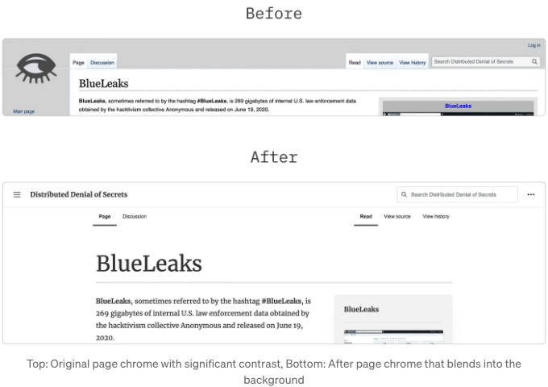
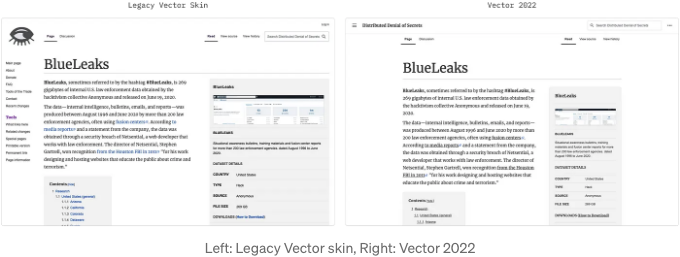
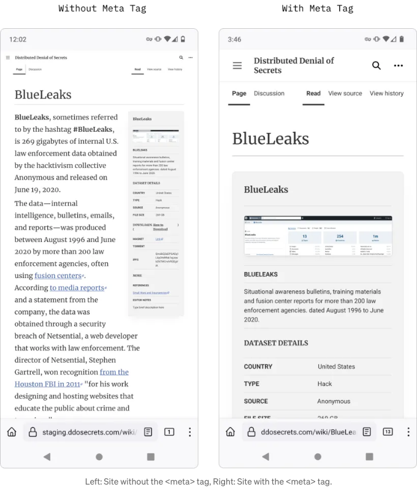

분산 거부 비밀은 언론인, 활동가 및 기술자로 구성된 비영리 501(c)(3) 단체입니다. 이들은 공익에 맞는 데이터를 발표합니다.



DDoSecrets는 미디어위키를 사용하여 사이트를 운영합니다. 이 프로젝트는 위키미디어 재단에 의해 개발되었으며 위키피디아와 같이 다른 무료 지식 제품을 지원합니다. 위키스피시스, 지구 상 모든 생명을 기록한 디렉토리 및 위키북스, 교과서, 매뉴얼 및 레시피 컬렉션까지 무료 백과사전입니다.

미디어위키에는 작성, 버전 기록, 검색 등 많은 기능이 내장되어 있습니다. 또한 필요에 따라 사용할 수 있는 다양한 템플릿이 함께 제공됩니다. DDoSecrets는 위키피디아가 사용하는 것과 동일한 템플릿을 사용합니다.

<!-- ui-log 수평형 -->
<ins class="adsbygoogle"
  style="display:block"
  data-ad-client="ca-pub-4877378276818686"
  data-ad-slot="9743150776"
  data-ad-format="auto"
  data-full-width-responsive="true"></ins>
<component is="script">
(adsbygoogle = window.adsbygoogle || []).push({});
</component>



특히, 이 방법론의 주요 제한 사항 중 하나는 비구조적인 변경만을 제한한다는 것입니다. 미디어위키 스킨을 사용하고 새로운 스킨을 처음부터 만들어 유지 관리할 필요가 없었기 때문에 CSS를 사용하여 개선할 수 있는 부분에만 집중했습니다.

처음에는 사이트에서 개선할 수 있는 측면이라고 생각했던 것을 문서화하고 싶었습니다. 첫 번째 원칙은 무엇이 발행되었는지 쉽게 소비하고 싶어하는 사람들이 있다는 것입니다. 현재 디자인의 요소 중에 그러한 목적을 지원하지 않는 것이 있다면, 그것을 지적하고 경험을 개선할 방법에 대해 권장했습니다. 디자인을 바라보는 전반적인 시각 중 하나는 접근성입니다. 서로 다른 능력을 가진 사용자에게 부정적인 영향을 미칠 인터페이스 요소가 있는가? 모두를 위한 경험을 어떻게 개선할 수 있을까요? Keybase에서 전체 감사 내용을 확인할 수 있습니다.



<!-- ui-log 수평형 -->
<ins class="adsbygoogle"
  style="display:block"
  data-ad-client="ca-pub-4877378276818686"
  data-ad-slot="9743150776"
  data-ad-format="auto"
  data-full-width-responsive="true"></ins>
<component is="script">
(adsbygoogle = window.adsbygoogle || []).push({});
</component>

# 접근성 + 타이포그래피

## 단락

악명 높은 Wikipedia와 벡터 미디어위키 스킨을 사용하는 다른 사이트는 주 본문이나 러닝 콘텐츠에 대한 최대 너비를 사용하지 않습니다. W3C와 미국 총무부의 접근성 표준은 한 줄에 45~75자, 줄 간격 1.4~1.65, 최소 1rem의 글꼴 크기를 권장합니다. 편안한 읽기를 위해 글꼴 크기와 줄 간격을 늘리고 본문 콘텐츠를 640px의 최대 너비로 조정하여 가이드에 맞추었습니다.



<!-- ui-log 수평형 -->
<ins class="adsbygoogle"
  style="display:block"
  data-ad-client="ca-pub-4877378276818686"
  data-ad-slot="9743150776"
  data-ad-format="auto"
  data-full-width-responsive="true"></ins>
<component is="script">
(adsbygoogle = window.adsbygoogle || []).push({});
</component>

## 제목

제목은 계층을 전달해야 합니다. 가장 중요한 정보가 가장 눈에 띄어야 하지만 본문 복사본보다는 더 촘촘한 줄 간격으로 작성되어야 합니다.



## 글꼴 설정

<!-- ui-log 수평형 -->
<ins class="adsbygoogle"
  style="display:block"
  data-ad-client="ca-pub-4877378276818686"
  data-ad-slot="9743150776"
  data-ad-format="auto"
  data-full-width-responsive="true"></ins>
<component is="script">
(adsbygoogle = window.adsbygoogle || []).push({});
</component>

커스텀 폰트는 제품의 시각적 디자인에 많은 것을 더할 수 있어요. Merriweather 글꼴을 선택한 이유는 균일한 무게, 안정된 삐침, 그리고 많은 라틴어와 키릴 문자에 대한 번역 때문이에요. 게다가 이 글꼴은 약간 압축되어 있어서 “편집 디자인, 뉴스, 그리고 기타 종류의 공간 민감한 타이포그래피”에 좋은 선택이에요.

## 링크

WebAIM이 가장 잘 말했어요: “링크는 링크처럼 보여야 하고, 그 외에 다른 것은 아무것도 아니어야 해요.” 그래서 모든 링크에 밑줄을 긋고 파란색은 그 텍스트에만 사용할 수 있게 했어요.



<!-- ui-log 수평형 -->
<ins class="adsbygoogle"
  style="display:block"
  data-ad-client="ca-pub-4877378276818686"
  data-ad-slot="9743150776"
  data-ad-format="auto"
  data-full-width-responsive="true"></ins>
<component is="script">
(adsbygoogle = window.adsbygoogle || []).push({});
</component>

## 색 대비

화면에서의 텍스트 가독성은 종종 간과되지만 좋은 사용자 경험의 기초입니다. 일반 텍스트의 대비 비율은 적어도 4.5:1이어야 하며 큰 텍스트와 인터페이스 구성 요소에는 3:1이 필요합니다. 텍스트의 대비를 테스트하려면 WebAIM 대비 검사기로 이동할 수 있습니다. 페이지를 검사한 후에 몇 가지 대비가 더 필요한 부분을 발견했습니다.



# 시각적 디자인

<!-- ui-log 수평형 -->
<ins class="adsbygoogle"
  style="display:block"
  data-ad-client="ca-pub-4877378276818686"
  data-ad-slot="9743150776"
  data-ad-format="auto"
  data-full-width-responsive="true"></ins>
<component is="script">
(adsbygoogle = window.adsbygoogle || []).push({});
</component>

니클슨 노만 그룹의 인터페이스 휴리스틱에서 나온 원칙들이 미니멀한 인터페이스를 선택하는 데 영향을 미쳤어요. 페이지의 주요 콘텐츠와 경쟁하는 모든 것에 질문을 던졌죠. 사진, 배너, 패널 등 실제 세계 개체를 나타내는 요소를 그림자 같은 심미적인 특징을 사용해 구현하고 있어요.

## Chrome

크롬은 "사용자 데이터와 웹 페이지 콘텐츠를 둘러싼 사용자 인터페이스의 오버헤드"를 의미해요. 조금 물러나게 만들기 위해, 페이지 탭의 명확성을 늘리면서 사이트의 본문과 일치하는 균일한 색상을 적용했어요.



<!-- ui-log 수평형 -->
<ins class="adsbygoogle"
  style="display:block"
  data-ad-client="ca-pub-4877378276818686"
  data-ad-slot="9743150776"
  data-ad-format="auto"
  data-full-width-responsive="true"></ins>
<component is="script">
(adsbygoogle = window.adsbygoogle || []).push({});
</component>

# 벡터 2022

일부 주요 개선 사항은 MediaWiki에서 나왔어요. 그들의 v2 벡터 스킨은 모바일 반응성과 정보 구조를 크게 향상시켰어요. 전역 및 맥락적 요소들이 더 강력한 계층 구조를 갖고, 내비게이션이 접힐 수 있고, 미디어 쿼리가 지원돼요.



# 특별한 경우

<!-- ui-log 수평형 -->
<ins class="adsbygoogle"
  style="display:block"
  data-ad-client="ca-pub-4877378276818686"
  data-ad-slot="9743150776"
  data-ad-format="auto"
  data-full-width-responsive="true"></ins>
<component is="script">
(adsbygoogle = window.adsbygoogle || []).push({});
</component>

우리가 마주한 유일한 특수 사례는 `meta` 태그가 누락된 경우였습니다. 특히 다음과 같았습니다:

```js
<meta name=”viewport” content=”width=device-width, initial-scale=1">
```

이 태그는 모바일 브라우저가 페이지를 올바르게 렌더링할 수 있도록 합니다. 위키미디어에서 이 태그를 기본 패키지에 포함할지에 대한 결정은 아직 내려지지 않았지만, 운영 중인 시스템에서는 포함하는 데 성공했습니다.



<!-- ui-log 수평형 -->
<ins class="adsbygoogle"
  style="display:block"
  data-ad-client="ca-pub-4877378276818686"
  data-ad-slot="9743150776"
  data-ad-format="auto"
  data-full-width-responsive="true"></ins>
<component is="script">
(adsbygoogle = window.adsbygoogle || []).push({});
</component>

# 결론

우리가 DDoSecrets에 한 작업의 99%는 CSS를 통해 이루어졌어요. 접근성에 중점을 두어 다양한 인지 능력을 가진 사용자가 소프트웨어를 더 잘 사용할 수 있도록 돕는 많은 개선 사항 중 일부는 시각적 디자인에만 집중했어요. 이러한 변경 사항은 더 나은 사용자 경험을 가져다 주었고, 몇 일만에 배포되었어요.

# 피드백

우리는 언제나 DDoSecrets 경험이 개선될 수 있는 방법에 대해 커뮤니티로부터 피드백을 기다리고 있어요. 사용자 조사에 참여하고 싶다면 이 양식을 작성해 주세요. 곧 연락 드릴게요!

<!-- ui-log 수평형 -->
<ins class="adsbygoogle"
  style="display:block"
  data-ad-client="ca-pub-4877378276818686"
  data-ad-slot="9743150776"
  data-ad-format="auto"
  data-full-width-responsive="true"></ins>
<component is="script">
(adsbygoogle = window.adsbygoogle || []).push({});
</component>

읽어 주셔서 감사합니다! 궁금한 점이 있으시면 트위터에서 연락해요!