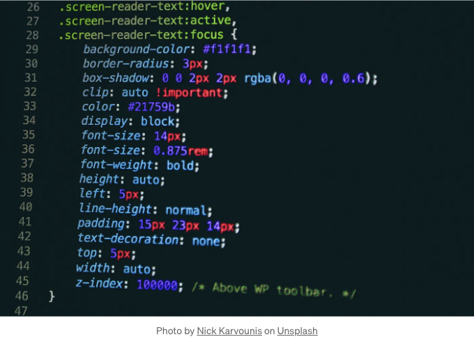

HTML로 코드된 웹 사이트에서 Java 프로그램을 실행하는 두 가지 주요 방법이 있습니다:

- Java 애플릿 사용: Java 애플릿은 HTML 페이지에 포함되어 Java 호환 웹 브라우저에서 실행할 수 있는 작은 프로그램입니다. HTML 페이지에 Java 애플릿을 포함하려면 `applet` 태그를 사용합니다.
- JavaServer Pages (JSP) 사용: JSP는 Java 코드를 HTML 페이지에 임베드할 수 있는 기술입니다. 웹 브라우저가 JSP 페이지를 요청하면 서버에서 Java 코드가 실행되고 결과가 HTML로 브라우저에 반환됩니다.

Java 애플릿 사용하기

<!-- ui-log 수평형 -->
<ins class="adsbygoogle"
  style="display:block"
  data-ad-client="ca-pub-4877378276818686"
  data-ad-slot="9743150776"
  data-ad-format="auto"
  data-full-width-responsive="true"></ins>
<component is="script">
(adsbygoogle = window.adsbygoogle || []).push({});
</component>

HTML 페이지에 Java applet을 포함하려면 `applet` 태그를 사용합니다. `applet` 태그에는 다음과 같은 속성이 있습니다:

- code: Java applet 클래스 파일의 경로.
- width: 애플릿의 너비(픽셀).
- height: 애플릿의 높이(픽셀).

예를 들어, 아래 코드는 HTML 페이지에 Java applet을 포함합니다:

Markdown

<!-- ui-log 수평형 -->
<ins class="adsbygoogle"
  style="display:block"
  data-ad-client="ca-pub-4877378276818686"
  data-ad-slot="9743150776"
  data-ad-format="auto"
  data-full-width-responsive="true"></ins>
<component is="script">
(adsbygoogle = window.adsbygoogle || []).push({});
</component>

```js
<applet code="MyApplet.class" width="200" height="200"></applet>
```

HTML 페이지를 로드할 때, 자바 애플릿이 페이지에 임베드되고 웹 브라우저에 의해 실행됩니다.

JavaServer Pages (JSP)를 사용하는 방법

JSP를 사용하여 HTML 페이지에 자바 코드를 임베드하려면 `%와 %` 델리미터를 사용합니다. 델리미터 사이의 자바 코드는 서버에서 실행되고 결과가 HTML로 브라우저에 반환됩니다.

<!-- ui-log 수평형 -->
<ins class="adsbygoogle"
  style="display:block"
  data-ad-client="ca-pub-4877378276818686"
  data-ad-slot="9743150776"
  data-ad-format="auto"
  data-full-width-responsive="true"></ins>
<component is="script">
(adsbygoogle = window.adsbygoogle || []).push({});
</component>

예를 들어, 다음의 JSP 코드는 웹 페이지에 "안녕, 세상!" 메시지를 표시합니다:

Java

```js
<%
String message = "Hello, world!";
%>
```

```js
<p><%= message %></p>
```

<!-- ui-log 수평형 -->
<ins class="adsbygoogle"
  style="display:block"
  data-ad-client="ca-pub-4877378276818686"
  data-ad-slot="9743150776"
  data-ad-format="auto"
  data-full-width-responsive="true"></ins>
<component is="script">
(adsbygoogle = window.adsbygoogle || []).push({});
</component>

사용자가 HTML 페이지를 로드할 때, 서버에서 Java 코드가 실행되고 웹 페이지에 "Hello, world!" 메시지가 표시됩니다.

사용할 메소드는 귀하의 특정한 요구에 따라 다릅니다. HTML 페이지에서 간단한 Java 프로그램을 실행해야 한다면 Java 애플릿을 사용하는 것이 가장 쉬운 방법입니다. HTML 페이지에 더 복잡한 Java 코드를 포함해야 한다면 JSP를 사용하는 것이 더 나은 옵션입니다.

Java 애플릿을 지원하지 않는 웹 브라우저가 있음을 주의해야 합니다. 웹사이트에서 Java 애플릿을 사용 중이라면, Java 애플릿을 지원하지 않는 브라우저를 사용하는 사용자를 위한 후속 옵션을 제공해야 합니다.