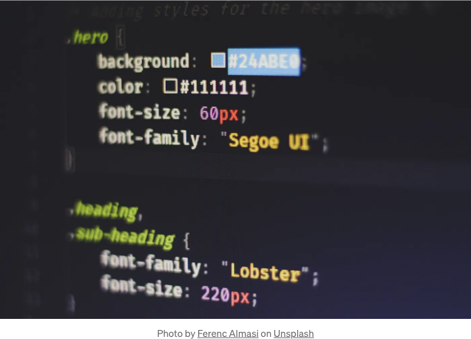

- 이미지 색상을 CSS로 변경하는 방법
- 이 간단한 단계로 CSS에서 이미지 색상 변경하기
- CSS로 이미지의 색상 변경하기
- CSS 이미지 색상: 완전 가이드
- 이미지 색상을 변경하기 위해 CSS 사용하는 방법



# 소개

CSS 또는 캐스케이딩 스타일 시트는 웹 페이지 스타일을 적용하는 데 사용되는 언어입니다. 텍스트, 이미지 및 다른 요소들의 모양을 변경하는 데 사용할 수 있습니다.

<!-- ui-log 수평형 -->
<ins class="adsbygoogle"
  style="display:block"
  data-ad-client="ca-pub-4877378276818686"
  data-ad-slot="9743150776"
  data-ad-format="auto"
  data-full-width-responsive="true"></ins>
<component is="script">
(adsbygoogle = window.adsbygoogle || []).push({});
</component>

CSS로 할 수 있는 한 가지는 이미지의 색상을 변경하는 것입니다. 이것은 color 속성을 사용하여 할 수 있습니다.

color 속성은 텍스트, 배경 및 이미지의 색상을 지정하는 데 사용될 수 있습니다. color 속성의 값은 16진수 색상 코드, 이름 있는 색상 또는 RGB 값일 수 있습니다.

예를 들어, 다음 코드는 이미지의 색상을 빨간색으로 변경합니다:

```css```

<!-- ui-log 수평형 -->
<ins class="adsbygoogle"
  style="display:block"
  data-ad-client="ca-pub-4877378276818686"
  data-ad-slot="9743150776"
  data-ad-format="auto"
  data-full-width-responsive="true"></ins>
<component is="script">
(adsbygoogle = window.adsbygoogle || []).push({});
</component>

```js
img {
  color: red;
}
```

# 이미지 배경 색상 변경하기

color 속성을 사용하여 이미지의 배경 색상을 변경할 수도 있습니다. 이를 위해서는 background-color 속성을 사용해야 합니다.

background-color 속성은 color 속성과 동일한 방식으로 값을 취합니다. 예를 들어, 다음 코드는 이미지의 배경색을 파란색으로 변경합니다:```

<!-- ui-log 수평형 -->
<ins class="adsbygoogle"
  style="display:block"
  data-ad-client="ca-pub-4877378276818686"
  data-ad-slot="9743150776"
  data-ad-format="auto"
  data-full-width-responsive="true"></ins>
<component is="script">
(adsbygoogle = window.adsbygoogle || []).push({});
</component>

CSS

```js
img {
  background-color: blue;
}
```

# 이미지 테두리 색상 변경

색상 속성을 사용하여 이미지의 테두리 색상을 변경할 수도 있습니다. 이를 위해서는 border-color 속성을 사용해야 합니다.

<!-- ui-log 수평형 -->
<ins class="adsbygoogle"
  style="display:block"
  data-ad-client="ca-pub-4877378276818686"
  data-ad-slot="9743150776"
  data-ad-format="auto"
  data-full-width-responsive="true"></ins>
<component is="script">
(adsbygoogle = window.adsbygoogle || []).push({});
</component>

border-color 속성은 color 속성과 동일한 방식으로 값을 취합니다. 예를 들어, 다음 코드는 이미지의 테두리 색상을 녹색으로 변경합니다:

CSS

```js
img {
  border-color: green;
}
```

# 이미지 투명도의 색상 변경

<!-- ui-log 수평형 -->
<ins class="adsbygoogle"
  style="display:block"
  data-ad-client="ca-pub-4877378276818686"
  data-ad-slot="9743150776"
  data-ad-format="auto"
  data-full-width-responsive="true"></ins>
<component is="script">
(adsbygoogle = window.adsbygoogle || []).push({});
</component>

색 속성은 이미지의 투명도를 변경하는 데에도 사용될 수 있어. 이미지의 투명도는 얼마나 투명한지를 측정하는 척도야. 투명도가 1이면 이미지가 완전 불투명하고, 0이면 이미지가 완전 투명한 거야.

이미지의 투명도를 변경하려면 opacity 속성을 사용해야 해. opacity 속성은 0과 1 사이의 값이 필요해. 다음 코드 예시는 이미지의 투명도를 50%로 변경해:

CSS

```js
img {
  opacity: 0.5;
}
```

<!-- ui-log 수평형 -->
<ins class="adsbygoogle"
  style="display:block"
  data-ad-client="ca-pub-4877378276818686"
  data-ad-slot="9743150776"
  data-ad-format="auto"
  data-full-width-responsive="true"></ins>
<component is="script">
(adsbygoogle = window.adsbygoogle || []).push({});
</component>

# 예시

CSS를 사용하여 이미지의 색을 변경하는 방법의 예시입니다:

CSS

```css
img {
  color: red;
  background-color: blue;
  border-color: green;
  opacity: 0.5;
}
```

<!-- ui-log 수평형 -->
<ins class="adsbygoogle"
  style="display:block"
  data-ad-client="ca-pub-4877378276818686"
  data-ad-slot="9743150776"
  data-ad-format="auto"
  data-full-width-responsive="true"></ins>
<component is="script">
(adsbygoogle = window.adsbygoogle || []).push({});
</component>

이 코드는 이미지의 색상을 빨간색으로 변경하고, 이미지의 배경 색상을 파란색으로, 테두리 색상을 녹색으로 그리고 이미지의 불투명도를 50%로 변경할 것입니다.

# 결론

이 기사에서는 CSS를 사용하여 이미지의 색상을 변경하는 방법을 보여줬습니다. 이미지의 배경, 테두리, 불투명도를 변경하는 방법을 배우셨습니다. 또한 CSS를 사용하여 이미지의 색상을 변경하는 예시를 보셨습니다.

이 기사가 도움이 되었으면 좋겠습니다. 궁금한 점이 있으시면 언제든지 물어보세요.

<!-- ui-log 수평형 -->
<ins class="adsbygoogle"
  style="display:block"
  data-ad-client="ca-pub-4877378276818686"
  data-ad-slot="9743150776"
  data-ad-format="auto"
  data-full-width-responsive="true"></ins>
<component is="script">
(adsbygoogle = window.adsbygoogle || []).push({});
</component>

Medium 게시물을 구독해 주셔서 감사합니다! 아래 내용을 확인해보세요:

- 👏 이 이야기에 박수를 보내고 저자를 팔로우하세요 👉
- 📰 Level Up Coding 게시물에서 더 많은 콘텐츠 보기
- 💰 무료 코딩 인터뷰 코스 ⇒ 코스 보기
- 🧠 AI 도구 ⇒ 지금 보기

<!-- ui-log 수평형 -->
<ins class="adsbygoogle"
  style="display:block"
  data-ad-client="ca-pub-4877378276818686"
  data-ad-slot="9743150776"
  data-ad-format="auto"
  data-full-width-responsive="true"></ins>
<component is="script">
(adsbygoogle = window.adsbygoogle || []).push({});
</component>

🔔 팔로우하고: 트위터 | 링크드인 | 뉴스레터

🚀👉 Level Up 재능 모임에 가입하여 멋진 직업을 찾아보세요