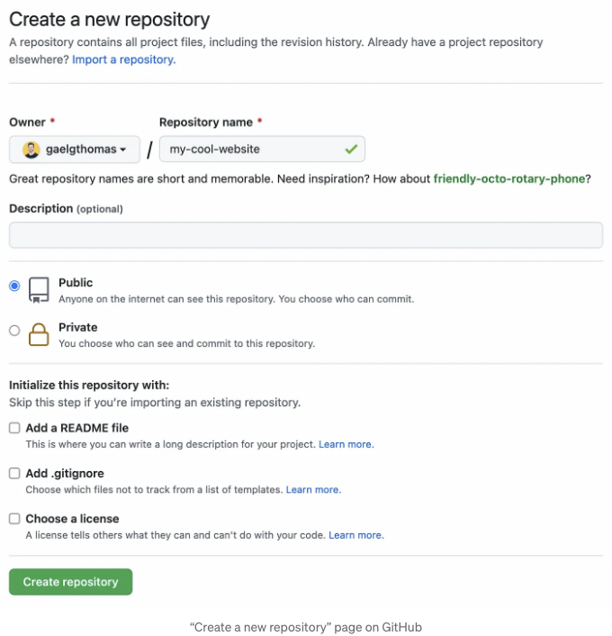
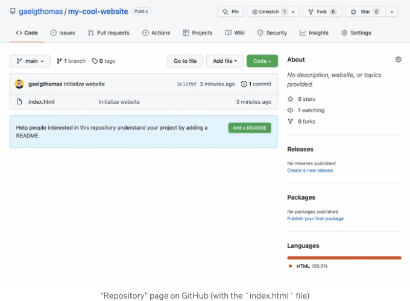
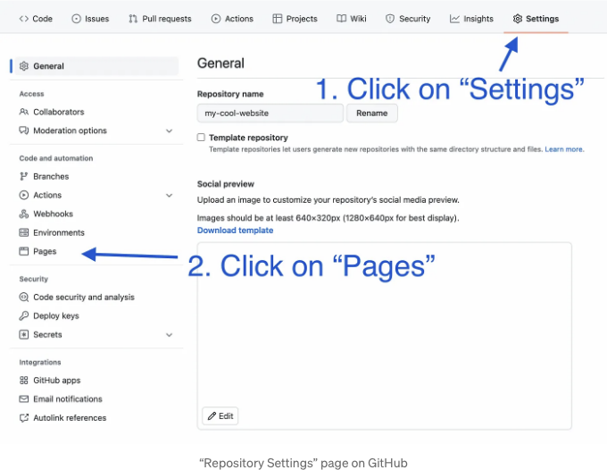
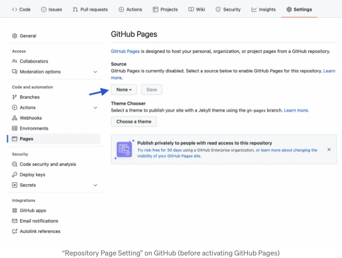
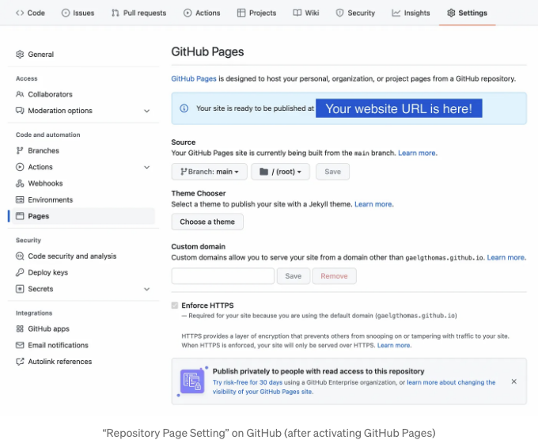
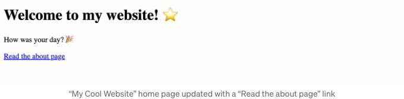
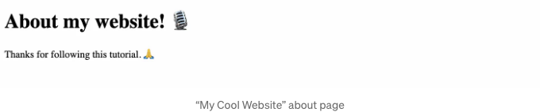

안녕하세요! GitHub는 코드 프로젝트를 저장하고 동료들과 함께 작업하는 데에 최적의 플랫폼입니다. 하지만 여러분은 그들이 무료 호스팅 솔루션인 Pages를 제공한다는 것을 아시나요?

이 기능은 포트폴리오, 프로젝트 문서 또는 원하는 모든 것과 같은 정적 웹사이트(HTML, CSS 및 JavaScript)를 배포하는 데에 유용합니다! 심지어 사용자 정의 도메인 이름을 구성하는 것도 가능해요 (하지만 이 튜토리얼에서는 호스팅 부분에만 집중할 거에요).

하지만, 한 가지 제한 사항이 있습니다. 정적 서비스이기 때문에 서버 측 스크립트 (PHP, Python 등)를 지원하지 않는다는 점이죠.

<!-- ui-log 수평형 -->
<ins class="adsbygoogle"
  style="display:block"
  data-ad-client="ca-pub-4877378276818686"
  data-ad-slot="9743150776"
  data-ad-format="auto"
  data-full-width-responsive="true"></ins>
<component is="script">
(adsbygoogle = window.adsbygoogle || []).push({});
</component>

준비됐나요? 🤿

# 1. 새 GitHub 저장소 만들기

위에서 언급한 대로, 정적 웹사이트를 호스팅하기 위해 GitHub Pages를 사용할 거에요. 첫 번째 단계에서는 귀하의 계정에 새 저장소를 만들어야 합니다.

이를 위해 GitHub에서 “새 저장소 만들기” 페이지를 열어주세요.

<!-- ui-log 수평형 -->
<ins class="adsbygoogle"
  style="display:block"
  data-ad-client="ca-pub-4877378276818686"
  data-ad-slot="9743150776"
  data-ad-format="auto"
  data-full-width-responsive="true"></ins>
<component is="script">
(adsbygoogle = window.adsbygoogle || []).push({});
</component>

레포지토리에 멋진 이름을 자유롭게 선택해보세요! 🎸🤘 하지만 주의하세요, 이 이름은 당신의 웹사이트 URL의 일부가 될 것입니다.

이 튜토리얼에서는 제 레포지토리를 "my-cool-website"로 이름을 지었습니다.




# 2. 컴퓨터에 레포지토리 복제하기

<!-- ui-log 수평형 -->
<ins class="adsbygoogle"
  style="display:block"
  data-ad-client="ca-pub-4877378276818686"
  data-ad-slot="9743150776"
  data-ad-format="auto"
  data-full-width-responsive="true"></ins>
<component is="script">
(adsbygoogle = window.adsbygoogle || []).push({});
</component>

저장소를 만들었으면 해당 페이지로 리디렉션됩니다. 거기서 HTTPS 또는 SSH 링크를 복사하여 컴퓨터에 저장소를 복제할 수 있습니다.

```js
$ git clone [HTTPS 또는 SSH URL]
```

# 3. 정적 웹사이트 만들기

창의력 발휘의 시간! 🎨

<!-- ui-log 수평형 -->
<ins class="adsbygoogle"
  style="display:block"
  data-ad-client="ca-pub-4877378276818686"
  data-ad-slot="9743150776"
  data-ad-format="auto"
  data-full-width-responsive="true"></ins>
<component is="script">
(adsbygoogle = window.adsbygoogle || []).push({});
</component>

제가 즐겨 사용하는 IDE인 VSCode로 귀하의 저장소를 열어보시고 index.html 파일을 생성해보세요. 이 파일은 우리 웹사이트의 진입점이 될 것입니다.

아래는 제가 사용할 템플릿입니다.

```html
<!DOCTYPE html>
<html>
   <head>
      <title>나의 멋진 웹사이트</title>
   </head>
   <body>
      <h1>우리 웹사이트에 오신 것을 환영합니다! ⭐️</h1>
      <p>오늘 하루는 어떠셨나요? 🎉</p>
   </body>
</html>
```

# 4. 코드를 GitHub에 푸시하세요

<!-- ui-log 수평형 -->
<ins class="adsbygoogle"
  style="display:block"
  data-ad-client="ca-pub-4877378276818686"
  data-ad-slot="9743150776"
  data-ad-format="auto"
  data-full-width-responsive="true"></ins>
<component is="script">
(adsbygoogle = window.adsbygoogle || []).push({});
</component>

만족스러우신가요? 아직 만족스럽지 않다면 걱정하지 마세요. 다음 스텝에서는 어떻게 업데이트할 지 배울 거에요! ⏭

만약 코드가 준비되었다면, GitHub에 저장해야 할 거예요. 아래 명령어를 입력해보세요:

```js
$ git add index.html
$ git commit -m "웹사이트 초기화"
$ git push origin main
```

여기까지는 다른 GitHub 프로젝트와 똑같이 하시면 돼요.

<!-- ui-log 수평형 -->
<ins class="adsbygoogle"
  style="display:block"
  data-ad-client="ca-pub-4877378276818686"
  data-ad-slot="9743150776"
  data-ad-format="auto"
  data-full-width-responsive="true"></ins>
<component is="script">
(adsbygoogle = window.adsbygoogle || []).push({});
</component>

모든 것이 올바르게 작동되는지 확인하려면 GitHub에서 리포지토리를 열고 index.html 파일이 표시되는지 확인해보세요. 그렇다면, 다음 단계를 준비할 준비가 된 것입니다!



# 5. 리포지토리 설정 열기

당신의 웹사이트를 배포하고 세상에 공개해봅시다! 🌐

<!-- ui-log 수평형 -->
<ins class="adsbygoogle"
  style="display:block"
  data-ad-client="ca-pub-4877378276818686"
  data-ad-slot="9743150776"
  data-ad-format="auto"
  data-full-width-responsive="true"></ins>
<component is="script">
(adsbygoogle = window.adsbygoogle || []).push({});
</component>

저장소 페이지에는 맨 위에 메뉴가 있습니다. 사이드바에서 "Settings"의 마지막 옵션인 아래 이미지를 클릭한 후 "Pages"를 클릭하세요.



"Pages"를 클릭한 후에는 GitHub Pages 구성 페이지로 이동합니다. 이곳에서 GitHub에 웹사이트를 온라인으로 배포 요청하고 그에 대한 URL을 생성합니다.

두 가지 설정이 가능합니다:

<!-- ui-log 수평형 -->
<ins class="adsbygoogle"
  style="display:block"
  data-ad-client="ca-pub-4877378276818686"
  data-ad-slot="9743150776"
  data-ad-format="auto"
  data-full-width-responsive="true"></ins>
<component is="script">
(adsbygoogle = window.adsbygoogle || []).push({});
</component>

- 배포 브랜치: 재고 저장소 중 어떤 브랜치를 배포에 사용할 것인지 선택하세요.
- 배포 폴더 (기본값은 "/ root"): 엔트리 포인트로 사용하고 싶은 저장소 폴더를 선택하세요. 기본 옵션을 유지하는 것이 좋습니다. 하지만 "/docs"를 선택하여 문서 페이지용 GitHub 웹사이트를 만들고 싶다면 선택할 수도 있습니다.

가장 기본 설정을 유지하고 배포 브랜치로 "main"을 선택하고 배포 폴더로 "/ (root)"를 유지합시다.



“저장” 버튼을 클릭하면 페이지가 새로고침되며... 다 왔어요! 🥁

<!-- ui-log 수평형 -->
<ins class="adsbygoogle"
  style="display:block"
  data-ad-client="ca-pub-4877378276818686"
  data-ad-slot="9743150776"
  data-ad-format="auto"
  data-full-width-responsive="true"></ins>
<component is="script">
(adsbygoogle = window.adsbygoogle || []).push({});
</component>



당신의 웹사이트가 활성화되었습니다! 🎉

온라인 버전을 보기 위해 URL을 클릭해보세요.

여기가 제 웹사이트입니다!

<!-- ui-log 수평형 -->
<ins class="adsbygoogle"
  style="display:block"
  data-ad-client="ca-pub-4877378276818686"
  data-ad-slot="9743150776"
  data-ad-format="auto"
  data-full-width-responsive="true"></ins>
<component is="script">
(adsbygoogle = window.adsbygoogle || []).push({});
</component>


## 6. 새 페이지 추가하기

계속해서 발전을 이야기할 때, 웹사이트에는 한 페이지만 있는 것은 부족하죠. 새 페이지를 생성해보는 것은 어떨까요? 📃

이제 모든 것이 설정되었으니 우리 IDE로 돌아가서 about.html 페이지를 만들어봅시다.

<!-- ui-log 수평형 -->
<ins class="adsbygoogle"
  style="display:block"
  data-ad-client="ca-pub-4877378276818686"
  data-ad-slot="9743150776"
  data-ad-format="auto"
  data-full-width-responsive="true"></ins>
<component is="script">
(adsbygoogle = window.adsbygoogle || []).push({});
</component>

인덱스.html을 통해 한 것처럼 마음껏 선택한 코드를 만드세요!

다음은 이 새로운 페이지에 사용할 템플릿입니다:

```js
<!DOCTYPE html>
<html>
   <head>
      <title>About - 내 멋진 웹사이트</title>
   </head>
   <body>
      <h1>내 웹사이트 소개! 🎙</h1>
      <p>이 튜토리얼을 따라와 주셔서 감사합니다. 🙏</p>
   </body>
</html>
```

그런 다음, 홈페이지(index.html)에 클릭하여 about 페이지를 열 수 있는 버튼을 만들어봅시다.

<!-- ui-log 수평형 -->
<ins class="adsbygoogle"
  style="display:block"
  data-ad-client="ca-pub-4877378276818686"
  data-ad-slot="9743150776"
  data-ad-format="auto"
  data-full-width-responsive="true"></ins>
<component is="script">
(adsbygoogle = window.adsbygoogle || []).push({});
</component>

```js
<!DOCTYPE html>
<html>
   <head>
      <title>나의 멋진 웹사이트</title>
   </head>
   <body>
      <h1>내 웹사이트에 오신 것을 환영합니다! ⭐️</h1>
      <p>오늘 하루 어떠셨나요? 🎉</p>
      <a href="./about">소개 페이지 읽기</a>
   </body>
</html>
```

# 7. 웹사이트 업데이트

새로운 페이지가 생성되었습니다! 이제 실제로 만들어 봅시다! 🆕

이 튜토리얼의 마지막 단계에서는 첫 릴리스 이후 정적 웹사이트를 업데이트하는 방법을 가르쳐 드립니다.

<!-- ui-log 수평형 -->
<ins class="adsbygoogle"
  style="display:block"
  data-ad-client="ca-pub-4877378276818686"
  data-ad-slot="9743150776"
  data-ad-format="auto"
  data-full-width-responsive="true"></ins>
<component is="script">
(adsbygoogle = window.adsbygoogle || []).push({});
</component>

이제 모든 것이 설정되었으니, 4단계 "코드를 GitHub에 푸시"를 참조하겠습니다. 이전 단계에서 우리는 코드를 저장소에 푸시했습니다. 이번에도 마찬가지로 새로운 업데이트로 진행될 것입니다.

about.html 페이지를 저장하고 index.html을 업데이트하고 싶습니다.

동일한 Git 명령어를 사용하여 이를 수행해 봅시다.

```js
$ git add index.html about.html
$ git commit -m "about 페이지 추가"
$ git push origin main
```

<!-- ui-log 수평형 -->
<ins class="adsbygoogle"
  style="display:block"
  data-ad-client="ca-pub-4877378276818686"
  data-ad-slot="9743150776"
  data-ad-format="auto"
  data-full-width-responsive="true"></ins>
<component is="script">
(adsbygoogle = window.adsbygoogle || []).push({});
</component>

작업이 완료되면 몇 분 동안 기다린 후 웹사이트 URL로 돌아가서 새로고침하면 변경 사항이 표시됩니다!





# 마무리

<!-- ui-log 수평형 -->
<ins class="adsbygoogle"
  style="display:block"
  data-ad-client="ca-pub-4877378276818686"
  data-ad-slot="9743150776"
  data-ad-format="auto"
  data-full-width-responsive="true"></ins>
<component is="script">
(adsbygoogle = window.adsbygoogle || []).push({});
</component>

이 튜토리얼을 따라 주셔서 감사합니다! 읽으시면서 GitHub Pages에 대해 좀 더 배우셨으면 좋겠어요.

FlyCode에서는 Git과 GitHub에 관한 콘텐츠를 정기적으로 제공하고 있어요. 놓치고 싶지 않으시면, 트위터에서 팔로우해주시기를 초대합니다.