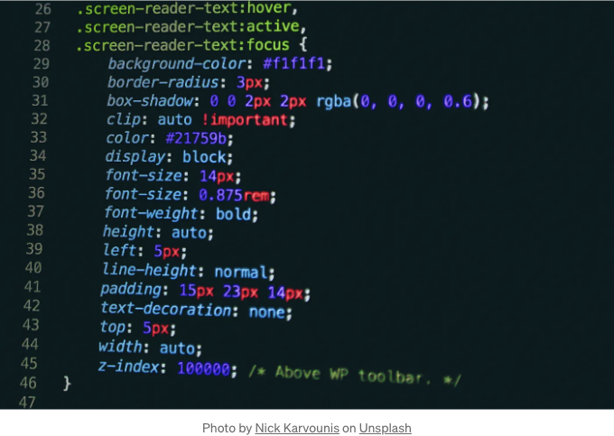

HTML 요소 정렬은 CSS에서 개발자들이 다루는 가장 일반적인 문제 중 하나입니다. CSS는 요소를 배치하는 데 제공하는 여러 방법이 있으며, 프로젝트에 따라 사용할 방법을 스스로 결정해야 합니다.

이 게시물에서는 CSS에서 제공하는 요소를 옆으로 배치하는 네 가지 다양한 방법을 탐색해 보겠습니다.

# 1. Display: Inline-Block

<!-- ui-log 수평형 -->
<ins class="adsbygoogle"
  style="display:block"
  data-ad-client="ca-pub-4877378276818686"
  data-ad-slot="9743150776"
  data-ad-format="auto"
  data-full-width-responsive="true"></ins>
<component is="script">
(adsbygoogle = window.adsbygoogle || []).push({});
</component>

첫 번째 방법은 display: inline-block 방식을 사용하는 것입니다. 이 방법은 요소를 나란히 배치하기 위한 간단하고 전통적인 CSS 기법입니다.

## Inline 또는 Block?

이 방법을 사용하기 전에 이 방법을 사용할 요소가 블록 수준 요소(예: `div`, `p`)인지 인라인 요소(`span`, `a`)인지 확인하는 것이 중요합니다.

먼저, 인라인 HTML 요소를 사용할 수 있고 이 요소들은 자동으로 나란히 배치됩니다. 그러나 인라인 요소의 제한은 너비 & 높이 속성이 적용되지 않는다는 것입니다. 반면에, 블록 수준 요소에는 너비와 높이 속성을 적용할 수 있지만 블록 요소는 나란히 배치할 수 없는 문제가 있습니다. 이것이 display 속성을 inline-block으로 변경하여 요소의 표시 동작을 변경하는 세 번째 방법을 적용할 수 있는 이유입니다:

<!-- ui-log 수평형 -->
<ins class="adsbygoogle"
  style="display:block"
  data-ad-client="ca-pub-4877378276818686"
  data-ad-slot="9743150776"
  data-ad-format="auto"
  data-full-width-responsive="true"></ins>
<component is="script">
(adsbygoogle = window.adsbygoogle || []).push({});
</component>

```css
div, span {
  display: inline-block;
}
```
`inline-block` 속성은 요소를 옆으로 놓습니다 (인라인 요소처럼). 블록 레벨 요소와 같이 너비 및 높이 속성을 할당할 수도 있습니다.

## 2. `float` 사용하기

요소를 옆으로 정렬하는 또 다른 방법은 `float`를 사용하는 것입니다. 이것은 오래된 기술이며 `float`를 사용하는 것이 여전히 유용한지에 대한 많은 토론이 있습니다.

<!-- ui-log 수평형 -->
<ins class="adsbygoogle"
  style="display:block"
  data-ad-client="ca-pub-4877378276818686"
  data-ad-slot="9743150776"
  data-ad-format="auto"
  data-full-width-responsive="true"></ins>
<component is="script">
(adsbygoogle = window.adsbygoogle || []).push({});
</component>

## 플롯을 사용해야 할까요?

솔직히 말해서, 프로젝트에 따라 다릅니다. 요소를 옆으로 배치하기만 하려면 플롯을 사용하는 것이 좋습니다. 그러나 Flexbox, Grid 또는 Bootstrap과 같은 프레임워크와 같은 현대 기술을 사용하는 경우에는 플롯을 사용하는 것이 좋지 않을 수도 있습니다.

## 사용 방법

플롯을 사용하면 페이지의 왼쪽이나 오른쪽에 요소를 배치할 수 있습니다. 그러나 중앙 정렬은 플롯만으로 직접 할 수 없습니다. 왜냐하면 플롯에 대한 "가운데" 값이 없기 때문이지만, 이는 다른 CSS 속성으로 수행할 수 있습니다.

<!-- ui-log 수평형 -->
<ins class="adsbygoogle"
  style="display:block"
  data-ad-client="ca-pub-4877378276818686"
  data-ad-slot="9743150776"
  data-ad-format="auto"
  data-full-width-responsive="true"></ins>
<component is="script">
(adsbygoogle = window.adsbygoogle || []).push({});
</component>

```js
div {
  float: left;
}
```

그리고 float 속성은 요소를 일반 문서 흐름에서 제거합니다. 이는 페이지를 엉망으로 만들고 나머지 요소를 둥둥 떠 있는 요소 아래로 이동시켜 일부가 보이지 않거나 전혀 보이지 않게 할 수 있습니다.

이를 방지하기 위해 float 된 요소 다음에 clear 속성을 사용해야 합니다.

```js
div {
  clear: both;
}
```

<!-- ui-log 수평형 -->
<ins class="adsbygoogle"
  style="display:block"
  data-ad-client="ca-pub-4877378276818686"
  data-ad-slot="9743150776"
  data-ad-format="auto"
  data-full-width-responsive="true"></ins>
<component is="script">
(adsbygoogle = window.adsbygoogle || []).push({});
</component>

이 게시물의 고급 기술을 보다 상세히 살펴보려면 아래의 튜토리얼 비디오를 시청해 보세요:

# 고급 기술: Flexbox 또는 Grid

지금까지 우리는 이 문제를 해결하기 위한 전통적인 방법에 대해 이야기했습니다. 이제 더 고급 기술로 넘어가 봅시다.

CSS는 정렬 문제를 해결하기 위한 두 가지 더 최근 방법을 제공합니다. 그것이 바로 ‘flexbox’와 ‘grid’입니다. Flexbox 또는 Grid를 사용하는 장점은 더 넓고, 더 유연하며, 정렬 문제에 대해 쉽게 해결책을 제공한다는 점입니다. 그러나 이러한 기술들은 정렬을 위한 다양한 기능이 많기 때문에 프로젝트에서 Flexbox 또는 Grid를 사용하기 전에 이들에 대한 이해가 좀 필요합니다. 혹은 사용하려는 기술에 적합한 경우 프로젝트를 진행해야 합니다.

<!-- ui-log 수평형 -->
<ins class="adsbygoogle"
  style="display:block"
  data-ad-client="ca-pub-4877378276818686"
  data-ad-slot="9743150776"
  data-ad-format="auto"
  data-full-width-responsive="true"></ins>
<component is="script">
(adsbygoogle = window.adsbygoogle || []).push({});
</component>

# 3. Flexbox

플렉스박스를 사용하기로 결정했다면, 먼저 요소들은 부모 요소로 둘러싸여 있어야 합니다.

```js
<div class="container">
  <p> 1 </p>
  <p> 2 </p>
  <p> 3 </p>
</div>
```

그런 다음, 부모 요소(컨테이너)에 display: flex 속성을 할당하면 자식 요소들을 자동으로 옆으로 나란히 배치할 것입니다:

<!-- ui-log 수평형 -->
<ins class="adsbygoogle"
  style="display:block"
  data-ad-client="ca-pub-4877378276818686"
  data-ad-slot="9743150776"
  data-ad-format="auto"
  data-full-width-responsive="true"></ins>
<component is="script">
(adsbygoogle = window.adsbygoogle || []).push({});
</component>

```js
.container {
  display: flex;
}
```

또한, 자식 요소에 flex 속성을 추가하고 숫자를 지정하면 (예: 숫자 1) 공간이 모두 동등하게 나뉩니다:

```js
p {
  flex: 1;
}
```

Flexbox를 사용하면 CSS로 요소를 쉽게 배치할 수 있습니다. 이를 사용하는 방법을 이해하면 매우 편리합니다.```

<!-- ui-log 수평형 -->
<ins class="adsbygoogle"
  style="display:block"
  data-ad-client="ca-pub-4877378276818686"
  data-ad-slot="9743150776"
  data-ad-format="auto"
  data-full-width-responsive="true"></ins>
<component is="script">
(adsbygoogle = window.adsbygoogle || []).push({});
</component>

# 4. 그리드

CSS 그리드는 요소들을 옆으로 정렬하는 또 다른 대안적인 방법입니다. Flexbox와 유사하지만 다른 규칙과 구현을 갖고 있습니다.

우선, flexbox 방법에서 했던 것처럼 요소들은 부모 컨테이너 내부에 있어야 합니다:

```js
<div class="container">
  <p> 1 </p>
  <p> 2 </p>
  <p> 3 </p>
</div>
```

<!-- ui-log 수평형 -->
<ins class="adsbygoogle"
  style="display:block"
  data-ad-client="ca-pub-4877378276818686"
  data-ad-slot="9743150776"
  data-ad-format="auto"
  data-full-width-responsive="true"></ins>
<component is="script">
(adsbygoogle = window.adsbygoogle || []).push({});
</component>

그 후에, 부모 요소인 컨테이너의 display 속성을 grid로 변경합니다:

```js
.container {
  display: grid;
}
```

다음으로, 레이아웃을 어떻게 할 것인지 결정해야 합니다. 레이아웃에 몇 개의 열과 행이 있을지 결정할 수 있습니다. 예를 들어, 세 개의 요소를 각각 한 열에 배치하여 나란히 놓고 싶다고 가정해봅시다. 요소를 나란히 배치하기 위해 grid-template-columns 속성을 정의하고, 각 열에 1fr 값을 주어 빈 필드를 동일하게 나눕니다:

```js
.container {
  display: grid;
  grid-template-columns: 1fr 1fr 1fr;
}
```

<!-- ui-log 수평형 -->
<ins class="adsbygoogle"
  style="display:block"
  data-ad-client="ca-pub-4877378276818686"
  data-ad-slot="9743150776"
  data-ad-format="auto"
  data-full-width-responsive="true"></ins>
<component is="script">
(adsbygoogle = window.adsbygoogle || []).push({});
</component>

지금까지 글이 마음에 드셨나요? Medium은 수많은 훌륭한 기사를 광고 없이 제공하는 훌륭한 플랫폼입니다. 광고가 없는 Medium은 이 플랫폼을 사랑하는 독자들이 회원이 되어 지원할 수 있도록 해줍니다.

위에서 언급한 링크를 통해 Medium 회원이 되시면 Medium의 모든 이야기에 무제한 액세스할 수 있습니다. 그 링크를 이용하면 함께 작가로서 저를 지원할 수도 있습니다. Medium에서 작은 커미션을 얻을 수 있습니다. 감사합니다 :)