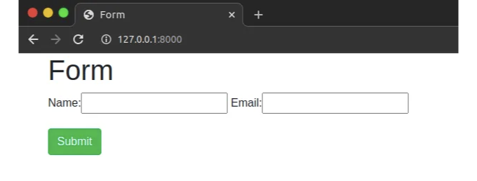

## 스포일러: 위젯을 사용해야 합니다.

Django를 사용하는 사람이라면 Django 폼이 얼마나 좋은지 알고 있을 겁니다. 하지만 처음 사용하는 경우에는 다음과 같은 질문이 등장합니다: 어떻게 스타일을 지정할 수 있을까요? 어떻게 클래스를 추가할 수 있을까요?

음, 방법이 있습니다 (실제로 매우 간단합니다), 바로 위젯을 사용해야 합니다.

<!-- ui-log 수평형 -->
<ins class="adsbygoogle"
  style="display:block"
  data-ad-client="ca-pub-4877378276818686"
  data-ad-slot="9743150776"
  data-ad-format="auto"
  data-full-width-responsive="true"></ins>
<component is="script">
(adsbygoogle = window.adsbygoogle || []).push({});
</component>

하지만 정확히 무엇인가요? Django 문서에 따르면 위젯의 정의를 살펴보겠습니다:

다시 말해, 위젯은 콘텐츠를 HTML로 렌더링하는 방법을 정의하는 것뿐입니다. 예를 들어, CharField의 기본 위젯은 `input type="text"`로 렌더링되는 TextInput입니다.

하지만 위젯은 사용자 정의 가능합니다. 그래서 그 textarea의 크기나 해당 필드가 필수 필드인지와 같은 것들을 설정할 수 있습니다.

그래서 위젯이 어떻게 작동하는지 보여주기 위해 예제를 만들어보겠습니다.

<!-- ui-log 수평형 -->
<ins class="adsbygoogle"
  style="display:block"
  data-ad-client="ca-pub-4877378276818686"
  data-ad-slot="9743150776"
  data-ad-format="auto"
  data-full-width-responsive="true"></ins>
<component is="script">
(adsbygoogle = window.adsbygoogle || []).push({});
</component>

안녕하세요! UserInfoForm이라는 양식이 있습니다. 여기서 사용자의 이름과 이메일을 얻습니다.

HTML 코드는 다음과 같습니다:

현재 이 양식은 기본 위젯을 사용하고 있으며 아무런 스타일이 없어서 기본적으로 이렇게 보입니다:

<!-- ui-log 수평형 -->
<ins class="adsbygoogle"
  style="display:block"
  data-ad-client="ca-pub-4877378276818686"
  data-ad-slot="9743150776"
  data-ad-format="auto"
  data-full-width-responsive="true"></ins>
<component is="script">
(adsbygoogle = window.adsbygoogle || []).push({});
</component>

그래서 변경하려면 외관을 사용자 정의해야 합니다. 위젯을 두 가지 방법으로 사용자 정의할 수 있어요 — 위젯 인스턴스를 통해 또는 위젯 클래스를 통해. 이 첫 번째 예제에서는 위젯 인스턴스를 사용할 거에요. 기본적으로 Widget.attrs 인수를 사용해야 하는데요, 이는 렌더링된 위젯에 설정할 HTML 속성을 포함하는 딕셔너리입니다. 아래 예제처럼요:

그리고 그 다음엔 placeholder 키를 가지고 Name 값을, 그리고 style 키를 가지고 width: 300px; 값을 가진 attrs 딕셔너리를 볼 수 있어요.

그리고 이게 결과에요:

<!-- ui-log 수평형 -->
<ins class="adsbygoogle"
  style="display:block"
  data-ad-client="ca-pub-4877378276818686"
  data-ad-slot="9743150776"
  data-ad-format="auto"
  data-full-width-responsive="true"></ins>
<component is="script">
(adsbygoogle = window.adsbygoogle || []).push({});
</component>

훨씬 나아졌죠? 그렇지만 더 개선할 수 있어요. 이에 부트스트랩 클래스를 추가해볼게요. attrs 딕셔너리 내에서 클래스를 선언하여 이 작업을 할 수 있어요.

부트스트랩 클래스를 추가했고 결과가 여기 있어요.

이제 완벽해졌네요!

<!-- ui-log 수평형 -->
<ins class="adsbygoogle"
  style="display:block"
  data-ad-client="ca-pub-4877378276818686"
  data-ad-slot="9743150776"
  data-ad-format="auto"
  data-full-width-responsive="true"></ins>
<component is="script">
(adsbygoogle = window.adsbygoogle || []).push({});
</component>

그러나 보통 Django 양식을 사용할 때는 해당 양식이 특정 모델과 관련이 있습니다. 하지만 현재 이 양식은 그렇지 않습니다. 이것을 가능하게 하려면 몇 가지 더 변경해야 합니다. 이제 위젯 클래스를 사용할 것입니다. 위젯 클래스에는 위의 예시와 마찬가지로 기본 속성인 attrs가 있습니다. 또한 Meta라는 새 클래스를 추가하고, 이 양식이 관련된 모델의 이름과 가져야 할 필드, 그리고 해당 필드에 대한 위젯을 지정해야 합니다.

그래서 여기에서 무슨 일이 일어나고 있는 걸까요? 이전에 사용했던 CharField와 EmailField는 내장 Field 클래스입니다. 그러나 이제 위젯 클래스와 함께 작업하려면 내장 위젯을 사용해야 합니다(이 경우 TextInput과 EmailInput입니다). 결과적으로 동일한 작업을 수행하지만 구성은 약간 다를 것입니다.

이 양식은 기본적으로 이전과 동일하며 표시되는 방식이나 기타 사항을 변경하지 않았습니다. 그러나 이제 이 양식은 사용자 정보를 저장하는 데 사용된 User 모델에 연결되어 있습니다.

HTML은 다음과 같습니다:

<!-- ui-log 수평형 -->
<ins class="adsbygoogle"
  style="display:block"
  data-ad-client="ca-pub-4877378276818686"
  data-ad-slot="9743150776"
  data-ad-format="auto"
  data-full-width-responsive="true"></ins>
<component is="script">
(adsbygoogle = window.adsbygoogle || []).push({});
</component>

마지막 결과:

# 결론

위젯을 사용하는 방법을 배우는 것은 좋은 선택입니다. 이제 폼을 더 잘보이도록 만들고 부트스트랩 클래스를 추가하는 것이 얼마나 간단한지 알게 되었으니 유용하게 사용할 수 있을 겁니다.

<!-- ui-log 수평형 -->
<ins class="adsbygoogle"
  style="display:block"
  data-ad-client="ca-pub-4877378276818686"
  data-ad-slot="9743150776"
  data-ad-format="auto"
  data-full-width-responsive="true"></ins>
<component is="script">
(adsbygoogle = window.adsbygoogle || []).push({});
</component>

이 프로젝트의 소스 코드는 Github에서 확인할 수 있어요.

물론 위젯을 사용하여 할 수 있는 작업이 더 많아요. 그리고 배울 수 있는 최고의 곳은 공식 문서인 Django docs죠.