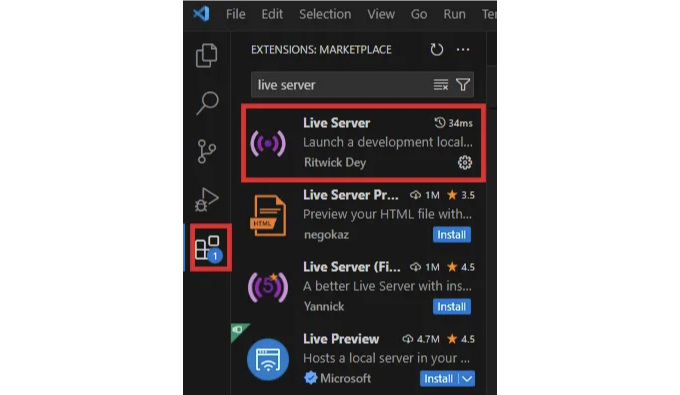
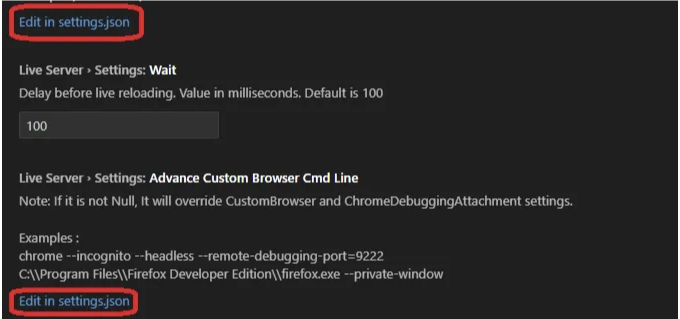
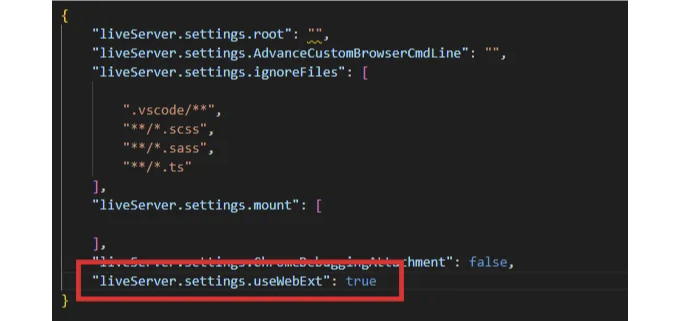
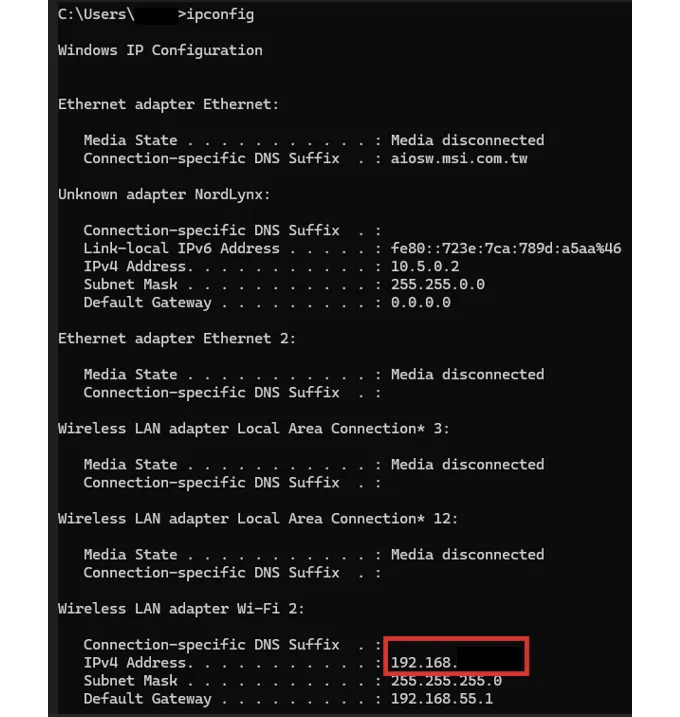

웹사이트 디자인 과정에서 테스트는 배포 전 중요한 역할을 합니다. 원하는 대로 작동하고 보이는지 확인하기 위해 테스트 작업이 필요합니다. VS code는 좋은 개발 도구이며, 확장 기능 Live Server를 사용하여 웹사이트를 검토할 수 있습니다.

저희는 몇 줄을 추가하고 몇 가지 조치를 취하여 노트북이나 PC의 웹 브라우저를 통해만 웹사이트를 확인하는 것이 아니라 모바일 기기를 통해 프론트엔드를 직접 검토할 수 있는 멋진 기능을 공유하고자 합니다.

단계 1: 확장 탭에서 Live Server를 설치하세요.

<!-- ui-log 수평형 -->
<ins class="adsbygoogle"
  style="display:block"
  data-ad-client="ca-pub-4877378276818686"
  data-ad-slot="9743150776"
  data-ad-format="auto"
  data-full-width-responsive="true"></ins>
<component is="script">
(adsbygoogle = window.adsbygoogle || []).push({});
</component>



단계 2: 파일/환경설정/설정 경로를 따라가서 라이브 서버를 입력하세요. 라이브 서버 설정 탭을 볼 수 있습니다.


단계 3: 라이브 서버 설정 탭에서 설정.json에서 편집 링크를 볼 수 있으며, 이 중 하나를 선택하여 다음 줄을 추가하세요.

<!-- ui-log 수평형 -->
<ins class="adsbygoogle"
  style="display:block"
  data-ad-client="ca-pub-4877378276818686"
  data-ad-slot="9743150776"
  data-ad-format="auto"
  data-full-width-responsive="true"></ins>
<component is="script">
(adsbygoogle = window.adsbygoogle || []).push({});
</component>

```js
"liveServer.settings.useWebExt": true
```





Step 4: 명령 프롬프트(CMD)로 이동하여 ipconfig를 입력하십시오. IP 주소를 확인할 수 있습니다. 이 주소를 모바일 장치에서 사용해야 합니다(192.168.XXX.XXX:5500).```

<!-- ui-log 수평형 -->
<ins class="adsbygoogle"
  style="display:block"
  data-ad-client="ca-pub-4877378276818686"
  data-ad-slot="9743150776"
  data-ad-format="auto"
  data-full-width-responsive="true"></ins>
<component is="script">
(adsbygoogle = window.adsbygoogle || []).push({});
</component>



감사합니다!

Informula를 지원하고 싶다면 여기에서 커피를 사주세요 :)

저에게 커피를 사주세요