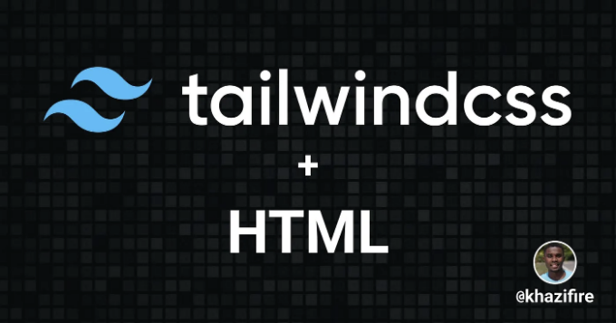

# Tailwind가 훌륭한 이유는 무엇인가요?

Tailwind는 일반 CSS로는 어려움을 겪는 사람들에게 많은 도움이 됩니다. Tailwind는 낮은 수준의 유틸리티 클래스를 제공하여 HTML 파일을 떠나지 않고도 독특한 디자인을 만들 수 있게 해줍니다. 자세한 정보는 공식 문서를 참조하십시오.

# 프로젝트에 Tailwind를 추가하는 방법은?

<!-- ui-log 수평형 -->
<ins class="adsbygoogle"
  style="display:block"
  data-ad-client="ca-pub-4877378276818686"
  data-ad-slot="9743150776"
  data-ad-format="auto"
  data-full-width-responsive="true"></ins>
<component is="script">
(adsbygoogle = window.adsbygoogle || []).push({});
</component>

# 1. 노드 설치

테일윈드를 설치하기 전에 컴퓨터에 노드가 설치되어 있어야 합니다. 노드에는 종속성을 관리하는 데 사용되는 패키지 관리자(NPM)가 포함되어 있습니다.

노드가 컴퓨터에 설치되어 있는지 확인하려면 터미널을 열고 다음 명령어를 입력하세요:

```js
node -v
```

<!-- ui-log 수평형 -->
<ins class="adsbygoogle"
  style="display:block"
  data-ad-client="ca-pub-4877378276818686"
  data-ad-slot="9743150776"
  data-ad-format="auto"
  data-full-width-responsive="true"></ins>
<component is="script">
(adsbygoogle = window.adsbygoogle || []).push({});
</component>

컴퓨터에 노드가 없는 경우, 공식 노드 웹사이트로 이동하여 다운로드해주세요.

## 2. 프로젝트 만들기

프로젝트를 만들려면 디렉토리를 하나 생성하면 됩니다. 컴퓨터의 터미널을 열고 다음 명령어를 입력하세요:

프로젝트는 데스크탑에 만들 것이므로, 디렉토리 간 이동에 사용하는 cd 명령어를 사용하겠습니다.

<!-- ui-log 수평형 -->
<ins class="adsbygoogle"
  style="display:block"
  data-ad-client="ca-pub-4877378276818686"
  data-ad-slot="9743150776"
  data-ad-format="auto"
  data-full-width-responsive="true"></ins>
<component is="script">
(adsbygoogle = window.adsbygoogle || []).push({});
</component>

```md
cd Desktop
```

mkdir 명령어는 새로운 디렉토리를 생성하는 데 사용됩니다. 이 경우에는 tailwindProject라는 새 폴더를 만들고 있습니다.

```md
mkdir tailwindProject
```

방금 만든 폴더 안에는 몇 가지 더 폴더(src 및 styles 폴더)를 추가해야 합니다.

<!-- ui-log 수평형 -->
<ins class="adsbygoogle"
  style="display:block"
  data-ad-client="ca-pub-4877378276818686"
  data-ad-slot="9743150776"
  data-ad-format="auto"
  data-full-width-responsive="true"></ins>
<component is="script">
(adsbygoogle = window.adsbygoogle || []).push({});
</component>

```js
cd tailwindProject
```

이 명령은 tailwindProject 디렉토리 안에 두 개의 폴더를 생성합니다.

```js
mkdir src styles
```

# 3. NPM을 사용하여 Tailwind CSS 설치하기

<!-- ui-log 수평형 -->
<ins class="adsbygoogle"
  style="display:block"
  data-ad-client="ca-pub-4877378276818686"
  data-ad-slot="9743150776"
  data-ad-format="auto"
  data-full-width-responsive="true"></ins>
<component is="script">
(adsbygoogle = window.adsbygoogle || []).push({});
</component>

터미널에 이 명령어를 입력하세요:

```js
npm install -D tailwindcss
```

Tailwind에는 테일윈드 테마를 사용자 정의하는 구성 파일이 함께 제공됩니다. 사용자 정의 색상, 글꼴 및 기타 다양한 사항을 추가할 수 있습니다. 테일윈드 구성 파일을 만들려면 이 명령어를 실행하면 됩니다:

```js
npx tailwindcss init
```

<!-- ui-log 수평형 -->
<ins class="adsbygoogle"
  style="display:block"
  data-ad-client="ca-pub-4877378276818686"
  data-ad-slot="9743150776"
  data-ad-format="auto"
  data-full-width-responsive="true"></ins>
<component is="script">
(adsbygoogle = window.adsbygoogle || []).push({});
</component>

그리고 가장 좋아하는 코드 편집기로 프로젝트를 열어보세요. Visual Studio Code (VSCode)를 사용 중이라면 터미널에 다음 명령어를 입력하면 프로젝트가 자동으로 열립니다.

```js
code .
```

# 4. 템플릿 경로 구성하기

구성 파일은 tailwind가 tailwind 클래스를 사용하는 템플릿 파일을 어디에서 찾을지 알려주는 데 사용됩니다. 이것은 중요한데, tailwind는 그 경로를 사용하여 HTML 파일을 클래스로 스캔하고 그 클래스를 스타일 시트에 추가합니다.

<!-- ui-log 수평형 -->
<ins class="adsbygoogle"
  style="display:block"
  data-ad-client="ca-pub-4877378276818686"
  data-ad-slot="9743150776"
  data-ad-format="auto"
  data-full-width-responsive="true"></ins>
<component is="script">
(adsbygoogle = window.adsbygoogle || []).push({});
</component>

tailwind.config.js 파일 안에, 3단계에서 생성된 파일에 html 파일의 경로를 content에 추가하세요.

내 경우에는 이전 단계에서 생성된 src 폴더 안에 모든 html 파일이 저장될 것입니다.

```js
module.exports = {
  content: ["./src/**/*.{html,js}"],
  theme: {
    extend: {},
  },
  plugins: [],
}
```

# 5. CSS에 Tailwind 지시문 추가하기

<!-- ui-log 수평형 -->
<ins class="adsbygoogle"
  style="display:block"
  data-ad-client="ca-pub-4877378276818686"
  data-ad-slot="9743150776"
  data-ad-format="auto"
  data-full-width-responsive="true"></ins>
<component is="script">
(adsbygoogle = window.adsbygoogle || []).push({});
</component>

styles 폴더 안에 tailwind.css 또는 원하는 이름으로 CSS 파일을 만들어 주세요. 그리고 다음 내용을 추가해 주세요:

```js
@tailwind base;
@tailwind components;
@tailwind utilities;
```

tailwind 지시문 이외에도 해당 파일을 사용하여 사용자 정의 CSS를 추가할 수 있습니다.

# 6. Tailwind CLI 빌드 프로세스 시작

<!-- ui-log 수평형 -->
<ins class="adsbygoogle"
  style="display:block"
  data-ad-client="ca-pub-4877378276818686"
  data-ad-slot="9743150776"
  data-ad-format="auto"
  data-full-width-responsive="true"></ins>
<component is="script">
(adsbygoogle = window.adsbygoogle || []).push({});
</component>

거의 다 왔어요. 다음 단계는 유틸리티 클래스를 포함하는 CSS 파일을 만드는 것입니다.

## 6.1 package.json 파일 열기

다음 스크립트를 추가하세요:

```js
"scripts":{
    "dev":"npx tailwindcss -i ./styles/tailwind.css -o ./styles/output.css --watch"
},
```

<!-- ui-log 수평형 -->
<ins class="adsbygoogle"
  style="display:block"
  data-ad-client="ca-pub-4877378276818686"
  data-ad-slot="9743150776"
  data-ad-format="auto"
  data-full-width-responsive="true"></ins>
<component is="script">
(adsbygoogle = window.adsbygoogle || []).push({});
</component>

위 스크립트는 테일윈드 디렉티브가 포함된 파일을 입력으로 사용하여 프로젝트에서 사용되는 모든 유틸리티 클래스를 포함하는 CSS를 생성합니다.

## 6.2 스크립트 실행

터미널에서 다음 명령을 입력하세요

```js
npm run dev
```

<!-- ui-log 수평형 -->
<ins class="adsbygoogle"
  style="display:block"
  data-ad-client="ca-pub-4877378276818686"
  data-ad-slot="9743150776"
  data-ad-format="auto"
  data-full-width-responsive="true"></ins>
<component is="script">
(adsbygoogle = window.adsbygoogle || []).push({});
</component>

거기에 추가로 매번 프로젝트를 시작할 때마다 사용될 것입니다.

# 7. HTML에서 Tailwind 사용 시작하기

좋아하는 코드 편집기에서 프로젝트를 열고 일부 HTML 코드를 작성하세요. 무엇보다 중요한 것은 **stylesheet를 output.css 파일에 연결하는 것을 잊지 말아주세요.**

```js
html
<!DOCTYPE html>
<html lang="en">
<head>
    <meta charset="UTF-8">
    <meta http-equiv="X-UA-Compatible" content="IE=edge">
    <meta name="viewport" content="width=device-width, initial-scale=1.0">
    <link  href="/styles/output.css" rel="stylesheet"/>
    <title>Tailwind Starter</title>
</head>
<body class="bg-gray-800">
    <div class="text-center mt-12">
        <h1 class="text-4xl text-yellow-500 font-bold">Heap Heap Arrayy!</h1>
        <p class="text-xl text-white mt-4"> 저는 Tailwind를 사용하여 첫 HTML 프로젝트를 만들었습니다. </p>
    </div>
</body>
</html>
```

<!-- ui-log 수평형 -->
<ins class="adsbygoogle"
  style="display:block"
  data-ad-client="ca-pub-4877378276818686"
  data-ad-slot="9743150776"
  data-ad-format="auto"
  data-full-width-responsive="true"></ins>
<component is="script">
(adsbygoogle = window.adsbygoogle || []).push({});
</component>

# 8. 라이브 서버로 테스트해보세요

브라우저에서 코드를 열어서 모든 것이 제대로 작동하는지 확인해보세요. CSS 스타일이 표시되지 않는다면, 어떤 단계를 놓친 것일지도 모릅니다. 이 튜토리얼 생성 시 사용했던 파일 구조와 비교해보세요.

# 결론

독서해주셔서 감사합니다. 궁금한 점이 있으시면 언제든지 트위터 @khazifire 에게 연락주세요. 비슷한 컨텐츠를 더 보고 싶으시다면 팔로우도 잊지말고 해주세요.