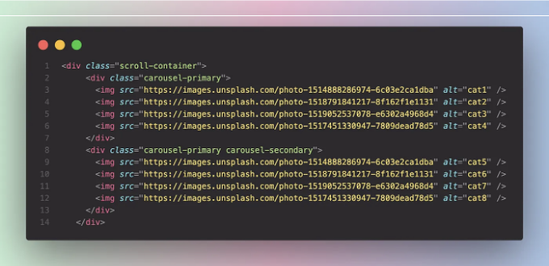
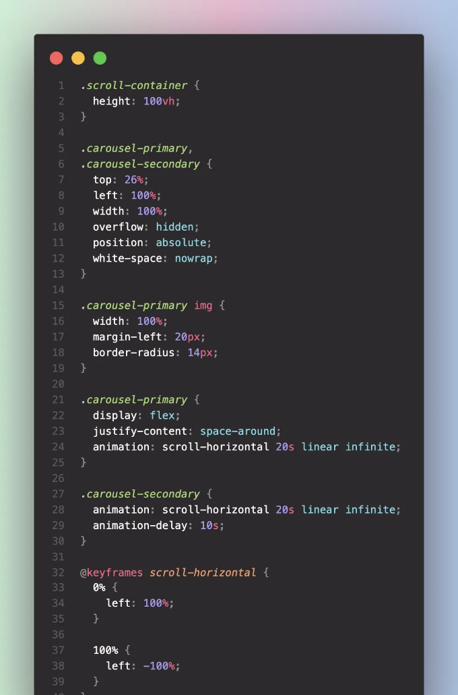
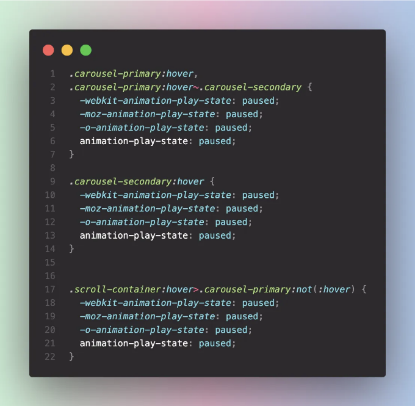

당신은 웹사이트에 매력적인 가로 스크롤 효과를 추가해보고 싶은 적이 있나요? CSS 애니메이션과 호버 상태를 결합하면 콘텐츠를 더 생동감 있게 만들 수 있어요. 간단한 HTML과 CSS를 사용하여 일시 중지 및 호버 기능이 있는 무한 가로 스크롤을 어떻게 구현하는지 알아봐요.

사람들이 고민하는 일반적인 문제점은 다음과 같아요.

1. 이미지 목록의 끝에 도달한 후 가로 스크롤이 중단되는 문제.
2. 새 루프에서 첫 번째 이미지를 표시한 후 스크롤이 부드럽지 않은 문제.
3. 새로운 루프를 시작하기 전에 스크롤 컨테이너 안에 너무 많은 공간이 남아 있는 문제.

이 문제들을 해결하기 위해 이 기사를 따라 해보세요.

<!-- ui-log 수평형 -->
<ins class="adsbygoogle"
  style="display:block"
  data-ad-client="ca-pub-4877378276818686"
  data-ad-slot="9743150776"
  data-ad-format="auto"
  data-full-width-responsive="true"></ins>
<component is="script">
(adsbygoogle = window.adsbygoogle || []).push({});
</component>

HTML이 어떻게 보이는지 살펴보도록 해요.

이 문제를 해결하기 위해 초기 자식 요소 옆에 동일한 자식 요소를 중복해서 추가하면 됩니다. 놀랍게도 간단하죠? 하지만 이 해결책이 어떻게 작동하는지 궁금하시죠?

# CSS 마법 공개

<!-- ui-log 수평형 -->
<ins class="adsbygoogle"
  style="display:block"
  data-ad-client="ca-pub-4877378276818686"
  data-ad-slot="9743150776"
  data-ad-format="auto"
  data-full-width-responsive="true"></ins>
<component is="script">
(adsbygoogle = window.adsbygoogle || []).push({});
</component>

CSS 파일은 요소들에 대한 스타일을 정의하는데, 유연한 레이아웃을 설정하고 애니메이션을 정의하는 데 사용됩니다. 핵심은 @keyframes 규칙에 있으며, left 속성을 100%에서 -100%로 애니메이션화하여 수평 스크롤 효과를 만들어 지속적인 움직임 효과를 얻을 수 있습니다.

animation-delay 속성은 .carousel-primary 클래스를 가진 요소들에게 애니메이션이 시작되기 전 지연을 도입하는 데 사용됩니다.

<!-- ui-log 수평형 -->
<ins class="adsbygoogle"
  style="display:block"
  data-ad-client="ca-pub-4877378276818686"
  data-ad-slot="9743150776"
  data-ad-format="auto"
  data-full-width-responsive="true"></ins>
<component is="script">
(adsbygoogle = window.adsbygoogle || []).push({});
</component>

이해를 돕기 위해 쪼개 봅시다:

- animation: scroll-horizontal 20s linear infinite;: 이 줄은 .carousel-secondary에 적용된 애니메이션을 지정합니다. 여기서 사용된 scroll-horizontal 애니메이션은 요소를 수평으로 20초 동안 일정한 속도로 이동하여 무한한 수평 스크롤 효과를 만듭니다.
- animation-delay: 10s;: 이 속성은 .carousel-secondary 클래스를 가진 요소들에게 애니메이션이 시작되기 전 10초의 딜레이를 도입합니다. 이 딜레이는 정해진 시간이 지난 후에 애니메이션이 시작되도록 합니다.

# CSS 선택자를 이용한 Hover-Pause 구현

여기서 흥미로운 점은 JavaScript 개입 없이 CSS 선택자를 활용하여 hover 기능을 구현한다는 것입니다. 사용자가 .carousel-primary 위에 마우스를 올리면 .carousel-primary 및 .carousel-secondary가 모두 애니메이션을 일시 중지합니다. 게다가 스크롤 컨테이너 위에 마우스를 올리면 .carousel-primary의 애니메이션이 일시 중지되는데, 사용자가 .carousel-primary 바로 위에 마우스를 올리지 않는 한요소입니다.

<!-- ui-log 수평형 -->
<ins class="adsbygoogle"
  style="display:block"
  data-ad-client="ca-pub-4877378276818686"
  data-ad-slot="9743150776"
  data-ad-format="auto"
  data-full-width-responsive="true"></ins>
<component is="script">
(adsbygoogle = window.adsbygoogle || []).push({});
</component>

여기에 전체 소스 코드 링크가 있습니다. 필요한 대로 활용하거나 공유해 주세요.

# 최종 생각

<!-- ui-log 수평형 -->
<ins class="adsbygoogle"
  style="display:block"
  data-ad-client="ca-pub-4877378276818686"
  data-ad-slot="9743150776"
  data-ad-format="auto"
  data-full-width-responsive="true"></ins>
<component is="script">
(adsbygoogle = window.adsbygoogle || []).push({});
</component>

HTML과 CSS만을 사용하여 호버 일시정지 기능이 있는 무한 스크롤 이미지 캐로셀을 만들어보는 것은 이러한 기술들이 제공하는 유연성과 창의성을 보여주는 좋은 예시입니다. 이 방법을 통해 JavaScript 라이브러리나 복잡한 스크립트 없이도 사용자 경험을 향상시킬 수 있습니다.

즐거운 코딩하세요! 😊