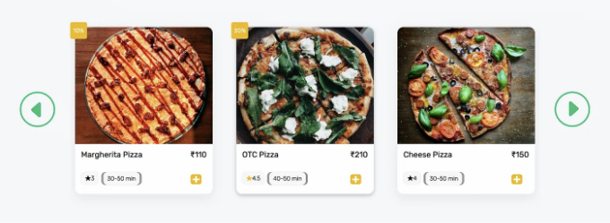
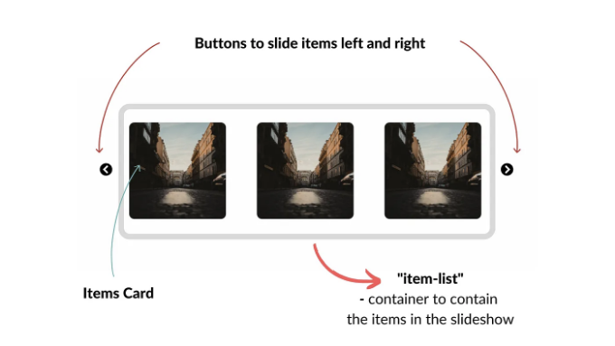
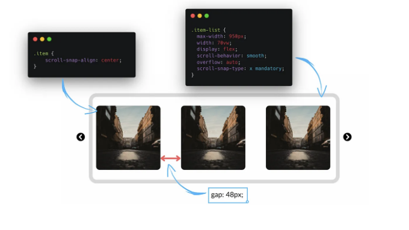
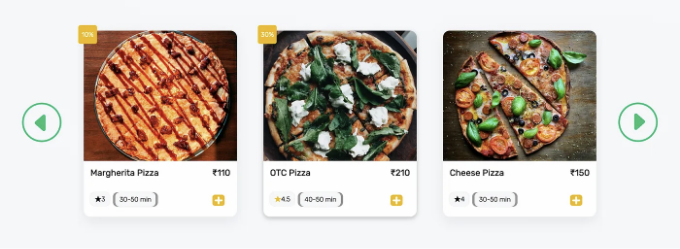

최근에 슬라이드쇼/캐로셀을 구현해야 하는 프로젝트를 진행 중이에요. 구글에서 검색했지만 다양한 기능을 갖춘 캐로셀을 찾지 못했어요. 그래서 직접 만들어 보기로 결정했죠.

다음은 그 모습을 예로 보여드릴게요:-

<!-- ui-log 수평형 -->
<ins class="adsbygoogle"
  style="display:block"
  data-ad-client="ca-pub-4877378276818686"
  data-ad-slot="9743150776"
  data-ad-format="auto"
  data-full-width-responsive="true"></ins>
<component is="script">
(adsbygoogle = window.adsbygoogle || []).push({});
</component>

# HTML

카루셀을 위한 기본 HTML 구조를 만들어봅시다.

- class가 container인 div를 만듭니다.
- 이 div 내부에 class가 carousel-view인 또 다른 div를 만듭니다.
- 슬라이드쇼의 왼쪽 스크롤을 위한 버튼을 만듭니다.
- class가 item-list인 슬라이드쇼 아이템을 보유하는 div를 만듭니다.
- 슬라이드쇼의 오른쪽 스크롤을 위한 다른 버튼을 만듭니다.

# CSS

<!-- ui-log 수평형 -->
<ins class="adsbygoogle"
  style="display:block"
  data-ad-client="ca-pub-4877378276818686"
  data-ad-slot="9743150776"
  data-ad-format="auto"
  data-full-width-responsive="true"></ins>
<component is="script">
(adsbygoogle = window.adsbygoogle || []).push({});
</component>

이제 CSS 부분으로 넘어가 봅시다. 먼저 베이스를 설정해야 합니다.
다음 이미지는 CSS 구조화 방법을 보여줍니다.

이제 이 아이템 목록을 살펴보겠습니다.
수평 슬라이드쇼인 만큼 아이템을 수평으로 정렬해야 합니다. 이를 위해 여러 가지 방법이 있지만 저는 `display:flex` 속성을 이용하겠습니다. 이 속성을 사용하면 아이템 사이에 간격을 추가할 수도 있어요.

이 컨테이너에 적용해야 하는 속성을 간단히 살펴보겠습니다.

<!-- ui-log 수평형 -->
<ins class="adsbygoogle"
  style="display:block"
  data-ad-client="ca-pub-4877378276818686"
  data-ad-slot="9743150776"
  data-ad-format="auto"
  data-full-width-responsive="true"></ins>
<component is="script">
(adsbygoogle = window.adsbygoogle || []).push({});
</component>

이제 사용하는 마법 주문에 대해 이야기해 봅시다.

이 속성은 항목의 스크롤을 제어하는 데 사용됩니다.
우리가 이곳에서 이루고자 하는 효과는 항목이 창의 왼쪽에서 완전히 안쪽 또는 외부에 있는지 확인하는 것입니다.

수직 슬라이더를 만들려면 scroll-snap-type: y mandatory를 사용할 수 있습니다.
scroll-snap 속성에 대해 더 알아보려면 여기를 확인하세요.

<!-- ui-log 수평형 -->
<ins class="adsbygoogle"
  style="display:block"
  data-ad-client="ca-pub-4877378276818686"
  data-ad-slot="9743150776"
  data-ad-format="auto"
  data-full-width-responsive="true"></ins>
<component is="script">
(adsbygoogle = window.adsbygoogle || []).push({});
</component>

팁: 스크롤 막기는 하되 기능은 유지하려면 다음과 같이 할 수 있습니다

# JavaScript

이제 버튼의 기능을 구현할 시간입니다:

- document.getElementById() 함수를 사용하여 document에서 nextButton, prevButton 및 itemList 객체를 가져옵니다.
- 이제 eventListener를 사용하여 클릭할 때 항목 스크롤을 구현합니다.

<!-- ui-log 수평형 -->
<ins class="adsbygoogle"
  style="display:block"
  data-ad-client="ca-pub-4877378276818686"
  data-ad-slot="9743150776"
  data-ad-format="auto"
  data-full-width-responsive="true"></ins>
<component is="script">
(adsbygoogle = window.adsbygoogle || []).push({});
</component>

- 사용자가 버튼과 상호 작용할 때마다 addEventListener가 트리거되며, 이를 클릭 이벤트로 전달하면 콜백 함수가 클릭 시에만 실행됨을 보장합니다.
- 이제 콜백 함수에서 scrollLeft 속성 값의 증가 및 감소를 통해 itemList을 오른쪽과 왼쪽으로 슬라이드합니다.

다음은 슬라이드쇼를 위한 완전한 코드 및 데모입니다:

이 문서를 읽어 주셔서 감사합니다. 유용하게 느꼈다면 친구나 가족과 공유해주세요. 저를 지원하려면 팔로우 버튼을 클릭해주세요.

<!-- ui-log 수평형 -->
<ins class="adsbygoogle"
  style="display:block"
  data-ad-client="ca-pub-4877378276818686"
  data-ad-slot="9743150776"
  data-ad-format="auto"
  data-full-width-responsive="true"></ins>
<component is="script">
(adsbygoogle = window.adsbygoogle || []).push({});
</component>

트위터에서 만나요! 내 관객들을 더 알고 커뮤니티를 형성하고 싶어요 :)

의견란에 당신의 결론과 다른 주제를 알려주세요. 무엇이든 다 듣고 싶어요.

이것이 도움이 되기를 바랍니다. 좋은 하루 보내세요!