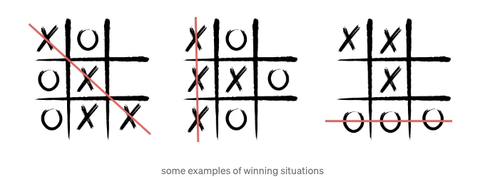
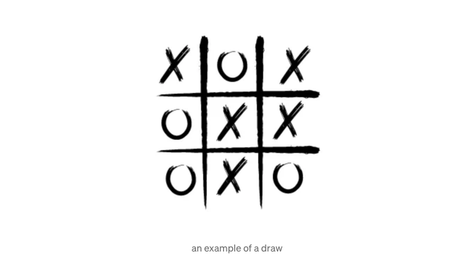

저는 HTML, CSS, 그리고 JavaScript 언어로 틱택토 게임을 만들어보려고 합니다. 게임의 종료 상황은 다음과 같을 것입니다:


우선, 게임에 대해 간단히 설명을 드리겠습니다.

## 틱택토란 무엇이며 게임의 규칙은 무엇인가요?

<!-- ui-log 수평형 -->
<ins class="adsbygoogle"
  style="display:block"
  data-ad-client="ca-pub-4877378276818686"
  data-ad-slot="9743150776"
  data-ad-format="auto"
  data-full-width-responsive="true"></ins>
<component is="script">
(adsbygoogle = window.adsbygoogle || []).push({});
</component>

- 두 명의 플레이어를 위한 게임입니다.
- 일반적으로 3x3 보드에서 플레이하지만 더 넓게 플레이할 수도 있습니다. 여기서는 3x3 보드를 기준으로 설명할게요.
- 먼저 시작한 플레이어가 빈 칸에 'X'를 입력하고, 다른 플레이어는 'O'를 입력합니다.
- 플레이어가 가로, 세로 또는 대각선으로 X-X-X 또는 O-O-O를 만들면 게임에서 이기게 됩니다.



- 모든 칸이 채워지고 위의 조건 중 하나가 충족되지 않았을 경우에는 무승부가 됩니다.



<!-- ui-log 수평형 -->
<ins class="adsbygoogle"
  style="display:block"
  data-ad-client="ca-pub-4877378276818686"
  data-ad-slot="9743150776"
  data-ad-format="auto"
  data-full-width-responsive="true"></ins>
<component is="script">
(adsbygoogle = window.adsbygoogle || []).push({});
</component>

코딩을 시작하기 전에, 보통 내가 한 일을 먼저 알려드리고 싶어요. 처음에 게임에 필수적인 것들을 위해 HTML로 코딩을 했어요. 좀 더 아름답게 만들기 위해 CSS로 스타일을 만들었고, 게임을 기능적으로 만들기 위해 JavaScript를 사용했어요. 이제 그것들을 살펴보겠어요.

## HTML:

- id가 title인 div 안에 h1 태그를 추가했어요.

- 게임에 필요한 3*3 보드를 만들기 위해 id가 board인 div를 생성했어요.

<!-- ui-log 수평형 -->
<ins class="adsbygoogle"
  style="display:block"
  data-ad-client="ca-pub-4877378276818686"
  data-ad-slot="9743150776"
  data-ad-format="auto"
  data-full-width-responsive="true"></ins>
<component is="script">
(adsbygoogle = window.adsbygoogle || []).push({});
</component>

게임판의 각 정사각형은 클래스가 "square"인 div로 만들었습니다. 각 정사각형에 대한 id도 만들었습니다.

게임을 다시 시작할 수 있도록 버튼 형식의 입력란을 추가했습니다. 이를 endGame이라는 id를 가진 div 안에 만들었습니다. 버튼을 클릭하면 게임 화면이 재설정되어야 합니다. 그래서 onclick 이벤트에 제가 javascript에서 만든 함수를 호출하는 기능을 추가했습니다.

```js
<!DOCTYPE html>
<html lang="en">
<head>
    <meta charset="UTF-8">
    <meta http-equiv="X-UA-Compatible" content="IE=edge">
    <meta name="viewport" content="width=device-width, initial-scale=1.0">
    <title>Tic Tac Toe</title>
    <link rel="stylesheet" href="styles.css">
    <link href="https://fonts.googleapis.com/css2?family=Poppins:wght@200&family=Roboto+Serif&display=swap" rel="stylesheet">
</head>
<body>
    <div id="title">
        <h1>Tic Tac Toe</h1>
    </div>
    <div id="board">
        <div class="square" id="square0"></div>
        <div class="square" id="square1"></div>
        <div class="square" id="square2"></div>
        <div class="square" id="square3"></div>
        <div class="square" id="square4"></div>
        <div class="square" id="square5"></div>
        <div class="square" id="square6"></div>
        <div class="square" id="square7"></div>
        <div class="square" id="square8"></div>
    </div>  
    <div id="endGame">
        <input type="button" value="재시작" id="restartButton" onclick="restartButton()"/>
    </div>
    <script src="game.js"></script>
</body>
</html>
```

## CSS:

<!-- ui-log 수평형 -->
<ins class="adsbygoogle"
  style="display:block"
  data-ad-client="ca-pub-4877378276818686"
  data-ad-slot="9743150776"
  data-ad-format="auto"
  data-full-width-responsive="true"></ins>
<component is="script">
(adsbygoogle = window.adsbygoogle || []).push({});
</component>

페이지의 제목을 가운데에 놨어요.

아이디가 "board"인 div를 페이지 가운데에 배치했어요. 이를 위해 margin 속성을 설정했어요.

아이디가 "board"인 div의 너비와 높이 속성을 지정했어요.

게시판은 9개의 정사각형으로 구성되어 있는데, 이를 만들기 위해 display 속성을 그리드로 설정했어요. Grid 템플릿 열 설정을 사용해서 9개의 프레임을 만들었고, grid-gap 속성으로 격자 사이의 간격을 조정했어요.

<!-- ui-log 수평형 -->
<ins class="adsbygoogle"
  style="display:block"
  data-ad-client="ca-pub-4877378276818686"
  data-ad-slot="9743150776"
  data-ad-format="auto"
  data-full-width-responsive="true"></ins>
<component is="script">
(adsbygoogle = window.adsbygoogle || []).push({});
</component>

각 사각형에 너비와 높이 속성을 설정했어요. 이들 사각형에 테두리 속성을 추가했구요. 배경 색상도 넣었어요. display 속성을 사용해서 위치를 설정했어요. 사각형 위에 마우스를 올렸을 때 색상이 변경되도록 했어요. 이를 위해 hover 기능을 사용했어요.

restartButton의 id를 가지는 요소에 대해 display 속성 및 기타 스타일을 설정했어요. 또한 hover 기능을 사용했어요.

```js
body {
    font-family: 'Poppins', sans-serif;
    color: #000000;
}

h1 {
    text-align: center;
}

#board {
    margin-left: auto;
    margin-right: auto;
    width: 375px;
    height: 375px;
    display: grid;
    grid-template-columns: repeat(3, 1fr);
    grid-gap: 5px;
}

.square {
    width: 120px;
    height: 120px;
    border: 1px solid #D3D3D3;
    background-color: #F5F5F5;
    font-size: 40px;
    display: flex;
    justify-content: center;
    align-items: center;
}

.square:hover {
    background-color: #FFFFE0;
}

#restartButton {
    display: block;
    margin-left: auto;
    margin-right: auto;
    height: 40px;
    width: 150px;
    background-color: #FFFFFF;
    border: 1px solid #000000;
    border-radius: 40px;
    font-size: 18px;
}

#restartButton:hover {
    background-color: #000000;
    color: #FFFFFF;
}
```

## JavaScript:

<!-- ui-log 수평형 -->
<ins class="adsbygoogle"
  style="display:block"
  data-ad-client="ca-pub-4877378276818686"
  data-ad-slot="9743150776"
  data-ad-format="auto"
  data-full-width-responsive="true"></ins>
<component is="script">
(adsbygoogle = window.adsbygoogle || []).push({});
</component>

JavaScript를 통해 HTML에서 사용하는 요소를 처리하기 위해 HTML DOM 기능을 사용했어요.

HTML 파일에서 id가 board인 div과 class가 square인 div에 접근하기 위해 해당 DOM 태그에 변수를 할당하여 얻었어요.

게임을 위해 "players"라는 시리즈를 만들었어요. 배열의 요소들은 X와 O예요.

게임을 시작하는데 X가 먼저 시작했기 때문에 players[0]를 currentPlayer 변수에 할당했어요.

<!-- ui-log 수평형 -->
<ins class="adsbygoogle"
  style="display:block"
  data-ad-client="ca-pub-4877378276818686"
  data-ad-slot="9743150776"
  data-ad-format="auto"
  data-full-width-responsive="true"></ins>
<component is="script">
(adsbygoogle = window.adsbygoogle || []).push({});
</component>

```js
const board = document.getElementById('board');
const squares = document.getElementsByClassName('square');
const players = ['X', 'O'];
let currentPlayer = players[0];
```

게임이 끝났을 때 화면에 메시지를 출력하려면 필요한 조건을 충족했을 때 메시지를 출력해야 합니다. 이를 위해 HTML 문서에서 확인할 수 있도록 h2 태그를 endMessage 변수에 할당했습니다. board라는 id를 가진 div에 수행된 작업의 결과로 메시지를 출력할 것입니다. after 함수를 사용하여 메시지를 출력할 수 있습니다. textContent를 사용하여 메시지를 변수에 출력할 수 있습니다. 'X의 차례!' 라는 메시지를 출력하였습니다. 만든 태그에 스타일을 추가했습니다.

```js
const endMessage = document.createElement('h2');
endMessage.textContent = `X의 차례!`;
endMessage.style.marginTop = '30px';
endMessage.style.textAlign = 'center';
board.after(endMessage);
```

게임의 승리 상태를 배열로 정의했습니다.

<!-- ui-log 수평형 -->
<ins class="adsbygoogle"
  style="display:block"
  data-ad-client="ca-pub-4877378276818686"
  data-ad-slot="9743150776"
  data-ad-format="auto"
  data-full-width-responsive="true"></ins>
<component is="script">
(adsbygoogle = window.adsbygoogle || []).push({});
</component>

```js
const winning_combinations = [
    [0, 1, 2],
    [3, 4, 5],
    [6, 7, 8],
    [0, 3, 6],
    [1, 4, 7],
    [2, 5, 8],
    [0, 4, 8],
    [2, 4, 6]
]
```

필요한 컨트롤을 제공하기 위해 함수를 만들었어요. checkWin이라는 함수를 만들어서 게임의 승리 상태를 확인합니다. 배열의 상태 중 하나가 만족되면 해당 플레이어가 게임에서 승리합니다.

```js
function checkWin(currentPlayer) {
    for(let i = 0; i < winning_combinations.length; i++){
        const [a, b, c] = winning_combinations[i]
        if(squares[a].textContent === currentPlayer && squares[b].textContent === currentPlayer && squares[c].textContent === currentPlayer){
            return true
        }
    }
    return false
}
```

무승부 상태를 확인하는 checkTie 함수도 만들었어요. for 루프를 통해 생성된 모든 프레임의 텍스트를 제어합니다. 이 방법으로 모두 가득 차 있고 승리 상태가 만족되지 않은 경우 함수는 true를 반환합니다.

<!-- ui-log 수평형 -->
<ins class="adsbygoogle"
  style="display:block"
  data-ad-client="ca-pub-4877378276818686"
  data-ad-slot="9743150776"
  data-ad-format="auto"
  data-full-width-responsive="true"></ins>
<component is="script">
(adsbygoogle = window.adsbygoogle || []).push({});
</component>

```js
function checkTie(){
    for(let i = 0; i < squares.length; i++) {
        if(squares[i].textContent === '') {
            return false;
        }
    }
    return true
}
```

저는 "restartButton"이라는 함수를 만들어 게임을 다시 시작할 때 동작을 재설정했습니다. 우리는 사각형 안의 값을 ""으로 할당했습니다. 그런 다음 게임이 시작할 때 표시될 메시지를 endMessage.textContent에 할당했습니다. 다시 기본 플레이어를 X로 할당했습니다.

```js
function restartButton() {
    for(let i = 0; i < squares.length; i++) {
        squares[i].textContent = ""
    }
    endMessage.textContent=`X's turn!`
    currentPlayer = players[0]
}
```

게임에서 생성된 기능을 확인하기 위해 for 루프에서 사용했습니다. 이 루프에서 각 프레임을 클릭할 때, 특정 조건이 충족되는 경우 endMessage 변수를 사용하여 게임 상태가 화면에 출력됩니다. 저는 addEventListener 메서드를 사용하여 이 작업을 수행했습니다.```

<!-- ui-log 수평형 -->
<ins class="adsbygoogle"
  style="display:block"
  data-ad-client="ca-pub-4877378276818686"
  data-ad-slot="9743150776"
  data-ad-format="auto"
  data-full-width-responsive="true"></ins>
<component is="script">
(adsbygoogle = window.adsbygoogle || []).push({});
</component>

```js
for(let i = 0; i < squares.length; i++){
    squares[i].addEventListener('click', () => {
        if(squares[i].textContent !== ''){
            return
        }
        squares[i].textContent = currentPlayer
        if(checkWin(currentPlayer)) {
            endMessage.textContent=`게임 종료! ${currentPlayer} 승리!`
            return
        }
        if(checkTie()) {
            endMessage.textContent= `게임이 비겼습니다!`
            return
        }
        currentPlayer = (currentPlayer === players[0]) ? players[1] : players[0] 
        if(currentPlayer == players[0]) {
            endMessage.textContent= `X의 차례!`
        } else {
            endMessage.textContent= `O의 차례!`
        }     
    })   
}
```

자바스크립트로 작성한 모든 코드는 다음과 같습니다:

```js
const board = document.getElementById('board')
const squares = document.getElementsByClassName('square')
const players = ['X', 'O']
let currentPlayer = players[0]
const endMessage = document.createElement('h2')
endMessage.textContent = `X의 차례!`
endMessage.style.marginTop = '30px'
endMessage.style.textAlign='center'
board.after(endMessage)

const winning_combinations = [
    [0, 1, 2],
    [3, 4, 5],
    [6, 7, 8],
    [0, 3, 6],
    [1, 4, 7],
    [2, 5, 8],
    [0, 4, 8],
    [2, 4, 6]
]

for(let i = 0; i < squares.length; i++){
    squares[i].addEventListener('click', () => {
        if(squares[i].textContent !== ''){
            return
        }
        squares[i].textContent = currentPlayer
        if(checkWin(currentPlayer)) {
            endMessage.textContent=`게임 종료! ${currentPlayer} 승리!`
            return
        }
        if(checkTie()) {
            endMessage.textContent= `게임이 비겼습니다!`
            return
        }
        currentPlayer = (currentPlayer === players[0]) ? players[1] : players[0] 
        if(currentPlayer == players[0]) {
            endMessage.textContent= `X의 차례!`
        } else {
            endMessage.textContent= `O의 차례!`
        }     
    })   
}

function checkWin(currentPlayer) {
    for(let i = 0; i < winning_combinations.length; i++){
        const [a, b, c] = winning_combinations[i]
        if(squares[a].textContent === currentPlayer && squares[b].textContent === currentPlayer && squares[c].textContent === currentPlayer){
            return true
        }
    }
    return false
}

function checkTie(){
    for(let i = 0; i < squares.length; i++) {
        if(squares[i].textContent === '') {
            return false;
        }
    }
    return true
}

function restartButton() {
    for(let i = 0; i < squares.length; i++) {
        squares[i].textContent = ""
    }
    endMessage.textContent=`X의 차례!`
    currentPlayer = players[0]
}
```

여기는 소스 코드에 액세스할 수 있는 GitHub 링크입니다.```

<!-- ui-log 수평형 -->
<ins class="adsbygoogle"
  style="display:block"
  data-ad-client="ca-pub-4877378276818686"
  data-ad-slot="9743150776"
  data-ad-format="auto"
  data-full-width-responsive="true"></ins>
<component is="script">
(adsbygoogle = window.adsbygoogle || []).push({});
</component>

틱택토를 HTML, CSS 및 JavaScript를 사용해 단계별로 설명해보았어요. 도움이 되었으면 좋겠네요. 읽어 주셔서 감사합니다.