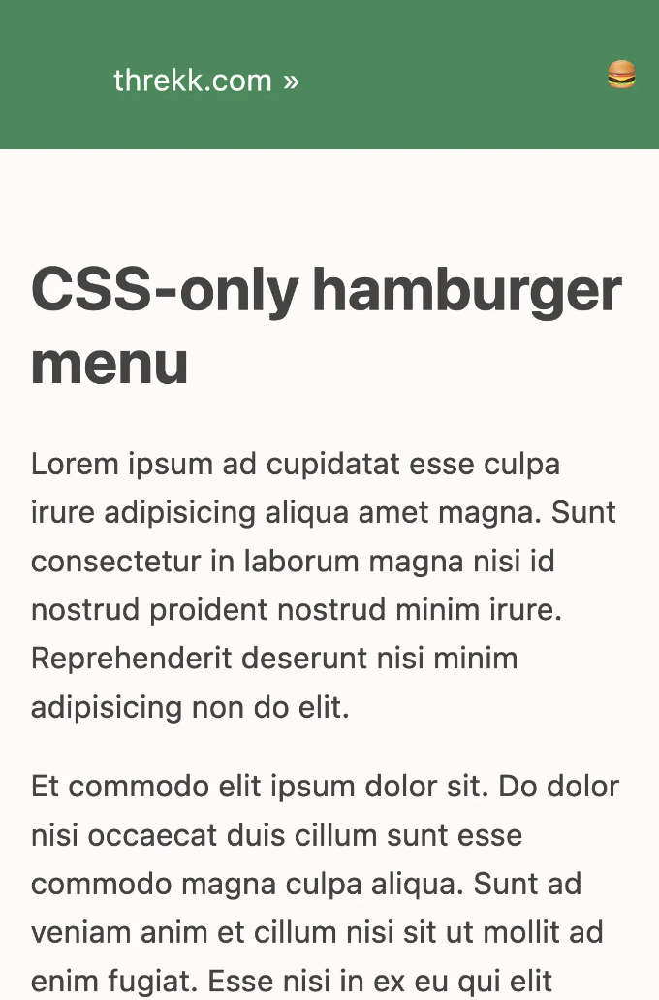

요즘에 제가 사이트에 작은 수정을 하고 있었을 때, 제가 만들었던 햄버거 메뉴를 다시 발견했어요. 아주 특별한 것은 아니에요. 작은 해상도로 들어가면 숨겨진 수직 메뉴로 자신을 압축하는 메뉴인데요. 버튼을 눌러서 보이게하거나 숨길 수 있어요. 흥미로운 점은 이것을 HTML과 CSS만을 사용해서 만든 것이에요.

만들 때, 인터넷에서 어떻게 이를 달성할 수 있는지에 대한 전체적인 예제를 찾을 수 없었고, 원하는 결과를 얻기 위해 많은 시행착오가 필요했다는 것을 기억해요. 그래서 메뉴의 코드를 추출하여 간단화된 예제로 변환했어요.

# 요구 사항

이 프로젝트를 시작할 때, 수행해야 할 몇 가지 요구 사항이 있었어요.

<!-- ui-log 수평형 -->
<ins class="adsbygoogle"
  style="display:block"
  data-ad-client="ca-pub-4877378276818686"
  data-ad-slot="9743150776"
  data-ad-format="auto"
  data-full-width-responsive="true"></ins>
<component is="script">
(adsbygoogle = window.adsbygoogle || []).push({});
</component>

- HTML과 CSS만 사용할 수 있습니다. 상호작용도 포함됩니다.
- 두 개의 다른 메뉴가 아닌 동일한 메뉴여야 하며 한 가지만 표시해야 합니다.
- CSS가 로드되지 않을 경우에도 적어도 기능해야 합니다.

# 과정

프로젝트는 다음 단계를 포함합니다:

- 링크 목록을 작성합니다.
- 링크 목록을 큰 화면에 맞게 꾸밈니다.
- 링크 목록을 작은 화면에 맞게 꾸밈니다.
- 작은 화면의 링크 목록을 접을 수 있도록 만듭니다. 

<!-- ui-log 수평형 -->
<ins class="adsbygoogle"
  style="display:block"
  data-ad-client="ca-pub-4877378276818686"
  data-ad-slot="9743150776"
  data-ad-format="auto"
  data-full-width-responsive="true"></ins>
<component is="script">
(adsbygoogle = window.adsbygoogle || []).push({});
</component>

# 시작점, 링크 목록

메뉴는 결국 탐색에 사용되는 링크 목록이므로, 우리는 그것으로 시작합니다:

```js
<nav>
    <!-- 항상 표시되는 항목들을 포함하는 네비게이션 바 -->
    <ul>
        <li>
            <a href="https://threkk.com">threkk.com</a>
        </li>
    </ul>
    <!-- 접을 수 있는 메뉴 -->
    <ul>
        <li><a href='https://mastodon.social/@threkk'>Mastodon</a></li>
        <li><a href='https://twitter.com/threkk'>Twitter</a></li>
        <li><a href='https://github.com/threkk'>Github</a></li>
    </ul>
</nav>
```

이 목록은 사실상 전체 메뉴에서 사용할 모든 HTML입니다. 나머지는 CSS 마법일 뿐입니다.

<!-- ui-log 수평형 -->
<ins class="adsbygoogle"
  style="display:block"
  data-ad-client="ca-pub-4877378276818686"
  data-ad-slot="9743150776"
  data-ad-format="auto"
  data-full-width-responsive="true"></ins>
<component is="script">
(adsbygoogle = window.adsbygoogle || []).push({});
</component>

# 큰 화면에서 목록 깔끔하게 만들기

이 부분은 간단하며, CSS를 조금 추가하면 끝나요. 어떤 것이 깔끔해 보이는지는 당신의 선택입니다:

```js
nav {
    background-color: SeaGreen;
    color: snow;
    display: flex;
    justify-content: space-between;
}
nav ul {
    /* 마커들을 사라지게 만듭니다 */
    list-style-type: none;
}
nav ul li {
    /* 요소들을 한 줄에 배치합니다 */
    display: inline-flex;
    margin: 0.3em 1em;
}
```

이 부분은 여기까지입니다. 이 부분에서는 변경 사항이 없을 것입니다.

<!-- ui-log 수평형 -->
<ins class="adsbygoogle"
  style="display:block"
  data-ad-client="ca-pub-4877378276818686"
  data-ad-slot="9743150776"
  data-ad-format="auto"
  data-full-width-responsive="true"></ins>
<component is="script">
(adsbygoogle = window.adsbygoogle || []).push({});
</component>

# 작은 화면에서 목록을 예쁘게 만들기

미디어 쿼리를 사용하여 다음 규칙을 작은 해상도에만 제한합니다. 원하는 경우 테블릿을 "작은 장치"로 고려할지에 따라 사용된 값을 조정해볼 수 있어요.

```js
@media (max-width: 576px) {
    nav {
        flex-direction: row;
        flex-wrap: wrap;
        margin-left: 0;
        margin-right: 0;
    }
    /* 현재 모바일 모드이므로 수직 목록으로 표시하고 싶어요 */
    nav ul {
        display: block;
    }
    /* 두 개의 목록이 있습니다. 첫 번째는 항상 메뉴 바에 표시되는 항목이고,
       두 번째는 숨겨질 목록입니다 */
    nav ul:last-child {
        width: 100%;
        flex-basis: 100%;
    }
    nav ul li {
        margin-bottom: 0;
        width: 100%;
        text-align: right;
        padding: 0.5em;
    }
}
```



<!-- ui-log 수평형 -->
<ins class="adsbygoogle"
  style="display:block"
  data-ad-client="ca-pub-4877378276818686"
  data-ad-slot="9743150776"
  data-ad-format="auto"
  data-full-width-responsive="true"></ins>
<component is="script">
(adsbygoogle = window.adsbygoogle || []).push({});
</component>

# 작은 화면에서 링크 목록을 접을 수 있게 만들기.

마침내, 흥미로운 부분이에요. 모든 마법은 여기에 있어요: 체크박스가 제공되었을 때, 그것이 선택되지 않았다면 인접한 목록은 표시되지 않아요.

```js
input[type='checkbox']:not(:checked)+ul {
    display: none;
}
```

먼저, HTML에 라벨이 달린 체크박스를 추가해요.

<!-- ui-log 수평형 -->
<ins class="adsbygoogle"
  style="display:block"
  data-ad-client="ca-pub-4877378276818686"
  data-ad-slot="9743150776"
  data-ad-format="auto"
  data-full-width-responsive="true"></ins>
<component is="script">
(adsbygoogle = window.adsbygoogle || []).push({});
</component>

```js
<nav>
    <!-- 항상 보이는 네비게이션 바 아이템 -->
    <ul>
        <li>
            <a href="https://threkk.com">threkk.com</a>
        </li>
    </ul>
    <!-- 햄버거 메뉴 -->
    <label for='menu' tabindex="0">
        🍔
    </label>
    <input id='menu' type='checkbox' />
    <!-- 축소 가능한 메뉴 -->
    <ul>
        <li><a href='https://mastodon.social/@threkk'>Mastodon</a></li>
        <li><a href='https://twitter.com/threkk'>Twitter</a></li>
        <li><a href='https://github.com/threkk'>Github</a></li>
    </ul>
</nav>
```

화면이 큰 경우에는 체크박스와 레이블이 숨겨지며, 그 값은 중요하지 않습니다.

```js
nav input[type='checkbox'], nav label {
    display: none;
}
```

그러나 작은 화면 해상도에서는 디자인 상의 이유로 레이블을 표시하고 체크박스는 숨깁니다.

<!-- ui-log 수평형 -->
<ins class="adsbygoogle"
  style="display:block"
  data-ad-client="ca-pub-4877378276818686"
  data-ad-slot="9743150776"
  data-ad-format="auto"
  data-full-width-responsive="true"></ins>
<component is="script">
(adsbygoogle = window.adsbygoogle || []).push({});
</component>

```js
/* 메뉴 아이콘 스타일링, 체크박스는 숨겨져 있습니다 */
nav label {
    text-align: right;
    display: block;
    padding: 0.5em;
    line-height: 1.6em;
    align-self: center;
}
```


에쇼! 여기까지입니다. 실제 예시를 확인하려면 여기를 클릭하고, 전체 소스 코드는 GitHub에서 확인할 수 있습니다.

이 글이 마음에 드셨나요? Mastodon이나 Twitter에서 알려주세요!
```