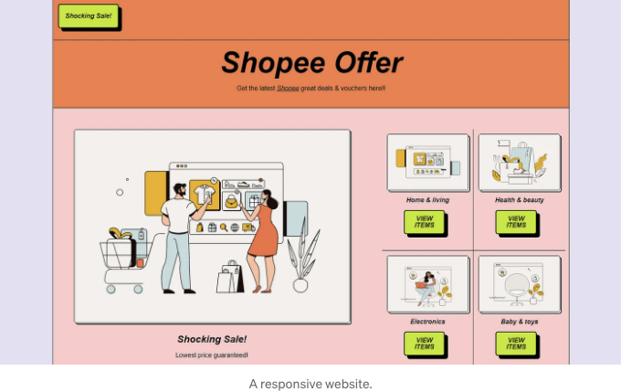
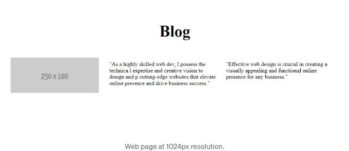
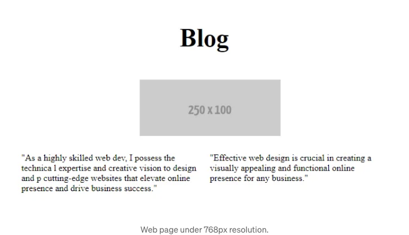
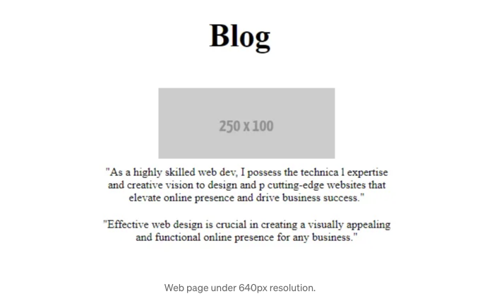

여기서 이 글을 읽는다면, 아마도 이미 반응형 웹 디자인을 알고 있다면 좋을 것입니다. 반응형 웹 디자인은 웹 페이지가 다양한 기기와 화면 크기에 적응하여 사용자에게 최적의 화면 표시 경험을 제공합니다.

이제 우리는 간단한 반응형 웹을 만들어보려고 합니다. 아마 여러분은 HTML과 CSS만으로 처음부터 반응형 웹을 만드는 방법을 배우고 이해할 수 있을 것입니다.

시작해 봅시다. 이 모든 코드는 body 태그 안에 있습니다. 우리는 먼저 1024px 데스크톱 화면 해상도부터 시작하여 iPad 또는 스마트폰 화면에 맞게 반응형으로 만들 것입니다.

<!-- ui-log 수평형 -->
<ins class="adsbygoogle"
  style="display:block"
  data-ad-client="ca-pub-4877378276818686"
  data-ad-slot="9743150776"
  data-ad-format="auto"
  data-full-width-responsive="true"></ins>
<component is="script">
(adsbygoogle = window.adsbygoogle || []).push({});
</component>

## 대형 해상도



```html
<!DOCTYPE html>
<html lang="en">
<head>
  <meta charset="UTF-8" />
  <title>Hello, world!</title>
  <meta name="viewport" content="width=device-width, initial-scale=1" />
  <meta name="description" content="" />
  <link rel="icon" href="favicon.png">
</head>
<body>
  <div class="header">
    <h2>블로그</h2>
  </div>
  <div>
    <div class="row1">
      
    </div> 
  </div>
  <div class="row2">
    <div class="column-2">
      "고도로 숙련된 웹 개발자로서, 기술적 전문지식과 창의적 비전을 갖추어 첨단 웹사이트를 설계하고 온라인 존재감을 높이며 비즈니스 성공을 이끌어내는 능력을 지니고 있습니다."
    </div>
    <div class="column-3">
      "효과적인 웹 디자인은 어떤 비즈니스에게도 시각적으로 매력적이고 기능적인 온라인 존재감을 만드는 데 중요합니다."
    </div>
  </div>
</body>
</html>
```

<!-- ui-log 수평형 -->
<ins class="adsbygoogle"
  style="display:block"
  data-ad-client="ca-pub-4877378276818686"
  data-ad-slot="9743150776"
  data-ad-format="auto"
  data-full-width-responsive="true"></ins>
<component is="script">
(adsbygoogle = window.adsbygoogle || []).push({});
</component>

```js
body{
  padding: 20px;
}

.header{
  text-align: center;
  font-size: 30px;
  
}

.row1{
  float: left;
  padding: 10px;
}

.row2{
  display: flex;
  justify-content: center;
  padding: 10px;
}


.column-2{
  padding: 10px;
  width: 50%;
}

.column-3{
  padding: 10px;
  width: 50%;
}
```

## 중간 해상도

중간 크기 해상도는 테이블이나 아이패드 화면에 적합한 크기입니다.

CSS에서 max-width가 768픽셀인 기기를 대상으로 하는 CSS 미디어 쿼리를 사용할 수 있습니다. 이는 이 크기나 그 이하의 화면에 특별히 맞춘 스타일을 적용하는 데 사용됩니다.

<!-- ui-log 수평형 -->
<ins class="adsbygoogle"
  style="display:block"
  data-ad-client="ca-pub-4877378276818686"
  data-ad-slot="9743150776"
  data-ad-format="auto"
  data-full-width-responsive="true"></ins>
<component is="script">
(adsbygoogle = window.adsbygoogle || []).push({});
</component>

이 미디어 쿼리 아래에서는 화면 크기에 맞춰 웹사이트 레이아웃을 변경할 수 있어요.



CSS

```css
body{
  padding: 20px;
}

.header{
  text-align: center;
  font-size: 30px;
  
}

.row1{
  float: left;
  padding: 10px;
}

.row2{
  display: flex;
  justify-content: center;
  padding: 10px;
}


.column-2{
  padding: 10px;
  width: 50%;
}

.column-3{
  padding: 10px;
  width: 50%;
}

/* 중형 기기 (가로모드 태블릿)에 대한 CSS 미디어 쿼리 */
@media only screen and (max-width: 768px) {
  .row1{
    display: flex;
    justify-content: center;
    width: 100%;
  }
}
```

<!-- ui-log 수평형 -->
<ins class="adsbygoogle"
  style="display:block"
  data-ad-client="ca-pub-4877378276818686"
  data-ad-slot="9743150776"
  data-ad-format="auto"
  data-full-width-responsive="true"></ins>
<component is="script">
(adsbygoogle = window.adsbygoogle || []).push({});
</component>

## 작은 해상도

중간 해상도와 동일한 프로세스를 수행할 수 있어요. 모바일 레이아웃을 지정하기 위해 또 다른 CSS 미디어 쿼리를 추가하면 돼요.



CSS

<!-- ui-log 수평형 -->
<ins class="adsbygoogle"
  style="display:block"
  data-ad-client="ca-pub-4877378276818686"
  data-ad-slot="9743150776"
  data-ad-format="auto"
  data-full-width-responsive="true"></ins>
<component is="script">
(adsbygoogle = window.adsbygoogle || []).push({});
</component>

```js
body{
  padding: 20px;
}

.header{
  text-align: center;
  font-size: 30px;
  
}

.row1{
  float: left;
  padding: 10px;
}

.row2{
  display: flex;
  justify-content: center;
  text-align: center;
  padding: 10px;
}


.column-2{
  padding: 10px;
  width: 50%;

  
}

.column-3{
  padding: 10px;
  width: 50%;

 
}

/* 중간 크기 장치(가로형 태블릿) */
@media only screen and (max-width: 768px) {
  .row1{
    display: flex;
    justify-content: center;
    width: 100%;
  }
}

/* 소형 장치 (세로형 태블릿 및 대형 휴대폰, 600px 이상) */
@media only screen and (max-width: 640px) {
  .row2 {
   display: block;
  }
  
  .column-2, .column-3{
   width: 100%;
  }
}
```
주된 포인트는 CSS 미디어 쿼리를 사용하여 각 화면 크기에 따른 디자인 레이아웃을 지정하는 것입니다. 순수 CSS를 사용하는 것이 조금 복잡하다는 것을 알고 있노라면까지요. 더 간결한 코드를 위해서는 Tailwind나 다른 프레임워크와 같은 CSS 프레임워크를 사용하는 것이 더 좋습니다.

그래서 이렇게 처음부터 반응형 웹사이트를 만들 수 있습니다. 가기 전에 웹 개발에 관한 내 글 몇 가지를 공유하고 싶어요.