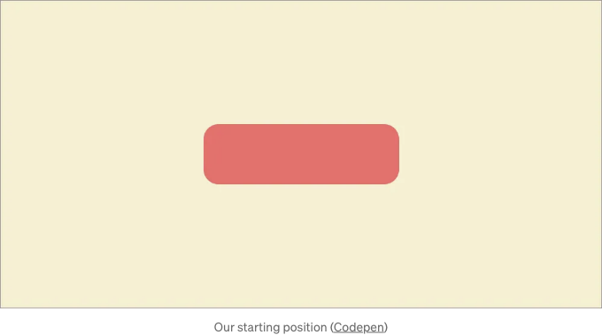
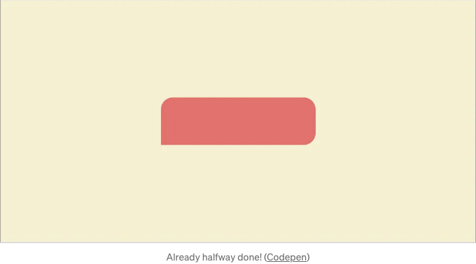
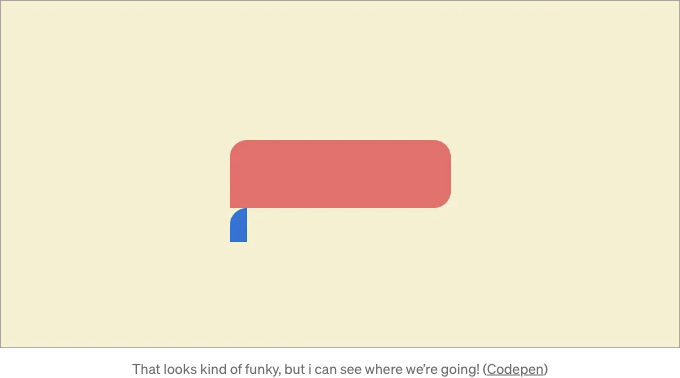
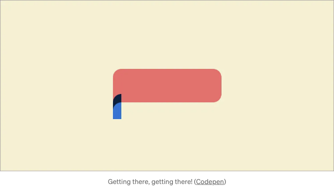
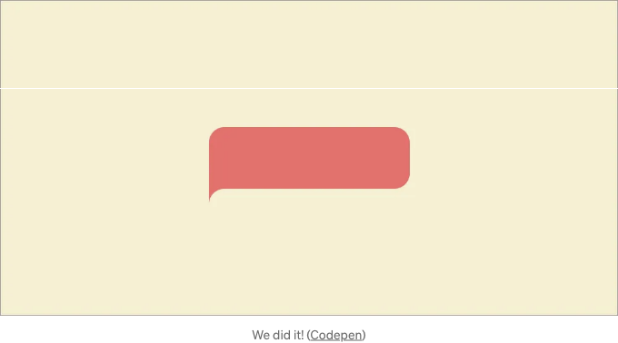

얼마 전에 Emre Mazursky가 올린 흥미로운 Dribbble 게시물을 발견했는데, 제 뇌에서는 용어 부분에서 더 나은 영감이 없어서 '역반전 둥근 테두리 반경'이라고 불렀습니다. 이 아름다운 디자인을 몇 줄의 CSS로 만드는 방법을 알아봅시다!

## 시작 코드

시작 코드는 정말 기본적입니다. body에 하나의 div를 추가하고 div와 본문 자체에 대한 몇 가지 css를 추가하면 일반적인 테두리 반경을 가진 상자가 만들어집니다. 이제 반전된 효과를 적용해 봅시다!

<!-- ui-log 수평형 -->
<ins class="adsbygoogle"
  style="display:block"
  data-ad-client="ca-pub-4877378276818686"
  data-ad-slot="9743150776"
  data-ad-format="auto"
  data-full-width-responsive="true"></ins>
<component is="script">
(adsbygoogle = window.adsbygoogle || []).push({});
</component>

## 1. 모서리를 곧게 만들기

우리가 해야 할 첫 번째 단계는 사실 굉장히 작은 일이지만 이미 거의 절반을 해냈습니다: 우리는 역모퉁이를 추가할 모서리의 테두리 반경을 제거해야 합니다. 우리는 간단히 css에서 border-radius 값을 업데이트하여 이 작업을 할 수 있습니다.

## 2. 가상 요소 생성

<!-- ui-log 수평형 -->
<ins class="adsbygoogle"
  style="display:block"
  data-ad-client="ca-pub-4877378276818686"
  data-ad-slot="9743150776"
  data-ad-format="auto"
  data-full-width-responsive="true"></ins>
<component is="script">
(adsbygoogle = window.adsbygoogle || []).push({});
</component>

역방향 모서리 반경을 만드는 요령(적어도 이 방법을 사용하는 경우)은 의사 요소를 만들고 그 요소에서 일반적인 모서리 반경을 잘라내는 것입니다. 의사 요소를 설정하고 동시에 이미 모서리 반경을 추가하여 일을 좀 더 빠르게 해 봅시다!

(의사 요소의 배경 색상은 투명해야 하는데, 여기서는 어떻게 작동하는지 보여주기 위해 파란색으로 설정했습니다).

## 3. 의사 요소에 그림자 추가

<!-- ui-log 수평형 -->
<ins class="adsbygoogle"
  style="display:block"
  data-ad-client="ca-pub-4877378276818686"
  data-ad-slot="9743150776"
  data-ad-format="auto"
  data-full-width-responsive="true"></ins>
<component is="script">
(adsbygoogle = window.adsbygoogle || []).push({});
</component>

이렇게 하면 테두리 반지름이 외부로 나가게 됩니다! 우리가 원하는 것은 div와 의사 요소 사이의 공간을 채워서, 만약 div와 동일한 색상을 주면 역전된 테두리 반지름처럼 보이도록 하는 것입니다! 이 색상을 채우는 가장 좋은 방법은 박스 그림자를 사용하는 것입니다. 의사 요소에 박스 그림자를 추가하고 위쪽으로 움직여, 흐림 없이 효과를 얻을 수 있습니다!

그리고 색상을 제대로 변경하면, 의사 요소 배경색을 투명하게 하고 그림자 색상을 빨간색(정도)으로 변경하면, 우리가 원하는 반짝이는 역전된 테두리 반지름이 나옵니다!

<!-- ui-log 수평형 -->
<ins class="adsbygoogle"
  style="display:block"
  data-ad-client="ca-pub-4877378276818686"
  data-ad-slot="9743150776"
  data-ad-format="auto"
  data-full-width-responsive="true"></ins>
<component is="script">
(adsbygoogle = window.adsbygoogle || []).push({});
</component>

아래에는이 예제에 대한 전체 CSS 코드가 있습니다.

안녕하세요, 제 이름은 Jeroen Knol이고 현재 암스테르담의 @themainingredient에서 소프트웨어 개발자로 일하고 있습니다. 더 많은 멋진 일들을 The Main Ingredient에서 하고 있는 와중에이 멋진 일을 모두와 공유하고 싶습니다.

이 게시물을 좋아하고 더 많은 정보를 원하는 경우 저희 웹 사이트를 확인해주세요! www.themainingredient.co

또는 제 개인 Linkedin을 확인해주세요: www.linkedin.com/in/jeroen-knol