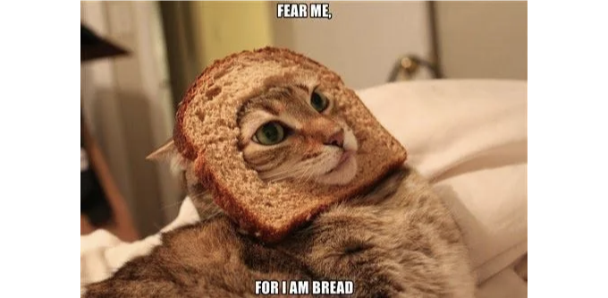
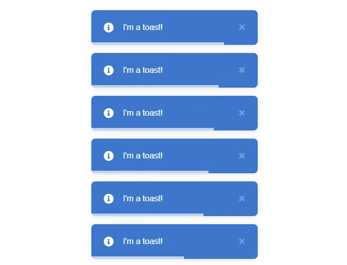
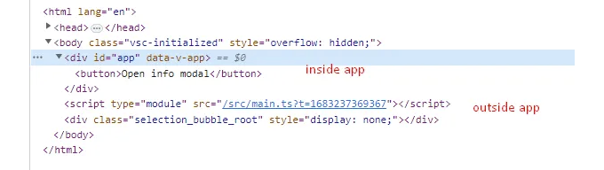
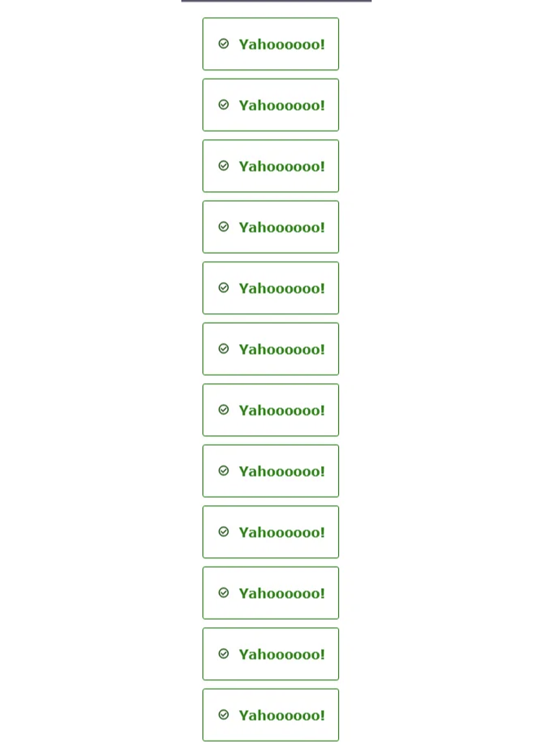

잉! 이 기사는 모달에 관한 다른 글과 닮아 있네요. 함께 확인해보세요! https://medium.com/itnext/how-to-build-a-reusable-modal-component-in-vuejs-f1799ab9b3e

# 소개

여러분도 이미 알고 계시겠지만, 웹사이트를 구축할 때 사용자 경험은 상당히 중요합니다. 사용자가 버튼이나 양식과 상호작용하거나 뭔가 잘못되었을 때, 사용자에게 그 결과를 어떤 식으로 알려주는 것이 중요하다는 것을 알고 계셔야 합니다. 그래서 작업이 완료되었고 응답이 있는 것처럼 느껴지게끔 사용자에게 통지하는 것이 중요합니다.

<!-- ui-log 수평형 -->
<ins class="adsbygoogle"
  style="display:block"
  data-ad-client="ca-pub-4877378276818686"
  data-ad-slot="9743150776"
  data-ad-format="auto"
  data-full-width-responsive="true"></ins>
<component is="script">
(adsbygoogle = window.adsbygoogle || []).push({});
</component>

이러한 종류의 요구 사항에 대한 솔루션 중 하나는 Toast입니다 - 화면의 어딘가에서 부드럽게 알려주는 간단한 팝업 알림입니다. 모든 것이 잘 되었는지 또는 끔찍한 일이 발생했는지 안내하며 최대한 빨리 페이지를 다시로드해야합니다.

그리고 많은 것들과 마찬가지로, Vue 생태계에는 이 기능을 잘 처리하는 멋진 라이브러리인 vue-toastification이 있습니다. 그들은 수많은 옵션이 있고, 초기에 멋진 보기를 제공하며, 라이브러리 자체가 가벼우며 다양한 기능을 제공합니다.



하지만 프로젝트에서 외부 리소스에 의존하지 않는 요구 사항이 있다면 어떨까요? 또는, 나의 경우처럼 해당 라이브러리의 내장 모듈이 없는 Nuxt 웹 사이트를 제작하고 있어서 우리의 모든 시도가 계속 오류를 발생시킨다면 어떨까요? 이 시점에서는 간단한 질문을 해결하기 위해 단순히 차분하고 손에 있는 도구로 직접 처리하는 것이 더 나을 수 있습니다.

<!-- ui-log 수평형 -->
<ins class="adsbygoogle"
  style="display:block"
  data-ad-client="ca-pub-4877378276818686"
  data-ad-slot="9743150776"
  data-ad-format="auto"
  data-full-width-responsive="true"></ins>
<component is="script">
(adsbygoogle = window.adsbygoogle || []).push({});
</component>

# 레시피

우리의 토스트 컴포넌트를 구축하려면 두 부분이 필요합니다:

- 토스트에 관한 모든 정보가 저장될 상태 논리.
- 상태를 이용하여 사용자가 현재 화면에 어떤 토스트를 가져야 하는지 표시하는 인터페이스

로직 없이 인터페이스만으로는 작동하지 않기 때문에, 먼저 로직을 작성해 봅시다!

<!-- ui-log 수평형 -->
<ins class="adsbygoogle"
  style="display:block"
  data-ad-client="ca-pub-4877378276818686"
  data-ad-slot="9743150776"
  data-ad-format="auto"
  data-full-width-responsive="true"></ins>
<component is="script">
(adsbygoogle = window.adsbygoogle || []).push({});
</component>

# Pinia 스토어

저희 앱에서 토스트 기능을 정말 어디서나 사용해야 하기 때문에, 상태를 유지하기 위해 여러분이 이미 많이 알고 계신 개념을 사용할 거에요. Vue 2를 위해서라면 Vuex를 사용해야 하지만, 이 글을 Vue 3 프로젝트에서 작성 중이므로 Pinia를 사용할 거에요. 둘의 차이점은 Vuex가 옛날 상태 관리자로 자신의 흠과 낮은 Typescript 지원을 갖고 있다는 점이고, Pinia는 더 새롭고 커뮤니티에서 공식 Vue 상태 관리자로 인정하고 지원하는 것이죠.

## Pinia 설치하기

Pinia를 설치하려면:

<!-- ui-log 수평형 -->
<ins class="adsbygoogle"
  style="display:block"
  data-ad-client="ca-pub-4877378276818686"
  data-ad-slot="9743150776"
  data-ad-format="auto"
  data-full-width-responsive="true"></ins>
<component is="script">
(adsbygoogle = window.adsbygoogle || []).push({});
</component>

- 패키지로 설치하세요 (선호하는 패키지 매니저를 선택하세요):

```js
//npm
npm install pinia
//yarn
yarn add pinia
//pnpm
pnpm add pinia
```

2. main.ts 파일에 Pinia 인스턴스를 생성하세요:

```js
import { createPinia } from "pinia";

const pinia = createPinia();
```

<!-- ui-log 수평형 -->
<ins class="adsbygoogle"
  style="display:block"
  data-ad-client="ca-pub-4877378276818686"
  data-ad-slot="9743150776"
  data-ad-format="auto"
  data-full-width-responsive="true"></ins>
<component is="script">
(adsbygoogle = window.adsbygoogle || []).push({});
</component>

3. 우리 앱에 사용해 봅시다:

```js
const app = createApp(App);

app.use(pinia);
```

좋아요! 이제 우리는 스토어를 정의할 수 있어요. Pinia 스토어는 Vuex의 모듈 시스템과 달리 각각 별도의 파일로 작성됩니다. stores라는 폴더를 만들어서 거기에 useToasterStore 파일을 생성해요. 그 파일 안에서 다음과 같이 스토어를 정의할 거에요:

```js
import { defineStore } from "pinia";

export const useToasterStore = defineStore("toaster-store", {
  state: () => ({}),
  actions: {},
});
```

<!-- ui-log 수평형 -->
<ins class="adsbygoogle"
  style="display:block"
  data-ad-client="ca-pub-4877378276818686"
  data-ad-slot="9743150776"
  data-ad-format="auto"
  data-full-width-responsive="true"></ins>
<component is="script">
(adsbygoogle = window.adsbygoogle || []).push({});
</component>

첫 번째 인수는 모든 다른 상점들 중에서 그것을 식별하는 데 사용되는 상점의 ID이고, 두 번째 인수는 상태를 보유하는 객체입니다 (중괄호 안에 있는 객체를 반환하는 화살표 함수입니다). 그리고 이 함수 내에서는 클래스의 메소드처럼 작동하는 액션도 포함되어 있습니다.

## 로직 처리

한 번에 많은 알림이 있을 수 있기 때문에, 저희는 상태를 보관하는 배열을 사용할 것입니다. 미리 TypeScript 인터페이스를 정의할 것입니다. 하지만 순수 JS로 작업 중이라면, 이 인터페이스는 무시하셔도 됩니다.

```js
// 상태는 토스트 색상 및 아이콘을 정의할 것입니다.
export type TToastStatus = "success" | "warning" | "error";

interface IToast {
  // 토스트 내용
  text: string;
  status: TToastStatus;
  // 토스트 구분을 위한 ID
  id: number;
}

export default defineStore("toaster-store", {
  state: (): { toasts: IToast[] } => ({
    toasts: [],
  }),
  actions: {}
});
```

<!-- ui-log 수평형 -->
<ins class="adsbygoogle"
  style="display:block"
  data-ad-client="ca-pub-4877378276818686"
  data-ad-slot="9743150776"
  data-ad-format="auto"
  data-full-width-responsive="true"></ins>
<component is="script">
(adsbygoogle = window.adsbygoogle || []).push({});
</component>

좋아요! 이제 필요에 따라 상태를 변이시키는 몇 가지 메서드를 정의해 보겠습니다. 나중을 위해 상태의 양이 변경될 수 있기 때문에 먼저, 나중에 재사용할 수 있도록 상점의 핵심인 컨트롤러와 유사한 메서드를 정의해야 합니다.

먼저, 토스트 정보를 전달하는 방법을 정의해야 합니다. 그에 대한 타입을 만듭니다:

```js
// timeout is conditional because we will define default one
type ToastPayload = { timeout?: number; text: string };
```

다음으로, 파일의 맨 위에 위치한 함수(상점 내부가 아닌)로 토스트 객체를 생성하는 방법이 필요합니다.

<!-- ui-log 수평형 -->
<ins class="adsbygoogle"
  style="display:block"
  data-ad-client="ca-pub-4877378276818686"
  data-ad-slot="9743150776"
  data-ad-format="auto"
  data-full-width-responsive="true"></ins>
<component is="script">
(adsbygoogle = window.adsbygoogle || []).push({});
</component>

```js
const createToast = (text: string, status: TToastStatus): IToast => ({
  text,
  status,
  id: Math.random() * 1000,
});
```

미래에 토스트를 구분하기 위해 ID를 정의했어요. Math.random() * 1000 함수를 사용해서 천 단위 내의 랜덤 숫자를 생성했어요. uuid 라이브러리와 같은 것을 사용할 수도 있지만, 저희 애플리케이션의 범위에서는 필요하지 않다고 생각해요.

마지막으로, 마침내 우리의 메소드를 정의하기 전에, 일반적인 토스트를 생성할 때마다 지속 시간을 전달할 필요가 없도록 상수 기본 시간 초를 만들겠어요:

```js
const defaultTimeout: number = 2000;
```

<!-- ui-log 수평형 -->
<ins class="adsbygoogle"
  style="display:block"
  data-ad-client="ca-pub-4877378276818686"
  data-ad-slot="9743150776"
  data-ad-format="auto"
  data-full-width-responsive="true"></ins>
<component is="script">
(adsbygoogle = window.adsbygoogle || []).push({});
</component>

그리고 저희 함수가 여기 나왔어요!

```js
actions: {
    updateState(payload: ToastPayload, status: TToastStatus) {
// Get text and timeout from payload
      const { text, timeout } = payload;
// We create the toast with function above
      const toast = createToast(text, status);

// We push toasts to the state
      this.toasts.push(toast);

// We create a delay to delete toast after its provided timeout is over
      setTimeout(() => {
        this.toasts = this.toasts.filter((t) => t.id !== toast.id);
      }, timeout ?? defaultTimeout);
    }
}
```

이 함수가 하는 일:
- 제공된 payload 객체의 값들을 해체
- 해당 값들을 사용하여 일반적인 토스트 객체를 생성
- 생성된 토스트를 상태 배열에 추가
- 제공된 시간이 종료되거나(널 병합 연산자를 사용하여) 제공되지 않은 경우—기본 시간이 지난 후 토스트를 상태 배열에서 제거하기 위해 지연 시간을 설정합니다.

<!-- ui-log 수평형 -->
<ins class="adsbygoogle"
  style="display:block"
  data-ad-client="ca-pub-4877378276818686"
  data-ad-slot="9743150776"
  data-ad-format="auto"
  data-full-width-responsive="true"></ins>
<component is="script">
(adsbygoogle = window.adsbygoogle || []).push({});
</component>

그렇게 하면 앱에서 손쉽게 사용할 수 있는 세 가지 독립적인 메서드를 만들 수 있게 됩니다. 이러한 메서드는 상태를 직접 변이(mutate)하는 메서드 위에 추상화된 종류의 역할을 하며, 앞으로 상태가 예측 불가능한 방식으로 변이되지 않도록 합니다.

```js
success(payload: ToastPayload) {
      this.updateState(payload, "success");
    },

warning(payload: ToastPayload) {
      this.updateState(payload, "warning");
    },

error(payload: ToastPayload) {
      this.updateState(payload, "error");
    },
```

각 메서드에서는 updateState를 사용하며, 각 메서드마다 다른 종류의 토스트를 제공합니다.

마지막으로 useToasterStore 파일은 다음과 같이 보입니다:

<!-- ui-log 수평형 -->
<ins class="adsbygoogle"
  style="display:block"
  data-ad-client="ca-pub-4877378276818686"
  data-ad-slot="9743150776"
  data-ad-format="auto"
  data-full-width-responsive="true"></ins>
<component is="script">
(adsbygoogle = window.adsbygoogle || []).push({});
</component>

```js
import { defineStore } from "pinia";

export type TToastStatus = "success" | "warning" | "error";

interface IToast {
  text: string;
  status: TToastStatus;
  id: number;
}
type ToastPayload = { timeout?: number; text: string };

const defaultTimeout = 2000;

const createToast = (text: string, status: TToastStatus): IToast => ({
  text,
  status,
  id: Math.random() * 1000,
});

export default defineStore("toaster-store", {
  state: (): { toasts: IToast[] } => ({
    toasts: [],
  }),
  actions: {
    updateState(payload: ToastPayload, status: TToastStatus) {
      const { text, timeout } = payload;

      const toast = createToast(text, status);

      this.toasts.push(toast);

      setTimeout(() => {
        this.toasts = this.toasts.filter((t) => t.id !== toast.id);
      }, timeout ?? defaultTimeout);
    },
    success(payload: ToastPayload) {
      this.updateState(payload, "success");
    },

    warning(payload: ToastPayload) {
      this.updateState(payload, "warning");
    },

    error(payload: ToastPayload) {
      this.updateState(payload, "error");
    },
  },
});
```

그렇게 작성했습니다. 여러분은 이제 토스트에 대한 로직 작성을 완료했습니다! 이제 뷰를 만들어보겠습니다!

## 뷰 만들기 (UI)

먼저, 뷰를 만드는 데 필요한 단계를 논의해보겠습니다:```

<!-- ui-log 수평형 -->
<ins class="adsbygoogle"
  style="display:block"
  data-ad-client="ca-pub-4877378276818686"
  data-ad-slot="9743150776"
  data-ad-format="auto"
  data-full-width-responsive="true"></ins>
<component is="script">
(adsbygoogle = window.adsbygoogle || []).push({});
</component>

- store를 초기화하고 사용할 SFC (Single File Component)을 만듭니다.
- 화면의 오른쪽 하단에 (우리를 위해 설정되어 있는) 토스트를 위한 컨테이너를 만듭니다. 이후 조정할 수 있으며, 특정 옵션을 추가할 수도 있습니다.
- 컨테이너에 스타일을 적용하고 각 토스트의 유형에 따라 스타일과 아이콘을 조정합니다.

그렇죠! 저희는 애플리케이션 어딘가에 Toaster.vue라는 파일을 만들고, 우리 토스트 컴포넌트의 템플릿 구조를 만드는 것으로 시작합니다:

```js
  <Teleport to="body">
      <ul v-if="toastStore.toasts.length" class="toaster__wrapper">
          <li
            v-for="toast in toastStore.toasts"
            class="toaster__list"
            :key="toast.text"
          >
            <Icon
              class="toaster__list-icon"
            />
            <span class="toaster__list-text">
              { toast.text }
            </span>
          </li>
      </ul>
  </Teleport>
```

여기에서 우리는 몇 가지를 사용합니다:

<!-- ui-log 수평형 -->
<ins class="adsbygoogle"
  style="display:block"
  data-ad-client="ca-pub-4877378276818686"
  data-ad-slot="9743150776"
  data-ad-format="auto"
  data-full-width-responsive="true"></ins>
<component is="script">
(adsbygoogle = window.adsbygoogle || []).push({});
</component>

- `Teleport` 컴포넌트는 우리의 토스트를 #app div 바깥에 렌더링할 수 있게 해줍니다. 모달과 마찬가지로 앱 위에 모든 것을 다른 DOM 노드로 생성하고 싶다는 점이 중요합니다:



2. 우리의 상태에 토스트가 있을 때에만 렌더링되는 순서 없는 목록 `ul`입니다. 이는 `li` 항목에 대한 `v-for` 루프를 사용해 토스트를 접근 가능한 방식으로 래핑합니다. 각 항목은 아이콘과 텍스트가 포함된 span을 포함하고 있습니다. Vue에서 svgs를 처리하는 다양한 방법이 있지만(템플릿에 직접 배치, 컴포넌트를 만들어서 사용, NuxtIcon과 Nuxt 또는 Iconify와 Vue를 사용), Vite 앱에서 즐겨 사용하는 방법을 사용하고 있습니다:

```js
<template>
  <component :is="icon" />
</template>

<script setup lang="ts">
import { defineAsyncComponent } from "vue";

// 우리가 가진 svg를 정의함
type TIconName = 'toast-error' | 'toast-warning' | 'toast-success'

// props에서 svg의 이름을 가져옴
const props = defineProps<{ name: TIconName }>();

// 아이콘을 동적으로 가져옴. 여기서는 해당 폴더까지의 경로를 정의해야 함
const icon = defineAsyncComponent(
  () => import(`/assets/icons/${props.name}.svg`)
);
</script>

<style scoped lang="scss"></style>
```

<!-- ui-log 수평형 -->
<ins class="adsbygoogle"
  style="display:block"
  data-ad-client="ca-pub-4877378276818686"
  data-ad-slot="9743150776"
  data-ad-format="auto"
  data-full-width-responsive="true"></ins>
<component is="script">
(adsbygoogle = window.adsbygoogle || []).push({});
</component>

이해하기 쉽고 타입 안전하며 재사용 가능하기 때문에 여기저기서도 활용할 수 있어요 :) 기사 맨 아래에서 레포지토리에서 SVG 파일을 받아도 돼요.

기본적인 마크업을 마무리한 후에는 스타일을 살펴봅시다:

```js
.toaster {
  &__wrapper {
    position: fixed;
    bottom: 3%;
    right: 5%;

    z-index: 100;
  }

  &__list {
    display: flex;
    align-items: center;
    gap: 1rem;

    border-radius: 0.3rem;

    border: 1px solid transparent;

    background-color: white;

    padding: 2.2rem 1.6rem;


    &-icon {
      width: 1.8rem;
      aspect-ratio: 1/1;
    }

    &-text {
      font-size: 1.6rem;
      font-weight: 600;
    }
  }
}
```

여기서는 position: fixed와 bottom, right 속성을 적용하여 화면의 오른쪽 하단에 토스트를 위치시켜요. 그리고 z-index를 100으로 지정하여 대부분의 (하지만 modal과 같은 것은 아님) 요소들 위에 나타나도록 해요. 목록에는 패딩을 조금 주고, display: flex 및 flex-direction: column 속성을 주어 토스트가 수직으로 배치되도록 만들었어요. 아이콘과 텍스트도 스타일링했어요.

<!-- ui-log 수평형 -->
<ins class="adsbygoogle"
  style="display:block"
  data-ad-client="ca-pub-4877378276818686"
  data-ad-slot="9743150776"
  data-ad-format="auto"
  data-full-width-responsive="true"></ins>
<component is="script">
(adsbygoogle = window.adsbygoogle || []).push({});
</component>

## 토스트 유형에 따라 색상과 아이콘 결정하기

우리의 토스트를 조건부로 렌더링하려면 맵 패턴을 사용할 것입니다. 맵 패턴은 객체의 키가 마치 보물지도처럼 작용하는 곳입니다. 이를 통해 다음과 같은 코드를 피할 수 있습니다:

```js
if (type === 'a') ...
else if(type === 'b') ...
else if(type === 'c') ...
```

맵은 단순한 객체일 뿐입니다:

<!-- ui-log 수평형 -->
<ins class="adsbygoogle"
  style="display:block"
  data-ad-client="ca-pub-4877378276818686"
  data-ad-slot="9743150776"
  data-ad-format="auto"
  data-full-width-responsive="true"></ins>
<component is="script">
(adsbygoogle = window.adsbygoogle || []).push({});
</component>

```js
const toastColorMap: Record<TToastStatus, string> = {
  warning: "warning",
  error: "error",
  success: "success",
};

const toastIconMap: Record<TToastStatus, string> = {
  error: "toast-error",
  warning: "toast-warning",
  success: "toast-success",
};
```

여기서 key는 useToasterStore 파일에서 정의한 상태 유형이며 값은 간단한 문자열입니다. 여기서 우리는 우리의 토스트에 적용할 클래스를 위한 맵과 Icon 컴포넌트에 제공할 아이콘 이름을 위한 맵을 두 개 정의합니다. 코드에서 사용하기 위해 이렇게 조정합니다:

```js
 <li
    v-for="toast in toastStore.toasts"
    :class="['toaster__inner', toastClassMap[toast.status]]"
    :key="toast.text"
>
    <Icon
      :name="toastIconMap[toast.status]"
      class="toaster__inner-icon"
    />
    <span class="toaster__inner-text">
      { toast.text }
    </span>
</li>
```

여기서 v-for 루프의 각 항목에서 toast.status 필드를 사용하여 맵에서 해당 값에 액세스합니다. 주의할 점은 div에서 템플릿 리터럴 대신 배열을 사용하고 있습니다. 코드를 읽기 쉽게하는 방법입니다.```

<!-- ui-log 수평형 -->
<ins class="adsbygoogle"
  style="display:block"
  data-ad-client="ca-pub-4877378276818686"
  data-ad-slot="9743150776"
  data-ad-format="auto"
  data-full-width-responsive="true"></ins>
<component is="script">
(adsbygoogle = window.adsbygoogle || []).push({});
</component>

마지막으로, 아래 스타일 시트에서 지도에서 사용하는 클래스를 정의해 봅시다. 우리는 매번 중복되는 코드를 재작성하지 않고 토스트의 색상을 동적으로 변경하기 위해 CSS 변수를 사용할 것입니다.

```js
 &__inner {
// CSS 변수 할당
    --color: black;
    display: flex;
    align-items: center;
    gap: 1rem;

    border-radius: 0.3rem;

    border: 1px solid transparent;

    background-color: white;

    padding: 2.2rem 1.6rem;

// 색상을 변경하기 위해 사용
    border-color: var(--color);
    color: var(--color);
    svg {
      fill: var(--color);
      stroke: var(--color);
    }

// 적용된 클래스에 따라 변경
    &.success {
      --color: green;
    }

    &.warning {
      --color: orange;
    }

    &.error {
      --color: red;
    }
}
```

마지막으로 Toaster.vue 파일은 다음과 같이 보입니다:

```js
<template>
  <Teleport to="body">
      <ul v-if="toastStore.toasts.length" class="toaster__wrapper">
          <li
            v-for="toast in toastStore.toasts"
            :class="['toaster__inner', toastClassMap[toast.status]]"
            :key="toast.text"
          >
            <Icon
              :name="toastIconMap[toast.status]"
              class="toaster__inner-icon"
            />

            <span class="toaster__inner-text">
              { toast.text }
            </span>
          </li>
      </ul>
  </Teleport>
</template>

<script setup lang="ts">
import useToasterStore, { TToastStatus } from "@/stores/useToasterStore";
import Icon from "./Icon.vue";

const toastClassMap: Record<TToastStatus, string> = {
  warning: "warning",
  error: "error",
  success: "success",
};

const toastIconMap: Record<TToastStatus, string> = {
  error: "toast-error",
  warning: "toast-warning",
  success: "toast-success",
};
const toastStore = useToasterStore();
</script>

<style scoped lang="scss">
.toaster {
  &__wrapper {
    position: fixed;
    bottom: 3%;
    right: 5%;

    z-index: 100;

    display: flex;
    flex-direction: column;
    gap: 1rem;
  }

  &__inner {
    --color: black;
    display: flex;
    align-items: center;
    gap: 1rem;

    border-radius: 0.3rem;

    border: 1px solid transparent;

    background-color: white;

    padding: 2.2rem 1.6rem;

    border-color: var(--color);
    color: var(--color);
    svg {
      fill: var(--color);
      stroke: var(--color);
    }

    &.success {
      --color: green;
    }

    &.warning {
      --color: orange;
    }

    &.error {
      --color: red;
    }

    &-icon {
      width: 1.8rem;
      aspect-ratio: 1/1;
    }

    &-text {
      font-size: 1.6rem;
      font-weight: 600;
    }
  }
}
</style>
```

<!-- ui-log 수평형 -->
<ins class="adsbygoogle"
  style="display:block"
  data-ad-client="ca-pub-4877378276818686"
  data-ad-slot="9743150776"
  data-ad-format="auto"
  data-full-width-responsive="true"></ins>
<component is="script">
(adsbygoogle = window.adsbygoogle || []).push({});
</component>

자, 이제 보기 좋지 않게 만든 버튼을 만들고 토스트를 확인해 봅시다!

SomeOtherComponent.vue

```js
<template>
  <Toaster />

  <button @click="successToast">클릭해주세요!</button>
</template>

<script setup lang="ts">
import Toaster from "./components/Toaster.vue";
import useToasterStore from "./stores/useToasterStore";

const toasterStore = useToasterStore();

const successToast = () => toasterStore.success({ text: "야후!" });
</script>

<style scoped lang="scss"></style>
```

그리고, 타다!

<!-- ui-log 수평형 -->
<ins class="adsbygoogle"
  style="display:block"
  data-ad-client="ca-pub-4877378276818686"
  data-ad-slot="9743150776"
  data-ad-format="auto"
  data-full-width-responsive="true"></ins>
<component is="script">
(adsbygoogle = window.adsbygoogle || []).push({});
</component>



토스트가 몇 개 있더라도 모두 쌓이고 오래된 토스트가 대체됩니다. 잘 했어요!

## 애니메이션 추가

끝났다고 생각되지만, 한 가지 중요한 부분이 남아있습니다 — 애니메이션. 애니메이션이 없으면 토스트가 정적이고 둔한 느낌이 들어, 이른바 워드프레스 웹사이트에 나타나는 무작위 광고 알림처럼 갑자기 나타납니다. 이것을 고쳐봐요!

<!-- ui-log 수평형 -->
<ins class="adsbygoogle"
  style="display:block"
  data-ad-client="ca-pub-4877378276818686"
  data-ad-slot="9743150776"
  data-ad-format="auto"
  data-full-width-responsive="true"></ins>
<component is="script">
(adsbygoogle = window.adsbygoogle || []).push({});
</component>

아이템 목록에 애니메이션을 추가하려면 Vue에서 TransitionGroup이라는 특별한 API가 있어요. 이를 사용하면 아이템이 목록에 들어오거나 나갈 때 애니메이션을 매우 쉽게 정의할 수 있어요. Toaster.vue 컴포넌트에 이를 구현해봅시다:

```js
<template>
  <Teleport to="body">
    <Transition name="toast">
      <div v-if="toastStore.toasts.length" class="toaster__wrapper">
        <TransitionGroup name="toast" tag="ul">
          <li
            v-for="toast in toastStore.toasts"
            :class="['toaster__inner', toastClassMap[toast.status]]"
            :key="toast.text"
          >
            <Icon
              :name="toastIconMap[toast.status]"
              class="toaster__inner-icon"
            />

            <span class="toaster__inner-text">
              { toast.text }
            </span>
          </li>
        </TransitionGroup>
      </div>
    </Transition>
  </Teleport>
</template>

<script setup lang="ts">
import useToasterStore, { TToastStatus } from "@/stores/useToasterStore";
import Icon from "./Icon.vue";

const toastClassMap: Record<TToastStatus, string> = {
  warning: "warning",
  error: "error",
  success: "success",
};

const toastIconMap: Record<TToastStatus, string> = {
  error: "toast-error",
  warning: "toast-warning",
  success: "toast-success",
};
const toastStore = useToasterStore();
</script>

<style scoped lang="scss">
.toast-enter-from,
.toast-leave-to {
  transform: translateX(100%);
  opacity: 0;
}

.toast-enter-active,
.toast-leave-active {
  transition: 0.25s ease all;
}

.toaster {
  &__wrapper {
    position: fixed;
    bottom: 3%;
    right: 5%;

    z-index: 100;

    display: flex;
    flex-direction: column;
    gap: 1rem;
  }

  &__inner {
    --color: black;
    display: flex;
    align-items: center;
    gap: 1rem;
    /* 이하 생략 */
  }
}
</style>
```

변경된 사항을 살펴봅시다:
- 상자의 맨 위에 `Transition` 컴포넌트가 추가되었어요. 첫번째 토스트가 나타날 때 애니메이션을 적용하기 위해서 그렇게 했어요. `TransitionGroup`은 그렇게 하지 않기 때문에요. 그 컴포넌트에는 toast라는 이름이 지정되었는데, 나중에 설명할게요.
- `TransitionGroup`은 순서가 없는 목록 요소(렌더링된 것을 `ul`로 표시하도록 tag="ul"을 추가했어요)로 설정되었습니다. 또한 동일한 이름을 가지고 있어요.
- 그리고 컴포넌트가 오른쪽에서 슬라이드하여 투명하게 나타날 때 및 이탈할 때 오른쪽으로 슬라이드되고 희미하게 사라지도록 하는 몇 가지 스타일이 추가되었어요. `Transition`와 `TransitionGroup`는 내부에서 DOM에 진입하거나 나가는 요소에 해당 클래스를 적용할 것이므로 이러한 속성에 스타일을 적용하면 동일하게 애니메이션을 적용하도록 하는 것과 같아요. 다르게 처리하려면 클래스별로 스타일을 조정할 수 있어요(여기에서 자세히 읽기)```

<!-- ui-log 수평형 -->
<ins class="adsbygoogle"
  style="display:block"
  data-ad-client="ca-pub-4877378276818686"
  data-ad-slot="9743150776"
  data-ad-format="auto"
  data-full-width-responsive="true"></ins>
<component is="script">
(adsbygoogle = window.adsbygoogle || []).push({});
</component>

자, 이제 토스트를 터트려 봅시다!


# 빵이 움직이고 있어요!

안녕하세요, 이 글을 읽어주셔서 감사합니다. 이 글에 대한 코드는 다음 저장소에서 확인할 수 있어요: https://github.com/Serpentarius13/toast-tutorial. 무언가를 배운 것이 있다면 좋아요를 눌러주세요. 이 글을 공유하고 싶다면 함께 공유해주세요. 좋은 하루 되세요!

<!-- ui-log 수평형 -->
<ins class="adsbygoogle"
  style="display:block"
  data-ad-client="ca-pub-4877378276818686"
  data-ad-slot="9743150776"
  data-ad-format="auto"
  data-full-width-responsive="true"></ins>
<component is="script">
(adsbygoogle = window.adsbygoogle || []).push({});
</component>

