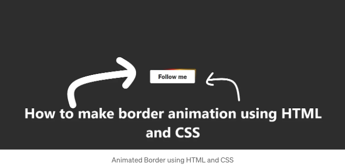

웹 디자인에서 애니메이션은 웹 사이트를 생동감 있게 만들어주고 개성을 더해주어 더 매력적으로 만들어줄 수 있습니다.

보통 애니메이션의 중요한 부분으로 무시되는 것이 경계선입니다. 경계선은 보통 정적이지만, CSS를 사용하면 애니메이션을 통해 경계선을 생동감 있게 만들 수 있습니다. 이 블로그에서는 경계선에 부드러운 애니메이션 효과를 만드는 방법을 다룰 것입니다. 이 효과는 매우 인기가 있고 각 사이트에서 일반적으로 사용됩니다.



## 시작해봐요.

<!-- ui-log 수평형 -->
<ins class="adsbygoogle"
  style="display:block"
  data-ad-client="ca-pub-4877378276818686"
  data-ad-slot="9743150776"
  data-ad-format="auto"
  data-full-width-responsive="true"></ins>
<component is="script">
(adsbygoogle = window.adsbygoogle || []).push({});
</component>

먼저, HTML 구조를 설정해봅시다. `div` 요소를 만들고 클래스가 container인 요소를 생성합니다. 이는 상대적인 부모로 사용될 겁니다. (CSS 스타일에서 overflow: hidden;을 통해 모든 오버플로우를 숨기고 패딩은 테두리 너비가 될 것입니다.) 그리고 animated-border 클래스를 가진 또 다른 `div` 요소를 만들어 CSS 스타일을 적용할 겁니다. 모든 다른 내용은 container 안에 추가해주세요.

```js
<!DOCTYPE html>
<html lang="en">

<head>
    <meta charset="UTF-8">
    <meta name="viewport" content="width=device-width, initial-scale=1.0">
    <title>Border Animation</title>
</head>

<body>
    <div id="container">
        <div class="animated-border"></div>
        <button id="followBtn">Follow me</button>
    </div>
</body>

</html>
```

그 다음, CSS로 들어가서 애니메이션 효과를 만들어보겠습니다. 애니메이션 동작을 정의하기 위해 키프레임을 활용할 겁니다.

```js
.animated-border {
    width: 250%;
    height: 350%;
    position: absolute;
    z-index: -10;
    top: 50%;
    left: 50%;
    transform: translate(-50%, -50%);
    background: conic-gradient(transparent, transparent, transparent, red, orange, transparent, transparent, transparent);
    animation: rotate 5s infinite linear;
}

@keyframes rotate {
    0% {
        transform: translate(-50%, -50%) rotate(0deg);
    }

    100% {
        transform: translate(-50%, -50%) rotate(360deg);
    }
}
```

<!-- ui-log 수평형 -->
<ins class="adsbygoogle"
  style="display:block"
  data-ad-client="ca-pub-4877378276818686"
  data-ad-slot="9743150776"
  data-ad-format="auto"
  data-full-width-responsive="true"></ins>
<component is="script">
(adsbygoogle = window.adsbygoogle || []).push({});
</component>

여기 전체 CSS입니다:

```js
body {
    padding: 0;
    margin: 0;
    background-color: #2d2d2d;
    display: flex;
    align-items: center;
    justify-content: center;
    height: 100vh;
}

#container {
    position: relative;
    overflow: hidden;
    padding: 5px;
    border-radius: 6px;
}

#followBtn {
    font-size: 32px;
    padding: 15px 40px;
    border: none;
    border-radius: 6px;
    font-family: 'Franklin Gothic Medium', 'Arial Narrow', Arial, sans-serif;
    background-color: white;
    color: #2d2d2d;
    cursor: pointer;
}

.animated-border {
    width: 250%;
    height: 350%;
    position: absolute;
    z-index: -10;
    top: 50%;
    left: 50%;
    transform: translate(-50%, -50%);
    background: conic-gradient(transparent, transparent, transparent, red, orange, transparent, transparent, transparent);
    animation: rotate 5s infinite linear;
}

@keyframes rotate {
    0% {
        transform: translate(-50%, -50%) rotate(0deg);
    }

    100% {
        transform: translate(-50%, -50%) rotate(360deg);
    }
}
```

## 결과:

여기서 애니메이션의 최종 결과를 확인하세요. 테두리가 버튼 주위를 돌고 있습니다. `button` 또는 `div` 등 모든 요소 주위에 테두리를 추가할 수 있습니다.

<!-- ui-log 수평형 -->
<ins class="adsbygoogle"
  style="display:block"
  data-ad-client="ca-pub-4877378276818686"
  data-ad-slot="9743150776"
  data-ad-format="auto"
  data-full-width-responsive="true"></ins>
<component is="script">
(adsbygoogle = window.adsbygoogle || []).push({});
</component>


## 결론:

CSS로 테두리를 애니메이션하는 것은 당신의 웹사이트의 시각적 매력을 향상시키는 무한한 가능성을 제공합니다. CSS 애니메이션과 키프레임을 활용하여 동적이고 눈길을 사로잡는 테두리 효과를 만들어내어 대중을 매혹시킬 수 있습니다. 서로 다른 속성과 값을 실험하여 원하는 테두리 룩앤필을 이룰 수 있도록 해보세요. 즐거운 코딩 되세요!

질문 있으시면 언제든지 물어보세요. 저에게 이곳이나 직접 https://tajammalmaqbool.com 에서 문의할 수 있습니다.