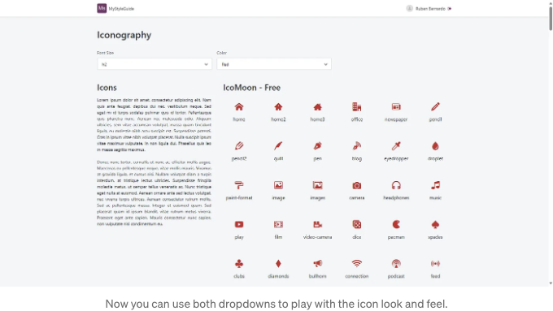

아이콘. 우리 모두 한 번쯤은 경험한 적이 있죠. 아웃시스템의 폰트 어썸(Font Awesome)를 사용하거나 자체 아이콘 폰트를 만들면서 말이죠.

나는 처음으로 이 주제를 접했던 것 같은데, 그것은 2018년에 나탈리아 블라시크 알베스(Natalia Blaszczyk Alves)의 '스프라이트 이미지를 넘어서: 아웃시스템에서 아이콘 폰트 사용하기'라는 글을 읽었을 때였어요. 당시에는 자체 폰트를 만들 필요가 없었지만 주제를 흥미롭게 여겨 그 글을 나중을 위해 저장했죠. 그로부터 2년이 지나고, 많은 UI와 시각 자산이 있는 프로젝트에 참여했어요. 말할 필요도 없이, 나탈리아의 글을 다시 읽게 되었죠.

요즘에는 디자인 시스템과 함께 일하는 일이 거의 매일이라, 아이콘 폰트 관리는 계속된 도전이 될 수 있어요. 특히 해당 파일을 다루는 사람이 여러 명이어도 말이죠.

나는 개인적으로 내게 도움이 되는 팁과 요령들을 정리했어요. 아이콘 폰트를 만들기 시작하는 순간부터 최신 상태를 유지해야 하는 순간까지.

<!-- ui-log 수평형 -->
<ins class="adsbygoogle"
  style="display:block"
  data-ad-client="ca-pub-4877378276818686"
  data-ad-slot="9743150776"
  data-ad-format="auto"
  data-full-width-responsive="true"></ins>
<component is="script">
(adsbygoogle = window.adsbygoogle || []).push({});
</component>

## 아이콘 폰트

아이콘 폰트는 일반적으로 Icomoon과 함께 사용됩니다. 왜 Icomoon을 사용하는 걸까요? 정말 모르겠지만 솔직히 말해서 정말 잘 동작합니다! Natalia의 말을 인용해 보겠습니다:

OutSystems와 함께 다른 것을 사용하시나요? Iconly나 Fontello 같은 것을 사용하시나요? 댓글란에 메시지를 남겨주시면 좋겠어요.

만약 정말 많은 기사들이 존재하지 않았다면, 이것을 하는 장점에 대해 글을 쓸 수 있었을텐데 아쉽군요. 하지만 이미 많은 기사들이 존재하기 때문에, 독자의 시간을 그렇게 많이 잡아먹지 않고 몇 가지 장점을 강조하고 싶습니다.

<!-- ui-log 수평형 -->
<ins class="adsbygoogle"
  style="display:block"
  data-ad-client="ca-pub-4877378276818686"
  data-ad-slot="9743150776"
  data-ad-format="auto"
  data-full-width-responsive="true"></ins>
<component is="script">
(adsbygoogle = window.adsbygoogle || []).push({});
</component>

- 확장성 - 일반 글꼴로 작동하여 품질을 잃지 않고 쉽게 크기를 조절할 수 있습니다. 글꼴 크기를 늘리기만 하면 됩니다.
- 사용자 정의 - CSS를 사용하여 다른 글꼴처럼 스타일을 지정할 수 있습니다. 이 유연성은 아이콘을 표시하는 방식을 일관되게 만듭니다.
- 성능 - SVG 형식의 수십, 수백 개의 아이콘보다 매우 가벼우며 브라우저에서도 캐시됩니다.

# 팁과 요령

이론 부분을 살펴보았으니 이제 Icomoon, OutSystems 및 스크린샷을 살펴보겠습니다. 제가 생각하기에 여러분의 삶을 더 쉽게 만들어줄 팁과 요령 목록을 작성해보았어요. 이를 '이것이 방법'(*만다로리언 보이스 체인저 사용*)이라고 부르진 않겠지만 상당히 잘 작동합니다. 잠재적인 오류를 최소화하고 시간을 상당히 절약할 수 있도록 도와줍니다.

## Icomoon의 Do’s and Don’t’s

<!-- ui-log 수평형 -->
<ins class="adsbygoogle"
  style="display:block"
  data-ad-client="ca-pub-4877378276818686"
  data-ad-slot="9743150776"
  data-ad-format="auto"
  data-full-width-responsive="true"></ins>
<component is="script">
(adsbygoogle = window.adsbygoogle || []).push({});
</component>

- 채우기! 선이 아닌 채우기 - 아이콘이 올바른 형식에 있는지 확인해주세요 (자세한 내용은 여기를 참조하세요). 이 문제를 해결하는 가장 빠른 방법은 전체 세트를 업로드한 다음 Icomoon에 의해 제거된 아이콘을 수동으로 수정하는 것입니다. 저는 개인적으로 인크스케이프를 사용하는 것을 선호합니다.


- 중립적인 색상 유지 - 세트에서 가져온 모든 색상을 제거해주세요. 색상을 유지하면 CSS 파일이 훨씬 더 길어지고 CSS 속성 상속의 이점을 완전히 누리지 못할 수 있습니다.


<!-- ui-log 수평형 -->
<ins class="adsbygoogle"
  style="display:block"
  data-ad-client="ca-pub-4877378276818686"
  data-ad-slot="9743150776"
  data-ad-format="auto"
  data-full-width-responsive="true"></ins>
<component is="script">
(adsbygoogle = window.adsbygoogle || []).push({});
</component>

- 네이밍 규칙 — 아이콘 폰트에는 분명한 이름과 접두사를 사용하고, 아이콘 이름을 건드리지 말아주세요. 가능한 간단하게 유지해주세요.
- CSS 선택자 — 기본적으로 Icomoon은 속성 선택자를 사용하여 CSS 선택자를 생성합니다. 이것을 `i` 요소 선택기로 변경할 수 있습니다. 개인적으로 두 가지 모두 사용하는 것을 좋아합니다. OutSystems의 Mobile 및 Reactive Web 앱에서는 HTML Element 위젯을 사용하여 고유한 아이콘 요소를 만들 수 있습니다. 어떻게 하는지 잘 모르겠나요? 이 튜토리얼을 확인해보세요!


- 태그 — 아이콘에 태그를 할당할 수 있다는 것을 알고 계셨나요? 이것이 OutSystems Service Studio에서 아이콘 검색 막대가 작동하는 방법을 설명해줄 수 있습니다. 여러분의 Live Style Guide를 위해 고려해볼 만한 사항입니다.


<!-- ui-log 수평형 -->
<ins class="adsbygoogle"
  style="display:block"
  data-ad-client="ca-pub-4877378276818686"
  data-ad-slot="9743150776"
  data-ad-format="auto"
  data-full-width-responsive="true"></ins>
<component is="script">
(adsbygoogle = window.adsbygoogle || []).push({});
</component>

## 아이콘 폰트 관리

대부분의 자습서 또는 기사에서는 Icomoon에서 아이콘 폰트를 만들고 OutSystems로 가져오는 방법을 보여줍니다. 이것에 대한 내용은 이미 다루었습니다. 문제는 보통 다음과 같은 질문을 받았을 때 시작됩니다:

그것이 나에게 생각하게 했습니다:

다음 접근 방식은 아이콘을 빠르게 찾는 방법을 제공하면서도 유지 보수 비용이 낮은 특히 유용한 것으로 입증되었습니다.

<!-- ui-log 수평형 -->
<ins class="adsbygoogle"
  style="display:block"
  data-ad-client="ca-pub-4877378276818686"
  data-ad-slot="9743150776"
  data-ad-format="auto"
  data-full-width-responsive="true"></ins>
<component is="script">
(adsbygoogle = window.adsbygoogle || []).push({});
</component>

아이쿠문은 필요한 모든 자원을 제공하는데 더해 프로젝트 파일에 접근하여 더 많은 정보를 제공할 수 있습니다. 아이쿰에서 폰트를 다운로드할 때에는 반드시 프로젝트도 함께 다운로드해야 합니다. 이 프로젝트는 모든 아이콘 폰트 정의가 담긴 JSON 파일입니다. 어떤 종류의 정보를 반환하는지 확인하려면 다운로드 버튼을 클릭하세요.


아웃시스템 테마로 .eot, .svg, .ttf 또는 .woff 파일을 업로드할 때에는 프로젝트도 함께 업로드하세요.


<!-- ui-log 수평형 -->
<ins class="adsbygoogle"
  style="display:block"
  data-ad-client="ca-pub-4877378276818686"
  data-ad-slot="9743150776"
  data-ad-format="auto"
  data-full-width-responsive="true"></ins>
<component is="script">
(adsbygoogle = window.adsbygoogle || []).push({});
</component>

프로젝트 파일을 텍스트 편집기로 열어서, 메인 오브젝트를 복사하고 해당 오브젝트를 기반으로 OutSystems 구조를 생성해보세요.


프로젝트 파일의 내용을 의미 있는 것으로 매핑하는 서버 액션을 생성해주세요.


<!-- ui-log 수평형 -->
<ins class="adsbygoogle"
  style="display:block"
  data-ad-client="ca-pub-4877378276818686"
  data-ad-slot="9743150776"
  data-ad-format="auto"
  data-full-width-responsive="true"></ins>
<component is="script">
(adsbygoogle = window.adsbygoogle || []).push({});
</component>

이렇게 하면 방금 추가한 CSS와 긴밀하게 연결된 Icomoon 프로젝트에 추가한 모든 아이콘을 정확히 반환하는 서버 액션을 생성했습니다.

## Live 스타일 가이드는 어떤가요?

Live 스타일 가이드를 열고 아이콘에 대한 페이지를 생성해보세요. 방금 만든 서버 액션을 참조하여 프론트엔드로 아이콘 메타데이터 목록을 반환할 수 있습니다.


<!-- ui-log 수평형 -->
<ins class="adsbygoogle"
  style="display:block"
  data-ad-client="ca-pub-4877378276818686"
  data-ad-slot="9743150776"
  data-ad-format="auto"
  data-full-width-responsive="true"></ins>
<component is="script">
(adsbygoogle = window.adsbygoogle || []).push({});
</component>

HTML Element 위젯을 사용하여 'icon' 요소를 만들어보세요. 클래스는 접두사 (예: "med-")와 아이콘 이름 (예: "home2")의 조합이어야 합니다. 발행 후 결과를 확인해보세요.


이후 UI를 업데이트하여 라이브 스타일 가이드에 접속하는 사용자들에게 더 매력적으로 만들 수 있습니다.


<!-- ui-log 수평형 -->
<ins class="adsbygoogle"
  style="display:block"
  data-ad-client="ca-pub-4877378276818686"
  data-ad-slot="9743150776"
  data-ad-format="auto"
  data-full-width-responsive="true"></ins>
<component is="script">
(adsbygoogle = window.adsbygoogle || []).push({});
</component>

당신은 엑셀 파일을 사용하거나 정적이나 일반 엔터티를 사용하여 이를 수행할 수도 있습니다. 그러나 새로운 아이콘이 추가될 때마다 그러한 데이터 세트를 업데이트해야하며 제대로 수행해야 합니다. 이는 피할 수 있는 추가적인 단계이며 때로는 추가적인 응용 프로그램 오브젝트도 피할 수 있습니다.

## 아이콘 폰트 업데이트

말할 필요도 없이 막 방금 OutSystems Service Studio에 업로드한 프로젝트를 사용할 것입니다. 프로젝트를 다운로드하여 Icomoon에 로드합니다. Icomoon 프로젝트 보기를 사용하면 새 프로젝트를 생성하는 대신 해당 프로젝트를 계속 업데이트할 수 있어야 합니다.

세트에 더 많은 아이콘을 추가하려면 해당 세트 내 동일한 위치의 오른쪽 상단 햄버거 아이콘을 클릭하십시오. 현재 세트에 더 많은 아이콘을 추가하려면 가져오기를 사용하십시오. 또한 Icomoon에 대한 팁을 염두에 두십시오.

<!-- ui-log 수평형 -->
<ins class="adsbygoogle"
  style="display:block"
  data-ad-client="ca-pub-4877378276818686"
  data-ad-slot="9743150776"
  data-ad-format="auto"
  data-full-width-responsive="true"></ins>
<component is="script">
(adsbygoogle = window.adsbygoogle || []).push({});
</component>


아이콘 폰트를 다운로드하고, OutSystems Service Studio에서는 자원뿐만 아니라 CSS 스타일 시트도 업데이트하세요. 프로젝트를 다운로드하는 것을 잊지 마세요. 이를 통해 라이브 스타일 가이드를 조정할 필요가 없게 됩니다. 새로운 아이콘은 발행하면 자동으로 업데이트될 것입니다.🥳

## (보너스) 사용자 정의

수행할 수 있는 빠른 두 가지 사용자 정의는 글꼴 크기와 색상을 적용하는 것입니다. i HTML 요소에 직접 유틸리티 클래스를 적용할 수 있지만, 같은 클래스를 반복해서 사용해야 합니다. 때로는 자식 요소가 부모로부터 속성을 상속받길 원할 수 있기 때문에 대안으로 부모 요소에 두 개의 새로운 CSS 사용자 지정 속성(일명 CSS 변수)을 만들고, 아이콘에 해당 값을 상속하도록 하는 것이 좋을 수 있습니다. 시작해 봅시다!

<!-- ui-log 수평형 -->
<ins class="adsbygoogle"
  style="display:block"
  data-ad-client="ca-pub-4877378276818686"
  data-ad-slot="9743150776"
  data-ad-format="auto"
  data-full-width-responsive="true"></ins>
<component is="script">
(adsbygoogle = window.adsbygoogle || []).push({});
</component>

먼저, 폰트 크기 및 색상의 목록 두 개와 드롭다운 두 개를 만드세요. 각 값은 아이콘이 상속해야 할 CSS 변수를 가리킵니다.


WidgetId, PropertyName 및 PropertyValue 세 개의 매개변수를 허용하는 GalleryChangeProperty라는 클라이언트 액션을 만드세요. 이 액션을 사용하여 갤러리에서 식별하고 새로운 속성을 추가할 것입니다. 요약하면, 우리는 CSS 변수를 중첩시키고 있습니다.

<!-- ui-log 수평형 -->
<ins class="adsbygoogle"
  style="display:block"
  data-ad-client="ca-pub-4877378276818686"
  data-ad-slot="9743150776"
  data-ad-format="auto"
  data-full-width-responsive="true"></ins>
<component is="script">
(adsbygoogle = window.adsbygoogle || []).push({});
</component>

```js
const gallery = OutSystems.OSUI.Patterns.GalleryAPI.GetGalleryById($parameters.WidgetId);

if (gallery) {
    const property = (() => {
        switch ($parameters.PropertyName) {
            case 'Color':
                return '--gallery-color';
            case 'FontSize':
                return '--gallery-font-size';
        }
    })();

    if ($parameters.PropertyValue && property) {
        gallery._selfElem.style.setProperty(property, `var(${$parameters.PropertyValue})`);
    } else {
        gallery._selfElem.style.removeProperty(property);
    }
}
```

각 드롭다운의 OnChange 콜백에서 'GalleryChangeProperty' 클라이언트 액션을 호출하십시오. 배포 후, 사이즈 h2 및 색상 red를 선택하십시오. 아래와 같이 보여야 합니다:



```

<!-- ui-log 수평형 -->
<ins class="adsbygoogle"
  style="display:block"
  data-ad-client="ca-pub-4877378276818686"
  data-ad-slot="9743150776"
  data-ad-format="auto"
  data-full-width-responsive="true"></ins>
<component is="script">
(adsbygoogle = window.adsbygoogle || []).push({});
</component>

이 속성 값들은 상속되기 때문에 아이콘 폰트 크기 및/또는 색상 속성 값에 대해 그것들을 가리킬 수 있습니다. 그 값들이 존재하지 않으면 항상 기본 값으로 되돌아갈 수 있습니다.

```js
.icon-card i {
    font-size: var(--gallery-font-size, var(--font-size-h5));
    color: var(--gallery-color, var(--color-neutral-9));
}
```

한 번 시도해보세요!