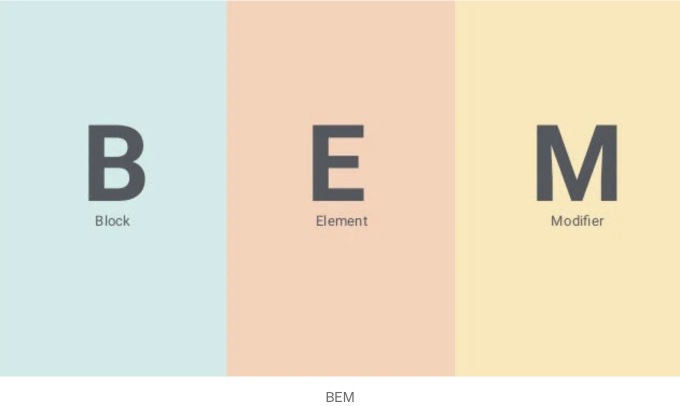
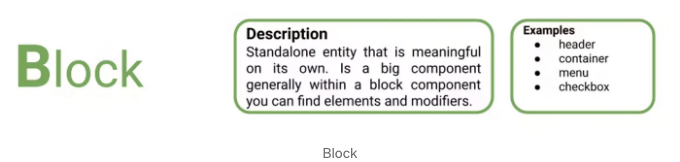
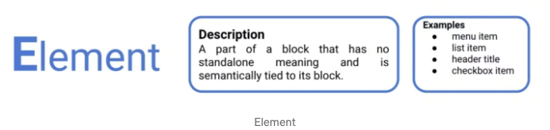
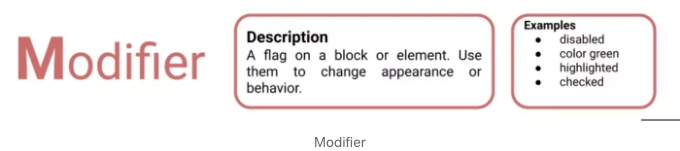
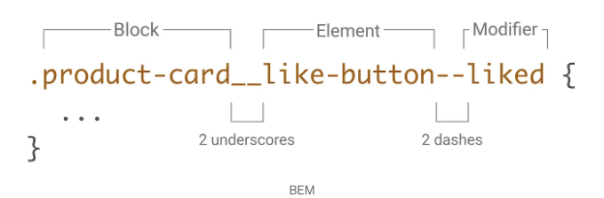
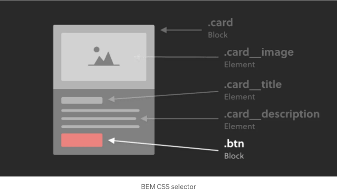

CSS 코드가 엉망이고 정리되지 않은 것에 지쳤나요? 프론트엔드 개발 프로젝트의 가독성, 유지 보수 및 확장이 어려우신가요? 그렇다면 당신만 그런 것은 아닙니다. 좋은 소식은 이러한 문제에 대한 해결책이 있고 그것이 바로 BEM입니다.

BEM은 Block(블록) Element(요소) Modifier(수정자)의 약자로, CSS 코드 작성 프로세스를 간단화하는 인기 있는 CSS 방법론입니다. 스타일을 블록, 요소 및 수정자로 분해하여 BEM은 CSS 코드를 이해하고 조작하기 쉽게 만듭니다. 이 글에서는 BEM을 소개하고 작동 방법을 설명하겠습니다. BEM의 기본 개념을 이해하고 프로젝트에서 어떻게 사용하는지 배워보세요.

BEM이란 무엇인가요?

<!-- ui-log 수평형 -->
<ins class="adsbygoogle"
  style="display:block"
  data-ad-client="ca-pub-4877378276818686"
  data-ad-slot="9743150776"
  data-ad-format="auto"
  data-full-width-responsive="true"></ins>
<component is="script">
(adsbygoogle = window.adsbygoogle || []).push({});
</component>

BEM은 앞단 개발에서 사용되는 인기 있는 CSS 방법론인 블록 엘리먼트 수식어(Block Element Modifier)의 약자입니다. 주요 목표는 대규모 프로젝트에서 CSS 코드를 조직화하고 유지보수하며 확장할 수 있도록 돕는 것입니다. 이 방법론은 스타일을 세 가지 주요 구성 요소로 분해합니다:

1. 블록 (Blocks)
2. 엘리먼트 (Elements)
3. 수식어 (Modifiers)

이러한 구성 요소를 자세히 살펴보겠습니다.

- 블록 (Blocks)

<!-- ui-log 수평형 -->
<ins class="adsbygoogle"
  style="display:block"
  data-ad-client="ca-pub-4877378276818686"
  data-ad-slot="9743150776"
  data-ad-format="auto"
  data-full-width-responsive="true"></ins>
<component is="script">
(adsbygoogle = window.adsbygoogle || []).push({});
</component>



블록은 BEM의 주요 구성 요소입니다. 단독 개체를 나타내며 관련 HTML 및 CSS를 모두 포함합니다. 예를 들어, 블록은 헤더, 탐색 메뉴 또는 관련 콘텐츠가 있는 섹션 등이 될 수 있습니다.

블록은 그 목적에 맞게 명명되어야 하며, 프로젝트 전체에서 고유해야 합니다. 블록에는 "header-container" 또는 "nav-menu"와 같이 하이픈(-)을 사용하는 네이밍 규칙을 권장합니다.

블록은 블록 이름으로 시작하는 클래스 이름으로 정의됩니다. 블록을 생성하기 위해선, 예를 들어 헤더의 블록을 만들기 위해 클래스 이름 "header__"를 사용합니다. 이렇게 하면 해당 CSS 스타일은 헤더 블록과 관련이 있다는 것을 알 수 있습니다.

<!-- ui-log 수평형 -->
<ins class="adsbygoogle"
  style="display:block"
  data-ad-client="ca-pub-4877378276818686"
  data-ad-slot="9743150776"
  data-ad-format="auto"
  data-full-width-responsive="true"></ins>
<component is="script">
(adsbygoogle = window.adsbygoogle || []).push({});
</component>

BEM 블록 예시:

```js
<div class="header__">
```

더블 언더바는 블록에 속하는 요소들을 구분하는 구분자입니다. 다음 섹션에서 이에 대해 더 자세히 다루겠습니다.

요소

<!-- ui-log 수평형 -->
<ins class="adsbygoogle"
  style="display:block"
  data-ad-client="ca-pub-4877378276818686"
  data-ad-slot="9743150776"
  data-ad-format="auto"
  data-full-width-responsive="true"></ins>
<component is="script">
(adsbygoogle = window.adsbygoogle || []).push({});
</component>



요소는 블록의 자식 요소로, 보다 구체적인 스타일을 만드는 데 사용됩니다. BEM에서는 블록과 요소를 구분하는 데 이중 밑줄(__)을 사용합니다. 요소들은 각자 별도의 클래스 이름을 가지고 있어 CSS 코드에서 쉽게 식별할 수 있습니다.

예를 들어, "navigation"이라는 블록이 있다고 가정해 봅시다. 해당 블록 내에서 "menu", "link", "dropdown"과 같은 여러 요소가 있습니다. "link" 요소에 스타일을 적용하려면 클래스 이름 "navigation__link"를 사용해야 합니다. 이렇게 하면 브라우저에게 이 요소가 "navigation" 블록에 속하며 해당 블록 내부에 있는 "link" 요소임을 알려줍니다.

BEM에서 요소를 사용하면 코드를 조직화하고 가독성을 높일 수 있습니다. 또한 특정 요소에 변경을 가하면 다른 부분에 영향을 주지 않고 코드를 쉽게 수정할 수 있습니다.

<!-- ui-log 수평형 -->
<ins class="adsbygoogle"
  style="display:block"
  data-ad-client="ca-pub-4877378276818686"
  data-ad-slot="9743150776"
  data-ad-format="auto"
  data-full-width-responsive="true"></ins>
<component is="script">
(adsbygoogle = window.adsbygoogle || []).push({});
</component>

CSS 코드에서 요소를 선택할 때 BEM 네이밍 규칙을 사용하는 것이 중요합니다. 이렇게 하면 코드를 일관성 있게 유지하고 이해하기 쉽게 만들 수 있어요.

수정자(Modifiers)



수정자는 BEM의 강력한 기능으로, 새로운 클래스 이름을 만들 필요 없이 블록과 요소의 변형을 만들 수 있게 해줍니다. 수정자는 상태, 테마, 크기 등 특정 조건에 따라 요소나 블록의 모양을 변경하는 데 사용됩니다.

<!-- ui-log 수평형 -->
<ins class="adsbygoogle"
  style="display:block"
  data-ad-client="ca-pub-4877378276818686"
  data-ad-slot="9743150776"
  data-ad-format="auto"
  data-full-width-responsive="true"></ins>
<component is="script">
(adsbygoogle = window.adsbygoogle || []).push({});
</component>

수정자는 이중 대시 (--) 뒤에 수정자 이름이 오는 방식으로 표시됩니다. 수정자는 블록 또는 요소에 적용할 수 있으며 다른 수정자와 결합하여 더 복잡한 효과를 만들 수도 있습니다.

예를 들어, "버튼"이라는 블록이 "비활성" 상태일 때 다르게 스타일을 지정하려는 경우 다음과 같이 "disabled" 상태용 수정자를 만들 수 있습니다:

```js
<div class="button button--disabled">비활성 버튼</div>
```

"button--disabled" 클래스에는 버튼을 비활성 상태로 스타일링하는 데 필요한 스타일이 포함될 것입니다. 수정자를 별도의 클래스로 유지하면 JavaScript 또는 다른 코드를 사용하여 기본 "button" 스타일에 영향을 주지 않고 쉽게 추가하거나 제거할 수 있습니다.

<!-- ui-log 수평형 -->
<ins class="adsbygoogle"
  style="display:block"
  data-ad-client="ca-pub-4877378276818686"
  data-ad-slot="9743150776"
  data-ad-format="auto"
  data-full-width-responsive="true"></ins>
<component is="script">
(adsbygoogle = window.adsbygoogle || []).push({});
</component>

블록 내에서 요소의 변형본을 만들기 위해 수정자(modifiers)를 사용할 수도 있어요. 예를 들어, "card"라는 블록 안에 이미지가 포함되어 있다고 해봅시다. 이미지를 원형으로 만들기 위해 이미지에 대한 수정자를 만들 수 있어요.

```js
<div class="card">
  
  <div class="card__content">
    <p class="card__content--title">여기에 카드 콘텐츠 제목이 들어갑니다.</p>
    <p class="card__content--description">카드 콘텐츠 설명이 여기에 들어갑니다.</p>
  </div>
</div>
```

"card__image--circular" 클래스에는 이미지를 원형으로 만들기 위한 스타일이 포함되어 있고, "card__image" 및 "card__content" 클래스에는 각각 이미지와 콘텐츠를 위한 기본 스타일이 포함되어 있어요.

이렇게 함으로써 수정자를 사용하여 복잡하고 유연한 디자인을 만들 수 있습니다. 동시에 가독성이나 유지보수성을 희생하지 않고요.

<!-- ui-log 수평형 -->
<ins class="adsbygoogle"
  style="display:block"
  data-ad-client="ca-pub-4877378276818686"
  data-ad-slot="9743150776"
  data-ad-format="auto"
  data-full-width-responsive="true"></ins>
<component is="script">
(adsbygoogle = window.adsbygoogle || []).push({});
</component>

BEM의 코드 예시

이렇게 HTML과 CSS에서 Block Element Modifier (BEM) 방법론을 사용하여 블록을 구조화하는 방법의 예시입니다:

```js
// HTML 코드:
<div class="block">
<h2 class="block__title">블록 제목</h2>
<p class="block__text">블록 내용이 여기에 들어갑니다.</p>
<div class="block__element">
<!-- 요소 내용이 여기에 들어갑니다 -->
</div>
</div>
```

```js
// CSS 코드:
.block {
/* 블록 스타일 */
}
.block__title {
/* 블록 제목 스타일 */
}
.block__text {
/* 블록 텍스트 스타일 */
}
.block__element {
/* 블록 요소 스타일 */
}
```

<!-- ui-log 수평형 -->
<ins class="adsbygoogle"
  style="display:block"
  data-ad-client="ca-pub-4877378276818686"
  data-ad-slot="9743150776"
  data-ad-format="auto"
  data-full-width-responsive="true"></ins>
<component is="script">
(adsbygoogle = window.adsbygoogle || []).push({});
</component>

이 예시에서는 "block" 클래스를 갖는 블록이 있습니다. 블록 안에는 "block__title" 클래스를 갖는 블록 제목, "block__text" 클래스를 갖는 블록 텍스트, 그리고 "block__element" 클래스를 갖는 블록 요소가 있습니다. 블록 내의 각 요소는 블록과 요소를 구분하는 데 이중 밑줄 "__"을 사용하여 BEM 네이밍 규칙을 따릅니다.

요소와 블록에 수정자를 추가하여 다른 상태나 변형을 나타낼 수도 있습니다. 수정된 블록의 예시는 다음과 같습니다:

```js
// HTML 코드:
<div class="block block--highlighted">
<h2 class="block__title">블록 제목</h2>
<p class="block__text block__text--large">블록 콘텐츠가 여기에 있습니다.</p>
<div class="block__element block__element--hidden">
<!-- 요소 콘텐츠가 여기에 있습니다 -->
</div>
</div>
```

```js
// CSS 코드:
.block {
/* 블록 스타일 */
}
.block--highlighted {
/* 강조된 블록을 위한 수정자 스타일 */
}
.block__title {
/* 블록 제목 스타일 */
}
.block__text {
/* 블록 텍스트 스타일 */
}
.block__text--large {
/* 큰 블록 텍스트를 위한 수정자 스타일 */
}
.block__element {
/* 블록 요소 스타일 */
}
.block__element--hidden {
/* 숨겨진 블록 요소를 위한 수정자 스타일 */
}
```

<!-- ui-log 수평형 -->
<ins class="adsbygoogle"
  style="display:block"
  data-ad-client="ca-pub-4877378276818686"
  data-ad-slot="9743150776"
  data-ad-format="auto"
  data-full-width-responsive="true"></ins>
<component is="script">
(adsbygoogle = window.adsbygoogle || []).push({});
</component>

이 수정된 블록 예제에서는 주 블록에 'block — highlighted' 수정자를 추가했습니다. 블록 텍스트에 'block__text — large' 수정자를, 블록 요소에는 'block__element — hidden' 수정자를 추가했습니다. 이러한 수정자들에 대한 CSS 규칙은 원하는 스타일을 적용하기 위해 별도로 정의됩니다.

BEM을 사용하는 이유는 무엇인가요?

BEM은 다른 방법들보다 많은 혜택을 제공하는 프런트엔드 개발에 대한 인기 있는 방법론입니다. BEM을 사용해야 하는 이유에 대해 몇 가지 이유를 제시해보겠습니다:



<!-- ui-log 수평형 -->
<ins class="adsbygoogle"
  style="display:block"
  data-ad-client="ca-pub-4877378276818686"
  data-ad-slot="9743150776"
  data-ad-format="auto"
  data-full-width-responsive="true"></ins>
<component is="script">
(adsbygoogle = window.adsbygoogle || []).push({});
</component>

개선된 CSS 구조

BEM의 모듈화 접근 방식을 통해 CSS 코드를 쉽게 정리하고 가독성 있게 유지할 수 있습니다. 스타일을 블록, 요소 및 수정자로 분해하여 명확하고 구조화된 계층을 생성하여 탐색하고 유지할 수 있습니다.

가독성 향상

BEM의 네이밍 규칙을 사용하면 각 클래스가 무엇을 하는지 이해하기 쉽고 페이지의 다른 요소들과 어떻게 관련되는지 파악하기 쉽습니다. 이를 통해 대규모 코드베이스를 다루는 것이 쉽고 다른 팀원과 협업하는 것이 용이해집니다.

<!-- ui-log 수평형 -->
<ins class="adsbygoogle"
  style="display:block"
  data-ad-client="ca-pub-4877378276818686"
  data-ad-slot="9743150776"
  data-ad-format="auto"
  data-full-width-responsive="true"></ins>
<component is="script">
(adsbygoogle = window.adsbygoogle || []).push({});
</component>

대형 프로젝트에서의 협업이 더 쉬워집니다.

BEM의 모듈식 구조와 네이밍 규칙은 다수의 개발자가 참여하는 대형 프로젝트에서 작업하기 쉽도록 만들어줍니다. 동일한 네이밍 규칙과 구조를 사용함으로써 모두가 더 효율적으로 작업하고 충돌을 피할 수 있습니다.

전반적으로, BEM은 보다 조직적이고 가독성 있으며 유지보수가 쉬운 CSS 코드를 만들 수 있는 강력한 방법론입니다. 프로젝트에서 BEM을 도입함으로써 작업 흐름을 개선하고 더 나은 웹사이트와 애플리케이션을 만들 수 있습니다.

프로젝트에서 BEM 사용하기

<!-- ui-log 수평형 -->
<ins class="adsbygoogle"
  style="display:block"
  data-ad-client="ca-pub-4877378276818686"
  data-ad-slot="9743150776"
  data-ad-format="auto"
  data-full-width-responsive="true"></ins>
<component is="script">
(adsbygoogle = window.adsbygoogle || []).push({});
</component>

BEM에 대한 기본적인 이해가 생겼으니, 이제 여러분의 프로젝트에서 BEM을 활용해 보는 것이 중요합니다. 효과적으로 BEM을 구현하는 몇 가지 팁을 소개해 드리겠습니다:

클래스 구조화하기

BEM 클래스 이름을 생성할 때, 의미 있는 구조로 정리하고 일관된 패턴을 따르는 것이 중요합니다. 설명적이고 이해하기 쉬운 블록 이름을 사용하고, 명명 규칙을 일관성 있게 유지하세요.

깔끔한 코드 작성하기

<!-- ui-log 수평형 -->
<ins class="adsbygoogle"
  style="display:block"
  data-ad-client="ca-pub-4877378276818686"
  data-ad-slot="9743150776"
  data-ad-format="auto"
  data-full-width-responsive="true"></ins>
<component is="script">
(adsbygoogle = window.adsbygoogle || []).push({});
</component>

BEM의 주요 장점 중 하나는 CSS 코드를 읽고 유지 관리하기 쉽게 만든다는 것입니다. 그러나 이것이 제대로 작동하려면 깔끔하고 잘 정리된 코드를 작성해야 합니다. 코드를 따라가기 쉽도록 들여쓰기와 간격을 사용해 주세요.

흔한 실수 피하기

BEM을 사용할 때 개발자들이 하는 몇 가지 흔한 실수가 있습니다. 너무 많은 수식어를 사용하거나 지나치게 복잡한 클래스 이름을 만드는 것 등이 있습니다. 이러한 실수를 피하고 최대한 BEM을 활용하기 위해 모베스트 프랙티스를 따르세요.

다른 CSS 방법론과 통합하기

<!-- ui-log 수평형 -->
<ins class="adsbygoogle"
  style="display:block"
  data-ad-client="ca-pub-4877378276818686"
  data-ad-slot="9743150776"
  data-ad-format="auto"
  data-full-width-responsive="true"></ins>
<component is="script">
(adsbygoogle = window.adsbygoogle || []).push({});
</component>

BEM은 여러 가지 CSS 방법론 중 하나에 불과합니다. 그러나 다른 방법론과 함께 사용하여 CSS 구성을 보다 포괄적으로 다룰 수 있습니다. 예를 들어 네이밍 컨벤션에 BEM을 사용하고 CSS 파일을 구조화하는 데는 SMACSS를 사용할 수 있습니다.

이러한 팁과 모베스트 프랙티스를 따르면 BEM을 사용하여 CSS 코드를 구성하고 프로젝트의 가독성과 유지 관리성을 개선할 수 있습니다.

BEM 대 다른 CSS 방법론

BEM은 다양한 CSS 방법론 중 하나일 뿐이지만 CSS 구성 및 확장성에 대한 접근 방식으로 눈에 띕니다. SMACSS나 OOCSS와 같은 인기 있는 방법론도 각각의 장점을 가지고 있지만, 많은 개발자들이 BEM이 그들의 요구를 가장 효과적으로 충족시킨다고 판단했습니다.

<!-- ui-log 수평형 -->
<ins class="adsbygoogle"
  style="display:block"
  data-ad-client="ca-pub-4877378276818686"
  data-ad-slot="9743150776"
  data-ad-format="auto"
  data-full-width-responsive="true"></ins>
<component is="script">
(adsbygoogle = window.adsbygoogle || []).push({});
</component>

BEM 장점

BEM을 사용하는 주요 장점 중 하나는 모듈화에 중점을 둔다는 것입니다. 스타일을 블록, 요소 및 수정자로 나눔으로써 BEM은 프로젝트가 커지고 복잡해져도 CSS 코드를 읽고 유지하기 쉽게 만듭니다.

또한 BEM은 설명적인 클래스 이름의 사용을 장려합니다. 각 CSS 규칙의 목적을 이해하기 쉽게 만드는데 큰 도움이 됩니다. 이는 같은 코드베이스에서 협업해야 하는 대규모 팀에 특히 유용할 수 있습니다.

SMACSS 대 BEM

<!-- ui-log 수평형 -->
<ins class="adsbygoogle"
  style="display:block"
  data-ad-client="ca-pub-4877378276818686"
  data-ad-slot="9743150776"
  data-ad-format="auto"
  data-full-width-responsive="true"></ins>
<component is="script">
(adsbygoogle = window.adsbygoogle || []).push({});
</component>

SMACSS (Scalable and Modular Architecture for CSS)은 또 다른 인기 있는 CSS 방법론으로, 프로젝트 전체에서 재사용할 수 있는 CSS 규칙을 작성하는 데 초점을 맞춥니다. SMACSS와 BEM은 몇 가지 유사점이 있지만, SMACSS는 주로 관심사의 분리에 중점을 두며, 스타일을 Base, Layout, Module, State 및 Theme 범주로 구성합니다.

SMACSS는 작은 프로젝트에 효과적일 수 있지만, 많은 개발자들은 BEM이 보다 견고하고 확장 가능한 방법론으로 여겨지는 경우가 많습니다. BEM은 독립적인 블록 및 설명적인 클래스 이름을 생성하는 데 초점을 두어 프로젝트가 커지고 복잡해질수록 코드를 유지보수하고 업데이트하기 쉬울 수 있습니다.

OOCSS vs BEM

OOCSS (Object Oriented CSS)는 재사용 가능한 CSS 구성 요소를 작성하는 데 초점을 맞춘 또 다른 CSS 방법론입니다. OOCSS는 구조와 스킨을 분리하는 것에 더 중점을 두며, 스타일을 객체 및 추상화로 구성합니다.

<!-- ui-log 수평형 -->
<ins class="adsbygoogle"
  style="display:block"
  data-ad-client="ca-pub-4877378276818686"
  data-ad-slot="9743150776"
  data-ad-format="auto"
  data-full-width-responsive="true"></ins>
<component is="script">
(adsbygoogle = window.adsbygoogle || []).push({});
</component>

OOCSS와 BEM은 몇 가지 유사점이 있지만, BEM은 CSS 구성 및 네이밍 규칙에 대한 접근 방식으로 코드를 읽거나 이해하기 쉽게 만들어 줍니다. BEM이 모듈화에 중점을 두는 것은 코드를 유지하고 업데이트하는 데 도움이 될 수 있습니다.

BEM과 반응형 디자인

반응형 디자인은 현대 웹 개발의 중요한 부분이 되었습니다. 점점 늘어나는 디바이스와 화면 크기에 대응하기 위해 사이트가 모든 화면에서 멋지게 보이도록 하는 것이 중요합니다. BEM을 사용하면 유지보수와 확장이 쉬운 반응형 디자인을 만들 수 있습니다.

반응형 디자인의 핵심은 CSS 브레이크포인트를 활용하는 것입니다. 이것들은 코드 내에서 다양한 화면 크기에 대해 다른 스타일을 지정할 수 있는 지점을 말합니다. 예를 들어, 내비게이션 메뉴를 작은 화면에서 수직 레이아웃으로 변경하고 싶을 수 있습니다.

<!-- ui-log 수평형 -->
<ins class="adsbygoogle"
  style="display:block"
  data-ad-client="ca-pub-4877378276818686"
  data-ad-slot="9743150776"
  data-ad-format="auto"
  data-full-width-responsive="true"></ins>
<component is="script">
(adsbygoogle = window.adsbygoogle || []).push({});
</component>

BEM을 사용하면 수정자(Modifiers)를 사용하여 코드에 쉽게 브레이크포인트를 추가할 수 있어요. 예를 들어, — small이라는 수정자를 만들어 블록 또는 요소에 특정한 스타일을 적용하여 작은 화면에서 동작하도록 할 수 있어요. 이렇게 하면 다양한 화면 크기에 대응하는 깔끔하고 읽기 쉬운 코드를 작성하기 쉽고 편해요.

BEM은 반응형 디자인 예제를 손쉽게 만들 수 있는 그리드 시스템과도 잘 작동해요. 그리드 시스템을 사용하면 콘텐츠를 배치할 수 있는 일련의 열(column)과 행(row)을 정의할 수 있어요. BEM을 사용하면 이러한 그리드 열과 행에 해당하는 블록과 요소를 만들어 콘텐츠를 구성하고 모든 화면에서 멋지게 표시되도록 할 수 있어요.

BEM과 반응형 디자인 예제

feature라는 블록에 특정한 기능 콘텐츠가 들어있다고 가정해봅시다. 작은 화면에서 컨텐츠를 수직으로 쌓아올리도록 — small이라는 수정자를 추가할 수 있어요:

<!-- ui-log 수평형 -->
<ins class="adsbygoogle"
  style="display:block"
  data-ad-client="ca-pub-4877378276818686"
  data-ad-slot="9743150776"
  data-ad-format="auto"
  data-full-width-responsive="true"></ins>
<component is="script">
(adsbygoogle = window.adsbygoogle || []).push({});
</component>

```js
.feature.feature--small {
  <h2 class="feature__title">Feature Title</h2>
  <p class="feature__description">Feature Description</p>
}
```

비슷하게, .grid라는 블록이 있을 수 있습니다. 여러 그리드 열을 포함할 수 있습니다. 서로 다른 화면 크기에 대해 다른 열 너비를 지정하기 위해 — 1of2, — 1of3와 같은 수정자를 추가할 수 있습니다.

```js
.grid {
  <div class="grid__column grid__column--1of1-small grid__column--1of2">
    Column 1
   </div>
  <div class="grid__column grid__column--1of1-small grid__column--1of2">
    Column 2
  </div>
}
```

BEM과 CSS 미디어 쿼리를 사용하여 반응형 디자인을 만들어 유지 및 확장이 쉬운 웹사이트를 만들 수 있습니다. 약간의 연습을 통해 모든 기기에서 멋지고 기능적인 사이트를 만들 수 있을 것입니다.

<!-- ui-log 수평형 -->
<ins class="adsbygoogle"
  style="display:block"
  data-ad-client="ca-pub-4877378276818686"
  data-ad-slot="9743150776"
  data-ad-format="auto"
  data-full-width-responsive="true"></ins>
<component is="script">
(adsbygoogle = window.adsbygoogle || []).push({});
</component>

BEM과 접근성

접근성은 모든 웹 개발자에게 중요한 고려 사항입니다. BEM을 사용하면 장애를 가진 사용자에게 사이트를 더 접근 가능하게 만들 수 있습니다. 여기 명심해야 할 몇 가지 모베스트 프랙티스가 있습니다:

- 접근성을 향상시키기 위해 의미 있는 HTML을 사용하세요. BEM은 의미 있는 HTML과 잘 어울리며, 이는 스크린 리더와 기타 보조 기술이 콘텐츠를 이해하는 데 도움이 됩니다.
- HTML 요소에 ARIA 역할을 추가하세요. ARIA 역할은 보조 기술에 대한 추가적인 맥락을 제공하여 시각 장애가 있는 사용자가 사이트를 쉽게 탐색할 수 있도록 돕습니다.
- 의미 있는 클래스 이름을 사용하세요. 앞서 설명한 것처럼, BEM은 CSS 코드를 이해하기 쉽게 만드는 기술적인 클래스 이름을 사용합니다. 이는 장애를 가진 사용자가 사이트를 쉽게 탐색할 수 있도록 도와줍니다.
- 화면 판독기로 사이트를 테스트하세요. 화면 판독기는 시각 장애가 있는 사용자에게 필수적인 도구입니다. 화면 판독기로 사이트를 테스트함으로써, 모든 사용자가 접근할 수 있도록 보장할 수 있습니다.

이러한 모베스트 프랙티스를 따르면 능력에 관계없이 모든 사용자가 접근할 수 있는 사이트를 보장할 수 있습니다.

<!-- ui-log 수평형 -->
<ins class="adsbygoogle"
  style="display:block"
  data-ad-client="ca-pub-4877378276818686"
  data-ad-slot="9743150776"
  data-ad-format="auto"
  data-full-width-responsive="true"></ins>
<component is="script">
(adsbygoogle = window.adsbygoogle || []).push({});
</component>

BEM을 사용할 때 흔히 범하는 실수들

BEM은 CSS 코드를 구성하는 강력한 방법론이지만, 사용할 때 개발자들이 범하는 일반적인 실수들이 있습니다. 피해야 할 가장 흔한 오류들은 다음과 같습니다:

해결책

- 지나치게 복잡한 클래스 이름 사용

<!-- ui-log 수평형 -->
<ins class="adsbygoogle"
  style="display:block"
  data-ad-client="ca-pub-4877378276818686"
  data-ad-slot="9743150776"
  data-ad-format="auto"
  data-full-width-responsive="true"></ins>
<component is="script">
(adsbygoogle = window.adsbygoogle || []).push({});
</component>

- 클래스 이름을 간단하고 읽기 쉽게 유지해주세요. 긴 수정자 체인을 사용하는 것은 피해주세요.

- 일관성 없는 명명 규칙

- 팀을 위한 명확한 명명 규칙을 수립하고 그에 따라 준수해주세요. 일관성이 중요합니다.

- 모든 것에 BEM을 사용하기

<!-- ui-log 수평형 -->
<ins class="adsbygoogle"
  style="display:block"
  data-ad-client="ca-pub-4877378276818686"
  data-ad-slot="9743150776"
  data-ad-format="auto"
  data-full-width-responsive="true"></ins>
<component is="script">
(adsbygoogle = window.adsbygoogle || []).push({});
</component>

- 모든 프로젝트에는 BEM이 적합하지 않습니다. 의미 있는 경우에만 사용하고, 필요하지 않은 경우 강요하지 마세요.

- 이러한 일반적인 실수를 피함으로써 BEM을 효과적으로 사용하고 이 강력한 CSS 방법론의 장점을 최대한 발휘할 수 있습니다.

고급 BEM 기술

이제 기본적인 BEM에 대한 확실한 이해를 가졌으므로, 고급 기술을 탐색할 시간입니다. 이러한 기술은 CSS 기술을 더욱 발전시키고 BEM을 사용하여 더 정교한 디자인을 만들 수 있도록 도와줄 것입니다.

<!-- ui-log 수평형 -->
<ins class="adsbygoogle"
  style="display:block"
  data-ad-client="ca-pub-4877378276818686"
  data-ad-slot="9743150776"
  data-ad-format="auto"
  data-full-width-responsive="true"></ins>
<component is="script">
(adsbygoogle = window.adsbygoogle || []).push({});
</component>

가상 요소 사용하기

가상 요소는 BEM에서 더 복잡한 디자인을 만드는 강력한 도구입니다. 이를 통해 HTML 마크업에 추가 요소를 추가할 수 있습니다. 페이지의 기본 구조를 변경하지 않고 추가할 수 있습니다. 가상 요소를 사용하여 드롭다운 메뉴, 툴팁 등의 사용자 정의 스타일을 만들 수 있습니다.

BEM에서 가상 요소를 사용할 때, 일반 요소와 동일한 네이밍 규칙을 따르는 것이 중요합니다. 가상 요소의 이름에는 부모 블록 또는 요소의 이름을 접두어로 사용하고, 부모와 가상 요소를 구분하기 위해 더블 밑줄을 사용해야 합니다.

BEM 네이밍 규칙

<!-- ui-log 수평형 -->
<ins class="adsbygoogle"
  style="display:block"
  data-ad-client="ca-pub-4877378276818686"
  data-ad-slot="9743150776"
  data-ad-format="auto"
  data-full-width-responsive="true"></ins>
<component is="script">
(adsbygoogle = window.adsbygoogle || []).push({});
</component>

CSS 선택자

의사 요소가 있는 블록

.block__의사-요소

의사 요소가 있는 요소

<!-- ui-log 수평형 -->
<ins class="adsbygoogle"
  style="display:block"
  data-ad-client="ca-pub-4877378276818686"
  data-ad-slot="9743150776"
  data-ad-format="auto"
  data-full-width-responsive="true"></ins>
<component is="script">
(adsbygoogle = window.adsbygoogle || []).push({});
</component>

.block__element__pseudo-element



BEM으로 복잡한 레이아웃 만들기

BEM은 여러 수준의 중첩 및 위치 지정이 필요한 복잡한 레이아웃을 만드는 데도 훌륭합니다. BEM을 사용하여 그리드 시스템, 반응형 레이아웃, 심지어 사용자 정의 페이지 레이아웃을 만들 수 있습니다.

<!-- ui-log 수평형 -->
<ins class="adsbygoogle"
  style="display:block"
  data-ad-client="ca-pub-4877378276818686"
  data-ad-slot="9743150776"
  data-ad-format="auto"
  data-full-width-responsive="true"></ins>
<component is="script">
(adsbygoogle = window.adsbygoogle || []).push({});
</component>

BEM에서 복잡한 레이아웃을 처리할 때는 네이밍 규칙을 일관성 있게 유지하고 이해하기 쉽도록 하는 것이 중요합니다. 블록과 엘리먼트에 명확한 이름을 사용하고 지나치게 복잡한 클래스 이름을 만들지 않도록 합니다.

다른 CSS 방법론과 BEM 통합

마지막으로, 다른 CSS 방법론과 BEM을 결합하여 더 강력한 스타일을 만들 수도 있습니다. 예를 들어 BEM과 SMACSS를 결합하여 두 방식의 장점을 활용한 하이브리드 방법론을 만들 수 있습니다.

BEM을 다른 방법론과 통합할 때는 두 방법 모두에 걸쳐 네이밍 규칙과 클래스 구조가 일관되도록 하는 것이 중요합니다. 명확하고 설명적인 클래스 이름을 사용하고 읽고 유지하기 어려운 지나치게 복잡한 구조를 만들지 않도록 합니다.

<!-- ui-log 수평형 -->
<ins class="adsbygoogle"
  style="display:block"
  data-ad-client="ca-pub-4877378276818686"
  data-ad-slot="9743150776"
  data-ad-format="auto"
  data-full-width-responsive="true"></ins>
<component is="script">
(adsbygoogle = window.adsbygoogle || []).push({});
</component>

이러한 고급 기술을 활용하면 CSS 기술을 더욱 높은 수준으로 발전시키고 BEM을 사용하여 더 강력하고 정교한 디자인을 만들 수 있습니다.

자주 묻는 질문

다음은 BEM에 관한 자주 묻는 질문들입니다:

Q. 다른 CSS 방법론들과 BEM을 구별 짓는 점은 무엇인가요?

<!-- ui-log 수평형 -->
<ins class="adsbygoogle"
  style="display:block"
  data-ad-client="ca-pub-4877378276818686"
  data-ad-slot="9743150776"
  data-ad-format="auto"
  data-full-width-responsive="true"></ins>
<component is="script">
(adsbygoogle = window.adsbygoogle || []).push({});
</component>

A. BEM은 다른 CSS 방법론과 다르게 블록(Block), 요소(Element), 그리고 수정자(Modifier)를 중점으로 두어 이해하고 조작하기 쉽도록 합니다. BEM은 클래스 이름에 대한 명확한 구조를 제공하여 CSS를 구성하고 읽기 쉽게 유지하는 데 도움이 됩니다.

Q. BEM을 배우기 어려운가요?

A. BEM을 배우기 어렵지 않습니다, 특히 이미 CSS에 대한 경험이 있는 경우입니다. BEM의 기본 원리를 이해하면 여러분은 여러분의 프로젝트에서 BEM을 사용하기 시작할 수 있습니다. 그러나 새로운 접근 방식을 사용하는 경우 익히는 데 시간이 조금 필요할 수 있습니다.

Q. 모든 종류의 웹 프로젝트에 BEM을 사용할 수 있나요?

<!-- ui-log 수평형 -->
<ins class="adsbygoogle"
  style="display:block"
  data-ad-client="ca-pub-4877378276818686"
  data-ad-slot="9743150776"
  data-ad-format="auto"
  data-full-width-responsive="true"></ins>
<component is="script">
(adsbygoogle = window.adsbygoogle || []).push({});
</component>

A. 네, BEM은 작은 프로젝트와 큰 프로젝트를 포함한 모든 종류의 웹 프로젝트에 사용할 수 있습니다. 그러나 CSS가 빠르게 무질서해지고 관리하기 어려운 큰 프로젝트에서 특히 유용할 수 있습니다.

Q. BEM은 다른 CSS 방법론과 통합될 수 있을까요?

A. 네, BEM은 SMACSS나 OOCSS와 같은 다른 CSS 방법론과 통합될 수 있습니다. 그러나 BEM과 잘 맞는 방법론을 선택하고 일관된 접근 방식을 유지하는 것이 중요합니다.

Q. BEM을 사용할 때 흔히 하는 실수를 어떻게 피할 수 있을까요?

<!-- ui-log 수평형 -->
<ins class="adsbygoogle"
  style="display:block"
  data-ad-client="ca-pub-4877378276818686"
  data-ad-slot="9743150776"
  data-ad-format="auto"
  data-full-width-responsive="true"></ins>
<component is="script">
(adsbygoogle = window.adsbygoogle || []).push({});
</component>

A. BEM 사용 시 흔한 실수를 피하기 위해서는 가능한 한 간결한 클래스를 유지하고, 수정자를 과도하게 사용하지 않으며, 네이밍 규칙을 일관성 있게 유지하는 것과 같은 최고의 실천 방법을 준수하는 것이 중요합니다. 프로젝트에 BEM을 사용하기 전에 BEM이 어떻게 작동하는지를 이해하는 데 시간을 들이는 것도 중요합니다.

Q. BEM은 반응형 디자인에 적합한가요?

A. 네, BEM은 반응형 디자인에 적합합니다. 사실, BEM을 사용하면 모든 기기에서 훌륭하게 보이는 반응형 디자인을 만들 수 있습니다. CSS 브레이크포인트와 기타 기술을 사용하여 관리 및 유지보수가 쉬운 반응형 레이아웃을 구축할 수 있습니다.

Q. BEM은 접근성에 어떻게 도움이 되나요?

<!-- ui-log 수평형 -->
<ins class="adsbygoogle"
  style="display:block"
  data-ad-client="ca-pub-4877378276818686"
  data-ad-slot="9743150776"
  data-ad-format="auto"
  data-full-width-responsive="true"></ins>
<component is="script">
(adsbygoogle = window.adsbygoogle || []).push({});
</component>

**안녕하세요!**

BEM은 HTML 및 CSS를 구조화하는 명확한 구조를 제공하여 접근성을 향상시킬 수 있습니다. 의미 있는 HTML과 ARIA 역할을 활용하여 장애를 가진 사용자가 쉽게 탐색할 수 있는 웹사이트를 만들 수 있습니다. 또한 이미지에 대체 텍스트를 제공하고 크고 가독성 좋은 글꼴을 사용하는 등 다른 최상의 방법을 따르는 것이 중요합니다.

**질문: BEM과 함께 사용할 수 있는 고급 기술은 어떤 것이 있나요?**

BEM의 기본 개념을 익힌 후에는 CSS 기술을 더욱 향상시킬 수 있는 다양한 고급 기술을 활용할 수 있습니다. 이러한 기술에는 가상 요소 사용, 복잡한 레이아웃 생성, 다른 CSS 방법론과 BEM 통합 등이 포함됩니다.

**행운을 빕니다! 계속 학습해 나가세요!**