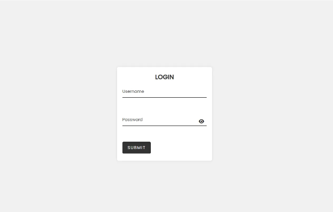

요즘 디지털 시대에는 대부분의 웹 사이트와 애플리케이션이 서비스에 액세스하기 전에 사용자가 로그인해야 합니다. 로그인 페이지는 사용자 인증이 필요한 모든 웹 사이트나 애플리케이션의 기본 구성 요소입니다. 사용자는 일반적으로 계정에 액세스하기 위해 이메일 주소, 사용자 이름 및 비밀번호 조합을 입력합니다.

그러나 비밀번호 입력은 불편하고 오타가 발생하기 쉽습니다. 이 프로세스를 간소화하기 위해 개발자들은 비밀번호 가시성을 토글하는 눈 아이콘을 도입했습니다. 이 기사에서는 HTML, CSS 및 JavaScript를 사용하여 비밀번호 눈 아이콘이 있는 로그인 페이지를 구현하는 방법에 대해 논의할 것입니다.

## HTML:

<!-- ui-log 수평형 -->
<ins class="adsbygoogle"
  style="display:block"
  data-ad-client="ca-pub-4877378276818686"
  data-ad-slot="9743150776"
  data-ad-format="auto"
  data-full-width-responsive="true"></ins>
<component is="script">
(adsbygoogle = window.adsbygoogle || []).push({});
</component>

HTML 또는 Hypertext Markup Language은 어떤 웹 페이지의 기본 구조입니다. 웹 페이지의 구조와 내용을 만드는 데 사용됩니다. 암호 눈 아이콘이 있는 로그인 페이지를 만들려면 HTML 폼을 만들어야 합니다. 암호 입력 필드와 아이콘이 있는 HTML 폼을 만들어야합니다. 암호 입력 필드에는 JavaScript 코드에서 참조할 수 있는 ID가 있어야 합니다.

## CSS:

CSS 또는 Cascading Style Sheets는 HTML 페이지를 스타일링하고 레이아웃을 설정합니다. 암호 눈 아이콘을 추가하려면 아이콘을 스타일링하고 암호 입력 필드에 추가하는 CSS 클래스를 만들어야 합니다. 사용자가 클릭할 때 아이콘의 모양을 변경하는 클래스를 만들어야 합니다. 이를 통해 사용자가 클릭할 때 암호를 표시하거나 숨길 수 있습니다.

## JavaScript:

<!-- ui-log 수평형 -->
<ins class="adsbygoogle"
  style="display:block"
  data-ad-client="ca-pub-4877378276818686"
  data-ad-slot="9743150776"
  data-ad-format="auto"
  data-full-width-responsive="true"></ins>
<component is="script">
(adsbygoogle = window.adsbygoogle || []).push({});
</component>

자바스크립트는 웹 페이지를 인터랙티브하게 만드는 프로그래밍 언어입니다. 로그인 페이지에서는 사용자가 눈 아이콘을 클릭했을 때 비밀번호 표시 여부를 전환하기 위해 JavaScript를 사용할 것입니다. 또한 아이콘에 클릭 이벤트를 감지하는 이벤트 리스너를 추가할 것입니다.

## 구현 방법:

- 비밀번호 입력 필드와 눈 아이콘이 있는 HTML 폼을 생성합니다.
- CSS를 사용하여 비밀번호 입력 필드와 눈 아이콘을 스타일링합니다.
- 사용자가 눈 아이콘을 클릭했을 때 비밀번호 표시 여부를 전환하는 JavaScript를 사용합니다.
- 클릭 이벤트를 감지하는 이벤트 리스너를 아이콘에 추가합니다.

## HTML 코드:

<!-- ui-log 수평형 -->
<ins class="adsbygoogle"
  style="display:block"
  data-ad-client="ca-pub-4877378276818686"
  data-ad-slot="9743150776"
  data-ad-format="auto"
  data-full-width-responsive="true"></ins>
<component is="script">
(adsbygoogle = window.adsbygoogle || []).push({});
</component>

```js
<!DOCTYPE html>
<html lang="en">
  <head>
    <meta charset="UTF-8" />
    <meta name="viewport" content="width=device-width, initial-scale=1.0" />
    <meta http-equiv="X-UA-Compatible" content="ie=edge" />
    <title>Login Page</title>
    <link rel="stylesheet" href="style.css" />
    <link rel="stylesheet" href="https://cdnjs.cloudflare.com/ajax/libs/font-awesome/6.4.0/css/all.min.css" integrity="sha512-iecdLmaskl7CVkqkXNQ/ZH/XLlvWZOJyj7Yy7tcenmpD1ypASozpmT/E0iPtmFIB46ZmdtAc9eNBvH0H/ZpiBw==" crossorigin="anonymous" referrerpolicy="no-referrer" />
  </head>
  <body>
    <div class="container">
      <div class="login-box">
        <h2>Login</h2>
        <form action="" method="post">
          <div class="user-box">
            <input type="text" name="" required="" />
            <label>사용자 이름</label>
          </div>
          <div class="user-box">
            <input type="password" name="" id="password" required="" />
            <label>비밀번호</label>
            <span class="password-toggle-icon"><i class="fas fa-eye"></i></span>
          </div>
          <a href="#">
            <span></span>
            <span></span>
            <span></span>
            <span></span>
            제출
          </a>
        </form>
      </div>
    </div>
    <script src="script.js"></script>
  </body>
</html>
```

## Css 코드:

```css
@import url("https://fonts.googleapis.com/css?family=Poppins:400,500&display=swap");

* {
  margin: 0;
  padding: 0;
  box-sizing: border-box;
  font-family: "Poppins", sans-serif;
}

body {
  height: 100vh;
  display: flex;
  justify-content: center;
  align-items: center;
  background-color: #f1f1f1;
}

.container {
  width: 100%;
  max-width: 400px;
  padding: 20px;
}

.login-box {
  background-color: #fff;
  padding: 20px;
  border-radius: 5px;
  box-shadow: 0 0 10px rgba(0, 0, 0, 0.1);
}

.login-box h2 {
  margin: 0 0 15px;
  padding: 0;
  color: #333;
  text-align: center;
  text-transform: uppercase;
}

.user-box {
  position: relative;
  margin-bottom: 30px;
}

.user-box input {
  width: 100%;
  padding: 10px 0;
  font-size: 16px;
  color: #333;
  margin-bottom: 30px;
  border: none;
  border-bottom: 2px solid #333;
  outline: none;
  background: transparent;
}

.user-box label {
  position: absolute;
  top: 0;
  left: 0;
  padding: 10px 0;
  font-size: 16px;
  color: #333;
  pointer-events: none;
  transition: 0.5s;
}

.user-box input:focus ~ label,
.user-box input:valid ~ label {
  transform: translateY(-20px);
  font-size: 14px;
  color: #333;
}

a {
  display: inline-block;
  background-color: #333;
  color: #fff;
  padding: 10px 20px;
  font-size: 16px;
  text-transform: uppercase;
  text-decoration: none;
  position: relative;
  overflow: hidden;
  transition: 0.5s;
  letter-spacing: 2px;
  border-radius: 5px;
}

a:hover {
  background-color: #fff;
  color: #333;
  border: 1px solid #333;
}

a span {
  position: absolute;
  display: block;
}

a span:nth-child(1) {
  top: 0;
  left: -100%;
  width: 100%;
  height: 2px;
  background-color: #333;
  animation: animate1 1s linear infinite;
}

@keyframes animate1 {
  0% {
    left: -100%;
  }
  50%,
  100% {
    left: 100%;
  }
}

a span:nth-child(2) {
  top: -100%;
  right: 0;
  width: 2px;
  height: 100%;
  background-color: #333;
  animation: animate2 1s linear infinite;
  animation-delay: 0.25s;
}

@keyframes animate2 {
  0% {
    top: -100%;
  }
  50%,
  100% {
    top: 100%;
  }
}

a span:nth-child(3) {
  bottom…
```

## Javascript 코드:

<!-- ui-log 수평형 -->
<ins class="adsbygoogle"
  style="display:block"
  data-ad-client="ca-pub-4877378276818686"
  data-ad-slot="9743150776"
  data-ad-format="auto"
  data-full-width-responsive="true"></ins>
<component is="script">
(adsbygoogle = window.adsbygoogle || []).push({});
</component>

```js
const passwordField = document.getElementById("password");
const togglePassword = document.querySelector(".password-toggle-icon i");

togglePassword.addEventListener("click", function () {
  if (passwordField.type === "password") {
    passwordField.type = "text";
    togglePassword.classList.remove("fa-eye");
    togglePassword.classList.add("fa-eye-slash");
  } else {
    passwordField.type = "password";
    togglePassword.classList.remove("fa-eye-slash");
    togglePassword.classList.add("fa-eye");
  }
});
```

요약하면, 비밀번호 눈 모양 아이콘이 있는 로그인 페이지는 사용자가 비밀번호 가시성을 쉽게 전환할 수 있어 사용자 경험을 향상시킬 수 있습니다. 이 글에서 설명된 구현 단계를 따라 HTML, CSS 및 JavaScript를 사용하여 원홀 소스 코드를 깃허브 저장소에서 다운로드할 수 있습니다.
```