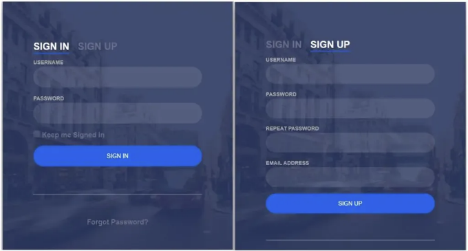
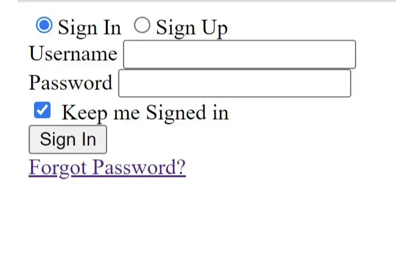
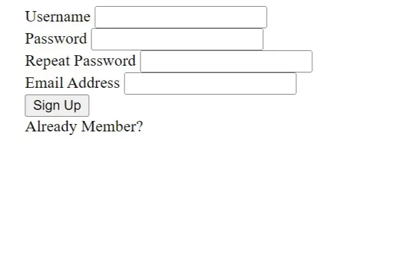
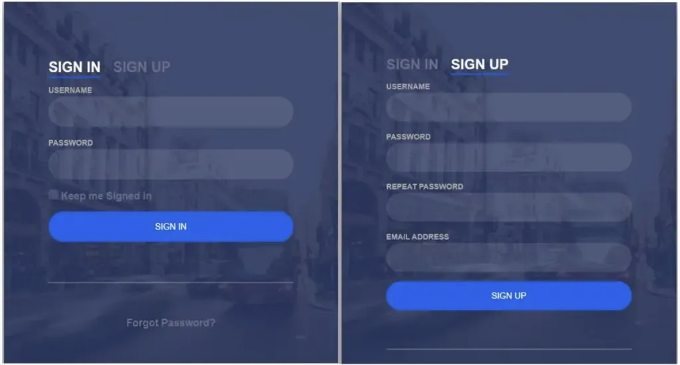

프로그래머 여러분 안녕하세요!! 이 튜토리얼에서는 HTML 및 CSS로 로그인 및 등록 양식을 만드는 방법을 소개하겠습니다.

이 초보자 수준의 프로젝트를 위해서는 HTML 양식에 대한 기본적인 이해만 필요합니다. 아직 개념이 없어도 걱정하지 마세요. 프로젝트를 단계별로 설명할 것이며, 이 프로젝트에서 같은 양식에서 등록 및 로그인할 수 있습니다. 두 가지 다른 버튼으로 제어됩니다. 로그인 버튼을 클릭하면 로그인 양식이 표시됩니다.

회원가입 양식은 등록 버튼을 클릭하여 엽니다. 이 기능은 HTML 체크박스 덕분에 활성화됩니다. 이름, 성, 이메일, 비밀번호 및 기타 정보를 등록 양식에 입력해야 합니다. 로그인 페이지에는 이메일 주소와 비밀번호만 필수 입력 사항입니다.

우리 프로젝트를 빠르게 살펴보겠습니다.

<!-- ui-log 수평형 -->
<ins class="adsbygoogle"
  style="display:block"
  data-ad-client="ca-pub-4877378276818686"
  data-ad-slot="9743150776"
  data-ad-format="auto"
  data-full-width-responsive="true"></ins>
<component is="script">
(adsbygoogle = window.adsbygoogle || []).push({});
</component>



로그인 및 회원가입 양식

만약 우리가 배운 팝업 로그인 양식을 아직 보지 않은 경우 아래 링크를 클릭해보세요.

프로젝트에 대한 아이디어를 얻었을 거라고 생각합니다. 그럼, 회원가입 및 로그인 양식 프로젝트 소스 코드로 넘어가봅시다. 먼저, 우리는 HTML 코드를 사용할 것입니다.

<!-- ui-log 수평형 -->
<ins class="adsbygoogle"
  style="display:block"
  data-ad-client="ca-pub-4877378276818686"
  data-ad-slot="9743150776"
  data-ad-format="auto"
  data-full-width-responsive="true"></ins>
<component is="script">
(adsbygoogle = window.adsbygoogle || []).push({});
</component>

# 단계1: HTML 코드에서 로그인 및 등록 양식

```js
<!DOCTYPE html>
<html>
```

```js
<head>
  <link rel="stylesheet" href="style.css" />
  <title>양식</title>
</head>
<body>
  <div class="login-wrap">
    <div class="login-html">
      <input id="tab-1" type="radio" name="tab" class="sign-in" checked><label for="tab-1" class="tab">로그인</label>
      <input id="tab-2" type="radio" name="tab" class="sign-up"><label for="tab-2" class="tab">가입</label>
      <div class="login-form">
        <div class="sign-in-htm">
          <div class="group">
            <label for="user" class="label">사용자 이름</label>
            <input id="user" type="text" class="input">
          </div>
          <div class="group">
            <label for="pass" class="label">비밀번호</label>
            <input id="pass" type="password" class="input" data-type="password">
          </div>
          <div class="group">
            <input id="check" type="checkbox" class="check" checked>
            <label for="check"><span class="icon"></span> 로그인 유지</label>
          </div>
          <div class="group">
            <input type="submit" class="button" value="로그인">
          </div>
          <div class="hr"></div>
          <div class="foot-lnk">
            <a href="#forgot">비밀번호 찾기?</a>
          </div>
        </div>
        <div class="sign-up-htm">
          <div class="group">
            <label for="user" class="label">사용자 이름</label>
            <input id="user" type="text" class="input">
          </div>
          <div class="group">
            <label for="pass" class="label">비밀번호</label>
            <input id="pass" type="password" class="input" data-type="password">
          </div>
          <div class="group">
            <label for="pass" class="label">비밀번호 재입력</label>
            <input id="pass" type="password" class="input" data-type="password">
          </div>
          <div class="group">
            <label for="pass" class="label">이메일 주소</label>
            <input id="pass" type="text" class="input">
          </div>
          <div class="group">
            <input type="submit" class="button" value="가입">
          </div>
          <div class="hr"></div>
          <div class="foot-lnk">
            <label for="tab-1">이미 회원이신가요?</a>
          </div>
        </div>
      </div>
    </div>
  </div>
</body>
</html>
```

등록 및 로그인 양식에 대한 정보가 아래 섹션의 HTML 코드로 추가되었습니다. 아래 나열된 코드는 복사하여 직접 HTML 파일에 추가됩니다.

<!-- ui-log 수평형 -->
<ins class="adsbygoogle"
  style="display:block"
  data-ad-client="ca-pub-4877378276818686"
  data-ad-slot="9743150776"
  data-ad-format="auto"
  data-full-width-responsive="true"></ins>
<component is="script">
(adsbygoogle = window.adsbygoogle || []).push({});
</component>

- 시작하기 위해 'login-wrap' 클래스를 div 태그에 추가할 거예요. 이 태그는 회원가입 및 로그인 폼을 감싸게 될 거에요.
- 이제 'radio' 타입의 입력 상자를 만들었으니, 이 라디오 버튼을 사용하여 회원가입 및 로그인 양식 사이를 전환할 수 있어요.
- 이제 로그인 폼을 만들 차례에요. 그것을 위해 사용자 이름을 요청하는 레이블을 디자인하고, 그 아래에 사용자 이름을 입력할 수 있는 텍스트 입력 상자를 만들 거예요.
- 이제 '패스워드' 입력 상자와 '로그인 유지'라고 적힌 '체크박스' 입력 상자를 만들 거에요.
- 이제 `hr` 태그를 사용하여 폼을 나누기 위한 수평 줄을 만들 거에요.
- 이제 앵커 태그를 사용하여 비밀번호를 잊어버렸을 때 사용할 링크를 만들 거에요.

우리가 만든 로그인 폼을 한번 살펴봐요.



<!-- ui-log 수평형 -->
<ins class="adsbygoogle"
  style="display:block"
  data-ad-client="ca-pub-4877378276818686"
  data-ad-slot="9743150776"
  data-ad-format="auto"
  data-full-width-responsive="true"></ins>
<component is="script">
(adsbygoogle = window.adsbygoogle || []).push({});
</component>

- 이제 회원가입 양식의 구조를 만들겠습니다. div 태그를 사용하여 회원가입 양식의 컨테이너를 만들 것입니다.
- 먼저, 사용자 이름을 위한 레이블과 "text"로 된 사용자 이름을 입력하는 입력란을 만들 것입니다. 그런 다음, 두 개의 "password" 유형의 입력란을 생성할 것입니다.
- 사용자의 이메일 주소를 요청하는 레이블을 만들고, "email" 주소 유형의 입력 상자를 함께 만들 것입니다.
- 사용자를 가입시키는 버튼 역할을 하는 입력란을 만들 것입니다. 사용자가 다른 웹사이트에서 이미 등록한 경우, 로그인 페이지로 가는 링크도 만들 것입니다.

이제 우리가 만든 SignUp 양식을 살펴보겠습니다.



<!-- ui-log 수평형 -->
<ins class="adsbygoogle"
  style="display:block"
  data-ad-client="ca-pub-4877378276818686"
  data-ad-slot="9743150776"
  data-ad-format="auto"
  data-full-width-responsive="true"></ins>
<component is="script">
(adsbygoogle = window.adsbygoogle || []).push({});
</component>

우리는 HTML 태그와 그 내용을 추가했습니다. 이제 CSS 코드를 추가하여 페이지를 더 멋지게 만들어 봅시다. 페이지를 스타일링하기 전에 HTML의 head 섹션에 외부 스타일링 링크를 추가해야 합니다.

```js
<link rel="stylesheet" href="styles.css" />
```

# 단계2: CSS 코드를 사용하여 로그인 및 등록 양식 스타일링하기

```js
body {
  margin: 0;
  color: #6a6f8c;
  background: #c8c8c8;
  font: 600 16px/18px "Open Sans", sans-serif;
```

<!-- ui-log 수평형 -->
<ins class="adsbygoogle"
  style="display:block"
  data-ad-client="ca-pub-4877378276818686"
  data-ad-slot="9743150776"
  data-ad-format="auto"
  data-full-width-responsive="true"></ins>
<component is="script">
(adsbygoogle = window.adsbygoogle || []).push({});
</component>

```js
}
*,
:after,
:before {
  box-sizing: border-box;
}
.clearfix:after,
.clearfix:before {
  content: "";
  display: table;
}
.clearfix:after {
  clear: both;
  display: block;
}
a {
  color: inherit;
  text-decoration: none;
}
.login-wrap {
  width: 100%;
  margin: auto;
  max-width: 525px;
  min-height: 670px;
  position: relative;
  background: url(https://raw.githubusercontent.com/khadkamhn/day-01-login-form/master/img/bg.jpg)
    no-repeat center;
  box-shadow: 0 12px 15px 0 rgba(0, 0, 0, 0.24),
    0 17px 50px 0 rgba(0, 0, 0, 0.19);
}
.login-html {
  width: 100%;
  height: 100%;
  position: absolute;
  padding: 90px 70px 50px 70px;
  background: rgba(40, 57, 101, 0.9);
}
.login-html .sign-in-htm,
.login-html .sign-up-htm {
  top: 0;
  left: 0;
  right: 0;
  bottom: 0;
  position: absolute;
  transform: rotateY(180deg);
  backface-visibility: hidden;
  transition: all 0.4s linear;
}
.login-html .sign-in,
.login-html .sign-up,
.login-form .group .check {
  display: none;
}
.login-html .tab,
.login-form .group .label,
.login-form .group .button {
  text-transform: uppercase;
}
.login-html .tab {
  font-size: 22px;
  margin-right: 15px;
  cursor: pointer;
  padding-bottom: 5px;
  margin: 0 15px 10px 0;
  display: inline-block;
  border-bottom: 2px solid transparent;
}
.login-html .sign-in:checked + .tab,
.login-html .sign-up:checked + .tab {
  color: #fff;
  border-color: #1161ee;
  cursor: pointer;
}
.login-form {
  min-height: 345px;
  position: relative;
  perspective: 1000px;
  transform-style: preserve-3d;
}
.login-form .group {
  margin-bottom: 15px;
}
.login-form .group .label,
.login-form .group .input,
.login-form .group .button {
  width: 100%;
  color: #fff;
  display: block;
}
.login-form .group .input,
.login-form .group .button {
  border: none;
  padding: 15px 20px;
  border-radius: 25px;
  background: rgba(255, 255, 255, 0.1);
}
login-form .group input[data-type="password"] {
  -webkit-text-security: circle;
}
/* The rest of the CSS code has been omitted for brevity. */
```

이제 CSS 코드를 글에 포함했으니 단계별로 살펴보겠습니다. Step1: body 태그를 사용하여 웹페이지의 margin과 padding을 "제로"로 설정했습니다. "Open Sans"는 글꼴 패밀리입니다. "Light Grey"는 배경 색상 설정입니다. 또한 글꼴 크기를 "dark-grey"로 변경했습니다.

별표(*)를 사용하여 웹페이지의 box-sizing을 "border-box"로 설정합니다. 특정 항목이 넘치면 clearfix 속성이 자동으로 높이로 설정됩니다.
```js
body {
  margin: 0;
  color: #6a6f8c;
  background: #c8c8c8;
  font: 600 16px/18px "Open Sans", sans-serif;
}
```

<!-- ui-log 수평형 -->
<ins class="adsbygoogle"
  style="display:block"
  data-ad-client="ca-pub-4877378276818686"
  data-ad-slot="9743150776"
  data-ad-format="auto"
  data-full-width-responsive="true"></ins>
<component is="script">
(adsbygoogle = window.adsbygoogle || []).push({});
</component>

```js
}
*,
:after,
:before {
  box-sizing: border-box;
}
.clearfix:after,
.clearfix:before {
  content: "";
  display: table;
}
.clearfix:after {
  clear: both;
  display: block;
}
```

다음 단계는 (.login-wrap) 클래스를 사용하여 너비를 "100%"로 설정하는 것입니다. 여백은 auto로 설정되어 내용에 따라 변경됩니다. 또한 최대 너비로 "525px"와 최소 높이로 "670px"를 지정했습니다. 로그인 폼에 약간의 특별한 매력을 더하기 위해 배경 이미지도 추가했습니다.

로그인 폼을 스타일링하기 위해 "login-html" 클래스를 사용할 것입니다. 너비를 "100%"로 설정하고 position을 absolute로 설정했습니다. 추가적인 공간을 추가하고 로그인 폼의 배경을 짙은 파란색으로 만들었습니다.

```js
.login-wrap {
  width: 100%;
  margin: auto;
  max-width: 525px;
  min-height: 670px;
  position: relative;
  background: url(https://raw.githubusercontent.com/khadkamhn/day-01-login-form/master/img/bg.jpg)
    no-repeat center;
  box-shadow: 0 12px 15px 0 rgba(0, 0, 0, 0.24),
    0 17px 50px 0 rgba(0, 0, 0, 0.19);
}
.login-html {
  width: 100%;
  height: 100%;
  position: absolute;
  padding: 90px 70px 50px 70px;
  background: rgba(40, 57, 101, 0.9);
}
```

<!-- ui-log 수평형 -->
<ins class="adsbygoogle"
  style="display:block"
  data-ad-client="ca-pub-4877378276818686"
  data-ad-slot="9743150776"
  data-ad-format="auto"
  data-full-width-responsive="true"></ins>
<component is="script">
(adsbygoogle = window.adsbygoogle || []).push({});
</component>

Step3: (.sign-in-htm와 .sign-up-htm) 파일을 사용하여 상단, 왼쪽, 오른쪽 및 하단 간격을 "zero"로 설정하고 위치를 "absolute"로 설정합니다. 우리의 로그인 및 회원 가입 양식을 몇 가지 변환 속성을 추가하여 180도 회전시킬 것입니다. 이제 로그인 버튼을 스타일링할 것입니다. 글꼴 크기는 "22 px"로 설정되었고 오른쪽 여백은 "15 px"로 설정되었으며, 커서는 "pointer"로 설정되었고 아래 여백은 "5 px"로 설정되었습니다. 추가적으로, 버튼에 2px의 하단 테두리를 부여했습니다. 비슷한 방식으로 회원 가입 양식을 스타일링할 것입니다. 당신은 우리의 CSS 코드를 한 번 훑어보기만 하면 코드를 쉽게 이해할 수 있을 것입니다.

```js
.login-html .tab {
  font-size: 22px;
  margin-right: 15px;
  cursor: pointer;
  padding-bottom: 5px;
  margin: 0 15px 10px 0;
  display: inline-block;
  border-bottom: 2px solid transparent;
}
.login-html .sign-in:checked + .tab,
.login-html .sign-up:checked + .tab {
  color: #fff;
  border-color: #1161ee;
  cursor: pointer;
}
.login-form {
  min-height: 345px;
  position: relative;
  perspective: 1000px;
  transform-style: preserve-3d;
}
.login-form .group {
  margin-bottom: 15px;
}
.login-form .group .label,
.login-form .group .input,
.login-form .group .button {
  width: 100%;
  color: #fff;
  display: block;
}
.login-form .group .input,
.login-form .group .button {
  border: none;
  padding: 15px 20px;
  border-radius: 25px;
  background: rgba(255, 255, 255, 0.1);
}
.login-form .group input[data-type="password"] {
  -webkit-text-security: circle;
}
login-form .group .label {
  color: #aaa;
  font-size: 12px;
}
.login-form .group .button {
  background: #1161ee;
  cursor: pointer;
}
.login-form .group .button:hover {
    background:#1454c4;
    cursor: pointer;
  }
.login-form .group label .icon {
  width: 15px;
  height: 15px;
  border-radius: 2px;
  position: relative;
  display: inline-block;
  background: rgba(255, 255, 255, 0.1);
}
.login-form .group label .icon:before,
.login-form .group label .icon:after {
  content: "";
  width: 10px;
  height: 2px;
  background: #fff;
  position: absolute;
  transition: all 0.2s ease-in-out 0s;
}
.login-form .group label .icon:before {
  left: 3px;
  width: 5px;
  bottom: 6px;
  transform: scale(0) rotate(0);
}
.login-form .group label .icon:after {
  top: 6px;
  right: 0;
  transform: scale(0) rotate(0);
}
```

Step4: 이제 checked 속성을 활용하여 로그인 및 회원 가입 양식 간을 전환할 것입니다. 이제 checked 프로퍼티를 사용하여, 회원 가입 버튼을 선택하면 하단에 파란색 테두리가 표시되고 로그인을 선택하면 로그인 양식의 checked 속성이 나타납니다.

```js
.login-form .group .check:checked + label {
  color: #fff;
}
.login-form .group .check:checked + label .icon {
  background: #1161ee;
}
.login-form .group .check:checked + label .icon:before {
  transform: scale(1) rotate(45deg);
}
.login-form .group .check:checked + label .icon:after {
  transform: scale(1) rotate(-45deg);
}
.login-html .sign-in:checked + .tab + .sign-up + .tab + .login-form .sign-in-htm {
  transform: rotate(0);
}
.login-html .sign-up:checked + .tab + .login-form .sign-up-htm {
  transform: rotate(0);
}
```

<!-- ui-log 수평형 -->
<ins class="adsbygoogle"
  style="display:block"
  data-ad-client="ca-pub-4877378276818686"
  data-ad-slot="9743150776"
  data-ad-format="auto"
  data-full-width-responsive="true"></ins>
<component is="script">
(adsbygoogle = window.adsbygoogle || []).push({});
</component>

팝업 로그인 폼을 스타일링했으니 이제 최종 결과를 확인해 보겠습니다. 결과물:

# HTML과 CSS로 스타일링한 최종 결과 로그인 및 등록 폼:



<!-- ui-log 수평형 -->
<ins class="adsbygoogle"
  style="display:block"
  data-ad-client="ca-pub-4877378276818686"
  data-ad-slot="9743150776"
  data-ad-format="auto"
  data-full-width-responsive="true"></ins>
<component is="script">
(adsbygoogle = window.adsbygoogle || []).push({});
</component>

프로젝트가 완료되었습니다. HTML 및 CSS를 사용하여 로그인 및 등록 양식이 완성되었습니다.

우리는 이제 HTML과 CSS를 사용하여 로그인 및 등록 양식을 성공적으로 만들었습니다. IDE로 복사하여 이 프로젝트를 직접 사용할 수 있습니다. 프로젝트를 이해하셨으면 댓글로 자유롭게 질문하세요! 이 블로그가 도움이 되셨다면 Front End Projects with Source codes에 대한 코드를 Google에서 랜덤하게 찾아보고, Code with Random Instagram 페이지를 팔로우하는 것을 잊지 마세요.

팔로우: codewithrandom

작성자: arun

<!-- ui-log 수평형 -->
<ins class="adsbygoogle"
  style="display:block"
  data-ad-client="ca-pub-4877378276818686"
  data-ad-slot="9743150776"
  data-ad-format="auto"
  data-full-width-responsive="true"></ins>
<component is="script">
(adsbygoogle = window.adsbygoogle || []).push({});
</component>

코드 작성자: Arun

## 이 로그인 및 등록 양식에 어떤 코드 편집기를 사용하시나요?

이 로그인 및 등록 양식에 대해 사용하는 것을 권장드리는 것은 VS Code Studio입니다. 직관적이며 사용하기 쉽습니다.

## 로그인 및 등록 양식은 반응형으로 제작되었나요?

<!-- ui-log 수평형 -->
<ins class="adsbygoogle"
  style="display:block"
  data-ad-client="ca-pub-4877378276818686"
  data-ad-slot="9743150776"
  data-ad-format="auto"
  data-full-width-responsive="true"></ins>
<component is="script">
(adsbygoogle = window.adsbygoogle || []).push({});
</component>

네, 이 로그인 및 등록 양식은 반응형입니다.

완전한 HTML과 CSS를 사용하여 로그인 및 등록 양식을 만들었습니다.