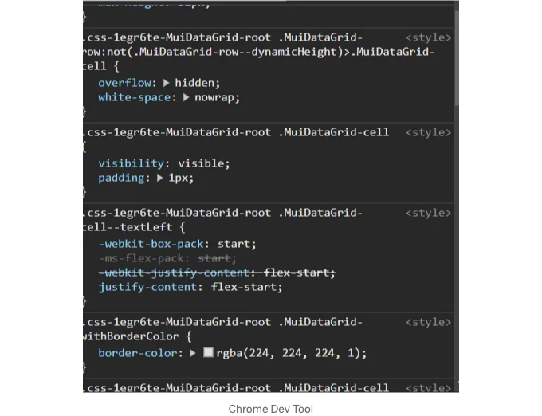

저는 최근 MUI DataGrid를 사용한 프로젝트를 진행하면서 컴포넌트에 적용된 기본 스타일을 변경하는 데 어려움을 겪었습니다. MUI 문서를 찾아보니 올바른 스타일링 방법을 찾기 어려웠습니다. 이와 관련하여, MUI DataGrid를 사용자 정의하는 더 쉬운 방법을 공유하고자 합니다. 이 방법에는 행 높이 변경, 열 헤더 색상 수정, 행 색상 조정 등의 작업이 포함됩니다.

# 데이터 그리드 초기화

우선, DataGrid를 초기화하세요. 아래에는 MUI 문서에서 찾을 수 있는 코딩 예제와 일치하는 일반 예제를 제공하겠습니다. 그런 다음 사용자 정의할 수 있는 측면을 자세히 살펴보겠습니다.

```js
import * as React from 'react';
import Box from '@mui/material/Box';
import { DataGrid, GridColDef, GridValueGetterParams } from '@mui/x-data-grid';

const columns: GridColDef[] = [
  { field: 'id', headerName: 'ID', width: 90 },
  {
    field: 'firstName',
    headerName: 'First name',
    width: 150,
    editable: true,
  },
  {
    field: 'lastName',
    headerName: 'Last name',
    width: 150,
    editable: true,
  },
  {
    field: 'age',
    headerName: 'Age',
    type: 'number',
    width: 110,
    editable: true,
  },
  {
    field: 'fullName',
    headerName: 'Full name',
    description: 'This column has a value getter and is not sortable.',
    sortable: false,
    width: 160,
    valueGetter: (params: GridValueGetterParams) =>
      `${params.row.firstName || ''} ${params.row.lastName || ''}`,
  },
];

const rows = [
  { id: 1, lastName: 'Snow', firstName: 'Jon', age: 14 },
  { id: 2, lastName: 'Lannister', firstName: 'Cersei', age: 31 },
  { id: 3, lastName: 'Lannister', firstName: 'Jaime', age: 31 },
  { id: 4, lastName: 'Stark', firstName: 'Arya', age: 11 },
];

export default function DataGridDemo() {
  return (
    <Box sx={ height: 400, width: '100%' }>
      <DataGrid
        rows={rows}
        columns={columns}
        initialState={
          pagination: {
            paginationModel: {
              page: 0,
              pageSize: 5,
            },
          },
        }
        pageSizeOptions={[5, 10]}
        checkboxSelection
        disableRowSelectionOnClick
      />
    </Box>
  );
}
```

<!-- ui-log 수평형 -->
<ins class="adsbygoogle"
  style="display:block"
  data-ad-client="ca-pub-4877378276818686"
  data-ad-slot="9743150776"
  data-ad-format="auto"
  data-full-width-responsive="true"></ins>
<component is="script">
(adsbygoogle = window.adsbygoogle || []).push({});
</component>

# MUI 데이터 그리드 사용자 정의하기

표시되는 행 수 수정하기

데이터 그리드의 기본으로 표시되는 행 수를 변경하려면 initialState prop을 수정할 수 있습니다. 제공된 예시에서는 pageSize가 5로 설정되어 5개의 행이 초기에 표시됩니다. 이 숫자를 원하는대로 조정할 수 있는 유연성이 있습니다. 또한 pageSizeOptions prop을 사용하여 사용자에게 드롭다운 메뉴를 제공할 수 있으며, 이 메뉴에는 5, 10, 15와 같은 여러 값이 포함되어 사용자가 쉽게 표시 크기를 변경할 수 있습니다.

일부 행 설정 변경하기

<!-- ui-log 수평형 -->
<ins class="adsbygoogle"
  style="display:block"
  data-ad-client="ca-pub-4877378276818686"
  data-ad-slot="9743150776"
  data-ad-format="auto"
  data-full-width-responsive="true"></ins>
<component is="script">
(adsbygoogle = window.adsbygoogle || []).push({});
</component>

DataGrid 컴포넌트는 처음에 행 선택이 쉽도록 체크박스를 렌더링합니다. 이러한 체크박스를 비활성화하려면 checkboxSelection={false}로 설정하면 됩니다. 이러한 조정으로 체크박스가 숨겨지며 더 깔끔한 외관을 제공합니다.

초기 DataGrid 설정에서 셀을 선택하면 자동으로 전체 행이 선택됩니다. 이 동작을 비활성화하려면 DataGrid에서 제공하는 disableRowSelection prop을 수정하여 할 수 있습니다. 이 prop을 변경하면 셀을 선택할 때 체크박스가 집곅되거나 선택 표시되지 않습니다.

rowHeight를 사용자 정의하려면 getRowHeight prop을 활용할 수 있습니다. 이 prop은 숫자를 반환해야 합니다. 이를 구현하기 전에 `@mui/x-data-grid`에서 GridRowHeightParams를 import하는 것을 잊지마세요. 다양한 행에 대해 변수 높이를 가져오도록 조건을 추가할 수 있으며, getRowHeight를 auto로 설정하면 셀 내용에 따라 자동으로 행 높이가 변경됩니다.

또한 행을 사용자 정의하는 데 사용할 수 있는 다른 prop이 있습니다. getRowSpacing을 사용하면 행 간의 간격을 추가할 수 있습니다.

<!-- ui-log 수평형 -->
<ins class="adsbygoogle"
  style="display:block"
  data-ad-client="ca-pub-4877378276818686"
  data-ad-slot="9743150776"
  data-ad-format="auto"
  data-full-width-responsive="true"></ins>
<component is="script">
(adsbygoogle = window.adsbygoogle || []).push({});
</component>

일부 열 설정 변경하기

열 정의에서 필드, 헤더 이름, 폭과 같은 기본 속성을 설정할 수 있습니다. 이외에도 열을 더 자세히 사용자 정의할 수 있습니다. 예를 들어, 사용자 편집을 제한하려면 editable: false로 설정하십시오. 열에서 정렬을 비활성화하려면 sortable: false를 사용하십시오. 게다가 기본 세 점 메뉴를 제거하고 싶다면 disableColumnMenu: true로 설정하십시오.

기본 사용자 상호작용 향상하기

또한, 특정 열에 대해 드롭다운 또는 날짜 선택기를 제공하여 자유 형식의 입력을 허용하는 대신 사용자 상호작용을 향상시킬 수 있습니다. 예를 들어, "성별" 열을 위해 type: `singleSelect`를 설정하고 `Male` 또는 `Female`과 같은 옵션을 드롭다운에서 선택할 수 있습니다. 마찬가지로, 열에 대해 날짜 선택기를 원하는 경우 type: `date`로 설정하십시오. 그러면 렌더링된 달력에서 날짜를 선택할 수 있습니다. 또한 숫자 필드의 경우 type: `number`를 지정하여 입력을 간소화하고 데이터 일관성을 향상시킬 수 있습니다. 이런 식으로 type 속성을 활용하여 각 열의 입력 방법을 데이터 요구 사항에 최적으로 맞추어 조정할 수 있습니다.

<!-- ui-log 수평형 -->
<ins class="adsbygoogle"
  style="display:block"
  data-ad-client="ca-pub-4877378276818686"
  data-ad-slot="9743150776"
  data-ad-format="auto"
  data-full-width-responsive="true"></ins>
<component is="script">
(adsbygoogle = window.adsbygoogle || []).push({});
</component>

# 데이터 그리드에 스타일 적용하기

- 열 구분선 제거하기:

그리드에서 열 구분선을 제거하려면 sx prop을 사용하십시오:

```js
sx={
    '.MuiDataGrid-columnSeparator': {
        display: 'none',
    },
}
```

<!-- ui-log 수평형 -->
<ins class="adsbygoogle"
  style="display:block"
  data-ad-client="ca-pub-4877378276818686"
  data-ad-slot="9743150776"
  data-ad-format="auto"
  data-full-width-responsive="true"></ins>
<component is="script">
(adsbygoogle = window.adsbygoogle || []).push({});
</component>

2. 그리드 테두리 조정 또는 제거하기:

sx prop을 사용하여 그리드 테두리를 수정하거나 제거하세요:

```js
sx={
    '&.MuiDataGrid-root': {
        border: 'none',
    },
}
```

3. 열 헤더 사용자 정의하기:

<!-- ui-log 수평형 -->
<ins class="adsbygoogle"
  style="display:block"
  data-ad-client="ca-pub-4877378276818686"
  data-ad-slot="9743150776"
  data-ad-format="auto"
  data-full-width-responsive="true"></ins>
<component is="script">
(adsbygoogle = window.adsbygoogle || []).push({});
</component>

다음과 같이 스타일에 접근하여 열 헤더를 사용자 정의하세요.

```js
sx={
"& .MuiDataGrid-columnHeaders": {
    fontWeight: 400,
    borderRadius: "var(--none, 0px)",
    borderBottom: "1px solid var(--divider, rgba(0, 0, 0, 0.12))",
    borderLeft: "var(--none, 0px) solid var(--divider, rgba(0, 0, 0, 0.12))",
    borderRight: "var(--none, 0px) solid var(--divider, rgba(0, 0, 0, 0.12))",
    borderTop: "var(--none, 0px) solid var(--divider, rgba(0, 0, 0, 0.12))",
    background: "var(--primary-selected, rgba(33, 150, 243, 0.08))",
    alignItems: 'space-between !important'
},
}
```

4. 항상 정렬 아이콘 표시:

정렬 상태와 관계없이 항상 정렬 아이콘이 표시되도록 보장하세요.

<!-- ui-log 수평형 -->
<ins class="adsbygoogle"
  style="display:block"
  data-ad-client="ca-pub-4877378276818686"
  data-ad-slot="9743150776"
  data-ad-format="auto"
  data-full-width-responsive="true"></ins>
<component is="script">
(adsbygoogle = window.adsbygoogle || []).push({});
</component>

```js
sx={
"& .MuiDataGrid-sortIcon": {
    opacity: 'inherit !important',
},
}
```

5. Changing Alignment in Column Header Cell:

Adjust alignment and add padding in the column header cell:

```js
sx={
".MuiDataGrid-iconButtonContainer": {
    marginLeft: '50px !important'
},
}
```

<!-- ui-log 수평형 -->
<ins class="adsbygoogle"
  style="display:block"
  data-ad-client="ca-pub-4877378276818686"
  data-ad-slot="9743150776"
  data-ad-format="auto"
  data-full-width-responsive="true"></ins>
<component is="script">
(adsbygoogle = window.adsbygoogle || []).push({});
</component>

6. 셀 선택 시 포커스 제거하기:

셀을 선택할 때 포커스를 제거하세요:

```js
sx={
"& .MuiDataGrid-cell:focus-within": {
    outline: 'none !important'
},
}
```

sx 프롭을 사용하여 스타일을 변경하거나 수정할 때 해당 스타일이 컴포넌트에 적용되지 않는 경우, 위의 예시에서와 같이 sx 프롭에 !important를 추가하는 것을 고려해보세요. !important 선언은 지정된 스타일이 컴포넌트 내 다른 소스에서 오는 충돌 스타일보다 우선 적용되도록 보장합니다. 이는 기본 또는 외부 스타일이 커스터마이즈를 방해할 수 있는 경우에 특히 유용합니다. !important를 추가함으로써 지정된 스타일을 우선시함으로써 스타일 충돌을 해결하고 컴포넌트에 정확하게 적용되도록 하여 사용자 정의가 올바르게 적용되도록합니다.

<!-- ui-log 수평형 -->
<ins class="adsbygoogle"
  style="display:block"
  data-ad-client="ca-pub-4877378276818686"
  data-ad-slot="9743150776"
  data-ad-format="auto"
  data-full-width-responsive="true"></ins>
<component is="script">
(adsbygoogle = window.adsbygoogle || []).push({});
</component>

# 더 많은 사용자 정의

만약 블로그 글에서 찾고 있는 스타일링 방법이 없다면 Chrome DevTools를 활용해보세요. 웹 페이지로 이동한 후, 조사하고 싶은 컴포넌트를 마우스 오른쪽 버튼으로 클릭하고 나타나는 메뉴에서 “조사”를 선택하세요. DevTools에서 “스타일” 탭으로 이동하여 선택한 컴포넌트에 적용된 스타일을 확인할 수 있습니다. 필요한 구체적인 스타일과 해당 CSS 선택자를 식별한 후, 위의 예시에 나와 있는 것처럼 해당 스타일을 프로젝트에 추가하여 사용할 수 있습니다. 이 방법을 통해 기존 스타일을 활용하고 쉽게 사용자 정의에 통합하여 일관성 있고 스타일링이 쉬운 결과물을 만들 수 있습니다.



마무리로, MaterialUI DataGrid를 사용자 정의하는 것은 다재다능하고 직관적인 프로세스입니다. 행, 열 또는 스타일을 조정하려 할 때 제공된 예시와 sx prop이 도움이 될 것입니다. 기억하세요, 간단함이 사용자 경험을 향상시킵니다. 이제 앞으로 나아가서 실험을 해보고 DataGrid를 독특하게 만들어 보세요!