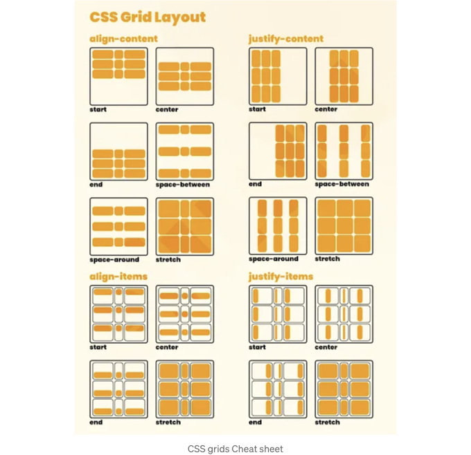

# 1. CSS Grid 기본 개념 이해하기:

# 2. 그리드 컨테이너 설정하기:

```js
.container {
  display: grid;
}
```

# 3. 행과 열 정의하기:

<!-- ui-log 수평형 -->
<ins class="adsbygoogle"
  style="display:block"
  data-ad-client="ca-pub-4877378276818686"
  data-ad-slot="9743150776"
  data-ad-format="auto"
  data-full-width-responsive="true"></ins>
<component is="script">
(adsbygoogle = window.adsbygoogle || []).push({});
</component>

```css
.container {
  display: grid;
  grid-template-rows: 100px 200px; /* 두 개의 행: 100px, 200px */
  grid-template-columns: 1fr 2fr; /* 1:2 비율로 두 개의 열 */
}
```

## 4. 그리드 아이템 배치:

```css
.item {
  grid-row: 1 / 2; /* 1행부터 2행까지 */
  grid-column: 1 / 3; /* 1열부터 3열까지 */
}
```

## 5. 그리드 간격:

<!-- ui-log 수평형 -->
<ins class="adsbygoogle"
  style="display:block"
  data-ad-client="ca-pub-4877378276818686"
  data-ad-slot="9743150776"
  data-ad-format="auto"
  data-full-width-responsive="true"></ins>
<component is="script">
(adsbygoogle = window.adsbygoogle || []).push({});
</component>

```js
.container {
  display: grid;
  grid-gap: 20px; /* 그리드 아이템 사이의 간격을 20px로 설정합니다 */
}
```

# 6. 그리드 아이템 정렬하기:

```js
.container {
  display: grid;
  justify-items: center; /* 트랙 내에서 항목을 수평으로 정렬합니다 */
  align-items: center; /* 트랙 내에서 항목을 수직으로 정렬합니다 */
}
```

# 7. 반응형 그리드:

<!-- ui-log 수평형 -->
<ins class="adsbygoogle"
  style="display:block"
  data-ad-client="ca-pub-4877378276818686"
  data-ad-slot="9743150776"
  data-ad-format="auto"
  data-full-width-responsive="true"></ins>
<component is="script">
(adsbygoogle = window.adsbygoogle || []).push({});
</component>

```css
@media screen and (max-width: 768px) {
  .container {
    grid-template-columns: 1fr; /* 더 작은 화면에서는 단일 열 레이아웃 */
  }
}
```



# 결론: