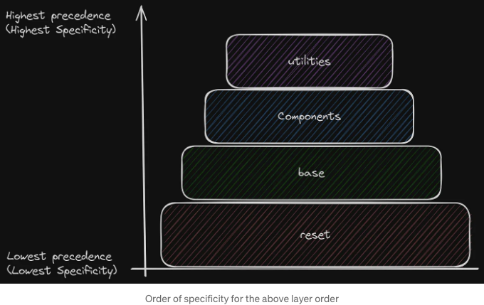
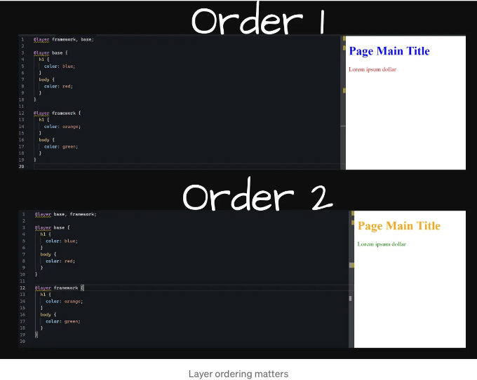
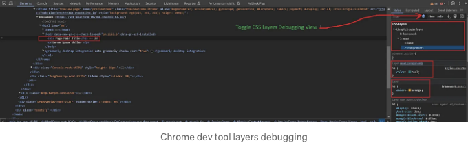
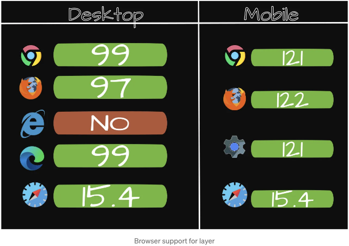

안녕하세요, 웹 개발자 및 CSS 열정가 여러분! CSS에서 카스케이드에 어려움을 겪거나 스타일이 예상대로 적용되지 않는 이유를 찾는 데 어려움을 겪은 적이 있나요? 또는 여러 스타일 시트를 번갈아 사용하면서 서로 겹치지 않도록 스타일을 유지하는 데 어려움을 겪고 있나요? 그렇다면 CSS 도구 상자에 반드시 필요한 멋진 기능인 CSS @layer 규칙의 세계를 탐험할 것을 좋아하게 될 것입니다.

# CSS 레이어란 무엇인가요?

CSS 레이어는 CSS Cascading Layers 사양의 일부이며 @layer 규칙을 도입합니다. 이 기능을 사용하면 특정한 특정성 레이어를 정의하여 가시성 수준을 높여줍니다. 간단히 말해 스타일을 다른 스타일보다 우선시하는지 여부를 명확하고 체계적으로 결정할 수 있는 방법입니다.

<!-- ui-log 수평형 -->
<ins class="adsbygoogle"
  style="display:block"
  data-ad-client="ca-pub-4877378276818686"
  data-ad-slot="9743150776"
  data-ad-format="auto"
  data-full-width-responsive="true"></ins>
<component is="script">
(adsbygoogle = window.adsbygoogle || []).push({});
</component>

# 왜 중요한가요?

집을 짓는다고 상상해봅시다. 계획 없이 짓다 보면 전기 설비가 있어야 할 곳에 배관이 설치될 수도 있습니다. CSS 레이어를 사용하면 스타일을 위한 계획을 세울 수 있어 모든 것이 원하는 위치에 정확히 배치될 수 있도록 도와줍니다. 특히, 서드파티 라이브러리, 프레임워크 또는 여러 팀원으로부터 오는 스타일이 다양한 출처에서 오는 복잡한 프로젝트에서 특히 유용합니다.

# 시작해봅시다: 레이어 정의하고 사용하기

## 1. 레이어 생성하기

<!-- ui-log 수평형 -->
<ins class="adsbygoogle"
  style="display:block"
  data-ad-client="ca-pub-4877378276818686"
  data-ad-slot="9743150776"
  data-ad-format="auto"
  data-full-width-responsive="true"></ins>
<component is="script">
(adsbygoogle = window.adsbygoogle || []).push({});
</component>

레이어를 생성하는 것은 아주 간단해요. @layer at-rule을 사용하고 원하는 레이어 이름을 지정하면 됩니다. 이 레이어 안에서는 보통처럼 스타일을 정의할 수 있어요.

```js
@layer base {
  body {
    font-family: sans-serif;
    line-height: 1.6;
  }

  h1 {
    font-size: 2rem;
  }
}
```

이 예시에서는 body와 h1 요소에 대한 스타일을 포함하는 base라는 이름의 레이어가 있어요. 

## 2. 레이어 순서의 힘

<!-- ui-log 수평형 -->
<ins class="adsbygoogle"
  style="display:block"
  data-ad-client="ca-pub-4877378276818686"
  data-ad-slot="9743150776"
  data-ad-format="auto"
  data-full-width-responsive="true"></ins>
<component is="script">
(adsbygoogle = window.adsbygoogle || []).push({});
</component>

CSS 레이어에서는 순서가 매우 중요합니다. CSS에서 늦게 정의된 레이어가 먼저 정의된 레이어보다 우선됩니다. 그러나 레이어의 순서를 명시적으로 설정하여 모든 것을 정리할 수도 있어요.

```js
@layer reset, base, components, utilities;
```



이 코드 라인은 당신의 스타일에게 "먼저 모든 것을 초기화하고, 기본 스타일을 적용한 다음, 컴포넌트를 따르고, 마지막으로 유틸리티를 뿌린다" 라고 말하는 것과 같아요.

<!-- ui-log 수평형 -->
<ins class="adsbygoogle"
  style="display:block"
  data-ad-client="ca-pub-4877378276818686"
  data-ad-slot="9743150776"
  data-ad-format="auto"
  data-full-width-responsive="true"></ins>
<component is="script">
(adsbygoogle = window.adsbygoogle || []).push({});
</component>

주문의 순서가 우선순위에 어떤 영향을 미치는지에 대한 예시는 다음 이미지에서 설명되어 있습니다:



## 3. 추가 구조화를 위한 레이어 중첩

더 깔끔하게 유지하고 싶은 사람들을 위해 CSS 레이어는 중첩될 수 있습니다. 이는 레이어 내에 다른 레이어가 있을 수 있다는 것을 의미하며 더 구조화된 스타일링을 할 수 있습니다.

<!-- ui-log 수평형 -->
<ins class="adsbygoogle"
  style="display:block"
  data-ad-client="ca-pub-4877378276818686"
  data-ad-slot="9743150776"
  data-ad-format="auto"
  data-full-width-responsive="true"></ins>
<component is="script">
(adsbygoogle = window.adsbygoogle || []).push({});
</component>

```js
 @layer reset {
  @layer base, components;
}

@layer reset.base {
  body {
    color: black;
  }
}
@layer reset.components {
  h1 {
    color: teal;
  }
  body {
    color: red;
  }
} 
```

이 코드 조각은 reset 레이어와 내부에 base 및 components가 있는 것을 보여줍니다. 중첩은 조직화를 더 깔끔하게 만들 수 있지만, 이 기능을 남용하지 않도록 주의해야 합니다. 그렇게 할 경우 더 큰 코드베이스에서 유지 관리가 어려워질 수 있습니다.

## 4. CSS Imports를 사용한 레이어 사용

여러 CSS 파일을 작업할 때, 한 파일에서 레이어를 정의하고 다른 파일에 가져올 수 있습니다. 이것은 CSS를 관리 가능한 청크로 분할하는 데 아주 유용합니다.```

<!-- ui-log 수평형 -->
<ins class="adsbygoogle"
  style="display:block"
  data-ad-client="ca-pub-4877378276818686"
  data-ad-slot="9743150776"
  data-ad-format="auto"
  data-full-width-responsive="true"></ins>
<component is="script">
(adsbygoogle = window.adsbygoogle || []).push({});
</component>

```js
@import url("reset.css") layer(reset);
@import url("base.css") layer(base);
@import url("components.css") layer(components);
```

이 코드는 각각의 레이어에 다른 CSS 파일을 가져와서 스타일 시트를 더 깨끗하고 모듈화할 수 있도록 합니다.

# 레이어 디버깅

Chrome 개발자 도구에는 레이어 계층 구조 및 우선 순위를 쉽게 검사할 수 있는 Toggle CSS Layers View 옵션이 있습니다. 이를 통해 여러 레이어와 특이성을 처리할 때 더 빠르게 디버깅할 수도 있습니다.```

<!-- ui-log 수평형 -->
<ins class="adsbygoogle"
  style="display:block"
  data-ad-client="ca-pub-4877378276818686"
  data-ad-slot="9743150776"
  data-ad-format="auto"
  data-full-width-responsive="true"></ins>
<component is="script">
(adsbygoogle = window.adsbygoogle || []).push({});
</component>



# 브라우저 지원 매트릭스

레이어 at-rule은 다음 이미지에 표시된 버전 이후의 다음 브라우저에서 지원됩니다:



<!-- ui-log 수평형 -->
<ins class="adsbygoogle"
  style="display:block"
  data-ad-client="ca-pub-4877378276818686"
  data-ad-slot="9743150776"
  data-ad-format="auto"
  data-full-width-responsive="true"></ins>
<component is="script">
(adsbygoogle = window.adsbygoogle || []).push({});
</component>

이 데이터는 caniuse 데이터베이스에서 얻었습니다.

# 결론

CSS 레이어는 프로젝트에서 캐스케이드와 특이성을 관리하는 데 큰 영향을 미치는 것입니다. 이를 통해 이전에 어렵게 달성했던 조직 및 제어 수준을 달성할 수 있습니다. 레이어를 정의하고 순서를 지정하며 중첩하여 스타일이 지정된대로 적용되도록 할 수 있으며, 일반적인 특이성으로 인한 머리 아픈 상황 없이 의도한 대로 스타일이 적용됩니다.

덜 알려진 다른 CSS 규칙에 대해 알아보고 싶다면 이 기사를 확인해보세요: