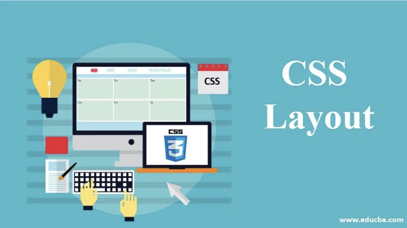
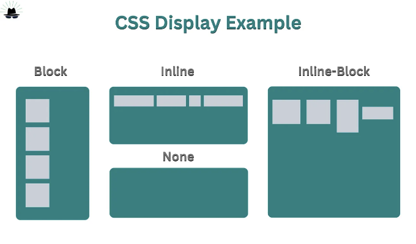
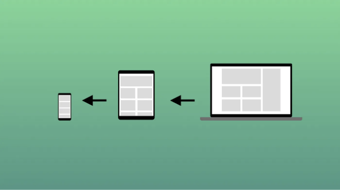
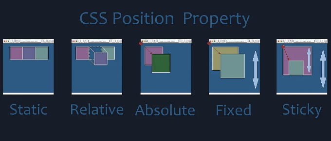
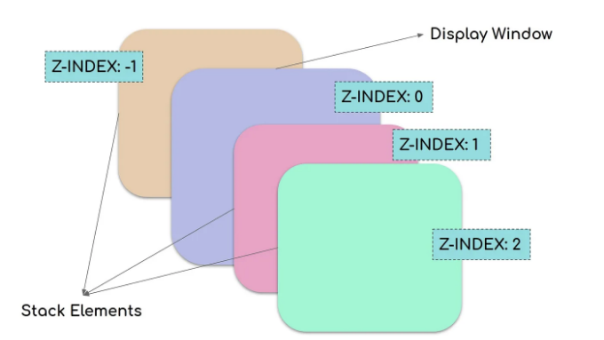
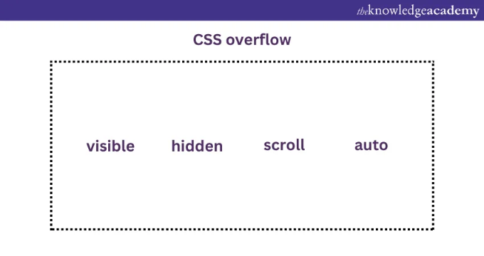
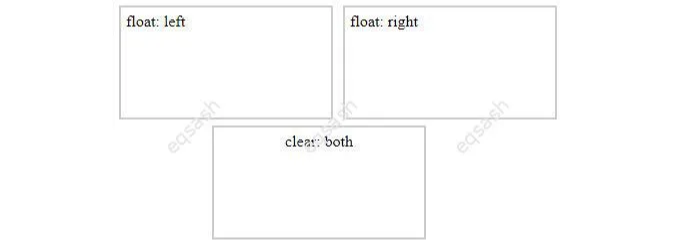

CSS 레이아웃은 웹 페이지의 시각적 구조를 형성하는 데 중요한 역할을 합니다. 레이아웃 속성을 이해하고 숙달하는 것은 시각적으로 매력적이고 반응형이며 잘 구조화된 웹 사이트를 만드는 데 필수적입니다.

이 포괄적인 가이드에서는 display (inline, block, inline-block), width 및 max-width, position (static, relative, absolute, fixed, sticky), z-index, overflow (visible, hidden, scroll, auto), float (left, right, none, inherit), clear (left, right, none, both, inherit)와 같은 주요 CSS 레이아웃 속성에 대해 자세히 살펴보겠습니다. 수평 및 수직으로 요소를 정렬하는 기술에 대해서도 알아볼 것입니다.

# CSS 디스플레이 속성의 기초

<!-- ui-log 수평형 -->
<ins class="adsbygoogle"
  style="display:block"
  data-ad-client="ca-pub-4877378276818686"
  data-ad-slot="9743150776"
  data-ad-format="auto"
  data-full-width-responsive="true"></ins>
<component is="script">
(adsbygoogle = window.adsbygoogle || []).push({});
</component>



웹 페이지의 요소 레이아웃을 제어할 때, display 속성은 웹 개발자에게 가장 중요한 도구 중 하나로 높은 가치를 지닙니다. 이 속성은 HTML 요소가 문서 내에서 어떻게 표시되는지를 결정하는 데 사용됩니다.

## 기본 Display 값

모든 HTML 요소는 해당 유형에 기반한 기본 display 값이 있습니다. 가장 일반적인 기본 display 값은 'block'과 'inline'입니다.

<!-- ui-log 수평형 -->
<ins class="adsbygoogle"
  style="display:block"
  data-ad-client="ca-pub-4877378276818686"
  data-ad-slot="9743150776"
  data-ad-format="auto"
  data-full-width-responsive="true"></ins>
<component is="script">
(adsbygoogle = window.adsbygoogle || []).push({});
</component>

## 블록 수준 요소

블록 수준 요소는 항상 새로운 줄에서 시작하며 왼쪽에서부터 오른쪽으로 확장되어 가용한 전체 너비를 차지합니다.

블록 수준 요소의 예로는 `div`, `h1`부터 `h6`, `p`, `form`, `header`, `footer`, 그리고 `section` 등이 있습니다.

## 인라인 요소

<!-- ui-log 수평형 -->
<ins class="adsbygoogle"
  style="display:block"
  data-ad-client="ca-pub-4877378276818686"
  data-ad-slot="9743150776"
  data-ad-format="auto"
  data-full-width-responsive="true"></ins>
<component is="script">
(adsbygoogle = window.adsbygoogle || []).push({});
</component>

인라인 요소는 새 줄을 시작하지 않고 필요한 만큼의 너비만 차지합니다.

인라인 요소의 예시로는 `span`, `a`, 및 `img`가 있습니다.

## 표시 동작 변경/기본 표시 값 무시

display 속성은 HTML 요소의 기본 표시 동작을 수정하는 데 사용됩니다. 인라인 요소를 블록 요소로 전환하거나 그 반대로 바꾸는 것은 하나의 일반적인 사용법으로, 레이아웃을 디자인할 때 더 많은 유연성을 제공하면서도 웹 표준을 준수할 수 있습니다.

<!-- ui-log 수평형 -->
<ins class="adsbygoogle"
  style="display:block"
  data-ad-client="ca-pub-4877378276818686"
  data-ad-slot="9743150776"
  data-ad-format="auto"
  data-full-width-responsive="true"></ins>
<component is="script">
(adsbygoogle = window.adsbygoogle || []).push({});
</component>

예시: 수평 메뉴를 위한 `li` 요소 만들기

```js
li {
  display: inline;
}
```

예시: `span` 요소를 블록 요소로 표시하기

```js
span {
  display: block;
}
```

<!-- ui-log 수평형 -->
<ins class="adsbygoogle"
  style="display:block"
  data-ad-client="ca-pub-4877378276818686"
  data-ad-slot="9743150776"
  data-ad-format="auto"
  data-full-width-responsive="true"></ins>
<component is="script">
(adsbygoogle = window.adsbygoogle || []).push({});
</component>

참고: 표시 속성을 변경해도 요소의 형식이 바뀌지는 않습니다. 단지 요소가 시각적으로 표시되는 방식에만 영향을 줍니다.

## display: inline-block

- display: inline과 비교했을 때, display: inline-block의 주요 차이점은 요소에 너비와 높이를 설정할 수 있다는 것입니다. 또한 display: inline-block을 사용하면 상하 여백이 존중되지만, display: inline은 그렇지 않습니다.
- display: block과 비교했을 때, display: inline-block의 주요 차이점은 요소 뒤에 줄 바꿈이 추가되지 않으므로 요소가 다른 요소 옆에 배치될 수 있다.

다음 예시는 display: inline, display: inline-block 및 display: block의 다른 동작을 보여줍니다.

<!-- ui-log 수평형 -->
<ins class="adsbygoogle"
  style="display:block"
  data-ad-client="ca-pub-4877378276818686"
  data-ad-slot="9743150776"
  data-ad-format="auto"
  data-full-width-responsive="true"></ins>
<component is="script">
(adsbygoogle = window.adsbygoogle || []).push({});
</component>

예시

```js
span.a {
  display: inline;
  width: 100px;
  height: 100px;
  padding: 5px;
  border: 1px solid blue;
  background-color: yellow;
}
span.b {
  display: inline-block;
  width: 100px;
  height: 100px;
  padding: 5px;
  border: 1px solid blue;
  background-color: yellow;
}
span.c {
  display: block;
  width: 100px;
  height: 100px;
  padding: 5px;
  border: 1px solid blue;
  background-color: yellow;
}
```

## inline-block을 사용하여 내비게이션 링크 만들기

display: inline-block을 사용하는 일반적인 방법 중 하나는 목록 항목을 수직이 아닌 수평으로 표시하는 것입니다. 다음 예시는 수평 내비게이션 링크를 만드는 방법을 보여줍니다.

<!-- ui-log 수평형 -->
<ins class="adsbygoogle"
  style="display:block"
  data-ad-client="ca-pub-4877378276818686"
  data-ad-slot="9743150776"
  data-ad-format="auto"
  data-full-width-responsive="true"></ins>
<component is="script">
(adsbygoogle = window.adsbygoogle || []).push({});
</component>

예시

```js
.nav {
  background-color: yellow;
  list-style-type: none;
  text-align: center;
  padding: 0;
  margin: 0;
}
.nav li {
  display: inline-block;
  font-size: 20px;
  padding: 20px;
}
```

## 요소 숨기기

요소 숨기기는 웹 개발에서 흔히 하는 작업이며, display 속성이 여기에 중요한 역할을 합니다. 자주 사용되는 두 가지 방법은 display: none;과 visibility: hidden;입니다.

<!-- ui-log 수평형 -->
<ins class="adsbygoogle"
  style="display:block"
  data-ad-client="ca-pub-4877378276818686"
  data-ad-slot="9743150776"
  data-ad-format="auto"
  data-full-width-responsive="true"></ins>
<component is="script">
(adsbygoogle = window.adsbygoogle || []).push({});
</component>

## display: none

이 속성은 요소를 문서에서 제거하여 완전히 보이지 않게 만들며 레이아웃에서 공간을 차지하지 않습니다. 자바스크립트와 함께 사용하여 요소를 동적으로 숨기고 보이게 만들 때 자주 사용됩니다. 

## visibility: hidden

이 속성은 요소를 숨기면서 레이아웃에서 해당 공간을 유지합니다. 보이지 않지만 숨겨진 요소는 문서의 전반적인 구조에 영향을 미칩니다.

<!-- ui-log 수평형 -->
<ins class="adsbygoogle"
  style="display:block"
  data-ad-client="ca-pub-4877378276818686"
  data-ad-slot="9743150776"
  data-ad-format="auto"
  data-full-width-responsive="true"></ins>
<component is="script">
(adsbygoogle = window.adsbygoogle || []).push({});
</component>

예시

```js
.hidden-element {
  display: none; /* 또는 visibility: hidden; */
}
```

## visibility: hidden vs. display: none

visibility: hidden;과 display: none; 사이의 차이를 이해하는 것이 중요합니다. 두 가지 모두 요소를 숨깁니다. 그러나 visibility: hidden;은 레이아웃에서 차지하는 공간을 유지하고 display: none;은 요소를 문서에서 제거하여 공간을 차지하지 않습니다.

<!-- ui-log 수평형 -->
<ins class="adsbygoogle"
  style="display:block"
  data-ad-client="ca-pub-4877378276818686"
  data-ad-slot="9743150776"
  data-ad-format="auto"
  data-full-width-responsive="true"></ins>
<component is="script">
(adsbygoogle = window.adsbygoogle || []).push({});
</component>

display: none;와 visibility: hidden의 차이점

## 더 많은 표시 유형

기본 표시 값 이외에도, CSS는 웹 페이지의 디자인과 반응성을 더욱 개선하기 위한 다양한 레이아웃 속성을 제공합니다.

# CSS 너비와 최대 너비

<!-- ui-log 수평형 -->
<ins class="adsbygoogle"
  style="display:block"
  data-ad-client="ca-pub-4877378276818686"
  data-ad-slot="9743150776"
  data-ad-format="auto"
  data-full-width-responsive="true"></ins>
<component is="script">
(adsbygoogle = window.adsbygoogle || []).push({});
</component>




블록 수준 요소는 항상 가능한 전체 너비를 차지합니다 (왼쪽과 오른쪽으로 가능한 한 넓게 펼쳐집니다).

블록 수준 요소의 너비를 설정하면 컨테이너의 가장자리에 펼쳐지지 않습니다. 그런 다음 마진을 자동으로 설정하여 요소를 수평으로 가운데 정렬할 수 있습니다. 요소는 지정된 너비를 차지하고 나머지 공간은 두 마진 사이에서 동일하게 분할됩니다.

예시

<!-- ui-log 수평형 -->
<ins class="adsbygoogle"
  style="display:block"
  data-ad-client="ca-pub-4877378276818686"
  data-ad-slot="9743150776"
  data-ad-format="auto"
  data-full-width-responsive="true"></ins>
<component is="script">
(adsbygoogle = window.adsbygoogle || []).push({});
</component>

```js
div.ex1 {
  width: 500px;
  margin: auto;
  border: 3px solid #73AD21;
}
```

참고: 위의 `div`에 대한 문제는 브라우저 창이 요소의 너비보다 작을 때 발생합니다. 그러면 브라우저가 페이지에 수평 스크롤 바를 추가합니다.

이 상황에서 `max-width`를 사용하면 작은 창에 대한 브라우저 처리가 향상됩니다. 이것은 작은 기기에서 사이트를 사용할 때 중요합니다.

예제

<!-- ui-log 수평형 -->
<ins class="adsbygoogle"
  style="display:block"
  data-ad-client="ca-pub-4877378276818686"
  data-ad-slot="9743150776"
  data-ad-format="auto"
  data-full-width-responsive="true"></ins>
<component is="script">
(adsbygoogle = window.adsbygoogle || []).push({});
</component>

```css
div.ex2 {
  max-width: 500px;
  margin: auto;
  border: 3px solid #73AD21;
}
```

브라우저 창 크기를 500px 이하로 조절하여 두 개의 div 사이의 차이를 확인하세요: [해당 링크에서](https://www.w3schools.com/css/tryit.asp?filename=trycss_max-width)

# 요소 배치: position 속성


```

<!-- ui-log 수평형 -->
<ins class="adsbygoogle"
  style="display:block"
  data-ad-client="ca-pub-4877378276818686"
  data-ad-slot="9743150776"
  data-ad-format="auto"
  data-full-width-responsive="true"></ins>
<component is="script">
(adsbygoogle = window.adsbygoogle || []).push({});
</component>

포지션 속성은 요소의 위치 지정 방법을 지정하는 데 사용됩니다. 포지션 속성에는 static, relative, fixed, absolute, sticky 다섯 가지 다른 값이 있습니다.

그런 다음 상위, 하단, 왼쪽, 오른쪽 속성을 사용하여 요소를 배치합니다. 그러나 이러한 속성은 포지션 속성이 먼저 설정되지 않으면 작동하지 않습니다. 또한 포지션 값에 따라 다르게 작동합니다.

## position: static

기본적으로 HTML 요소는 정적으로 배치됩니다. 페이지의 정상적인 흐름을 따르며 상위, 하단, 왼쪽, 오른쪽 속성에 영향을 받지 않습니다.

<!-- ui-log 수평형 -->
<ins class="adsbygoogle"
  style="display:block"
  data-ad-client="ca-pub-4877378276818686"
  data-ad-slot="9743150776"
  data-ad-format="auto"
  data-full-width-responsive="true"></ins>
<component is="script">
(adsbygoogle = window.adsbygoogle || []).push({});
</component>

예시

```js
div.static {
  position: static;
  border: 3px solid #73AD21;
}
```

## position: relative

position: relative; 속성을 가진 요소는 일반적인 위치를 기준으로 배치됩니다. top, right, bottom, left 속성을 사용하여 위치를 조정할 수 있습니다. 요소가 남긴 공간에 다른 콘텐츠가 맞춰지지는 않습니다.

<!-- ui-log 수평형 -->
<ins class="adsbygoogle"
  style="display:block"
  data-ad-client="ca-pub-4877378276818686"
  data-ad-slot="9743150776"
  data-ad-format="auto"
  data-full-width-responsive="true"></ins>
<component is="script">
(adsbygoogle = window.adsbygoogle || []).push({});
</component>

예시

```css
div.relative {
  position: relative;
  left: 30px;
  border: 3px solid #73AD21;
}
```

## position: fixed

position: fixed; 속성을 갖는 요소는 뷰포트를 기준으로 위치가 지정되어 페이지가 스크롤될 때도 항상 동일한 위치에 유지됩니다. top, right, bottom, left 속성을 사용하여 요소를 위치시킵니다. 고정된 요소는 일반적으로 위치했을 곳에 빈 공간을 남기지 않습니다.

<!-- ui-log 수평형 -->
<ins class="adsbygoogle"
  style="display:block"
  data-ad-client="ca-pub-4877378276818686"
  data-ad-slot="9743150776"
  data-ad-format="auto"
  data-full-width-responsive="true"></ins>
<component is="script">
(adsbygoogle = window.adsbygoogle || []).push({});
</component>

예시

```js
div.fixed {
  position: fixed;
  bottom: 0;
  right: 0;
  width: 300px;
  border: 3px solid #73AD21;
}
```

## position: absolute

position: absolute;으로 설정된 요소들은 가장 가까운 부모 요소를 기준으로 위치가 결정됩니다(fixed처럼 뷰포트를 기준으로 하지 않습니다). 하지만, 만약 absolute로 설정된 요소의 부모 요소 중에 positioned된 요소가 없다면 document body를 기준으로 하며, 페이지 스크롤과 함께 움직입니다.

<!-- ui-log 수평형 -->
<ins class="adsbygoogle"
  style="display:block"
  data-ad-client="ca-pub-4877378276818686"
  data-ad-slot="9743150776"
  data-ad-format="auto"
  data-full-width-responsive="true"></ins>
<component is="script">
(adsbygoogle = window.adsbygoogle || []).push({});
</component>

**알림:** 절대 위치 지정된 요소는 일반 흐름에서 제거되며 다른 요소와 겹칠 수 있습니다.

예시

```js
div.absolute {
  position: absolute;
  top: 80px;
  right: 0;
  width: 200px;
  height: 100px;
  border: 3px solid #73AD21;
}
```

## position: sticky

<!-- ui-log 수평형 -->
<ins class="adsbygoogle"
  style="display:block"
  data-ad-client="ca-pub-4877378276818686"
  data-ad-slot="9743150776"
  data-ad-format="auto"
  data-full-width-responsive="true"></ins>
<component is="script">
(adsbygoogle = window.adsbygoogle || []).push({});
</component>

position: sticky; 속성은 사용자의 스크롤 위치에 기반합니다. sticky 요소는 스크롤 위치에 따라 상대적 및 고정 위치 사이를 전환합니다. 지정된 오프셋 위치가 뷰포트에서 만날 때까지 상대적으로 위치하고, 그 후에는 "고정"됩니다 (position:fixed와 같이).

참고: Internet Explorer에서는 sticky 위치 지정을 지원하지 않습니다. Safari는 -webkit- 접두사가 필요합니다 (아래 예시 참조). 또한 sticky 위치 지정을 작동시키려면 top, right, bottom 또는 left 중 하나 이상을 반드시 지정해야 합니다.

예시

```js
div.sticky {
  position: -webkit-sticky; /* Safari */
  position: sticky;
  top: 0;
  background-color: green;
  border: 2px solid #4CAF50;
}
```

<!-- ui-log 수평형 -->
<ins class="adsbygoogle"
  style="display:block"
  data-ad-client="ca-pub-4877378276818686"
  data-ad-slot="9743150776"
  data-ad-format="auto"
  data-full-width-responsive="true"></ins>
<component is="script">
(adsbygoogle = window.adsbygoogle || []).push({});
</component>

## 이미지 안 텍스트 위치 설정하기

이미지 위에 텍스트를 위치시키는 능력은 흔한 디자인 요구사항입니다. 텍스트는 다양한 위치에 배치할 수 있습니다.

- 상단 좌측
- 상단 우측
- 하단 좌측
- 하단 우측
- 가운데

## 겹침 제어: z-index 속성

<!-- ui-log 수평형 -->
<ins class="adsbygoogle"
  style="display:block"
  data-ad-client="ca-pub-4877378276818686"
  data-ad-slot="9743150776"
  data-ad-format="auto"
  data-full-width-responsive="true"></ins>
<component is="script">
(adsbygoogle = window.adsbygoogle || []).push({});
</component>



요소가 겹치면 z-index 속성이 요소의 쌓임 순서를 결정합니다. 이 속성은 어떤 요소가 다른 요소들 앞이나 뒤에 나타나야 하는지를 지정하며 양수 또는 음수 값을 가질 수 있습니다.

예시

```js
img {
  position: absolute;
  left: 0px;
  top: 0px;
  z-index: -1;
}
```

<!-- ui-log 수평형 -->
<ins class="adsbygoogle"
  style="display:block"
  data-ad-client="ca-pub-4877378276818686"
  data-ad-slot="9743150776"
  data-ad-format="auto"
  data-full-width-responsive="true"></ins>
<component is="script">
(adsbygoogle = window.adsbygoogle || []).push({});
</component>

이미지가 z-index가 -1로 설정되어 있으므로 텍스트 뒤에 배치됩니다.

참고: z-index는 위치 지정된 요소 (position: absolute, position: relative, position: fixed 또는 position: sticky) 및 flex 아이템에만 작동합니다.

지정된 z-index가 없는 경우 HTML 코드에서 마지막에 정의된 요소가 가장 위에 표시됩니다.

# 콘텐츠 오버플로 관리하기: overflow 속성

<!-- ui-log 수평형 -->
<ins class="adsbygoogle"
  style="display:block"
  data-ad-client="ca-pub-4877378276818686"
  data-ad-slot="9743150776"
  data-ad-format="auto"
  data-full-width-responsive="true"></ins>
<component is="script">
(adsbygoogle = window.adsbygoogle || []).push({});
</component>



overflow 속성은 영역에 맞지 않는 콘텐츠를 관리하는데 사용되며, visible, hidden, scroll, auto와 같은 값을 제공합니다.

참고: overflow 속성은 지정된 높이를 가진 블록 요소에 대해서만 작동합니다.

## overflow: visible

<!-- ui-log 수평형 -->
<ins class="adsbygoogle"
  style="display:block"
  data-ad-client="ca-pub-4877378276818686"
  data-ad-slot="9743150776"
  data-ad-format="auto"
  data-full-width-responsive="true"></ins>
<component is="script">
(adsbygoogle = window.adsbygoogle || []).push({});
</component>

기본적으로 overflow는 visible로 설정되어 있어요. 이는 클립되지 않고 요소 상자 외부에 렌더링된다는 뜻이에요.

예시

```js
div {
  width: 200px;
  height: 65px;
  background-color: coral;
  overflow: visible;
}
```

## overflow: hidden

<!-- ui-log 수평형 -->
<ins class="adsbygoogle"
  style="display:block"
  data-ad-client="ca-pub-4877378276818686"
  data-ad-slot="9743150776"
  data-ad-format="auto"
  data-full-width-responsive="true"></ins>
<component is="script">
(adsbygoogle = window.adsbygoogle || []).push({});
</component>

숨겨진 값으로 인해 오버플로우가 잘립니다. 나머지 내용은 숨겨집니다.

예시

```js
div {
  overflow: hidden;
}
```

## overflow: scroll

<!-- ui-log 수평형 -->
<ins class="adsbygoogle"
  style="display:block"
  data-ad-client="ca-pub-4877378276818686"
  data-ad-slot="9743150776"
  data-ad-format="auto"
  data-full-width-responsive="true"></ins>
<component is="script">
(adsbygoogle = window.adsbygoogle || []).push({});
</component>

스크롤로 값을 설정하면 오버플로우가 클리핑되고 상자 내부에서 스크롤이 추가됩니다. 주의할 점은 이렇게 하면 수평 및 수직으로 스크롤바가 추가된다는 것입니다 (필요 없어도).

예시
```js
div {
  overflow: scroll;
}
```

## overflow: auto

<!-- ui-log 수평형 -->
<ins class="adsbygoogle"
  style="display:block"
  data-ad-client="ca-pub-4877378276818686"
  data-ad-slot="9743150776"
  data-ad-format="auto"
  data-full-width-responsive="true"></ins>
<component is="script">
(adsbygoogle = window.adsbygoogle || []).push({});
</component>

자동 값은 스크롤과 비슷하지만 필요할 때에만 스크롤 바를 추가합니다.

예시

```css
div {
  overflow: auto;
}
```

## overflow-x와 overflow-y

<!-- ui-log 수평형 -->
<ins class="adsbygoogle"
  style="display:block"
  data-ad-client="ca-pub-4877378276818686"
  data-ad-slot="9743150776"
  data-ad-format="auto"
  data-full-width-responsive="true"></ins>
<component is="script">
(adsbygoogle = window.adsbygoogle || []).push({});
</component>

overflow-x 및 overflow-y 속성은 콘텐츠의 오버플로우를 수평 또는 수직 (또는 둘 다)으로 변경할 지 여부를 지정합니다:

- overflow-x는 콘텐츠의 좌/우 가장자리에 대해 무엇을 할 지를 지정합니다.
- overflow-y는 콘텐츠의 상/하 가장자리에 대해 무엇을 할 지를 지정합니다.

예시

```js
div {
  overflow-x: hidden; /* 수평 스크롤바 숨기기 */
  overflow-y: scroll; /* 수직 스크롤바 추가 */
}
```

<!-- ui-log 수평형 -->
<ins class="adsbygoogle"
  style="display:block"
  data-ad-client="ca-pub-4877378276818686"
  data-ad-slot="9743150776"
  data-ad-format="auto"
  data-full-width-responsive="true"></ins>
<component is="script">
(adsbygoogle = window.adsbygoogle || []).push({});
</component>

# 부유 요소: float 및 clear 속성



- CSS float 속성은 요소가 어떻게 부유해야 하는지 지정합니다.
- CSS clear 속성은 지워진 요소 옆에 어떤 요소가 부유할 수 있는지 및 어느 쪽에 부유할 수 있는지를 지정합니다.

## float 속성

<!-- ui-log 수평형 -->
<ins class="adsbygoogle"
  style="display:block"
  data-ad-client="ca-pub-4877378276818686"
  data-ad-slot="9743150776"
  data-ad-format="auto"
  data-full-width-responsive="true"></ins>
<component is="script">
(adsbygoogle = window.adsbygoogle || []).push({});
</component>

플로트 속성은 콘텐츠의 위치 지정 및 서식 지정에 사용됩니다. 왼쪽, 오른쪽, 없음 및 상속과 같은 값이 올 수 있습니다. 플로팅 요소는 요소가 옆으로 위치하도록 레이아웃을 만드는 데 유용할 수 있습니다.

예시

```css
img {
  float: right;
}
```

예시

<!-- ui-log 수평형 -->
<ins class="adsbygoogle"
  style="display:block"
  data-ad-client="ca-pub-4877378276818686"
  data-ad-slot="9743150776"
  data-ad-format="auto"
  data-full-width-responsive="true"></ins>
<component is="script">
(adsbygoogle = window.adsbygoogle || []).push({});
</component>

```js
img { float: left; }
```

예시

```js
img { float: none; }
```

일반적으로 div 요소는 서로 위에 표시됩니다. 그러나 float: left를 사용하면 요소를 서로 옆에 두도록 할 수 있습니다.

<!-- ui-log 수평형 -->
<ins class="adsbygoogle"
  style="display:block"
  data-ad-client="ca-pub-4877378276818686"
  data-ad-slot="9743150776"
  data-ad-format="auto"
  data-full-width-responsive="true"></ins>
<component is="script">
(adsbygoogle = window.adsbygoogle || []).push({});
</component>

예시

```js
div {
  float: left;
  padding: 15px;
  background-color: red;
}
.div1 {
  background: red;
}
.div2 {
  background: yellow;
}
.div3 {
  background: green;
}
```

## clear 속성

float 속성을 사용할 때 다음 요소를 오른쪽이나 왼쪽이 아닌 아래에 배치하려면 clear 속성을 사용해야 합니다. clear 속성은 플로팅 요소 옆에 있는 요소에 대해 어떻게 처리해야 하는지를 지정합니다.

<!-- ui-log 수평형 -->
<ins class="adsbygoogle"
  style="display:block"
  data-ad-client="ca-pub-4877378276818686"
  data-ad-slot="9743150776"
  data-ad-format="auto"
  data-full-width-responsive="true"></ins>
<component is="script">
(adsbygoogle = window.adsbygoogle || []).push({});
</component>

클리어 속성은 다음 값 중 하나를 가질 수 있습니다:

- none — 요소가 왼쪽이나 오른쪽으로부터 밀려내어지지 않습니다. 이것이 기본값입니다.
- left — 요소가 왼쪽으로부터 밀려내어집니다.
- right — 요소가 오른쪽으로부터 밀려내어집니다.
- both — 요소가 왼쪽과 오른쪽으로부터 밀려내어집니다.
- inherit — 요소는 부모로부터 클리어 값을 상속받습니다.

플로트를 클리어할 때는 클리어 값을 해당 플로트와 맞추어야 합니다: 요소가 왼쪽으로 플로트되어 있으면 왼쪽을 클리어해야 합니다. 플로팅된 요소는 계속해서 플로팅되지만 클리어된 요소는 웹 페이지에서 그 아래에 나타납니다.

예시

<!-- ui-log 수평형 -->
<ins class="adsbygoogle"
  style="display:block"
  data-ad-client="ca-pub-4877378276818686"
  data-ad-slot="9743150776"
  data-ad-format="auto"
  data-full-width-responsive="true"></ins>
<component is="script">
(adsbygoogle = window.adsbygoogle || []).push({});
</component>

이 예제는 왼쪽으로의 float를 지웁니다. 여기서는 `div2` 요소가 왼쪽으로 플로팅된 `div1` 요소 아래로 이동되는 것을 의미합니다:

```js
div1 {
  float: left;
}
div2 {
  clear: left;
}
```

## Clearfix 해킹

만약 플로팅된 요소가 포함 요소보다 더 높다면 포함 요소 바깥으로 "넘칠" 수 있습니다. 이 문제를 해결하기 위해 clearfix 해킹을 추가할 수 있습니다.

<!-- ui-log 수평형 -->
<ins class="adsbygoogle"
  style="display:block"
  data-ad-client="ca-pub-4877378276818686"
  data-ad-slot="9743150776"
  data-ad-format="auto"
  data-full-width-responsive="true"></ins>
<component is="script">
(adsbygoogle = window.adsbygoogle || []).push({});
</component>

예시

```js
.clearfix::after {
  content: "";
  clear: both;
  display: table;
}
```

# 플로팅 예시

플로팅 속성은 다양한 레이아웃 시나리오에 사용할 수 있는 다재다능한 기능입니다. 여기 몇 가지 예시가 있습니다.

<!-- ui-log 수평형 -->
<ins class="adsbygoogle"
  style="display:block"
  data-ad-client="ca-pub-4877378276818686"
  data-ad-slot="9743150776"
  data-ad-format="auto"
  data-full-width-responsive="true"></ins>
<component is="script">
(adsbygoogle = window.adsbygoogle || []).push({});
</component>

## 상자 그리드 / 동일 너비의 상자

`float` 속성을 사용하면 컨텐츠 상자를 옆으로 띄울 수 있습니다.

예시

```js
* {
  box-sizing: border-box;
}
.box {
  float: left;
  width: 33.33%;
  padding: 50px;
}
```

<!-- ui-log 수평형 -->
<ins class="adsbygoogle"
  style="display:block"
  data-ad-client="ca-pub-4877378276818686"
  data-ad-slot="9743150776"
  data-ad-format="auto"
  data-full-width-responsive="true"></ins>
<component is="script">
(adsbygoogle = window.adsbygoogle || []).push({});
</component>

## 이미지 나란히 배치하기

상자 모양의 그리드를 사용하여 이미지를 나란히 표시하는 데도 사용할 수 있어요.

예시

```js
.img-container {
  float: left;
  width: 33.33%; /* 세 개의 컨테이너에 대해 (네 개의 경우 25%, 두 개의 경우 50% 사용) */
  padding: 5px; /* 이미지 사이에 여백을 원할 경우 */
}
```

<!-- ui-log 수평형 -->
<ins class="adsbygoogle"
  style="display:block"
  data-ad-client="ca-pub-4877378276818686"
  data-ad-slot="9743150776"
  data-ad-format="auto"
  data-full-width-responsive="true"></ins>
<component is="script">
(adsbygoogle = window.adsbygoogle || []).push({});
</component>

## 동일한 높이 상자

이전 예제에서는 상자를 동일한 너비로 옆에 띄우는 방법을 배웠습니다. 그러나 동일한 높이를 갖는 상자를 만드는 것은 쉽지 않습니다. 그러나 아래 예제처럼 고정 높이를 설정하는 것이 빠른 해결책입니다.

예시

```js
.box {
  height: 500px;
}
```

<!-- ui-log 수평형 -->
<ins class="adsbygoogle"
  style="display:block"
  data-ad-client="ca-pub-4877378276818686"
  data-ad-slot="9743150776"
  data-ad-format="auto"
  data-full-width-responsive="true"></ins>
<component is="script">
(adsbygoogle = window.adsbygoogle || []).push({});
</component>

그러나 이 방법은 조금 유연하지 않습니다. 상자들이 항상 동일한 양의 콘텐츠를 가질 것을 보장할 수 있다면 괜찮습니다. 그러나 많은 경우 콘텐츠가 동일하지 않을 수 있습니다. 여기서 CSS3 플렉스박스가 유용하게 사용됩니다. - 가장 긴 상자만큼 상자를 자동으로 늘릴 수 있기 때문에.

참고: Flexbox는 높이가 동일한 상자를 만들기 위한 더 유연한 해결책입니다.

유연한 상자 만들기에 Flexbox 사용 예시

## 네비게이션 메뉴

<!-- ui-log 수평형 -->
<ins class="adsbygoogle"
  style="display:block"
  data-ad-client="ca-pub-4877378276818686"
  data-ad-slot="9743150776"
  data-ad-format="auto"
  data-full-width-responsive="true"></ins>
<component is="script">
(adsbygoogle = window.adsbygoogle || []).push({});
</component>

테이블 태그를 마크다운 형식으로 변경해도 괜찮아요.

<!-- ui-log 수평형 -->
<ins class="adsbygoogle"
  style="display:block"
  data-ad-client="ca-pub-4877378276818686"
  data-ad-slot="9743150776"
  data-ad-format="auto"
  data-full-width-responsive="true"></ins>
<component is="script">
(adsbygoogle = window.adsbygoogle || []).push({});
</component>

웹 레이아웃 전체를 float 속성을 사용하여 만드는 것이 일반적입니다:

예시

```js
.header, .footer {
  background-color: grey;
  color: white;
  padding: 15px;
}
.column {
  float: left;
  padding: 15px;
}
.clearfix::after {
  content: "";
  clear: both;
  display: table;
}
.menu {
  width: 25%;
}
.content {
  width: 75%;
}
```

# 요소 정렬: 가로 및 세로 정렬

<!-- ui-log 수평형 -->
<ins class="adsbygoogle"
  style="display:block"
  data-ad-client="ca-pub-4877378276818686"
  data-ad-slot="9743150776"
  data-ad-format="auto"
  data-full-width-responsive="true"></ins>
<component is="script">
(adsbygoogle = window.adsbygoogle || []).push({});
</component>


요소 정렬은 웹 디자인의 중요한 측면입니다. CSS는 수평 및 수직 정렬을 달성하는 여러 가지 방법을 제공합니다.

## 요소 가운데 정렬

<!-- ui-log 수평형 -->
<ins class="adsbygoogle"
  style="display:block"
  data-ad-client="ca-pub-4877378276818686"
  data-ad-slot="9743150776"
  data-ad-format="auto"
  data-full-width-responsive="true"></ins>
<component is="script">
(adsbygoogle = window.adsbygoogle || []).push({});
</component>

블록 요소(예: `div`)를 수평으로 가운데 정렬하려면 margin: auto를 사용하세요. 요소의 너비를 설정하면 해당 요소가 컨테이너의 가장자리로 늘어나는 것을 방지할 수 있습니다. 그러면 요소는 지정된 너비를 차지하고 나머지 공간은 두 마진 사이에 균등하게 분배됩니다.

예시

```js
.center {
  margin: auto;
  width: 50%;
  border: 3px solid green;
  padding: 10px;
}
```

참고: 너비 속성이 설정되지 않으면 가운데 정렬이 효과가 없습니다.

<!-- ui-log 수평형 -->
<ins class="adsbygoogle"
  style="display:block"
  data-ad-client="ca-pub-4877378276818686"
  data-ad-slot="9743150776"
  data-ad-format="auto"
  data-full-width-responsive="true"></ins>
<component is="script">
(adsbygoogle = window.adsbygoogle || []).push({});
</component>

## 텍스트 가운데 정렬

요소 내의 텍스트를 가운데 정렬하려면 text-align: center;를 사용하세요.

예시

```js
.center {
  text-align: center;
  border: 3px solid green;
}
```

<!-- ui-log 수평형 -->
<ins class="adsbygoogle"
  style="display:block"
  data-ad-client="ca-pub-4877378276818686"
  data-ad-slot="9743150776"
  data-ad-format="auto"
  data-full-width-responsive="true"></ins>
<component is="script">
(adsbygoogle = window.adsbygoogle || []).push({});
</component>

## 이미지 가운데 정렬

이미지를 가운데로 정렬하려면 왼쪽과 오른쪽 마진을 자동으로 설정하고 블록 요소로 만듭니다.

예시

```js
img {
  display: block;
  margin-left: auto;
  margin-right: auto;
  width: 40%;
}
```

<!-- ui-log 수평형 -->
<ins class="adsbygoogle"
  style="display:block"
  data-ad-client="ca-pub-4877378276818686"
  data-ad-slot="9743150776"
  data-ad-format="auto"
  data-full-width-responsive="true"></ins>
<component is="script">
(adsbygoogle = window.adsbygoogle || []).push({});
</component>

##  왼쪽 정렬 및 오른쪽 정렬 - 위치 사용

요소를 정렬하는 한 가지 방법은 position: absolute;를 사용하는 것입니다.

예시

```js
.right {
  position: absolute;
  right: 0px;
  width: 300px;
  border: 3px solid #73AD21;
  padding: 10px;
}
```

<!-- ui-log 수평형 -->
<ins class="adsbygoogle"
  style="display:block"
  data-ad-client="ca-pub-4877378276818686"
  data-ad-slot="9743150776"
  data-ad-format="auto"
  data-full-width-responsive="true"></ins>
<component is="script">
(adsbygoogle = window.adsbygoogle || []).push({});
</component>

노트: 절대 위치 지정된 요소들은 일반 흐름에서 제외되어 요소들과 겹칠 수 있습니다.

## 좌우 정렬 — float 사용

요소를 정렬하는 또 다른 방법은 float 속성을 사용하는 것입니다:

예시

<!-- ui-log 수평형 -->
<ins class="adsbygoogle"
  style="display:block"
  data-ad-client="ca-pub-4877378276818686"
  data-ad-slot="9743150776"
  data-ad-format="auto"
  data-full-width-responsive="true"></ins>
<component is="script">
(adsbygoogle = window.adsbygoogle || []).push({});
</component>

```js
.right {
  float: right;
  width: 300px;
  border: 3px solid #73AD21;
  padding: 10px;
}
```

## 수직 가운데 정렬 — padding 사용

CSS에서 요소를 수직으로 가운데 정렬하는 여러 가지 방법이 있습니다. 간단한 해결책은 top과 bottom padding을 사용하는 것입니다.

예시

<!-- ui-log 수평형 -->
<ins class="adsbygoogle"
  style="display:block"
  data-ad-client="ca-pub-4877378276818686"
  data-ad-slot="9743150776"
  data-ad-format="auto"
  data-full-width-responsive="true"></ins>
<component is="script">
(adsbygoogle = window.adsbygoogle || []).push({});
</component>

```js
.center {
  padding: 70px 0;
  border: 3px solid green;
}
```

수직 및 수평 중앙 정렬을 위해 패딩과 text-align: center를 사용하세요:

예시

```js
.center {
  padding: 70px 0;
  border: 3px solid green;
  text-align: center;
}
```

<!-- ui-log 수평형 -->
<ins class="adsbygoogle"
  style="display:block"
  data-ad-client="ca-pub-4877378276818686"
  data-ad-slot="9743150776"
  data-ad-format="auto"
  data-full-width-responsive="true"></ins>
<component is="script">
(adsbygoogle = window.adsbygoogle || []).push({});
</component>

## 세로 가운데 정렬 — line-height 사용

다른 속임수는 line-height 속성을 사용하여 값이 height 속성과 동일한 경우입니다.

예시

```js
.center {
  line-height: 200px;
  height: 200px;
  border: 3px solid green;
  text-align: center;
}

/* 텍스트가 여러 줄인 경우 다음을 추가하세요: */
.center p {
  line-height: 1.5;
  display: inline-block;
  vertical-align: middle;
}
```

<!-- ui-log 수평형 -->
<ins class="adsbygoogle"
  style="display:block"
  data-ad-client="ca-pub-4877378276818686"
  data-ad-slot="9743150776"
  data-ad-format="auto"
  data-full-width-responsive="true"></ins>
<component is="script">
(adsbygoogle = window.adsbygoogle || []).push({});
</component>

## 수직 가운데 정렬 — position과 transform 사용

패딩과 줄 높이가 선택지가 아닐 때, positioning과 transform 속성을 사용하는 다른 해결책이 있습니다.

예시

```js
.center {
  height: 200px;
  position: relative;
  border: 3px solid green;
}
.center p {
  margin: 0;
  position: absolute;
  top: 50%;
  left: 50%;
  transform: translate(-50%, -50%);
}
```

<!-- ui-log 수평형 -->
<ins class="adsbygoogle"
  style="display:block"
  data-ad-client="ca-pub-4877378276818686"
  data-ad-slot="9743150776"
  data-ad-format="auto"
  data-full-width-responsive="true"></ins>
<component is="script">
(adsbygoogle = window.adsbygoogle || []).push({});
</component>

## 수직 가운데 정렬 - 플렉스박스 사용

요소들을 가운데 정렬하는 데 플렉스박스를 사용할 수도 있어요.

예시

```js
.center {
  display: flex;
  justify-content: center;
  align-items: center;
  height: 200px;
  border: 3px solid green;
}
```

<!-- ui-log 수평형 -->
<ins class="adsbygoogle"
  style="display:block"
  data-ad-client="ca-pub-4877378276818686"
  data-ad-slot="9743150776"
  data-ad-format="auto"
  data-full-width-responsive="true"></ins>
<component is="script">
(adsbygoogle = window.adsbygoogle || []).push({});
</component>

# 결론

CSS 레이아웃 속성을 숙달하면 웹 개발자가 미적으로 매력적이고 반응형 디자인을 만들 수 있습니다. display, position, z-index, overflow, float, clear 및 기타 속성을 어떻게 활용하는지 이해함으로써 디자이너는 매력적이고 잘 구조화된 웹 레이아웃을 구축할 수 있습니다. 이러한 기술을 실험하여 웹 개발 능력을 향상시키고 시각적으로 멋진 웹사이트를 만들어 보세요.