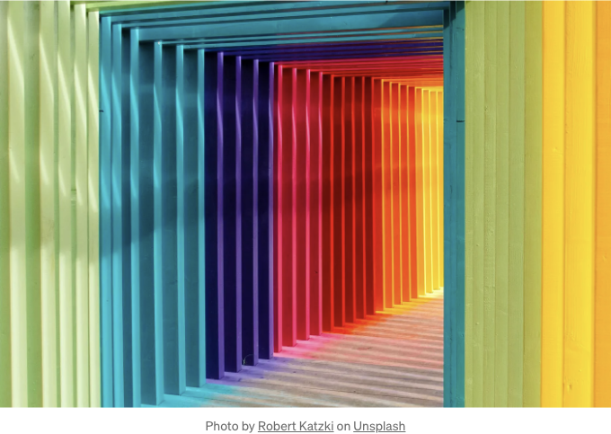
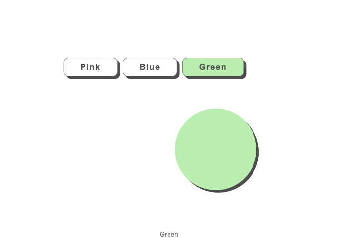

이 기사에서는 Angular의 NgClass 지시문을 실용적으로 적용하여 동적이고 대화형 사용자 인터페이스를 만들어보겠습니다. 컴포넌트 논리에 기반한 스타일을 신속하게 전환하기 위해 NgClass를 활용하는 방법에 대해 살펴보겠습니다.

## NgClass 이해하기:

Angular의 NgClass는 요소에 CSS 클래스를 조건부로 적용하는 지시문으로, 동적 스타일링을 위한 강력한 도구를 제공합니다. 특정 조건이나 사용자 작업에 응답하여 요소의 외관을 수정해야 할 필요성이있을 때 그 효과가 명백해집니다.

<!-- ui-log 수평형 -->
<ins class="adsbygoogle"
  style="display:block"
  data-ad-client="ca-pub-4877378276818686"
  data-ad-slot="9743150776"
  data-ad-format="auto"
  data-full-width-responsive="true"></ins>
<component is="script">
(adsbygoogle = window.adsbygoogle || []).push({});
</component>

문서: https://angular.io/api/common/NgClass

우리 예제에서는 Angular 컴포넌트 내의 요소 색상을 동적으로 업데이트하기 위해 NgClass를 추가할 것입니다.

## 데모



<!-- ui-log 수평형 -->
<ins class="adsbygoogle"
  style="display:block"
  data-ad-client="ca-pub-4877378276818686"
  data-ad-slot="9743150776"
  data-ad-format="auto"
  data-full-width-responsive="true"></ins>
<component is="script">
(adsbygoogle = window.adsbygoogle || []).push({});
</component>

코드: https://stackblitz.com/edit/angular-intensiv-create-a-new-project-cytwoy?file=src%2Fapp%2Fapp.component.html

시작해봐요! 🚀

## 색상 변경 기능

우리의 예제는 Angular 컴포넌트 내의 색상 변경 기능을 중심으로 합니다. NgClass가 동적 스타일링을 어떻게 구현하는지 이해하기 위해 코드를 살펴봅시다:

<!-- ui-log 수평형 -->
<ins class="adsbygoogle"
  style="display:block"
  data-ad-client="ca-pub-4877378276818686"
  data-ad-slot="9743150776"
  data-ad-format="auto"
  data-full-width-responsive="true"></ins>
<component is="script">
(adsbygoogle = window.adsbygoogle || []).push({});
</component>

```md
<div class="container">
  <div class="inner-container">
    <div class="button-container">
      <!-- 색상 변경 버튼 -->
      <button [class.pink]="currentColorClass === 'pink'" (click)="onToggleColor('pink')">핑크</button>
      <button [class.blue]="currentColorClass === 'blue'" (click)="onToggleColor('blue')">파랑</button>
      <button [class.green]="currentColorClass === 'green'" (click)="onToggleColor('green')">초록</button>
    </div>
    <!-- 동적으로 스타일이 적용된 요소 -->
    <div class="element" [ngClass]="currentColorClass"></div>
  </div>
</div>
```

색상 변경 버튼을 클릭하면 onclick 이벤트가 발생하고, 선택한 버튼의 색상에 맞게 currentColorClass가 동적으로 업데이트됩니다. element 클래스를 가진 div는 NgClass를 활용하여 currentColorClass에 따라 동적으로 색상이 조정됩니다.

## Angular 컴포넌트 로직

Angular 컴포넌트가 동적 스타일링 로직을 조율합니다:

<!-- ui-log 수평형 -->
<ins class="adsbygoogle"
  style="display:block"
  data-ad-client="ca-pub-4877378276818686"
  data-ad-slot="9743150776"
  data-ad-format="auto"
  data-full-width-responsive="true"></ins>
<component is="script">
(adsbygoogle = window.adsbygoogle || []).push({});
</component>

```js
import { Component } from '@angular/core';

@Component({
  selector: 'app-root',
  templateUrl: './app.component.html',
  styleUrls: ['./app.component.css'],
})
export class AppComponent {
  currentColorClass: string = 'pink';

  onToggleColor(color: string): void {
    this.currentColorClass = color;
  }
}
```

AppComponent 클래스는 색상 변경 로직을 캡슐화하며, currentColorClass는 NgClass의 앵커 포인트로 작용합니다.

## 디자인과 상호작용을 위한 스타일링

템플릿에서 pink, blue, green 클래스가 NgClass를 통해 사용됩니다.

<!-- ui-log 수평형 -->
<ins class="adsbygoogle"
  style="display:block"
  data-ad-client="ca-pub-4877378276818686"
  data-ad-slot="9743150776"
  data-ad-format="auto"
  data-full-width-responsive="true"></ins>
<component is="script">
(adsbygoogle = window.adsbygoogle || []).push({});
</component>

```js
.container {
  display: flex;
  justify-content: center;
  background-color: #dce0dc;
  height: 100vh;
}
.inner-container {
  display: flex;
  justify-content: center;
  flex-direction: column;
}

.pink {
  background-color: hsl(0, 70%, 80%);
}
.blue {
  background-color: hsl(210, 70%, 80%);
}
.green {
  background-color: hsl(120, 70%, 80%);
}
/* 버튼 컨테이너 스타일링 */
.button-container {
  margin-bottom: 4rem;
}
/* 버튼 스타일링 */
button {
  margin-right: 10px;
  padding: 0.5rem 2rem;
  cursor: pointer;
  background-color: transparent;
  color: rgb(76, 76, 77);
  border-radius: 0.6rem;
  font-size: 1rem;
  font-weight: 600;
  border: 1px solid grey;
  box-shadow: 0.3rem 0.3rem;
  letter-spacing: 0.1rem;
}
.element {
  border-radius: 50%;
  width: 10rem;
  height: 10rem;
  color: rgb(76, 76, 77);
  align-items: center;
  justify-content: center;
  font-size: 18px;
  font-weight: bold;
  box-shadow: 0.3rem 0.3rem;
  animation: 3s infinite alternate slidein; /* 요소에 대한 애니메이션 */
}

/* 슬라이드인 애니메이션을 위한 키프레임 */
@keyframes slidein {
  from {
    margin-left: 100%;
  }
  to {
    margin-left: 0%;
  }
}
```

## 결론

앵귤러의 NgClass 디렉티브는 색상 변경 기능을 보여줄 때 동적 스타일링을 손쉽게 처리합니다. 명료한 구조, 논리적인 컴포넌트 구성 및 매력적인 디자인은 앵귤러가 개발자들에게 매혹적인 사용자 인터페이스를 만들 수 있도록 하는 데 헌신하고 있음을 보여줍니다.

즐거운 코딩 되세요!```

<!-- ui-log 수평형 -->
<ins class="adsbygoogle"
  style="display:block"
  data-ad-client="ca-pub-4877378276818686"
  data-ad-slot="9743150776"
  data-ad-format="auto"
  data-full-width-responsive="true"></ins>
<component is="script">
(adsbygoogle = window.adsbygoogle || []).push({});
</component>

완료되었습니다. 도움이 되었기를 바랍니다. 저를 Medium 및 트위터에서 팔로우해도 괜찮아요: https://twitter.com/SkjelinOttosen