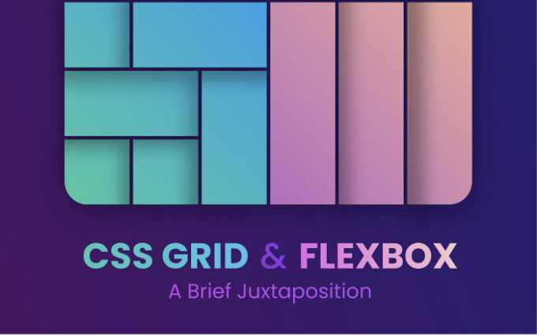

# 레이아웃 마스터리 언리쉬드: 플렉스박스와 CSS 그리드의 심도 있는 탐구



# 소개

웹 디자인의 영역에서는 변화에 뒤처지지 않는 것이 중요합니다. 사용자 인터페이스가 점점 복잡하고 동적해지면서, Flexbox와 CSS 그리드와 같은 도구를 숙달하는 것이 UI 디자이너에게 꼭 필요해졌습니다. 그럼 이 도구들이 왜 필수적인지 정확히 알아보겠습니다. UI 디자이너가 Flexbox와 CSS 그리드를 받아들이는 이유를 탐구해 보겠습니다.

<!-- ui-log 수평형 -->
<ins class="adsbygoogle"
  style="display:block"
  data-ad-client="ca-pub-4877378276818686"
  data-ad-slot="9743150776"
  data-ad-format="auto"
  data-full-width-responsive="true"></ins>
<component is="script">
(adsbygoogle = window.adsbygoogle || []).push({});
</component>

# Flexbox 이해하기

Flexbox는 Flexible Box Layout의 줄임말로, 복잡하고 반응형 레이아웃을 쉽게 만들 수 있는 강력한 레이아웃 모델입니다. UI 디자이너가 그 개념을 이해해야 하는 이유는 다음과 같습니다:

## 1. 간소화된 레이아웃

Flexbox는 레이아웃을 생성하는 과정을 간소화하여, 아이템들 사이의 공간을 더 효율적으로 분배하는 방법을 제공합니다. 심지어 아이템의 크기가 알려지지 않거나 동적인 경우에도요.

<!-- ui-log 수평형 -->
<ins class="adsbygoogle"
  style="display:block"
  data-ad-client="ca-pub-4877378276818686"
  data-ad-slot="9743150776"
  data-ad-format="auto"
  data-full-width-responsive="true"></ins>
<component is="script">
(adsbygoogle = window.adsbygoogle || []).push({});
</component>

```js
.container {
  display: flex;
}

.item {
  flex: 1;
}
```

## 2. 반응형 디자인

플렉스박스를 사용하면 UI 디자이너들은 다양한 화면 크기와 장치에 매끄럽게 적응하는 반응형 디자인을 만들 수 있어서, 다양한 플랫폼에서 일관된 사용자 경험을 제공할 수 있습니다.

```js
.container {
  display: flex;
  flex-wrap: wrap;
}

.item {
  flex: 1 0 50%; /* 컨테이너 크기에 따라 항목 너비 조정 */
}
```

<!-- ui-log 수평형 -->
<ins class="adsbygoogle"
  style="display:block"
  data-ad-client="ca-pub-4877378276818686"
  data-ad-slot="9743150776"
  data-ad-format="auto"
  data-full-width-responsive="true"></ins>
<component is="script">
(adsbygoogle = window.adsbygoogle || []).push({});
</component>

## 3. 정렬 제어

Flexbox는 디자이너가 아이템을 컨테이너 내에서 수평 및 수직으로 정렬할 수 있도록 정교한 제어를 제공합니다. 아이템의 크기와 상관없이 정렬이 가능합니다.

```js
.container {
  display: flex;
  justify-content: center; /* 수평 정렬 */
  align-items: center; /* 수직 정렬 */
}
```

# CSS Grid 탐험

<!-- ui-log 수평형 -->
<ins class="adsbygoogle"
  style="display:block"
  data-ad-client="ca-pub-4877378276818686"
  data-ad-slot="9743150776"
  data-ad-format="auto"
  data-full-width-responsive="true"></ins>
<component is="script">
(adsbygoogle = window.adsbygoogle || []).push({});
</component>

CSS 그리드는 UI 디자이너가 충분한 유연성을 가진 복잡한 그리드 기반 레이아웃을 만들 수 있게 해주는 레이아웃 모델입니다. 이제 CSS 그리드가 디자이너에게 필수적인 이유를 알아봅시다:

## 1. 그리드 기반 레이아웃

CSS 그리드는 이차원 그리드 시스템을 도입하여 디자이너가 요소를 가로 및 세로로 정렬할 수 있는 복잡한 레이아웃을 생성할 수 있게 합니다.

```js
.container {
  display: grid;
  grid-template-columns: 1fr 1fr 1fr; /* 세 개의 동일한 너비 컬럼 */
  grid-gap: 20px; /* 그리드 아이템 간 간격 */
}
```

<!-- ui-log 수평형 -->
<ins class="adsbygoogle"
  style="display:block"
  data-ad-client="ca-pub-4877378276818686"
  data-ad-slot="9743150776"
  data-ad-format="auto"
  data-full-width-responsive="true"></ins>
<component is="script">
(adsbygoogle = window.adsbygoogle || []).push({});
</component>

## 2. 반응형 그리드

Flexbox와 비슷하게, CSS Grid는 디자이너가 화면 크기와 방향에 맞게 우아하게 적응하는 그리드 레이아웃을 정의할 수 있도록 도와줍니다.

```js
.container {
  display: grid;
  grid-template-columns: repeat(auto-fit, minmax(200px, 1fr)); /* 반응형 컬럼 */
}
```

## 3. 그리드 아이템 배치

<!-- ui-log 수평형 -->
<ins class="adsbygoogle"
  style="display:block"
  data-ad-client="ca-pub-4877378276818686"
  data-ad-slot="9743150776"
  data-ad-format="auto"
  data-full-width-responsive="true"></ins>
<component is="script">
(adsbygoogle = window.adsbygoogle || []).push({});
</component>

CSS Grid은 그리드 항목의 배치를 정확하게 제어할 수 있게 해주어 디자이너들이 그리드 내에서 원하는 위치에 요소를 정확히 배치할 수 있습니다.

```js
.item {
  grid-column: span 2; /* 두 개의 그리드 열을 차지함 */
  grid-row: 1 / 3; /* 1부터 3까지의 행을 차지함 */
}
```

# 자주 묻는 질문

## Q: Flexbox와 CSS Grid 모두 배워야 할 필요가 있나요?

<!-- ui-log 수평형 -->
<ins class="adsbygoogle"
  style="display:block"
  data-ad-client="ca-pub-4877378276818686"
  data-ad-slot="9743150776"
  data-ad-format="auto"
  data-full-width-responsive="true"></ins>
<component is="script">
(adsbygoogle = window.adsbygoogle || []).push({});
</component>

A: 플렉스박스(Flexbox)와 CSS 그리드(CSS Grid)는 레이아웃 디자인을 위한 가치 있는 도구이지만, 각각 다른 목적을 가지고 있습니다. 플렉스박스는 네비게이션 메뉴와 같은 1차원 레이아웃에 이상적이며, CSS 그리드는 복잡한 그리드와 같은 2차원 레이아웃을 빛내는 데 능숙합니다.

## Q: Flexbox와 CSS Grid를 함께 사용할 수 있을까요?

A: 절대로 가능합니다! 사실, 플렉스박스와 CSS 그리드를 결합하면 보다 강력한 레이아웃 솔루션을 창출할 수 있습니다. 예를 들어, 플렉스박스를 사용하여 그리드 셀 내 항목을 정렬하거나 유연한 그리드 트랙을 만들 수 있습니다.

## Q: 모든 브라우저에서 Flexbox와 CSS Grid를 지원하나요?

<!-- ui-log 수평형 -->
<ins class="adsbygoogle"
  style="display:block"
  data-ad-client="ca-pub-4877378276818686"
  data-ad-slot="9743150776"
  data-ad-format="auto"
  data-full-width-responsive="true"></ins>
<component is="script">
(adsbygoogle = window.adsbygoogle || []).push({});
</component>

A: 현대 브라우저에서 Flexbox와 CSS Grid가 잘 지원되지만, 이 레이아웃 모델을 완전히 지원하지 않을 수도 있는 오래된 브라우저를 위한 후폭포용 옵션을 고려하는 것이 중요합니다. 다행히도, 기능 감지와 점진적 향상과 같은 기술을 사용하여 레이아웃이 우아하게 저하되도록 보장할 수 있습니다.

# 결론

요약하자면, 현대적이고 반응형이며 시각적으로 매력적인 인터페이스를 만들고자 하는 UI 디자이너들에게 Flexbox와 CSS Grid를 숙달하는 것이 중요합니다. 이 레이아웃 모델의 기능과 효과적인 활용 방법을 이해함으로써 디자이너는 자신의 작업을 높여 사용자에게 웹 전반에서 탁월한 경험을 제공할 수 있습니다. 그러니 깊이 파고들어 실험하고, 디자인 프로젝트에서 Flexbox와 CSS Grid의 모든 잠재력을 발휘해보세요.