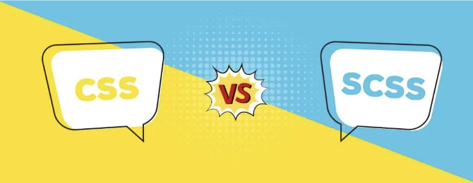

CSS는 웹사이트 스타일링에 강력한 도구일 수 있지만, 프로젝트가 커지면 스타일 관리가 악몽이 될 수 있습니다. SCSS가 등장합니다. SCSS는 CSS에 슈퍼파워를 추가하여 더 정리되고 유지보수가 쉽고 효율적인 CSS를 만들어 줍니다. 변수, 중첩 규칙, 믹스인, 함수 등을 사용할 수 있습니다.

## SCSS를 사용하는 이유

- 조직화: SCSS를 사용하면 선택자를 중첩하여 코드를 깔끔하게 유지하고 HTML의 구조를 반영할 수 있습니다. 내비게이션 바의 스타일을 모두 .nav 선택자 하위에 그룹화된 상태로 유지한다고 생각해보세요. 파일 전체에 흩뿌려져 있는 것이 아니라요!
- 재사용성: SCSS 변수는 색상, 글꼴 및 반복해서 사용하는 기타 스타일을 저장합니다. 변수를 한 번 변경하면 해당 변수가 사용된 모든 곳에 반영됩니다.
- 효율성: 믹스인은 일반적인 스타일에 대한 재사용 가능한 코드 블록입니다. 특정 모양의 버튼이 필요한가요? 믹스인을 만들고 필요한 곳에서 포함시키면 됩니다.

<!-- ui-log 수평형 -->
<ins class="adsbygoogle"
  style="display:block"
  data-ad-client="ca-pub-4877378276818686"
  data-ad-slot="9743150776"
  data-ad-format="auto"
  data-full-width-responsive="true"></ins>
<component is="script">
(adsbygoogle = window.adsbygoogle || []).push({});
</component>

## SCSS로 시작하기

SCSS로 여행을 시작하려면, 그것이 무엇인지 이해하고 전통적인 CSS와 어떻게 다른지를 이해하는 것이 중요합니다. SCSS는 CSS의 상위 집합이며, 모든 유효한 CSS는 유효한 SCSS입니다. 그러나 SCSS는 기능을 향상시키고 스타일 시트를 유지보수하기 쉽게 만드는 추가 기능을 도입합니다.

SCSS로 시작하는 것은 쉽습니다. 텍스트 편집기와 SCSS 코드를 CSS로 컴파일하는 방법이 필요합니다. node-sass, Dart Sass, CodeKit 등 컴파일링하는 여러 도구가 있습니다. 환경을 설정한 후에는 CSS와 마찬가지로 SCSS 코드를 작성할 수 있습니다.

## 기본 SCSS 구문:

<!-- ui-log 수평형 -->
<ins class="adsbygoogle"
  style="display:block"
  data-ad-client="ca-pub-4877378276818686"
  data-ad-slot="9743150776"
  data-ad-format="auto"
  data-full-width-responsive="true"></ins>
<component is="script">
(adsbygoogle = window.adsbygoogle || []).push({});
</component>

SCSS의 주요 기능 중 하나는 변수를 지원한다는 것입니다. 변수를 사용하면 스타일시트 전체에서 재사용할 수 있는 값을 저장할 수 있습니다.

예를 들어:

```js
$primary-color: #3498db;
$secondary-color: #2ecc71;

body {
  background-color: $primary-color;
  color: $secondary-color;
}
```

변수 외에도 SCSS는 중첩(nesting)을 지원합니다. 중첩을 사용하면 CSS 규칙을 서로 중첩시켜 더 나은 구성을 할 수 있습니다.

<!-- ui-log 수평형 -->
<ins class="adsbygoogle"
  style="display:block"
  data-ad-client="ca-pub-4877378276818686"
  data-ad-slot="9743150776"
  data-ad-format="auto"
  data-full-width-responsive="true"></ins>
<component is="script">
(adsbygoogle = window.adsbygoogle || []).push({});
</component>

예시:

```js
.nav {
  ul {
    list-style: none;
    padding: 0;

    li {
      display: inline-block;
      margin-right: 10px;
    }
  }
}
```

## SCSS 고급 기능:

변수, 중첩, 믹스인에 추가하여, SCSS는 더 깨끗하고 유지보수가 쉬운 코드를 작성하는 데 도움이 되는 몇 가지 고급 기능을 지원합니다.

<!-- ui-log 수평형 -->
<ins class="adsbygoogle"
  style="display:block"
  data-ad-client="ca-pub-4877378276818686"
  data-ad-slot="9743150776"
  data-ad-format="auto"
  data-full-width-responsive="true"></ins>
<component is="script">
(adsbygoogle = window.adsbygoogle || []).push({});
</component>

예를 들어, SCSS는 수학 연산을 수행하는 데 사용되는 연산자들을 지원합니다:

```js
$base-font-size: 16px;
$line-height: 1.5;

body {
  font-size: $base-font-size * 1.2;
  line-height: $base-font-size * $line-height;
}
```

SCSS는 함수도 지원하는데, 이를 통해 복잡한 계산을 수행하고 값들을 조작할 수 있습니다.

예를 들어:

<!-- ui-log 수평형 -->
<ins class="adsbygoogle"
  style="display:block"
  data-ad-client="ca-pub-4877378276818686"
  data-ad-slot="9743150776"
  data-ad-format="auto"
  data-full-width-responsive="true"></ins>
<component is="script">
(adsbygoogle = window.adsbygoogle || []).push({});
</component>

```js
$base-font-size: 16px;

body {
  font-size: percentage($base-font-size / 16);
}
```

또한, SCSS는 플레이스홀더를 지원합니다. 플레이스홀더는 믹스인과 유사하지만 명시적으로 참조하지 않는 한 컴파일된 CSS에 포함되지 않습니다. 플레이스홀더는 원하는 스타일을 정의할 때 유용하며 기본적으로 적용하고 싶지 않을 때 유용합니다.

## SCSS 코드 구성하기:

SCSS 프로젝트가 점점 커지고 복잡해지면 코드베이스를 유지하기 쉽도록 견고한 구조를 정립하는 것이 중요합니다. 하나의 일반적인 방법은 부분 파일을 사용하는 것입니다. 부분 파일은 특정 스타일 세트를 포함하는 별도의 SCSS 파일입니다.

<!-- ui-log 수평형 -->
<ins class="adsbygoogle"
  style="display:block"
  data-ad-client="ca-pub-4877378276818686"
  data-ad-slot="9743150776"
  data-ad-format="auto"
  data-full-width-responsive="true"></ins>
<component is="script">
(adsbygoogle = window.adsbygoogle || []).push({});
</component>

예를 들어, 당신은 타이포그래피, 레이아웃 및 컴포넌트를 위한 별도의 부분 파일을 가질 수 있습니다.

주요 SCSS 파일에 부분을 포함하려면 @import 지시문을 사용할 수 있습니다. 예를 들면:

```js
@import 'typography';
@import 'layout';
@import 'components';
```

스타일시트를 더 작고 관리하기 쉬운 조각으로 나누면 코드베이스가 커져도 더 쉽게 탐색하고 유지보수할 수 있습니다.

<!-- ui-log 수평형 -->
<ins class="adsbygoogle"
  style="display:block"
  data-ad-client="ca-pub-4877378276818686"
  data-ad-slot="9743150776"
  data-ad-format="auto"
  data-full-width-responsive="true"></ins>
<component is="script">
(adsbygoogle = window.adsbygoogle || []).push({});
</component>

## SCSS와 프레임워크 그리고 라이브러리 사용하기:

SCSS는 Bootstrap이나 Foundation과 같은 인기 있는 프론트엔드 프레임워크와 라이브러리와 잘 어울립니다. 이러한 프레임워크를 SCSS로 사용자 정의하면 프로젝트의 필요에 더 잘 맞도록 스타일을 맞출 수 있습니다.

예를 들어, 기본 변수를 재정의하여 색상, 글꼴 및 기타 스타일 요소를 변경할 수 있습니다.

## 고급 기술:

<!-- ui-log 수평형 -->
<ins class="adsbygoogle"
  style="display:block"
  data-ad-client="ca-pub-4877378276818686"
  data-ad-slot="9743150776"
  data-ad-format="auto"
  data-full-width-responsive="true"></ins>
<component is="script">
(adsbygoogle = window.adsbygoogle || []).push({});
</component>

기초 사항 외에 SCSS는 더 효율적이고 유지보수하기 쉬운 코드를 작성하는 데 도움이 되는 몇 가지 고급 기술을 제공합니다.

예를 들어 SCSS는 부모 선택자(&)를 포함한 고급 중첩 기술을 지원하여 중첩된 규칙 안에서 부모 선택자를 참조할 수 있게 해줍니다.

```js
.btn {
  &-primary {
    background-color: $primary-color;
  }
}
```

또한 SCSS는 @each, @for, @while과 같은 루프 구조를 지원하여 리스트, 범위 또는 조건에 기반하여 동적으로 CSS를 생성할 수 있도록 해줍니다.

<!-- ui-log 수평형 -->
<ins class="adsbygoogle"
  style="display:block"
  data-ad-client="ca-pub-4877378276818686"
  data-ad-slot="9743150776"
  data-ad-format="auto"
  data-full-width-responsive="true"></ins>
<component is="script">
(adsbygoogle = window.adsbygoogle || []).push({});
</component>

```js
@for $i from 1 through 3 {
  .btn-#{$i} {
    width: 100px * $i;
  }
}
```

또한, SCSS는 선택자를 확장하는 기능을 지원합니다. 이를 통해 선택자 간에 스타일을 공유할 수 있습니다.

## SCSS 출력 최적화:

SCSS를 CSS로 컴파일하여 프로덕션을 위한 출력물을 최적화하는 것이 중요합니다. 이는 CSS를 압축하여 파일 크기를 줄이는 것, 브라우저 호환성을 위해 벤더 접두사를 자동으로 추가하는 것, 그리고 효율적인 선택자를 위한 최적화를 포함할 수 있습니다.```

<!-- ui-log 수평형 -->
<ins class="adsbygoogle"
  style="display:block"
  data-ad-client="ca-pub-4877378276818686"
  data-ad-slot="9743150776"
  data-ad-format="auto"
  data-full-width-responsive="true"></ins>
<component is="script">
(adsbygoogle = window.adsbygoogle || []).push({});
</component>

Autoprefixer와 CSSnano와 같은 도구들을 사용하면 이러한 작업들을 자동화할 수 있어 SCSS 코드로부터 최적화된 CSS를 쉽게 생성할 수 있습니다.

## SCSS 디버깅 및 문제 해결:

SCSS는 이점이 많지만 때로는 특히 대규모 프로젝트에서 디버깅하기 어려울 수 있습니다. 다행히도 여러 도구와 기술을 활용하여 SCSS 코드에서 문제를 식별하고 해결하는 데 도움이 되는 여러 방법이 있습니다.

예를 들어, 소스 맵은 컴파일된 CSS를 원본 SCSS 소스 파일로 추적하여 스타일이 어디서 오는지 식별하는 데 도움이 될 수 있습니다. 또한, stylelint와 같은 리터러들은 구문 오류를 잡고 코드 스타일 규약을 강제하는 데 도움을 줄 수 있습니다.

<!-- ui-log 수평형 -->
<ins class="adsbygoogle"
  style="display:block"
  data-ad-client="ca-pub-4877378276818686"
  data-ad-slot="9743150776"
  data-ad-format="auto"
  data-full-width-responsive="true"></ins>
<component is="script">
(adsbygoogle = window.adsbygoogle || []).push({});
</component>

## 실제 프로젝트에서의 SCSS:

SCSS를 실제 프로젝트에서 어떻게 사용하는지 보기 위해 실제 예제를 살펴보겠습니다. 다음과 같은 디렉토리 구조를 가진 프로젝트를 가정해 봅시다:

```js
project/
  ├── scss/
  │   ├── _variables.scss
  │   ├── _mixins.scss
  │   ├── styles.scss
  ├── css/
  │   └── styles.scss
```

이 예제에서는 변수, 믹스인 및 스타일과 같은 별도의 SCSS 파일이 있습니다. 이 파일들은 다음에 소개할 메인 styles.scss 파일로 import되며, node-sass와 같은 도구를 사용하여 CSS로 컴파일됩니다.

<!-- ui-log 수평형 -->
<ins class="adsbygoogle"
  style="display:block"
  data-ad-client="ca-pub-4877378276818686"
  data-ad-slot="9743150776"
  data-ad-format="auto"
  data-full-width-responsive="true"></ins>
<component is="script">
(adsbygoogle = window.adsbygoogle || []).push({});
</component>

## 미래 트렌드와 자원:

웹 개발이 계속 발전함에 따라 SCSS 및 기타 CSS 전처리 도구도 발전할 것입니다. 산업 내에서 부상하는 트렌드와 모베스트 프랙티스를 주시하면서 최신 정보를 계속 따라가세요.

더 많은 학습을 원하시면, 책, 자습서 및 온라인 강의를 비롯한 다양한 자료가 온라인에서 제공됩니다. SCSS를 처음 시작하는 초보자이든 능숙한 개발자이든 기술을 향상시키고 싶은 경우라면, 배울 점은 항상 있습니다.

## 결론:

<!-- ui-log 수평형 -->
<ins class="adsbygoogle"
  style="display:block"
  data-ad-client="ca-pub-4877378276818686"
  data-ad-slot="9743150776"
  data-ad-format="auto"
  data-full-width-responsive="true"></ins>
<component is="script">
(adsbygoogle = window.adsbygoogle || []).push({});
</component>

SCSS는 CSS를 향상시키고 웹 개발 워크플로우를 간소화하는 강력한 도구입니다. 기본 사항을 숙달하고 고급 기술을 탐험함으로써 SCSS 스킬을 한 단계 더 올릴 수 있고 유지보수가 쉽고 효율적인 스타일 시트를 만들 수 있습니다.

이 포괄적인 안내서가 여러분이 SCSS 전문가가 되기 위해 필요한 지식과 자원을 제공해줬으면 좋겠습니다. 즐거운 코딩되세요!

- Sass 문서: https://sass-lang.com/documentation
- Autoprefixer: https://github.com/postcss/autoprefixer
- CSSnano: https://cssnano.co/
- Stylelint: https://stylelint.io/