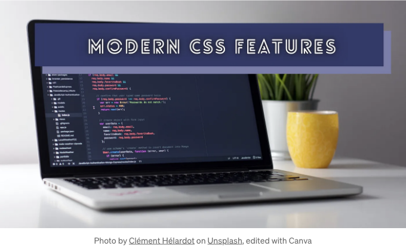
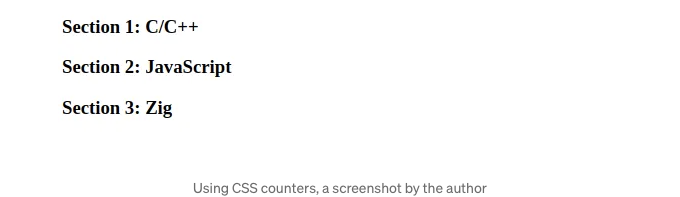

HTML 표준은 웹 페이지의 기본 구조를 만들기 위한 의미론적 태그를 제공하지만, 스타일을 적용하기 위한 완전한 기능을 제공하지는 않습니다. 그래서 웹 개발자들은 표준 CSS 스타일링 언어를 사용하여 HTML 구조화된 웹 페이지에 스타일을 추가합니다. 과거에는 CSS가 DOM 요소 위치 지정, 색상 및 수정 기능을 통해 웹 페이지를 개선하는 데 필수적인 기능만 제공했습니다. 하지만 오늘날 CSS는 자바스크립트를 필요로 하지 않는 애니메이션, Flexbox 기반 레이아웃, 사용자 정의 속성(변수), 반응형 디자인 보조 도구 등과 같은 미래 지향적인 기능을 제공함으로써 웹 개발자들이 고품질이고 사용자 친화적인 웹 앱을 개발할 수 있게 했습니다. 중첩, 스타일 태그 범위 설정, 네이티브 폼 요소 스타일링, 카스케이드 레이어와 같은 개발자 중심 기능은 개발자가 보다 조직적인 CSS 스타일 시트를 작성할 수 있도록 도와줍니다.

이러한 현대 CSS 기능을 알고 있으면 유지보수가 용이한 CSS 정의로 사용자 친화적이고 미래 지향적이며 고품질의 앱을 효율적으로 개발할 수 있습니다. 일부 CSS 기능은 원치 않는 제3 자바스크립트 라이브러리나 스크립트를 제거하여 앱 번들 크기를 줄이는 데 도움이 됩니다.

본 이야기에서는 모든 웹 개발자가 알아야 할 현대 CSS 기능 몇 가지와 몇 가지 데모 코드 스니펫을 사용하여 설명하겠습니다. 이러한 기능을 숙달하여 깨끗한 CSS 문서로 미래 지향적인 웹 앱을 효율적으로 개발하기 위해 이 기능을 마스터하는 것을 고려해보세요!

<!-- ui-log 수평형 -->
<ins class="adsbygoogle"
  style="display:block"
  data-ad-client="ca-pub-4877378276818686"
  data-ad-slot="9743150776"
  data-ad-format="auto"
  data-full-width-responsive="true"></ins>
<component is="script">
(adsbygoogle = window.adsbygoogle || []).push({});
</component>

# 네이티브 CSS 애니메이션과 전환

우리는 자바스크립트 애니메이션 시대를 지나왔습니다. 이전에는 DOM 요소를 애니메이션화하기 위해 JavaScript 코드나 라이브러리(예: JQuery)를 자주 사용했습니다. 브라우저에서 자바스크립트는 단일 스레드로 작동하기 때문에 DOM을 애니메이션화하는 데 사용하면 앱의 중요한 기능적 부분의 속도가 느려질 수 있습니다.

지금은 CSS로 DOM 요소를 효과적으로 애니메이션화할 수 있으므로 개발자들은 GIF 프리로더와 자바스크립트 애니메이션 스크립트를 CSS 애니메이션으로 교체하여 앱 번들 크기를 줄이고 더 나은 성능을 달성할 수 있습니다. 다음은 CSS로 만든 간단한 원형 로딩 애니메이션입니다:

```js
<div class="spinner"></div>
```

<!-- ui-log 수평형 -->
<ins class="adsbygoogle"
  style="display:block"
  data-ad-client="ca-pub-4877378276818686"
  data-ad-slot="9743150776"
  data-ad-format="auto"
  data-full-width-responsive="true"></ins>
<component is="script">
(adsbygoogle = window.adsbygoogle || []).push({});
</component>

```js
@keyframes spinner {
  from {
    transform: rotate(360deg);
  }
  to {
    transform: rotate(0deg);
  }
}

.spinner {
  width: 80px;
  height: 80px;
  background-color: transparent;
  border: 10px inset #eba21a;
  border-radius: 50%;
  animation: spinner 5s linear infinite;
}
```

위 코드는 다음과 같은 애니메이션을 렌더링합니다:


만약 사용자 상호작용을 통해 CSS 속성을 애니메이션화해야 한다면 어떻게 할까요? CSS 트랜지션 기능을 사용하면 CSS 속성을 부드럽게 렌더링하여 다음과 같이 트랜지션 애니메이션을 만들 수 있습니다:

<!-- ui-log 수평형 -->
<ins class="adsbygoogle"
  style="display:block"
  data-ad-client="ca-pub-4877378276818686"
  data-ad-slot="9743150776"
  data-ad-format="auto"
  data-full-width-responsive="true"></ins>
<component is="script">
(adsbygoogle = window.adsbygoogle || []).push({});
</component>

```js
button {
  border: none;
  background-color: #fc9003;
  color: #111;
  padding: 10px;
  font-size: 14px;
  border-radius: 4px;
  transition: all 0.5s;
}

button:hover {
  border: none;
  background-color: #ebb434;
}

button:active {
  border: none;
  background-color: #fc7b03;
}
```

위의 코드 스니펫은 시맨틱한 `button` 요소를 렌더링하며, 마우스 이벤트와 함께 부드러운 색상 전환을 제공합니다.


# 중첩된 CSS 스타일

<!-- ui-log 수평형 -->
<ins class="adsbygoogle"
  style="display:block"
  data-ad-client="ca-pub-4877378276818686"
  data-ad-slot="9743150776"
  data-ad-format="auto"
  data-full-width-responsive="true"></ins>
<component is="script">
(adsbygoogle = window.adsbygoogle || []).push({});
</component>

**DRY (Don’t Repeat Yourself)** 프로그래밍 원칙은 프로그래머가 반복 코드를 피해 고품질 코드를 작성하도록 동기를 부여합니다. CSS 전처리기는 반복되는 CSS 선택자를 피하기 위해 CSS 중첩 기능을 제공합니다. 이제 CSS가 이 기능을 네이티브로 지원합니다. 이 기능에 대한 브라우저 지원은 아직 완전히 성숙하지는 않지만, 곧 개발자 생산성에 영향을 줄 것으로 예상됩니다.

네이티브 중첩 기능이 나오기 전에, 개발자들은 다음과 같이 반복적인 선택자를 작성했습니다:

```js
.alert {
  margin-bottom: 10px;
}

.alert .title {
  background-color: #ccc;
  padding: 10px;
}

.alert .body {
  background-color: #ddd;
  padding: 10px;
}
```

이제 중첩 기능을 사용하여 더 간결한 CSS 정의를 다음과 같이 작성할 수 있습니다:

<!-- ui-log 수평형 -->
<ins class="adsbygoogle"
  style="display:block"
  data-ad-client="ca-pub-4877378276818686"
  data-ad-slot="9743150776"
  data-ad-format="auto"
  data-full-width-responsive="true"></ins>
<component is="script">
(adsbygoogle = window.adsbygoogle || []).push({});
</component>

```js
.alert {
   margin-bottom: 10px;

  .title {
    background-color: #ccc;
    padding: 10px;
  }

  .body {
    background-color: #ddd;
    padding: 10px;
  }
}
```

# CSS에서 사용하는 사용자 정의 속성 (변수)

우리는 BEM (Block Element Modifier)과 같은 잘 정의된 CSS 작성 전략으로 반복되는 CSS 속성을 줄일 수 있습니다. 그러나 반복되는 CSS 속성 값을 제거하기 위해 브라우저 기능이 필요합니다. 특정한 색상 구성표를 따르고 있다고 가정해보면, 다음과 같이 반복되는 HEX 색상 값 #eb9b34를 작성해야 합니다:

```js
.title {
  background-color: #eb9b34;
  padding: 10px;
}

.body {
  background-color: #ddd;
  border-bottom: 2px solid #eb9b34;
  padding: 10px;
}
```

<!-- ui-log 수평형 -->
<ins class="adsbygoogle"
  style="display:block"
  data-ad-client="ca-pub-4877378276818686"
  data-ad-slot="9743150776"
  data-ad-format="auto"
  data-full-width-responsive="true"></ins>
<component is="script">
(adsbygoogle = window.adsbygoogle || []).push({});
</component>

다음 코드 스니펫을 통해 반복되는 값을 제거하기 위해 CSS 변수를 만들 수 있습니다:

```js
:root {
  --primary-color: #eb9b34;
}

.title {
  background-color: var(--primary-color);
  padding: 10px;
}

.body {
  background-color: #ddd;
  border-bottom: 2px solid var(--primary-color);
  padding: 10px;
}
```

여기서 공유 변수인 --primary-color 전역 사용자 지정 속성을 정의하고 내장 var 함수를 사용하여 전통적인 CSS 값으로 적용했습니다. CSS 변수를 사용하여 쉽게 전환 가능한 색상 테마를 만들 수 있습니다. 위의 CSS 변수를 DevTools에서 변경하면 어떤 일이 발생하는지 살펴보세요:


<!-- ui-log 수평형 -->
<ins class="adsbygoogle"
  style="display:block"
  data-ad-client="ca-pub-4877378276818686"
  data-ad-slot="9743150776"
  data-ad-format="auto"
  data-full-width-responsive="true"></ins>
<component is="script">
(adsbygoogle = window.adsbygoogle || []).push({});
</component>

# CSS 카운터

일부 시나리오에서는 웹 페이지 요소에 증가하는 숫자를 렌더링해야 할 때가 있습니다. 자동으로 증가하는 숫자를 각 목록 항목에 추가하려면 순서가 있는 목록을 생성할 수 있지만, 이 표준 기능은 동적 숫자의 위치를 변경할 수 없습니다. 예를 들어 전통적인 `ol`로 "Section 1: 섹션 제목"을 표시할 수 없지만, "1: 섹션 제목"을 쉽게 표시할 수 있습니다.

CSS 카운터를 사용하면 CSS 내에서 카운터 변수를 생성하고 사용하여 전통적인 유연하지 않은 순서가 있는 목록을 사용하지 않고 DOM 요소 내에 증가하는 숫자를 렌더링할 수 있습니다. CSS 카운터는 일반적으로 더 유연한 버전의 순서가 있는 목록을 제공하기 위해 노력합니다.

다음 예제 코드 스니펫을 살펴보세요:

<!-- ui-log 수평형 -->
<ins class="adsbygoogle"
  style="display:block"
  data-ad-client="ca-pub-4877378276818686"
  data-ad-slot="9743150776"
  data-ad-format="auto"
  data-full-width-responsive="true"></ins>
<component is="script">
(adsbygoogle = window.adsbygoogle || []).push({});
</component>

```js
<h3>C/C++</h3>
<h3>JavaScript</h3>
<h3>Zig</h3>
```

```js
body {
  counter-reset: my-counter;
}

h3::before {
  content: "Section " counter(my-counter) ": ";
  counter-increment: my-counter;
}
```

위 CSS 코드는 모든 h3 태그를 동적으로 생성된 증가하는 번호가 있는 섹션 제목으로 변환합니다:



<!-- ui-log 수평형 -->
<ins class="adsbygoogle"
  style="display:block"
  data-ad-client="ca-pub-4877378276818686"
  data-ad-slot="9743150776"
  data-ad-format="auto"
  data-full-width-responsive="true"></ins>
<component is="script">
(adsbygoogle = window.adsbygoogle || []).push({});
</component>

# Scoped Style Tags

일반적으로 CSS 및 JavaScript를 HTML 문서로부터 분리하는 것은 웹 개발자들이 별도의 소스 파일을 만드는 전략입니다. 이 일반적인 전략은 웹 사이트 소스 파일을 잘 정리하지만 개발자 생산성에 영향을 미칩니다. 예를 들어, 특정 HTML 요소의 CSS 정의를 찾아야 할 때는 다른 소스 파일을 열어야 합니다. 이러한 생산성 문제를 극복하기 위해, LoB (Locality of Behavior) 원리에서 설명하는 대로 각 style HTML 세그먼트를 개별적으로 스타일링할 수 있습니다. 그러나 각 요소를 고유하게 선택하기 위해 고유한 클래스 또는 식별자를 만들어야 합니다. 이러한 명명 요구사항은 또한 생산성을 저해합니다:

```js
<div class="alert-1">
  <style>
     .alert-1 {
       margin-bottom: 10px;
     }
     .alert-1 .title {
        background-color: #eb9b34;
        padding: 10px;
      }
      .alert-1 .body {
        background-color: #ddd;
        border-bottom: 2px solid #eb9b34;
        padding: 10px;
      }
   </style>
  <div class="title">Lorem ipsum dolor sit amet</div>
  <div class="body">
    Lorem ipsum dolor sit amet, consectetur adipiscing elit. Suspendisse egestas justo ante, eu accumsan sem vulputate sit amet. Nulla facilisi. Maecenas ac mattis turpis.
  </div>
</div>
```

<!-- ui-log 수평형 -->
<ins class="adsbygoogle"
  style="display:block"
  data-ad-client="ca-pub-4877378276818686"
  data-ad-slot="9743150776"
  data-ad-format="auto"
  data-full-width-responsive="true"></ins>
<component is="script">
(adsbygoogle = window.adsbygoogle || []).push({});
</component>

CSS 스코핑 기능은 사용되지 않는 scoped 속성의 후속 기능으로, HTML에서 LoB 원칙을 구현하고 수동으로 고유한 클래스 이름이나 식별자를 사용하지 않고 가까운 스타일 태그로 HTML 세그먼트를 스타일링하는 데 도움이 됩니다:

```js
<div>
  <style>
    @scope {
      :scope {
        margin-bottom: 10px;
      }
      .title {
        background-color: #eb9b34;
        padding: 10px;
      }

      .body {
        background-color: #ddd;
        border-bottom: 2px solid #eb9b34;
        padding: 10px;
      }
    }
  </style>
  <div class="title">Lorem ipsum dolor sit amet</div>
  <div class="body">
    Lorem ipsum dolor sit amet, consectetur adipiscing elit. Suspendisse egestas justo ante, eu accumsan sem vulputate sit amet. Nulla facilisi. Maecenas ac mattis turpis.
  </div>
</div>
```

네이티브 CSS 스코핑 기능은 마크다운 형식으로 된 콘텐츠를 렌더링하고 기사 콘텐츠를 삽입하는 데 도움이 되며, 스타일 충돌을 방지하고 고유한 CSS 선택기를 생성할 필요가 없습니다.

이 기능에 대한 브라우저 지원은 아직 완전히 성숙하지 않지만, 앞으로 게임 체인저 역할을 할 것입니다!

<!-- ui-log 수평형 -->
<ins class="adsbygoogle"
  style="display:block"
  data-ad-client="ca-pub-4877378276818686"
  data-ad-slot="9743150776"
  data-ad-format="auto"
  data-full-width-responsive="true"></ins>
<component is="script">
(adsbygoogle = window.adsbygoogle || []).push({});
</component>

# 현대 텍스트 처리 기능

대부분의 웹 앱은 시각적 그래픽보다는 텍스트 콘텐츠가 더 많이 포함되어 있습니다. 모든 웹 앱 요소는 일반적으로 텍스트로 구성되므로 CSS로 텍스트를 다루는 방법을 알아야 하는 것은 모든 웹 개발자에게 필수적인 기술입니다. 모든 개발자는 CSS로 폰트를 변경하거나 폰트 크기를 조정하는 방법을 알고 있습니다. 그러므로 좀 더 고급 기능에 대해 논의해봅시다!

text-overflow 속성은 컨테이너 내에 잘린 텍스트의 동작을 사용자 정의할 수 있게 해줍니다. 아래 코드에서 보여지는 것처럼:

```js
h1 {
  background: #ddd;
  white-space: nowrap;
  padding: 12px;
  resize: horizontal;
  overflow: hidden;
  text-overflow: ellipsis;
}
```

<!-- ui-log 수평형 -->
<ins class="adsbygoogle"
  style="display:block"
  data-ad-client="ca-pub-4877378276818686"
  data-ad-slot="9743150776"
  data-ad-format="auto"
  data-full-width-responsive="true"></ins>
<component is="script">
(adsbygoogle = window.adsbygoogle || []).push({});
</component>

위의 CSS 정의는 h1 요소를 resizable하게 만들고 잘린 텍스트에 대한 후행 ellipsis 문자를 표시합니다:


이제 ::selection 가상 요소를 사용하여 텍스트 선택 색상을 웹 앱 주요 색상 구성과 일치시킬 수도 있습니다:

```js
*::selection {
  background: #f5dd89;
  color: #ed0057;
}
```

<!-- ui-log 수평형 -->
<ins class="adsbygoogle"
  style="display:block"
  data-ad-client="ca-pub-4877378276818686"
  data-ad-slot="9743150776"
  data-ad-format="auto"
  data-full-width-responsive="true"></ins>
<component is="script">
(adsbygoogle = window.adsbygoogle || []).push({});
</component>

위의 CSS 코드 스니펫은 텍스트 선택 요소를 다음과 같이 변경합니다.


현대 CSS 표준을 사용하면 텍스트 그림자, 강조 효과, 쓰기 방향 등을 설정할 수 있습니다. 텍스트 관련 CSS 속성을 애니메이션 Keyframes에 넣어서 텍스트에 애니메이션 효과를 줄 수 있습니다.

```js
@keyframes effect-1 {
  0% {
    text-shadow: 0px 0px #32a8a2;
  }
  40% {
    text-shadow: 2px 2px 5px #32a8a2;
  }
  100% {
    text-shadow: 0px 0px #32a8a2;
  }
}

h1 {
  animation: effect-1 1s linear infinite;
  color: white;
  font-size: 48px;
}
```

<!-- ui-log 수평형 -->
<ins class="adsbygoogle"
  style="display:block"
  data-ad-client="ca-pub-4877378276818686"
  data-ad-slot="9743150776"
  data-ad-format="auto"
  data-full-width-responsive="true"></ins>
<component is="script">
(adsbygoogle = window.adsbygoogle || []).push({});
</component>

위의 코드 스니펫은 h1 요소 텍스트에 대해 반짝이는 애니메이션을 렌더링합니다:


MDN 공식 문서에서 모든 지원되는 텍스트 관련 속성을 찾아보세요.

# 네이티브 폼 요소 스타일링

<!-- ui-log 수평형 -->
<ins class="adsbygoogle"
  style="display:block"
  data-ad-client="ca-pub-4877378276818686"
  data-ad-slot="9743150776"
  data-ad-format="auto"
  data-full-width-responsive="true"></ins>
<component is="script">
(adsbygoogle = window.adsbygoogle || []).push({});
</component>

웹 앱은 종종 텍스트 상자, 슬라이더, 라디오 버튼, 체크박스 등과 같은 폼 요소를 통해 사용자 입력을 수집합니다. HTML 표준은 내장된 기본 폼 요소를 제공하지만 해당 컨트롤의 기본 외관은 일관성이 없으며 웹 브라우저 구현에 따라 다릅니다. 이전에는 프라이머리 웹 앱 색상 구성과 일치시키기 위해 CSS 기반 사용자 정의 폼 컨트롤을 작성했습니다. 그러나 현대 CSS 표준에서는 native 폼 컨트롤 색상을 생산적으로 사용자 정의하기 위한 accent-color 속성을 제공합니다.

예를 들어, accent-color: red 설정은 native 체크박스에 대한 액센트를 다음과 같이 설정합니다:


이 accent color 속성은 라디오 버튼, 체크박스, 프로그레스 바 및 레인지 슬라이더와 함께 작동하므로 텍스트 상자와 같은 폼 컨트롤을 사용자 정의하기 위해 전통적인 CSS 속성을 사용해야 합니다. 또한, 이 accent color 기능은 어두운/밝은 테마와 잘 작동합니다.

<!-- ui-log 수평형 -->
<ins class="adsbygoogle"
  style="display:block"
  data-ad-client="ca-pub-4877378276818686"
  data-ad-slot="9743150776"
  data-ad-format="auto"
  data-full-width-responsive="true"></ins>
<component is="script">
(adsbygoogle = window.adsbygoogle || []).push({});
</component>

# 가상 클래스와 요소

CSS 가상 클래스는 DOM 요소의 다양한 상태를 기반으로 스타일을 설정하는 데 도움이 됩니다. 예를 들어, 이전에 우리는 :hover 가상 클래스를 사용하여 버튼의 마우스 호버 이벤트에 특정 스타일을 적용했습니다. 이러한 가상 클래스를 사용하면 JavaScript를 사용하지 않고도 DOM 요소의 상태에 따른 스타일을 적용할 수 있습니다.

다음 코드 스니펫을 살펴보세요:

```js
<input type="text" required pattern="[\w]+"/>
```

<!-- ui-log 수평형 -->
<ins class="adsbygoogle"
  style="display:block"
  data-ad-client="ca-pub-4877378276818686"
  data-ad-slot="9743150776"
  data-ad-format="auto"
  data-full-width-responsive="true"></ins>
<component is="script">
(adsbygoogle = window.adsbygoogle || []).push({});
</component>

```js
input[type=text] {
  padding: 6px;
  outline: none;
  border: 2px solid #555;
  border-radius: 6px;
}

input[type=text]:invalid {
  border: 2px solid #c22d00;
}

input[type=text]:valid:focus {
  border: 2px solid black;
}
```

위 코드는 텍스트 입력란을 렌더링하며, 해당 입력란이 비어 있거나 포커스를 받을 때 테두리 색상이 변경됩니다:


가상 요소는 주요 요소의 하위 요소를 스타일링하는 데 도움을 줍니다. 예를 들어 ::placeholder 요소는 텍스트 입력란의 플레이스홀더를 선택합니다:```

<!-- ui-log 수평형 -->
<ins class="adsbygoogle"
  style="display:block"
  data-ad-client="ca-pub-4877378276818686"
  data-ad-slot="9743150776"
  data-ad-format="auto"
  data-full-width-responsive="true"></ins>
<component is="script">
(adsbygoogle = window.adsbygoogle || []).push({});
</component>

```js
input[type=text]::placeholder {
  color: #031e96;
  font-style: italic;
}
```

MDN 공식 문서에서 지원하는 가상 클래스와 요소를 모두 살펴보세요.

다음 이야기는 현대 CSS 기술에서의 클래스 없는(classless) 및 클래스 가벼운(class-light) 운동에 대해 설명합니다:

읽어주셔서 감사합니다.