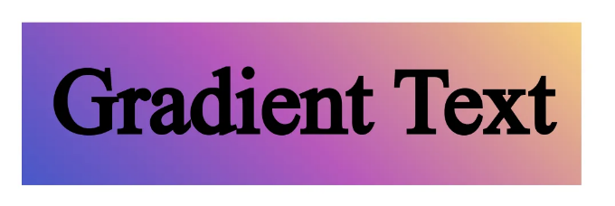

## 110% 더 멋진 웹사이트를 만드는 법


오늘은 웹사이트 제작에 큰 도움이 된 몇 가지 유용하고 간단한 CSS 원라이너들을 공유하고 싶어요.

다음과 같은 트릭을 사용하면 복잡한 기능을 프로그래밍하는 일에 많은 작업을 절약할 수 있어요.

<!-- ui-log 수평형 -->
<ins class="adsbygoogle"
  style="display:block"
  data-ad-client="ca-pub-4877378276818686"
  data-ad-slot="9743150776"
  data-ad-format="auto"
  data-full-width-responsive="true"></ins>
<component is="script">
(adsbygoogle = window.adsbygoogle || []).push({});
</component>

그러니 더 이상 말을 하지 말고 시작해 봅시다!

# 부드러운 페이지 스크롤링

페이지의 다른 섹션으로 스크롤하고 앵커 링크를 사용하려면 기본적으로 보기가 좋지 않습니다. 어떤 스크롤링도 없이 갑자기 이동하고 사용자는 페이지의 다른 부분으로 스크롤했다는 것을 인지하지 못할 수도 있습니다.

이 문제를 해결하려면 다음 속성을 HTML 태그에 적용하십시오:

<!-- ui-log 수평형 -->
<ins class="adsbygoogle"
  style="display:block"
  data-ad-client="ca-pub-4877378276818686"
  data-ad-slot="9743150776"
  data-ad-format="auto"
  data-full-width-responsive="true"></ins>
<component is="script">
(adsbygoogle = window.adsbygoogle || []).push({});
</component>

```css
html{
  scroll-behavior: smooth;
}
```

이제 앵커로 매끄럽게 스크롤되고 더욱 만족스럽고 사용자 친화적으로 보입니다.

# 자바스크립트 없이 상자 크기 조정하기

네, 들으신 대로입니다. 상자와 컨테이너의 크기를 조정하기 위해 어떤 프로그래밍 언어의 복잡한 계산도 필요하지 않습니다.

<!-- ui-log 수평형 -->
<ins class="adsbygoogle"
  style="display:block"
  data-ad-client="ca-pub-4877378276818686"
  data-ad-slot="9743150776"
  data-ad-format="auto"
  data-full-width-responsive="true"></ins>
<component is="script">
(adsbygoogle = window.adsbygoogle || []).push({});
</component>

다음 간단한 CSS 코드로 사용자가 마우스로 요소의 크기를 조정할 수 있도록 할 수 있어요.

```js
.box{
  overflow: hidden;
  resize: both;
}
```

"both"를 "horizontal" 또는 "vertical"로 바꿈으로써 크기 조정 방향을 사용자 정의할 수도 있어요.

# 텍스트 배경 그라데이션

<!-- ui-log 수평형 -->
<ins class="adsbygoogle"
  style="display:block"
  data-ad-client="ca-pub-4877378276818686"
  data-ad-slot="9743150776"
  data-ad-format="auto"
  data-full-width-responsive="true"></ins>
<component is="script">
(adsbygoogle = window.adsbygoogle || []).push({});
</component>

당신의 웹사이트에서 멋진 기능 중 하나는 헤드라인이나 제목에 배경 그라데이션을 넣는 것입니다. 다행히 CSS를 사용하면 쉽게 할 수 있어요.

먼저 텍스트 요소에 배경 그라데이션을 적용해야 해요:

```js
h1{
  width: fit-content;
  padding: 10px;
  background-color: #4158D0;
  background-image: linear-gradient(43deg, #4158D0 0%, #C850C0 46%, #FFCC70 100%);
}
```

이렇게 하고 나면 이런 결과를 볼 수 있을 거예요:

<!-- ui-log 수평형 -->
<ins class="adsbygoogle"
  style="display:block"
  data-ad-client="ca-pub-4877378276818686"
  data-ad-slot="9743150776"
  data-ad-format="auto"
  data-full-width-responsive="true"></ins>
<component is="script">
(adsbygoogle = window.adsbygoogle || []).push({});
</component>




이제 다음 두 개의 속성을 적용하면 끝납니다!

```css
h1{
  width: fit-content;
  padding: 10px;
  background-color: #4158D0;
  background-image: linear-gradient(43deg, #4158D0 0%, #C850C0 46%, #FFCC70 100%);
  -webkit-background-clip: text;
  -webkit-text-fill-color: transparent;
}
```

"-webkit-text-fill-color: transparent;"를 사용하면 배경 색상이 보입니다. 그렇지 않으면 텍스트는 검은색으로 유지됩니다.

<!-- ui-log 수평형 -->
<ins class="adsbygoogle"
  style="display:block"
  data-ad-client="ca-pub-4877378276818686"
  data-ad-slot="9743150776"
  data-ad-format="auto"
  data-full-width-responsive="true"></ins>
<component is="script">
(adsbygoogle = window.adsbygoogle || []).push({});
</component>

아래와 같이 변경해 보세요:

```

```

참고: 현재 이 기능은 Chrome과 Safari에서만 작동합니다. 문제를 피하려면 대비책을 마련해두시는 것이 좋습니다.

본문이 여러분의 문제를 해결해주고 즐겁게 읽어주셨기를 바라며! 댓글에서 여러분이 좋아하는 CSS 원라이너가 무엇인지 알려주세요.

<!-- ui-log 수평형 -->
<ins class="adsbygoogle"
  style="display:block"
  data-ad-client="ca-pub-4877378276818686"
  data-ad-slot="9743150776"
  data-ad-format="auto"
  data-full-width-responsive="true"></ins>
<component is="script">
(adsbygoogle = window.adsbygoogle || []).push({});
</component>

최신 콘텐츠 구독도 잊지마시고 박수 남기는 거 잊지 마세요!

코딩 즐기세요!