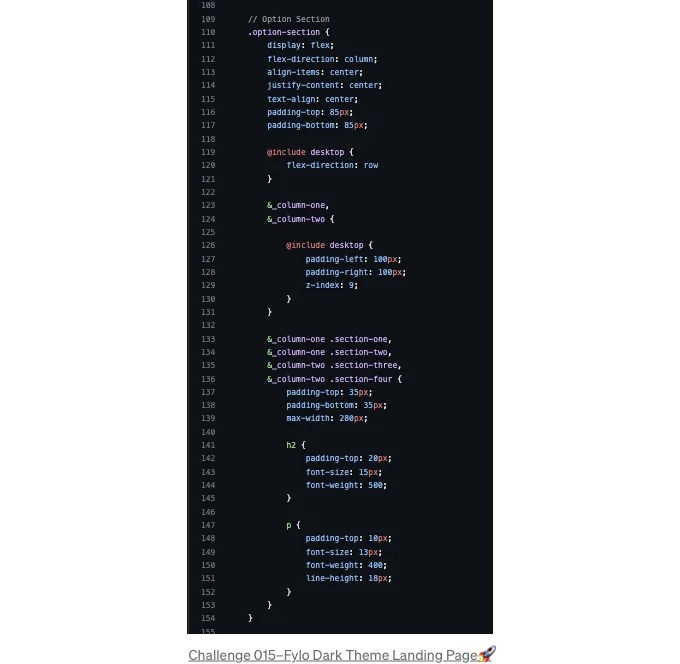

## 기본 개념 이해하기 (파트 3)

다시 오신 것을 환영합니다! 약속한 대로 SCSS 파트 3 기사를 살펴보겠습니다. 이전 기사 "SCSS의 힘을 활용하는 초보자 가이드 (파트 01) 및 SCSS의 변수 (파트 02)"에서는 SCSS의 기초를 탐험했습니다. 슈퍼파워, 전통적인 CSS에 비해 장점, SCSS와 CSS의 차이, 그리고 SCSS의 변수를 포함한 내용을 다뤘습니다. 이 기사에서는 SCSS의 중요한 측면 중 하나에 초점을 맞출 것인데요, 바로 중첩입니다.

이 기사에서는 실용적인 예제를 제공하고 중첩이 스타일링 능력을 향상시킨다는 것을 보여드릴 것입니다. SCSS의 중첩은 서로 다른 논리적 구조를 결합하고 CSS 규칙을 서로 중첩시켜 스타일시트를 보다 조직적이고 계층적인 구조로 만드는 능력입니다.

하지만 중첩에 대해 파헤치기 전에, 빠르게 SCSS의 변수 개념을 되짚어보겠습니다. 변수를 사용하면 색상, 글꼴 크기 또는 기타 CSS 속성과 같은 재사용 가능한 값을 저장하고 스타일시트 전반에 걸쳐 참조할 수 있습니다. 이를 통해 유연성을 제공하고 일관성을 유지하고 스타일을 전역적으로 변경하기가 더 쉬워집니다.

<!-- ui-log 수평형 -->
<ins class="adsbygoogle"
  style="display:block"
  data-ad-client="ca-pub-4877378276818686"
  data-ad-slot="9743150776"
  data-ad-format="auto"
  data-full-width-responsive="true"></ins>
<component is="script">
(adsbygoogle = window.adsbygoogle || []).push({});
</component>

이제 중첩에 대한 간단한 소개를 했으니 SCSS에서 중첩을 탐구해볼 수 있습니다. 이 글에서는 SCSS의 중첩의 강점을 설명하기 위해 실용적인 예제를 제공할 것입니다. 마지막에는 중첩을 활용하여 SCSS 스타일링 능력을 향상시킬 수 있는 방법에 대해 확고한 이해를 가지게 될 것입니다.

본 글은 다음과 같은 몇 가지 섹션으로 나뉘어 있습니다.

- 중첩이란 무엇인가?
- SCSS의 기본 중첩 구문
- SCSS에서 중첩 선언 및 사용
- 선택자와 속성 중첩
- 상위 선택자 탐색
- 최상의 방법과 팁
- SCSS에서 중첩 사용의 장점


<!-- ui-log 수평형 -->
<ins class="adsbygoogle"
  style="display:block"
  data-ad-client="ca-pub-4877378276818686"
  data-ad-slot="9743150776"
  data-ad-format="auto"
  data-full-width-responsive="true"></ins>
<component is="script">
(adsbygoogle = window.adsbygoogle || []).push({});
</component>

## 바로 알아보자! SCSS에서 Nesting의 세계를 탐험해 보세요!!

# Nesting이란?



Nesting은 CSS 셀렉터를 서로 중첩시키는 능력을 가리키며, 스타일 시트를 더 구조화되고 계층적으로 제공합니다. 상위-하위 관계에 따라 특정 요소에 스타일을 정의할 수 있도록 합니다.

<!-- ui-log 수평형 -->
<ins class="adsbygoogle"
  style="display:block"
  data-ad-client="ca-pub-4877378276818686"
  data-ad-slot="9743150776"
  data-ad-format="auto"
  data-full-width-responsive="true"></ins>
<component is="script">
(adsbygoogle = window.adsbygoogle || []).push({});
</component>

중첩을 사용하면 코드의 반복을 피하고 가독성을 향상할 수 있습니다. 부모 컨테이너 내의 특정 요소에 스타일을 정의할 수 있어 스타일시트를 더 모듈식으로 구성하고 관리하기 쉽게 만들어줍니다. 우리는 쉽게 복잡한 선택기를 만들 수 있고 스타일의 시각적 계층 구조를 유지할 수 있습니다.

예시:

## 예시 01

```js
<!DOCTYPE html>
<html lang="en">
<head>
  <meta charset="UTF-8">
  <title>Nesting in SCSS</title>
  <link rel="stylesheet" href="styles.css">
</head>
<body>
  <div class="container">
    <h1>Welcome to the Nesting in SCSS Article</h1>
    <p class="special-paragraph">This is a paragraph inside the container.</p>
    <a href="#" class="link">Click me!</a>
  </div>
</body>
</html>
```

<!-- ui-log 수평형 -->
<ins class="adsbygoogle"
  style="display:block"
  data-ad-client="ca-pub-4877378276818686"
  data-ad-slot="9743150776"
  data-ad-format="auto"
  data-full-width-responsive="true"></ins>
<component is="script">
(adsbygoogle = window.adsbygoogle || []).push({});
</component>

이 예제에서 컨테이너 div 내의 단락(p) 요소는 HTML 파일에서 특별한 클래스인 special-paragraph가 적용되었습니다. 마찬가지로 링크(a) 요소에도 link 클래스가 적용되었습니다.

```js
.container {
  width: 100%;

  h1 {
    color: blue;
    font-size: 24px;
  }

  p {
    color: red;
    font-size: 16px;

    &.special-paragraph {
      font-weight: bold;
    }
  }

  a {
    text-decoration: none;

    &.link {
      color: green;

      &:hover {
        color: purple;
      }
    }
  }
}
```

SCSS 파일에서는 & 기호를 사용하여 부모 셀렉터를 참조하고 클래스 셀렉터를 결합하여 중첩된 스타일을 만듭니다.

- special-paragraph 클래스가 적용된 단락 요소는 볼드체로 표시됩니다.
- link 클래스가 적용된 링크 요소는 녹색으로 표시됩니다.
- 링크에 마우스를 올리면 색상이 보라색으로 변경됩니다.

<!-- ui-log 수평형 -->
<ins class="adsbygoogle"
  style="display:block"
  data-ad-client="ca-pub-4877378276818686"
  data-ad-slot="9743150776"
  data-ad-format="auto"
  data-full-width-responsive="true"></ins>
<component is="script">
(adsbygoogle = window.adsbygoogle || []).push({});
</component>

## 예제 02

```js
<!DOCTYPE html>
<html lang="en">
<head>
  <meta charset="UTF-8">
  <title>SCSS 중첩</title>
  <link rel="stylesheet" href="styles.css">
</head>
<body>
  <div class="container">
    <h1>SCSS 중첩 기사에 오신 것을 환영합니다</h1>
    <div class="content">
      <p>이 컨테이너 안에 있는 단락입니다.</p>
      <ul>
        <li>항목 1</li>
        <li class="highlight">항목 2</li>
        <li>항목 3</li>
      </ul>
    </div>
    <footer class="footer">
      <a href="#" class="link">클릭하세요!</a>
    </footer>
  </div>
</body>
</html>
```

이 예에서 HTML 파일은 여러 단계로 중첩된 요소를 포함한 복잡한 구조를 가지고 있습니다. 컨테이너 div에는 제목(h1), 단락(p)과 목록(ul)을 가진 콘텐츠 div, 그리고 링크(a)를 포함한 푸터가 있습니다.

```js
.container {
  width: 100%;

  h1 {
    color: blue;
    font-size: 24px;
  }

  .content {
    background-color: lightgray;

    p {
      color: red;
      font-size: 16px;
    }

    ul {
      list-style: none;
      padding: 0;

      li {
        margin-bottom: 10px;

        &.highlight {
          color: green;
          font-weight: bold;
        }
      }
    }
  }

  .footer {
    background-color: darkgray;
    padding: 10px;

    a {
      text-decoration: none;
      color: white;

      &:hover {
        color: yellow;
      }
    }
  }
}
```

<!-- ui-log 수평형 -->
<ins class="adsbygoogle"
  style="display:block"
  data-ad-client="ca-pub-4877378276818686"
  data-ad-slot="9743150776"
  data-ad-format="auto"
  data-full-width-responsive="true"></ins>
<component is="script">
(adsbygoogle = window.adsbygoogle || []).push({});
</component>

SCSS 파일에서는 중첩을 사용하여 부모 컨테이너 내에서 특정 요소를 대상으로합니다.

- .container 내의 h1은 파란색이며 글꼴 크기는 24픽셀입니다.
- .content div 내의 단락은 빨간색이며 글꼴 크기는 16픽셀입니다.
- 비순서 목록 내의 리스트 항목 (li)은 10픽셀의 하단 여백을 가지며, li에 .highlight 클래스가있는 경우 녹색 및 굵은 글꼴 무게를 갖습니다.
- 마찬가지로 .footer 내의 링크는 흰색으로 표시되며 마우스를 올리면 색상이 노란색으로 변경됩니다.

# SCSS의 기본 중첩 구문

SCSS에서의 기본 중첩 구문은 부모 선택기 내에 중첩된 선택기를 공백으로 구분하여 배치하는 것을 포함합니다.

<!-- ui-log 수평형 -->
<ins class="adsbygoogle"
  style="display:block"
  data-ad-client="ca-pub-4877378276818686"
  data-ad-slot="9743150776"
  data-ad-format="auto"
  data-full-width-responsive="true"></ins>
<component is="script">
(adsbygoogle = window.adsbygoogle || []).push({});
</component>

위의 내용을 이해하는 데 도움이 되는 단계는 다음과 같습니다:

- 먼저 부모 선택기로 시작합니다.
- 중괄호 {}를 열어 부모 선택기의 스타일을 정의합니다.
- 부모 선택기 블록 내부에서 더 들여쓰기를 합니다.
- 중첩된 선택기를 작성하고 중괄호 {}를 따라 해당 스타일을 정의합니다.
- 추가 중첩 수준에 대해 단계 3과 4를 반복합니다.

```js
.parent-selector {
  // 부모 선택기의 스타일

  .child-selector {
    // 자식 선택기의 스타일
  }
}
```

.child-selector는 .parent-selector 안에 중첩되어 있습니다. .child-selector 블록 내에서 정의된 모든 스타일은 .parent-selector 및 .child-selector 클래스를 모두 가진 요소에만 적용됩니다.

<!-- ui-log 수평형 -->
<ins class="adsbygoogle"
  style="display:block"
  data-ad-client="ca-pub-4877378276818686"
  data-ad-slot="9743150776"
  data-ad-format="auto"
  data-full-width-responsive="true"></ins>
<component is="script">
(adsbygoogle = window.adsbygoogle || []).push({});
</component>

# SCSS에서 중첩 선언 및 사용하기

SCSS에서의 중첩은 선택기와 부모 요소 간의 관계를 시각적으로 표현하여 가독성을 높이고 명확한 계층 구조를 유지할 수 있는 방법을 제공합니다.

중첩된 선택기를 중괄호 {} 안에 넣어 특정 스타일을 정의할 수 있습니다. 이러한 방식을 통해 반복을 피하고 코드를 조직화하여 구조화되고 유지보수 가능한 코드베이스를 만들 수 있습니다.

예시:

<!-- ui-log 수평형 -->
<ins class="adsbygoogle"
  style="display:block"
  data-ad-client="ca-pub-4877378276818686"
  data-ad-slot="9743150776"
  data-ad-format="auto"
  data-full-width-responsive="true"></ins>
<component is="script">
(adsbygoogle = window.adsbygoogle || []).push({});
</component>

이 예제에서는 h1 선택자를 .container 선택자 내에 중첩하고 있습니다.

```js
.container {
  width: 100%;

  h1 {
    color: blue;
    font-size: 24px;
  }
}
```

이는 h1 블록 내에서 정의된 스타일이 .container 클래스를 가진 요소 내에 중첩된 h1 요소에만 적용된다는 것을 의미합니다.

- h1 블록 내에서 color 속성을 파란색으로, font-size 속성을 24px으로 설정했습니다. 이 스타일은 .container 요소 내의 h1 요소에만 적용됩니다.

<!-- ui-log 수평형 -->
<ins class="adsbygoogle"
  style="display:block"
  data-ad-client="ca-pub-4877378276818686"
  data-ad-slot="9743150776"
  data-ad-format="auto"
  data-full-width-responsive="true"></ins>
<component is="script">
(adsbygoogle = window.adsbygoogle || []).push({});
</component>

```js
.container {
  width: 100%;

  h1 {
    color: blue;
    font-size: 24px;

    span {
      font-weight: bold;
    }
  }

  p {
    color: red;
    font-size: 16px;

    a {
      text-decoration: none;

      &:hover {
        color: purple;
      }
    }
  }
}
```

이 예시에서는 h1 선택기 내에 span 선택기를 중첩했습니다.

- span 블록 내에 정의된 font-weight 속성은 .container 요소 내 h1 요소 내부에 중첩된 span 요소에만 적용됩니다.

<!-- ui-log 수평형 -->
<ins class="adsbygoogle"
  style="display:block"
  data-ad-client="ca-pub-4877378276818686"
  data-ad-slot="9743150776"
  data-ad-format="auto"
  data-full-width-responsive="true"></ins>
<component is="script">
(adsbygoogle = window.adsbygoogle || []).push({});
</component>

비슷하게, 우리는 p 선택자 안에 a 선택자를 중첩시켰습니다.

- a 블록 내에 정의된 color 속성은 .container 요소 내의 p 요소 안에 중첩된 a 요소에만 적용됩니다.
- 또한 &:hover 선택자는 a 요소 자체를 가리키며, a 요소 위에 마우스를 올렸을 때 스타일이 적용됩니다.

# 선택자 및 속성 중첩

SCSS에서 선택자 및 속성을 중첩시키면 계층 구조와 중첩된 요소의 명확한 스타일링이 가능해집니다

<!-- ui-log 수평형 -->
<ins class="adsbygoogle"
  style="display:block"
  data-ad-client="ca-pub-4877378276818686"
  data-ad-slot="9743150776"
  data-ad-format="auto"
  data-full-width-responsive="true"></ins>
<component is="script">
(adsbygoogle = window.adsbygoogle || []).push({});
</component>

## 중첩 셀렉터

SCSS에서 셀렉터를 중첩하는 것은 다른 요소 안에 중첩된 요소를 스타일링할 수 있게 해줍니다.

이는 가독성을 향상시키고 스타일을 구성하며 HTML 구조를 시각적으로 나타내게 해줍니다. 이를 실현하기 위해서 중첩된 셀렉터를 부모 셀렉터 안에 공백으로 구분하여 배치하세요.

예시:

<!-- ui-log 수평형 -->
<ins class="adsbygoogle"
  style="display:block"
  data-ad-client="ca-pub-4877378276818686"
  data-ad-slot="9743150776"
  data-ad-format="auto"
  data-full-width-responsive="true"></ins>
<component is="script">
(adsbygoogle = window.adsbygoogle || []).push({});
</component>

```js
<div class="container">
  <h1>Title</h1>
  <p>굵은 <span>텍스트</span>가 있는 단락입니다.</p>
</div>
```

```js
.container {
  padding: 20px;
  background-color: lightgray;

  h1 {
    font-size: 24px;
    color: blue;
  }

  p {
    font-size: 16px;
    color: red;

    span {
      font-weight: bold;
    }
  }
}
```

- .container 선택자: 이는 스타일을 적용하는 부모 선택자로, 요소에 20픽셀의 안쪽 여백과 연한 회색 배경색을 설정합니다.
- h1 선택자: .container 내부에 중첩된 선택자입니다. 컨테이너 내의 h1 요소에 대해 글꼴 크기를 24픽셀로 설정하고 파란색으로 지정합니다.
- p 선택자: .container 내에 또 다른 중첩된 선택자입니다. 컨테이너 내의 p 요소에 대해 글꼴 크기를 16픽셀로 설정하고 빨간색으로 지정합니다.
- span 선택자: p 내에 중첩된 선택자로, p 내의 span 요소에 대해 글꼴 굵기를 두꺼운으로 설정합니다. 이는 p 내의 모든 span 요소가 굵은 텍스트로 표시됨을 의미합니다.

## 속성 중첩하기

<!-- ui-log 수평형 -->
<ins class="adsbygoogle"
  style="display:block"
  data-ad-client="ca-pub-4877378276818686"
  data-ad-slot="9743150776"
  data-ad-format="auto"
  data-full-width-responsive="true"></ins>
<component is="script">
(adsbygoogle = window.adsbygoogle || []).push({});
</component>

프로퍼티를 중첩시켜서 관련된 프로퍼티들을 묶으면 명확한 계층 구조를 설정하고 반복을 최소화할 수 있어요.

이 방식은 스타일을 구성하고 유지보수하기 쉽게 도와줘요.

```js
.element {
  font: {
    weight: bold;
    size: 16px;
    family: Arial, sans-serif;
  }
  margin: {
    top: 10px;
    bottom: 20px;
  }
}
```

<!-- ui-log 수평형 -->
<ins class="adsbygoogle"
  style="display:block"
  data-ad-client="ca-pub-4877378276818686"
  data-ad-slot="9743150776"
  data-ad-format="auto"
  data-full-width-responsive="true"></ins>
<component is="script">
(adsbygoogle = window.adsbygoogle || []).push({});
</component>

폰트 속성: 이 속성은 .element 선택기 내에 중첩됩니다. 관련된 폰트 관련 하위 속성을 묶어줍니다.

- weight 하위 속성: 폰트 굵기를 굵게 설정합니다.
- size 하위 속성: 폰트 크기를 16픽셀로 설정합니다.
- family 하위 속성: 폰트 패밀리를 Arial, sans-serif로 설정합니다.

마진 속성: .element 선택기 내에 중첩된 다른 속성입니다. 여기에 여러 마진 관련 하위 속성을 묶어줍니다.

- top 하위 속성: 상단 마진을 10픽셀로 설정합니다.
- bottom 하위 속성: 하단 마진을 20픽셀로 설정합니다.

<!-- ui-log 수평형 -->
<ins class="adsbygoogle"
  style="display:block"
  data-ad-client="ca-pub-4877378276818686"
  data-ad-slot="9743150776"
  data-ad-format="auto"
  data-full-width-responsive="true"></ins>
<component is="script">
(adsbygoogle = window.adsbygoogle || []).push({});
</component>

## SCSS에서 Selector 및 Property Nesting을 결합합니다

```js
<div class="container">
  <h1>Title</h1>
  <p>굵은 <span>텍스트</span>가 있는 문장.</p>
  <button class="button">클릭해주세요</button>
</div>
```

```js
.container {
  background-color: lightgray;
  
  h1 {
    font-size: 24px;
    color: blue;
  }

  p {
    font-size: 16px;
    color: red;

    span {
      font-weight: bold;
    }
  }

  .button {
    padding: 10px;
    background-color: green;
    color: white;
    
    &:hover {
      background-color: purple;
    }
  }
}
```

- .container selector: 이 스타일은 container 요소에 적용됩니다. 배경색을 연한 회색으로 설정합니다.
- h1 selector: container 내의 h1 요소를 타겟팅하여 글꼴 크기를 24픽셀, 색상을 파란색으로 설정합니다.
- p selector: container 내의 p 요소를 타겟팅하여 글꼴 크기를 16픽셀, 색상을 빨간색으로 설정합니다.
- span selector: p 요소 내의 span 요소를 타겟팅하여 글꼴 굵기를 bold로 설정합니다.
- .button selector: container 내의 클래스 "button"을 가진 요소를 타겟팅합니다. 해당 요소들에 padding, 배경색, 텍스트 색상을 설정합니다. 추가로 &:hover 구문을 사용하여 버튼에 마우스를 올렸을 때 스타일을 정의합니다. 이 경우 배경색을 보라색으로 변경합니다.

<!-- ui-log 수평형 -->
<ins class="adsbygoogle"
  style="display:block"
  data-ad-client="ca-pub-4877378276818686"
  data-ad-slot="9743150776"
  data-ad-format="auto"
  data-full-width-responsive="true"></ins>
<component is="script">
(adsbygoogle = window.adsbygoogle || []).push({});
</component>

# 부모 선택자 살펴보기

SCSS에서 부모 선택자 "&"는 중첩된 스타일 내에서 부모 요소를 가리키는 데 사용됩니다. 부모 요소를 구체적으로 대상으로 지정하여 스타일을 적용할 수 있게 하므로 코드가 더 간결해지고 잘 정의된 계층 구조가 만들어집니다.

```js
<div class="container">
  <h1 class="title">제목</h1>
  <p class="content">일반 콘텐츠</p>
  <p class="content highlighted">강조된 콘텐츠</p>
</div>
```

- 이 예제에서는 컨테이너 요소에 스타일을 적용하는 .container 선택자가 있습니다.
- 컨테이너 내에는 .title 및 .content와 같은 중첩된 선택자가 두 개 있습니다.

<!-- ui-log 수평형 -->
<ins class="adsbygoogle"
  style="display:block"
  data-ad-client="ca-pub-4877378276818686"
  data-ad-slot="9743150776"
  data-ad-format="auto"
  data-full-width-responsive="true"></ins>
<component is="script">
(adsbygoogle = window.adsbygoogle || []).push({});
</component>

```js
.container {
  border: 1px solid black;
  padding: 10px;

  .title {
    font-weight: bold;
    margin-bottom: 5px;
  }

  .content {
    color: blue;

    &.highlighted {
      background-color: yellow;
    }

    &:hover {
      text-decoration: underline;
    }
  }
}
```

- .title 선택자: 컨테이너 내의 `h1` 요소를 대상으로 하며 글꼴 굵기를 굵게, 마진 바닥을 5픽셀로 설정합니다.
- .content 선택자: 컨테이너 내의 `p` 요소를 대상으로 하며 글자 색상을 파랑으로 설정합니다.

- &.highlighted는 .content 요소를 대상으로 하는데, 이 요소에 "highlighted" 클래스가 추가로 적용될 때 적용됩니다. 배경 색상을 노랑으로 설정합니다. 이는 상위 선택자 "&"가 부모 요소의 추가적인 클래스에 기반하여 스타일을 적용할 수 있도록 해주는 것을 보여줍니다.
- &:hover는 .content 요소를 대상으로 하는데, 해당 요소가 마우스 오버되었을 때 적용됩니다. 텍스트에 밑줄을 추가합니다. 이는 상위 선택자 "&"가 요소의 상태에 따라(이 경우에는 마우스 오버되었을 때) 부모 요소를 대상으로 스타일을 지정할 수 있도록 보여줍니다.

# 모범 사례 및 팁

<!-- ui-log 수평형 -->
<ins class="adsbygoogle"
  style="display:block"
  data-ad-client="ca-pub-4877378276818686"
  data-ad-slot="9743150776"
  data-ad-format="auto"
  data-full-width-responsive="true"></ins>
<component is="script">
(adsbygoogle = window.adsbygoogle || []).push({});
</component>

## 중첩 레벨을 얕게 유지하기

과도한 복잡성을 피하기 위해 중첩을 몇 단계로 제한하는 것이 좋습니다(일반적으로 세 단계 이상을 추천하지 않음). 이렇게 하면 코드를 이해하고 유지 관리하기 쉬워집니다.

```js
// 좋은 예시
.parent {
  .child {
    ...
  }
}

// 피해야 할 예시
.parent {
  .child {
    .grandchild {
      ...
    }
  }
}
```

## 중첩 사용에 주의하세요

<!-- ui-log 수평형 -->
<ins class="adsbygoogle"
  style="display:block"
  data-ad-client="ca-pub-4877378276818686"
  data-ad-slot="9743150776"
  data-ad-format="auto"
  data-full-width-responsive="true"></ins>
<component is="script">
(adsbygoogle = window.adsbygoogle || []).push({});
</component>

특정 요소나 구성 요소들이 더 잘 정리되도록 중첩된 스타일을 필요로 하는 경우를 고려해보세요.

```js
// 좋은 예시
.parent {
  ...
}

.child {
  ...
}

// 피하기
.parent {
  .child {
    ...
  }
}
```

## 코드 가독성 유지하기

내포된 블록 안에서 적절한 들여쓰기와 간격을 사용하여 명확한 계층구조를 유지하세요. 이것은 다른 사람들 (그리고 본인)이 코드를 쉽게 탐색하고 이해하는 데 도움이 됩니다.

<!-- ui-log 수평형 -->
<ins class="adsbygoogle"
  style="display:block"
  data-ad-client="ca-pub-4877378276818686"
  data-ad-slot="9743150776"
  data-ad-format="auto"
  data-full-width-responsive="true"></ins>
<component is="script">
(adsbygoogle = window.adsbygoogle || []).push({});
</component>

```js
// 좋은 예시
.parent {
  .child {
    ...
  }
}

// 피해야 할 예시
.parent {
.child {
...
}
}
```

## 관련 없는 스타일들은 분리

특정 부모 요소와 관련이 없는 스타일이 있다면, 중첩하지 말고 같은 수준에 유지해보세요. 더 나은 조직화와 명확성을 위해 부모 선택기와 동일한 레벨에 유지해주세요.

```js
// 좋은 예시
.parent {
  ...
}

.unrelated-style {
  ...
}

// 피해야 할 예시
.parent {
  .unrelated-style {
    ...
  }
}
```

<!-- ui-log 수평형 -->
<ins class="adsbygoogle"
  style="display:block"
  data-ad-client="ca-pub-4877378276818686"
  data-ad-slot="9743150776"
  data-ad-format="auto"
  data-full-width-responsive="true"></ins>
<component is="script">
(adsbygoogle = window.adsbygoogle || []).push({});
</component>

다음은 제가 따르는 몇 가지 팁입니다. 추가적으로 따르는 실천 방법이 있다면, 코멘트로 자유롭게 추가해주세요. 여러분의 통찰력을 통해 배우고 SCSS에 대한 지식을 확장하는 것에 열렬히 기대하고 있어요.

# 마지막으로, SCSS에서 중첩 사용의 혜택에 대해 이야기해 봅시다

- 향상된 가독성: 중첩을 사용하면 더 직관적이고 조직화된 코드 구조를 갖추어 스타일을 읽고 이해하기 쉬워집니다.
- 반복 감소: 중첩을 통해 부모 요소를 직접 참조하여 반복적인 코드를 피하고, 시간과 노력을 절약할 수 있습니다.
- 코드 효율성: SCSS에서 중첩은 더 깔끔하고 간결한 코드로 이어져, 개발 속도를 향상시키고 오류 발생 가능성을 줄일 수 있습니다.
- 향상된 제어: 중첩을 통해 특정 요소나 그 하위 항목을 정확하게 대상으로 지정할 수 있어, 스타일의 범위에 대한 제어를 보다 세밀하게 할 수 있습니다.

# 마지막 생각

<!-- ui-log 수평형 -->
<ins class="adsbygoogle"
  style="display:block"
  data-ad-client="ca-pub-4877378276818686"
  data-ad-slot="9743150776"
  data-ad-format="auto"
  data-full-width-responsive="true"></ins>
<component is="script">
(adsbygoogle = window.adsbygoogle || []).push({});
</component>

SCSS 변수에 대한 안내를 마무리하며, 귀하가 유익한 지식과 통찰력을 얻으셨기를 희망합니다. 이 콘텐츠를 살펴주신 시간에 감사드립니다.

만약 추가 질문이 있거나 더 많은 설명이 필요하다면, 아래 댓글을 남겨주시기 바랍니다. 귀하의 참여와 피드백을 감사히 받겠습니다.

다음에 또 만나요!

# 아래 게시물을 놓치지 마세요.👇🧠

<!-- ui-log 수평형 -->
<ins class="adsbygoogle"
  style="display:block"
  data-ad-client="ca-pub-4877378276818686"
  data-ad-slot="9743150776"
  data-ad-format="auto"
  data-full-width-responsive="true"></ins>
<component is="script">
(adsbygoogle = window.adsbygoogle || []).push({});
</component>

# 다음 도전 과제를 탐험하고 독립적으로 시도해보세요..👇🧠

도전 013, 도전 014, 도전 015

🔸트위터에서 나를 팔로우해보세요👀: @UxWithNathasha🔸