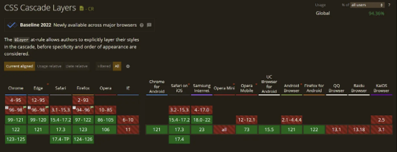
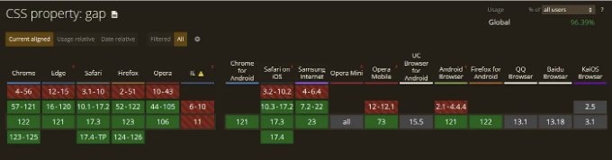

# SASS와 같은 CSS 중첩

## CSS 중첩이란?

CSS 중첩은 하나의 요소의 스타일 규칙을 다른 요소 내부에서 정의할 수 있는 기능입니다. 특정 자식 요소나 가상 선택자에 스타일을 적용하기 위해 동일한 선택자를 반복해서 작성하는 대신, 단일 선택자 아래에 중첩시켜서 적용할 수 있습니다.

중첩을 사용하면 관련된 스타일을 그룹화하고 중첩 구조로 CSS를 작성할 수 있습니다.

<!-- ui-log 수평형 -->
<ins class="adsbygoogle"
  style="display:block"
  data-ad-client="ca-pub-4877378276818686"
  data-ad-slot="9743150776"
  data-ad-format="auto"
  data-full-width-responsive="true"></ins>
<component is="script">
(adsbygoogle = window.adsbygoogle || []).push({});
</component>

예시:

# @ 레이어 지시문을 사용하여 스타일 재정렬.

@layer CSS at-rule은 캐스케이드 레이어를 선언하는 데 사용되며 여러 캐스케이드 레이어가 있는 경우 우선 순위 순서를 정의하는 데도 사용할 수 있습니다.

## 구문

<!-- ui-log 수평형 -->
<ins class="adsbygoogle"
  style="display:block"
  data-ad-client="ca-pub-4877378276818686"
  data-ad-slot="9743150776"
  data-ad-format="auto"
  data-full-width-responsive="true"></ins>
<component is="script">
(adsbygoogle = window.adsbygoogle || []).push({});
</component>

```js
/* 스타일을 적용할 순서를 지정합니다 */
@layer CardDetails, card;

/* 많은 스타일이 있다고 상상해보세요 */
@layer card {
  .card {
    background-color: red;
  }
}
@layer CardDetails {
  .card {
    background-color: green;
  }
}
```

브라우저 지원: 94.36%


```

<!-- ui-log 수평형 -->
<ins class="adsbygoogle"
  style="display:block"
  data-ad-client="ca-pub-4877378276818686"
  data-ad-slot="9743150776"
  data-ad-format="auto"
  data-full-width-responsive="true"></ins>
<component is="script">
(adsbygoogle = window.adsbygoogle || []).push({});
</component>

# 갭

갭 속성을 사용하면 요소들 사이에 수평 및 수직 간격을 추가할 수 있습니다. 물론 여태껏 우리는 마진을 사용해서 이를 할 수 있었습니다. 그러나 항상 간격을 두려는 아이템들이 한 줄에 걸쳐 나열될 때, 원치않는 마진이 생기는 불편한 경우가 있죠.

## 구문

```js
/* 하나의 <length> 값 */
gap: 20px;
gap: 1em;
gap: 3vmin;
gap: 0.5cm;

/* 하나의 <percentage> 값 */
gap: 16%;
gap: 100%;

/* 두 개의 <length> 값 */
gap: 20px 10px;
gap: 1em 0.5em;
gap: 3vmin 2vmax;
gap: 0.5cm 2mm;

/* 하나 또는 두 개의 <percentage> 값 */
gap: 16% 100%;
gap: 21px 82%;

/* calc() 값 */
gap: calc(10% + 20px);
gap: calc(20px + 10%) calc(10% - 5px);

/* 전역 값 */
gap: inherit;
gap: initial;
gap: revert;
gap: revert-layer;
gap: unset;
```

<!-- ui-log 수평형 -->
<ins class="adsbygoogle"
  style="display:block"
  data-ad-client="ca-pub-4877378276818686"
  data-ad-slot="9743150776"
  data-ad-format="auto"
  data-full-width-responsive="true"></ins>
<component is="script">
(adsbygoogle = window.adsbygoogle || []).push({});
</component>

gap 프로퍼티는 두 가지 값을 취할 수 있어요: 행 값 (다시 말해, 요소들 사이의 행 간격)과 열 값 (요소들 사이의 열 간격): gap: `행 간격` `열 간격`

예시:

여백을 포함한 갭

여백 없이 갭

<!-- ui-log 수평형 -->
<ins class="adsbygoogle"
  style="display:block"
  data-ad-client="ca-pub-4877378276818686"
  data-ad-slot="9743150776"
  data-ad-format="auto"
  data-full-width-responsive="true"></ins>
<component is="script">
(adsbygoogle = window.adsbygoogle || []).push({});
</component>

브라우저 지원율: 96.39%



읽어 주셔서 감사합니다.