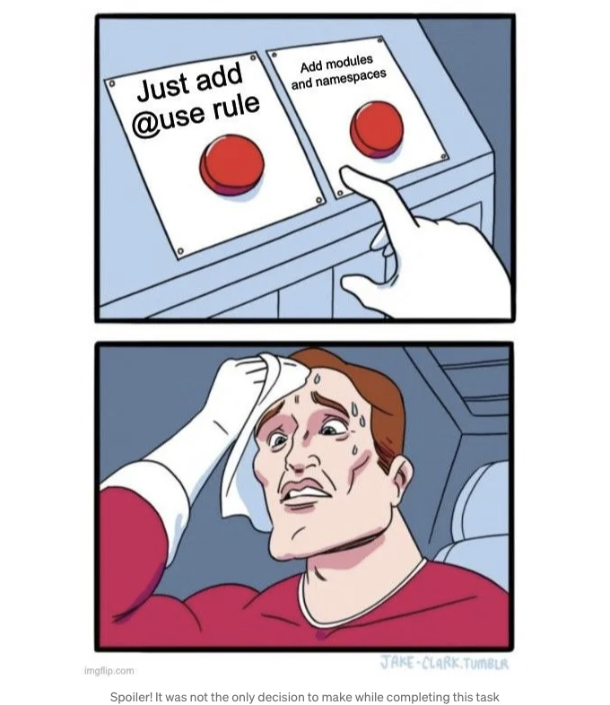
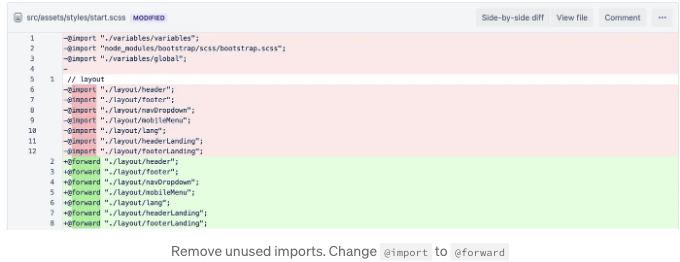
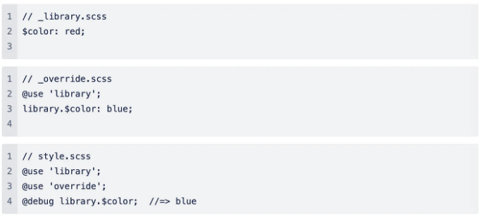
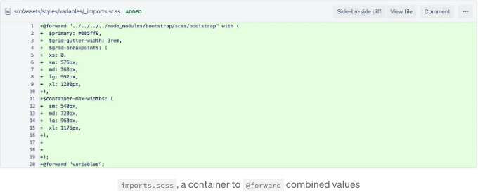
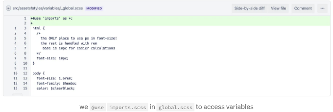
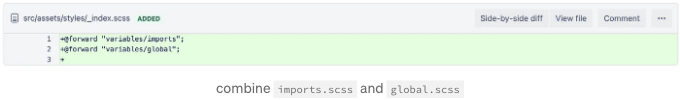
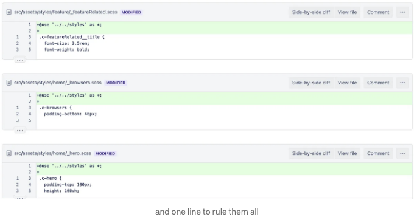
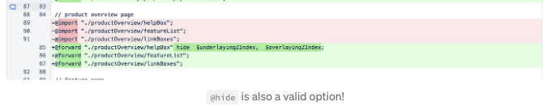
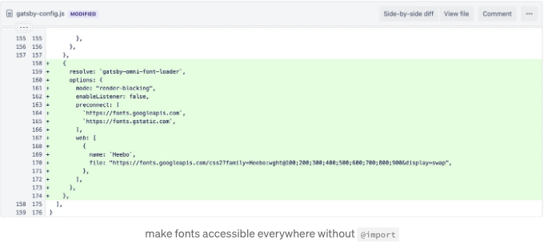
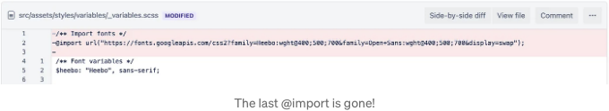

많은 분들이 딜레마를 겪은 적이 있을 것 같아요: "올바르게 하는 방법을 알고 있는데 (그리고 그것을 하는 것이 좋은 이유도 알고 있는데) 그러나 제 상황에서는 거의 의미가 없어요." "규칙은 깨지기 위해 만들어졌다"나 "규칙을 어기는 사람들이 역사를 만든다"와 같은 문구로 당신을 괴롭히지 않겠어요. 스타일 시트 리팩터링에 대한 다른 이론적인 기사를 보완하는 몇 가지 실제적인 예제를 공유하는 것이 더 중요해요.

저는 React로 만든 정적 웹사이트인 프로젝트를 하고 있는데요; 저희는 Gatsby와 Bootstrap을 사용해요. 언급했던 대로, 팀 내에서 그리고 프로젝트 전체적으로 훨씬 더 의미가 있어 보이는 몇 가지 책에 없는 결정을 했어요. 아래에서는 저희 프로젝트를 @import rule에서 퇴출시키기 위해 취한 리팩터링의 첫 번째 단계에 대해 이야기할 거예요. 다른 단계들은 더 이례적인 접근 방법이 훨씬 적었기 때문에 별도의 기사에서 합쳐지고 다루어 집니다.

# @import에서 @use & @forward로 이전하기

공식 문서에 따르면 @import rule에는 몇 가지 문제가 있고, 앞으로 몇 년 안에 사용 중지될 예정입니다. "올바른" 대안은 모듈을 소개하고 @import의 모든 "잘못"을 해결하는 @use rule입니다.

<!-- ui-log 수평형 -->
<ins class="adsbygoogle"
  style="display:block"
  data-ad-client="ca-pub-4877378276818686"
  data-ad-slot="9743150776"
  data-ad-format="auto"
  data-full-width-responsive="true"></ins>
<component is="script">
(adsbygoogle = window.adsbygoogle || []).push({});
</component>

@use, @import, 및 @forward가 SASS에서의 차이에 대해 잘 모르시겠다면, 이 짧은 비디오를 확인해보세요. 더 섬세하게 코드 변경 사항을 따를 수 있습니다.

# 모듈

이 아이디어는 멋지고 명확합니다: 서로 다른 스타일 블록을 격리시켜 동일한 변수 이름을 반복해서 사용할 수 있으며, 훌륭하게 유지할 수 있는 구조가 생깁니다. 그러나, 처음부터 이것을 염두에 두고 있다면 정말 빛을 발합니다. 완전히 작동하는 프로젝트가 있고 겹치는 임포트 및 같은 범위에서 변수 및 브레이크포인트에 접근한다면, 스타일 모듈별로 분리하고 다시 쓰는 것은 꽤 도전적입니다.  

우리는 결정을 내리기로 했습니다: "올바른 방법"으로 모든 것을 처리하고 변수를 부트스트랩 브레이크포인트에서 분리하여 네임스페이스를 통해 액세스하거나, @use 규칙을 사용하여 상태를 그대로 둘 것인지.

<!-- ui-log 수평형 -->
<ins class="adsbygoogle"
  style="display:block"
  data-ad-client="ca-pub-4877378276818686"
  data-ad-slot="9743150776"
  data-ad-format="auto"
  data-full-width-responsive="true"></ins>
<component is="script">
(adsbygoogle = window.adsbygoogle || []).push({});
</component>

"잘못된" 방식에서 얻는 것은 무엇인가요? 되돌릴 수 있을까요?

## 장점:

- 다시 쓸 코드가 적어져서 놀라운 속도와 실수를 줄일 수 있습니다.
- 앞으로 작성해야 할 코드가 적어집니다. 현재로서 변수와 부트스트랩 임포트가 있는 단 한 개의 파일만 있습니다. 특히 이 경우에는 여러 모듈을 추가할 필요가 없습니다.
- 자동완성은 여전히 잘 작동합니다; 여러 달 동안 모듈 없는 작업 흐름에 익숙해진 팀은 새로운 것에 적응할 필요가 없습니다.
- 앞으로 모듈을 분리해야 할 필요가 있으면 그때 추가할 수 있습니다.

<!-- ui-log 수평형 -->
<ins class="adsbygoogle"
  style="display:block"
  data-ad-client="ca-pub-4877378276818686"
  data-ad-slot="9743150776"
  data-ad-format="auto"
  data-full-width-responsive="true"></ins>
<component is="script">
(adsbygoogle = window.adsbygoogle || []).push({});
</component>

## 단점:

- 틀렸어요. @use는 모듈식으로 사용되어야 합니다.
- 겹치는 변수를 관리하기가 더 어려워졌어요.

프로젝트에서 내가 한 변경 사항에 대한 맥락을 알게 되었으니, 이제 그것들을 단계별로 안내해 드릴게요. 만남을 더 이상 미루지 말고 이제 우리 프로젝트에서 이 구식 @import 규칙을 마지막으로 제거해 보겠어요!

# 단계 1: @import를 @forward로 바꿔줘요 만약 데이터가 사용되지 않는다면

<!-- ui-log 수평형 -->
<ins class="adsbygoogle"
  style="display:block"
  data-ad-client="ca-pub-4877378276818686"
  data-ad-slot="9743150776"
  data-ad-format="auto"
  data-full-width-responsive="true"></ins>
<component is="script">
(adsbygoogle = window.adsbygoogle || []).push({});
</component>

과거에는 start.scss 파일이 있었는데, 이 파일은 변수와 부트스트랩을 모두 가져와 모든 스타일에 접근 가능하도록 했습니다. 그런데 start.scss 안에는 아무것도 사용하지 않은 채로, 스타일 시트에 @forward 규칙을 사용하여 해당 스타일을 Layout.tsx에서 액세스할 수 있게 수정했습니다. 또한 JSX에서 부트스트랩 및 변수를 사용하지 않게 되었으므로 해제해야 합니다. 변경 내용은 아래와 같았습니다:

# 단계 2: 재사용 가능한 데이터 흐름 관리 및 한 곳에 넣기

부트스트랩과 변수를 결합하기 위해 새 파일 imports.scss를 생성하고 값들을 사용하지 않을 것이기 때문에 다시 @forward 규칙을 사용했습니다. 즉시 주요 색상 및 다양한 레이아웃 지점과 같은 중복되는 변수 문제에 직면했습니다.

<!-- ui-log 수평형 -->
<ins class="adsbygoogle"
  style="display:block"
  data-ad-client="ca-pub-4877378276818686"
  data-ad-slot="9743150776"
  data-ad-format="auto"
  data-full-width-responsive="true"></ins>
<component is="script">
(adsbygoogle = window.adsbygoogle || []).push({});
</component>

다시 한 번 처리하는 방법은 적어도 두 가지가 있습니다. 권장되는 방법은 문서에 표시되어 있으며 변수를 다시 할당하는 파일을 하나 더 만드는 것을 포함합니다.

이 접근 방식에서 정말 싫어하는 점이 있습니다. 즉, 변수가 어떻게 변하는지 헷갈리지 않도록 파일을 특정한 방식으로 정리해야한다는 점입니다. 모든 변경 사항을 _override.scss에 저장할 수 있지만, 아름다운 with() 구성 옵션이 있기 때문에 굳이 귀찮아할 필요가 있을까요? 저는 이 접근 방식을 선호합니다:

<!-- ui-log 수평형 -->
<ins class="adsbygoogle"
  style="display:block"
  data-ad-client="ca-pub-4877378276818686"
  data-ad-slot="9743150776"
  data-ad-format="auto"
  data-full-width-responsive="true"></ins>
<component is="script">
(adsbygoogle = window.adsbygoogle || []).push({});
</component>

- 우리는 모든 것을 한 곳에 모았어요 — 중첩된 변수가 너무 많지 않다면 유지 관리가 더 쉬워요;
- 추가 파일을 생성하지 않아요 — 이게 프로젝트를 새롭게 시작하는 사람들에게 더 읽기 쉽게 만들어줘요;
- 어디에서 무엇이 수정되었는지 명확히 볼 수 있어요 — 이를 통해 중복 수정이 없다는 것을 보장할 수 있어요.

나는 일종의 컨테이너를 만들었어요. 이 컨테이너는 값을 저장하고 @forward할 수 있는데요, 만약 특정 기본 스타일을 추가하고 @extend 규칙을 통해 접근할 수 있게 하려면 어떻게 해야 할까요? 제가 스크린샷을 주목했다면 이미 무슨 얘기인지 유추할 수 있을 겁니다. 그것은 variables 디렉토리 아래의 global.scss 파일이에요.

모든 이 "표준화" 클래스들을 import에 복사하는 게 왜 좋지 않을까요? 우리는 모듈들을 가장 잘 활용하기 때문이에요: imports.scss와 그 변수들을 "기본" 클래스에서 사용할 수 있어요.

<!-- ui-log 수평형 -->
<ins class="adsbygoogle"
  style="display:block"
  data-ad-client="ca-pub-4877378276818686"
  data-ad-slot="9743150776"
  data-ad-format="auto"
  data-full-width-responsive="true"></ins>
<component is="script">
(adsbygoogle = window.adsbygoogle || []).push({});
</component>

여기 보세요. 우리가 한 일은 무엇인가요? 우리의 코드는 단 한 줄만 바뀌었어요; 변수들을 다시 구성하지 않으려고 * 구문을 사용해서 기본 모듈 이름(디렉토리 이름)을 피했어요.

# 단계 3: 결합된 데이터 쉽게 접근 가능하게 만들기

구현해야 할 마지막 것은 developers가 프로젝트의 나머지 부분을 바꾸지 않고 imports.scss와 global.scss 데이터를 모두 사용할 수 있도록 하는 것입니다.

<!-- ui-log 수평형 -->
<ins class="adsbygoogle"
  style="display:block"
  data-ad-client="ca-pub-4877378276818686"
  data-ad-slot="9743150776"
  data-ad-format="auto"
  data-full-width-responsive="true"></ins>
<component is="script">
(adsbygoogle = window.adsbygoogle || []).push({});
</component>

저는 모든 스타일 시트가 위치하는 styles 디렉토리 아래에 _index.scss를 생성했습니다. 이렇게 함으로써 나머지 스타일에 매우 간단한 추가를 할 수 있었고, 정확히 한 줄을 복사했습니다.

# 단계 4: @forward를 이용한 보너스 챌린지

<!-- ui-log 수평형 -->
<ins class="adsbygoogle"
  style="display:block"
  data-ad-client="ca-pub-4877378276818686"
  data-ad-slot="9743150776"
  data-ad-format="auto"
  data-full-width-responsive="true"></ins>
<component is="script">
(adsbygoogle = window.adsbygoogle || []).push({});
</component>

만약 당신이 단계 1이 순조롭다고 생각했다면, 아니었어요. 음, 완전히 순조롭지는 않았어요. 우리 프로젝트에서는 모든 스타일을 결합하는 start.scss와 같은 파일이 필요했어요. 당연히 그런 상황에서는 스타일 시트의 지역 변수가 서로 겹치게 되었죠. 하지만 그것들을 재할당하길 원하지 않았어요. “올바른” 방법은 다시 말하지만 각 스타일 시트마다 지역 변수와 @use 변수를 사용하도록 별도의 파일을 만들어야 했어요. 멋지고 좋은 방법이긴 하지만, 너무 많은 작업이 필요했는데 완전히 필요 없는 작업이었어요. 보여줄게요.

@import를 @forward로 변경한 파일 전체에서 충돌이 발생한 경우는 한 곳뿐이었어요. 기술적으로 둘이긴 했지만, 한 파일 내에서 발생했어요. 그리고 SASS에서 가시성을 제어할 수 있는 옵션이 있기 때문에 그걸 사용했어요. 따라서 깔끔하고 멋진 아키텍처적인 해결책에 반대했어요. 왜냐하면 많은 중첩이 발생한다면 별도의 파일을 만들어야 하고, 이 구조적 변경이 미적으로 더 멋지게 만드는 데에 굉장한 부하를 초래할 것이기 때문이죠.

# 단계 5: 마지막 @import 제거

<!-- ui-log 수평형 -->
<ins class="adsbygoogle"
  style="display:block"
  data-ad-client="ca-pub-4877378276818686"
  data-ad-slot="9743150776"
  data-ad-format="auto"
  data-full-width-responsive="true"></ins>
<component is="script">
(adsbygoogle = window.adsbygoogle || []).push({});
</component>

여기서 다시 말씀드리겠습니다: "집중력을 낭비하지 마세요; 목표를 기억하세요". 우리는 @import 규칙을 @use와 @forward로 대체하기 위해 스타일 시트를 리팩토링해야 합니다. 이것이 우리의 주요 목표이며, 우리는 성공했습니다. 그러나! 우리는 variables.scss에서 외부 글꼴을 사용하고 @use로는 이를 할 수 없습니다.

@import url("https://fonts.googleapis.com/css2?family=Heebo:wght@400;500;700&family=Open+Sans:wght@400;500;700&display=swap");

모든 작업이 끝나고 굉장히 작은 문제이기 때문에 초기 범위에서 조금 벗어나볼 수도 있습니다. 우리는 Gatsby를 사용하므로, 그들의 해결책을 구글링해보았고 우리 목적에 정확히 맞는 멋진 패키지를 발견했습니다: "gatsby-omni-font-loader": "^2.0.2". 이를 사용하려면, plugins 배열 안에 gatsby-config.js에 구성 객체를 추가해야 합니다.

<!-- ui-log 수평형 -->
<ins class="adsbygoogle"
  style="display:block"
  data-ad-client="ca-pub-4877378276818686"
  data-ad-slot="9743150776"
  data-ad-format="auto"
  data-full-width-responsive="true"></ins>
<component is="script">
(adsbygoogle = window.adsbygoogle || []).push({});
</component>

프로젝트에서 마지막 @import를 제거하고 기존 작업 흐름을 방해하지 않기 위해 글꼴 변수를 남겨두면 됩니다.

# 결론

몇 가지 실천 방법은 너무 우수해서 "최상의 실천 방법"으로 불립니다. 그러나 이것들이 보편적인 것일까요? 그렇지 않아요. "이상적인 아키텍처"나 "깔끔한 코드"를 갖는 것은 정말로 좋지만, 이를 가능하게 하려면 얼마나 많은 요소가 결합되어야 할까요? 현실에서는 빠른 제공과 유지보수의 쉬움 사이의 균형을 찾아야 합니다.

<!-- ui-log 수평형 -->
<ins class="adsbygoogle"
  style="display:block"
  data-ad-client="ca-pub-4877378276818686"
  data-ad-slot="9743150776"
  data-ad-format="auto"
  data-full-width-responsive="true"></ins>
<component is="script">
(adsbygoogle = window.adsbygoogle || []).push({});
</component>

우리의 목표는 적응하고 전달하는 것이며 "만약" 가지를 이상화하지 않는 것입니다. 각 결정이 결과로 이어진다는 것을 인식하세요. 하지만 예측 가능한 한 cool 하게 행동해요. 그래서 용감하게 "잘못된" 방식으로 일을 처리해보세요. 단, 규칙을 어기는 이유를 정당화할 수 있다면요.