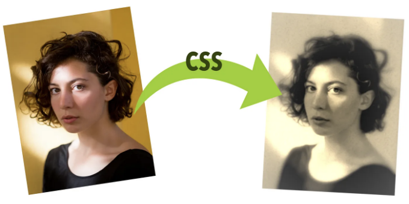
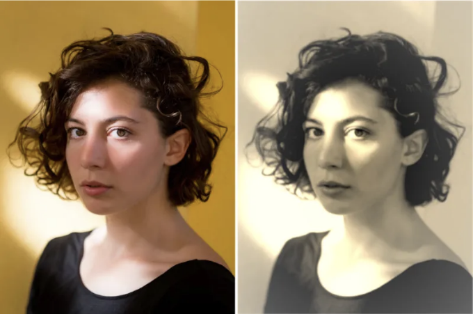
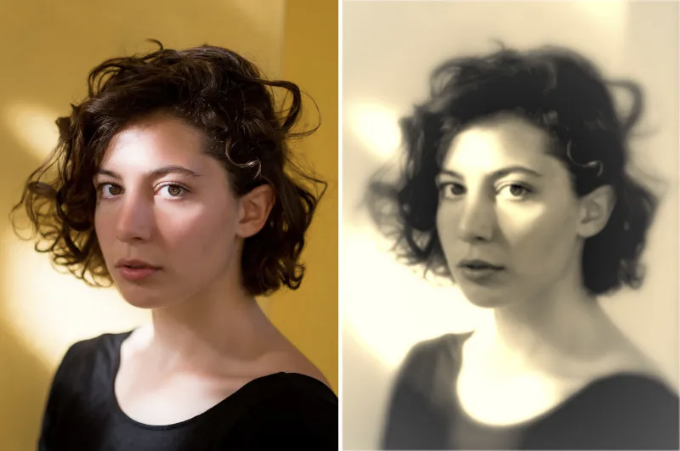
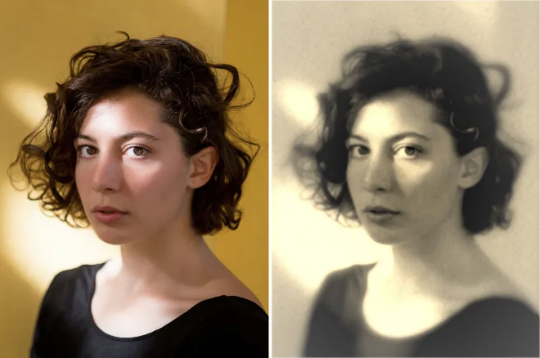
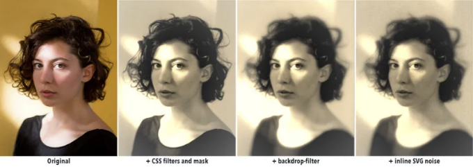
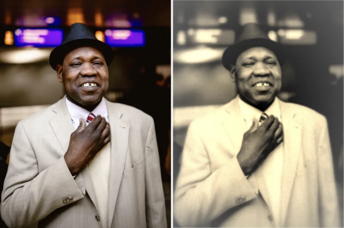
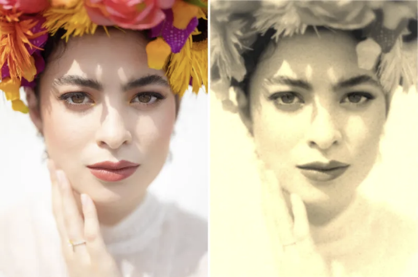
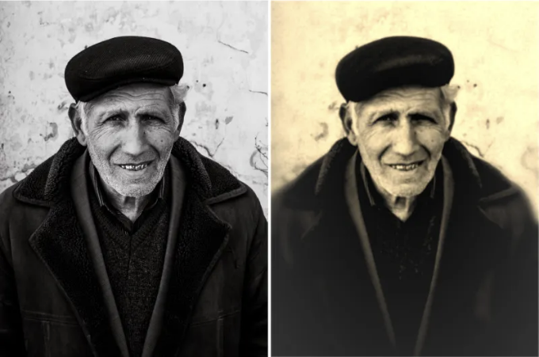
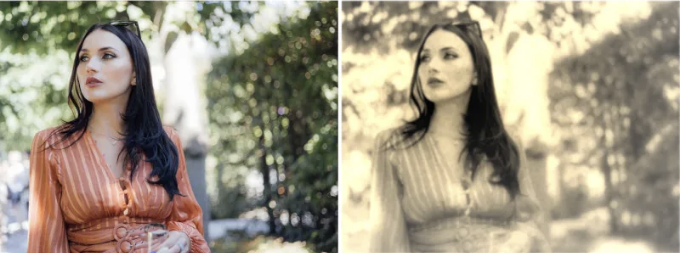
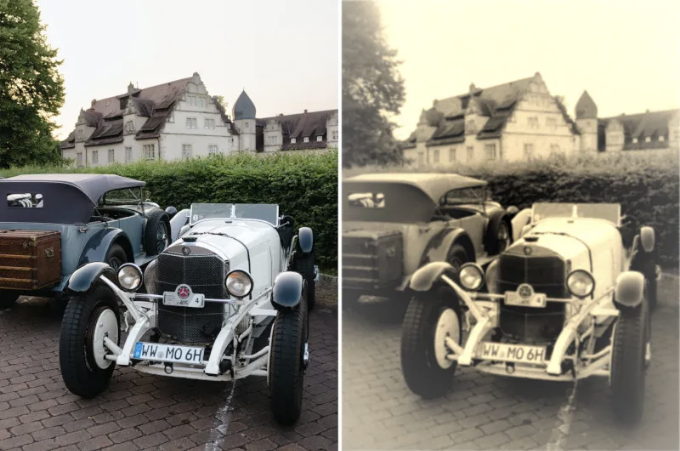

안녕하세요! 이 글은 CSS만을 사용하여 어떤 사진에도 오래된 사진 효과를 만드는 방법에 대해 제시합니다. 포토샵이나 다른 이미지 편집기가 필요 없어요. 심지어 몇 줄의 코드로 모든 것을 완성할 수 있습니다!

우리는 서로 연결되는 세 가지 다른 방법을 살펴볼 거에요. 각각의 반복에서 오래된 사진 효과를 증가시켜 실제같고 멋진 모습으로 만들어보겠어요.

이 페이지의 예시에는 필립 로만옵스키의 사진을 사용할 거에요. 필립의 작품과 더불어 다른 많은 작가들의 놀라운 사진들도 Unsplash에서 만나볼 수 있습니다.

<!-- ui-log 수평형 -->
<ins class="adsbygoogle"
  style="display:block"
  data-ad-client="ca-pub-4877378276818686"
  data-ad-slot="9743150776"
  data-ad-format="auto"
  data-full-width-responsive="true"></ins>
<component is="script">
(adsbygoogle = window.adsbygoogle || []).push({});
</component>

# 이미지 태그 사용하기

오래된 사진 효과를 만드는 가장 기본적인 방법은 `img` 태그에 이미지에 필터를 직접 적용하는 것입니다. 이 방법은 빠르고 효과는 좋지만 결과물이 너무 기본적일 수 있습니다.

HTML에서 이미지로 시작해볼까요:

```js

```

<!-- ui-log 수평형 -->
<ins class="adsbygoogle"
  style="display:block"
  data-ad-client="ca-pub-4877378276818686"
  data-ad-slot="9743150776"
  data-ad-format="auto"
  data-full-width-responsive="true"></ins>
<component is="script">
(adsbygoogle = window.adsbygoogle || []).push({});
</component>

그럼 CSS에 몇 가지 필터를 적용하고 간단한 마스크를 만들어보겠습니다:

```js
img {
  filter: grayscale(1) blur(1px) contrast(1.2) sepia(1);
  -webkit-mask: radial-gradient(#000, #0009);
}
```

하나씩 각 필터가 무엇을 하는지 살펴볼까요:

- grayscale(1): 이미지를 그레이 스케일로 변환합니다. 이렇게 하면 어떤 영역들을 유사한 회색톤으로 섞어서 일부 세부사항을 잃게 만듭니다.
- blur(1px): 이미지에 가우시안 블러를 적용합니다. 이렇게 하면 색 영역을 결합시키고 더 많은 세부사항을 잃게 합니다.
- contrast(1.2): 이미지의 대조를 강조합니다. 값을 조정하여 우리가 원하는 대로 조정하고 각 이미지에 맞게 개인화할 수 있습니다. 하지만 조절 값을 너무 높게 하거나 너무 낮게 하면 이상해 보일 수 있습니다.
- sepia(1): 이미지의 색상을 올드 포토 세피아 톤으로 변환합니다.

<!-- ui-log 수평형 -->
<ins class="adsbygoogle"
  style="display:block"
  data-ad-client="ca-pub-4877378276818686"
  data-ad-slot="9743150776"
  data-ad-format="auto"
  data-full-width-responsive="true"></ins>
<component is="script">
(adsbygoogle = window.adsbygoogle || []).push({});
</component>

또 다른 라인을 웹킷 마스크에 추가할 수도 있습니다. 예전 사진은 중앙이 더 집중되어 있는 것처럼 보이지만, 이후 색상이 사라지고 가장자리가 조금 흐릿해지면서 저하됩니다. 이를 CSS에 마스크를 적용하여 구현할 수 있습니다. 불행히도 마스크는 모든 브라우저에서 지원되지 않지만... 다행히도 벤더 접두사는 있습니다! 따라서 -webkit-mask를 사용하여 동일한 효과를 적용할 수 있습니다.

-webkit-mask: radial-gradient(#000, #0009)으로 이미지의 가장자리를 반투명하게 만들어줍니다(중앙에 완전히 투명한 타원을 사용하여 외부로 향해 점점 사라지는 것), 그래서 사진이 배경과 어우러져 흐려지고 같아집니다. 배경의 색에 따라 다른 결과가 나타날 수 있음을 주목하세요!

이 네 줄의 CSS를 적용하면 오래된 사진 효과를 얻을 수 있습니다. 원본과 결과 사진을 비교한 것이 여기 있습니다:

<!-- ui-log 수평형 -->
<ins class="adsbygoogle"
  style="display:block"
  data-ad-client="ca-pub-4877378276818686"
  data-ad-slot="9743150776"
  data-ad-format="auto"
  data-full-width-responsive="true"></ins>
<component is="script">
(adsbygoogle = window.adsbygoogle || []).push({});
</component>



나쁘지 않네요, 하지만 한 단계 더 나아갈 수 있어요.

# 가상 요소 추가

하나의 `img` 태그를 사용하는 경우 이미지에 ::before 또는 ::after와 같은 가상 요소가 없기 때문에 요소에 적용할 수 있는 효과가 제한됩니다. 대신 `div`를 사용하고 이미지를 배경으로 추가하면 가상 요소에 필터와 마스크를 적용하여 더 정확한 효과를 얻을 수 있습니다.

<!-- ui-log 수평형 -->
<ins class="adsbygoogle"
  style="display:block"
  data-ad-client="ca-pub-4877378276818686"
  data-ad-slot="9743150776"
  data-ad-format="auto"
  data-full-width-responsive="true"></ins>
<component is="script">
(adsbygoogle = window.adsbygoogle || []).push({});
</component>

`img /` 태그로 비슷한 결과를 얻는 것은 간단합니다. HTML은 다음과 같이 보일 것입니다:

```js
<div class="old-style-photo demo-image"></div>
```

그런 다음 CSS에서 우리는 이 요소를 사용하여 이전 스타일의 사진을 표시할 것입니다. 이전 섹션과 마찬가지로 할 것이지만, 크기와 이미지를 배경으로 설정해야 합니다:

```js
/* 데모 이미지에만 적용 */
.demo-image {
  width: 45vw;
  aspect-ratio: 3/4;
  background: url(link-to-image.jpg);
  background-size: cover;
}

/* 가상 요소와 오래된 사진 효과에 필요 */
.old-style-photo {
  position: relative;
  filter: grayscale(1) blur(1px) contrast(1.2) sepia(1) blur(0.25px);
  -webkit-mask: radial-gradient(#000, #000a);
}
```

<!-- ui-log 수평형 -->
<ins class="adsbygoogle"
  style="display:block"
  data-ad-client="ca-pub-4877378276818686"
  data-ad-slot="9743150776"
  data-ad-format="auto"
  data-full-width-responsive="true"></ins>
<component is="script">
(adsbygoogle = window.adsbygoogle || []).push({});
</component>

그렇게 함으로써, 이전 섹션에서와 동일한 효과를 얻을 수 있습니다. 이미지의 가장자리를 흐리게 하는 것은 오래된 사진에서 흔한 현상입니다. 이를 위해 우리는 다시 마스크를 사용할 것입니다. 중심에서 가장자리 방향으로의 또 다른 원형 그라디언트인데, 이번에는 반대 방향으로 되겠습니다: 중앙에서 숨겨지고 끝에서 보이도록 설정됩니다. 이렇게 하면 이미지 자체에 백드롭 필터 효과를 적용할 수 있습니다.

백드롭 필터를 사용하면 요소 뒤의 영역에 필터를 적용할 수 있습니다. 중앙 부분이 마스크로 잘린 상태이기 때문에 필터는 이미지의 중앙 부분에는 적용되지 않고, 오직 가시 영역과 마스크에 따라 가시도가 조절됩니다. 예를 들어 blur() 백드롭 필터를 적용하면 가장자리가 완전히 가시적인 부분보다 중앙 부분이 덜 흐릿하게 처리됩니다.

```js
.old-style-photo::before {
  content: "";
  position: absolute;
  width: 100%;
  height: 100%;
  -webkit-mask: radial-gradient(farthest-side, #0000 30%, #000);
  backdrop-filter: blur(5px) sepia(90%);
}
```

결과 이미지는 가장자리 주변이 더 흐리게 처리되며, 더 많은 세피아가 추가되었습니다(따라서 색상이 더 조화롭게 결합됩니다):

<!-- ui-log 수평형 -->
<ins class="adsbygoogle"
  style="display:block"
  data-ad-client="ca-pub-4877378276818686"
  data-ad-slot="9743150776"
  data-ad-format="auto"
  data-full-width-responsive="true"></ins>
<component is="script">
(adsbygoogle = window.adsbygoogle || []).push({});
</component>



# 인라인 SVG 블렌딩

언제나 몇몇 사람들이 이것이 "순수한 CSS 솔루션이 아니다"라고 말하는 경우가 있을 수 있습니다 (저는 그것이라고 주장한 적이 없습니다), 이 섹션을 부정하는 경우도 있습니다. 대신에, 우리는 "CSS가 제공하는 모든 기능을 활용하는" 것으로 보고 이것을 우리의 승리로 삼을 것입니다.

맞아요. 이 마지막 단계에는 약간의 SVG가 포함됩니다. 사실은 CSS에는 필터가 있지만, SVG의 필터가 그것보다 다양하고 고급스럽지는 않습니다. 우리에게 다행히도, 두 기술을 비교적 쉬운 방법으로 결합할 수 있습니다.

<!-- ui-log 수평형 -->
<ins class="adsbygoogle"
  style="display:block"
  data-ad-client="ca-pub-4877378276818686"
  data-ad-slot="9743150776"
  data-ad-format="auto"
  data-full-width-responsive="true"></ins>
<component is="script">
(adsbygoogle = window.adsbygoogle || []).push({});
</component>

한 가지 방법은 HTML에 인라인 SVG를 추가하고 CSS에서 참조하는 것입니다. 또 다른 방법으로는 HTML 쪽에 아무것도 추가하지 않고 CSS에서 SVG를 직접 인라인하는 것입니다. 이는 데이터 URI와 url() 함수를 결합하여 배경으로 SVG를 추가함으로써 가능합니다:

```js
data:[<mime 타입>][;charset=<문자셋>][;base64],<인코딩된 데이터>
```

우리의 경우, base64 인코딩을 할 필요조차 없습니다. 간단한 SVG이기 때문에 데이터 URI에 그냥 텍스트로 넣을 수 있습니다:

```js
<svg xmlns='http://www.w3.org/2000/svg' width='100' height='100'>
  <filter id='noise' x='0%' y='0%' width='100%' height='100%'>
    <feTurbulence baseFrequency='0.5' />
  </filter>
  <rect x='0' y='0' width='100%' height='100%' filter='url(#noise)' />
</svg>
```

<!-- ui-log 수평형 -->
<ins class="adsbygoogle"
  style="display:block"
  data-ad-client="ca-pub-4877378276818686"
  data-ad-slot="9743150776"
  data-ad-format="auto"
  data-full-width-responsive="true"></ins>
<component is="script">
(adsbygoogle = window.adsbygoogle || []).push({});
</component>

필요한 건 #을 주의깊게 다루는 것 뿐입니다. #은 URL 인코딩되어 %23으로 대체되어야 합니다. 그런 다음 해당 속성을 ::after 의 가상 요소에 적용합니다:

```js
.old-style-photo::after {
  content: "";
  position: absolute;
  width: 100%;
  height: 100%;
  opacity: 0.6;
  background:
    url("data:image/svg+xml;utf8,<svg xmlns='http://www.w3.org/2000/svg' width='100' height='100'><filter id='noise' x='0%' y='0%' width='100%' height='100%'><feTurbulence baseFrequency='0.5' /></filter><rect x='0' y='0' width='100%' height='100%' filter='url(%23noise)' /></svg>"), #f003;
  filter: grayscale(100%) contrast(150%);
  mix-blend-mode: darken;
}
```

잡음 자체에는 다양한 색상이 있지만, 우리가 부모에 적용한 몇 가지 색상 필터로 인해 이제 단색입니다. 그럼에도 불구하고 추가 필터(필수 아님) 및 원본 사진과 더 잘 혼합되도록 블렌드 모드를 적용할 수 있습니다. mix-blend-mode의 다른 값들을 사용해보는 걸 적극 권장합니다. darken 및 multiply 값은 우리가 원하는 효과에 좋은 결과를 낳지만 다른 값들로도 시도해보는 걸 권합니다.

결과는 이전과 동일한 이미지지만, 이제 오래된 사진 이미지에 더 많은 현실감을 더해주는 골반/잡음 효과가 있습니다:

<!-- ui-log 수평형 -->
<ins class="adsbygoogle"
  style="display:block"
  data-ad-client="ca-pub-4877378276818686"
  data-ad-slot="9743150776"
  data-ad-format="auto"
  data-full-width-responsive="true"></ins>
<component is="script">
(adsbygoogle = window.adsbygoogle || []).push({});
</component>



# 결론

이 글에서는 외부 파일에 의존하지 않고 CSS(그리고 작은 인라인 SVG)만을 사용하여 단계별로 오래된 사진 효과를 만드는 방법을 살펴보았습니다. 모든 코드가 독립적이며 우리가 원하는 수준에서 원하는 효과를 달성하는 데 적용될 수 있습니다:



<!-- ui-log 수평형 -->
<ins class="adsbygoogle"
  style="display:block"
  data-ad-client="ca-pub-4877378276818686"
  data-ad-slot="9743150776"
  data-ad-format="auto"
  data-full-width-responsive="true"></ins>
<component is="script">
(adsbygoogle = window.adsbygoogle || []).push({});
</component>

필터 및 마스크값을 변경하면 완전히 다른 이미지가 생성됩니다. 코드를 다운로드하여 로컬에서 시도해보거나 CodePen에서 이 데모를 사용해보세요:

# 더 많은 예시

이 효과가 일반적으로 작동하는 것을 보여주기 위해 데모 이미지에 특정한 것이 아니라는 것을 입증하기 위해 몇 가지 사진에도 적용해 보았습니다(Unsplash의 Filipp Romanovski가 찍은 모든 원본 이미지):



<!-- ui-log 수평형 -->
<ins class="adsbygoogle"
  style="display:block"
  data-ad-client="ca-pub-4877378276818686"
  data-ad-slot="9743150776"
  data-ad-format="auto"
  data-full-width-responsive="true"></ins>
<component is="script">
(adsbygoogle = window.adsbygoogle || []).push({});
</component>





우리는 방사형 그라데이션의 중심을 더 중요하다고 생각하는 영역에 초점을 맞출 수 있습니다. 예를 들어, 이 사진에서는 그라데이션의 중심이 얼굴에 더 가까운 위치에 있습니다:



<!-- ui-log 수평형 -->
<ins class="adsbygoogle"
  style="display:block"
  data-ad-client="ca-pub-4877378276818686"
  data-ad-slot="9743150776"
  data-ad-format="auto"
  data-full-width-responsive="true"></ins>
<component is="script">
(adsbygoogle = window.adsbygoogle || []).push({});
</component>

사람들의 사진을 사용하면 효과가 더 좋아요. 그러나 사람이 없어도 작동합니다. 특히 사진의 주제가 옛날 물건인 경우 효과가 특히 좋아요:

