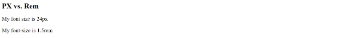
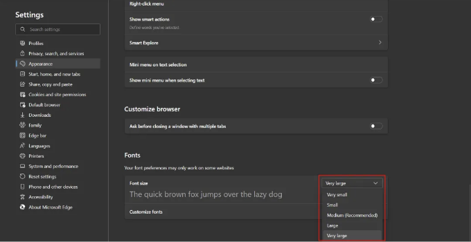
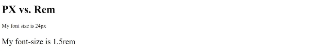
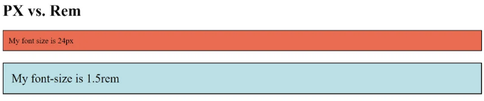

CSS에는 선택할 수있는 다양한 단위가 있습니다. 많은 경우, 다른 것보다 더 나은 단위가 있습니다.

그러나 제 경력 동안 자주 물어보는 질문 중 하나는 명확한 차이가 없는 특정 속성에서 픽셀(pixels) 또는 렘(rem)을 사용해야 하는지에 대한 것입니다.

오늘은 그 질문에 대한 답을 드리겠습니다.

<!-- ui-log 수평형 -->
<ins class="adsbygoogle"
  style="display:block"
  data-ad-client="ca-pub-4877378276818686"
  data-ad-slot="9743150776"
  data-ad-format="auto"
  data-full-width-responsive="true"></ins>
<component is="script">
(adsbygoogle = window.adsbygoogle || []).push({});
</component>

# 설정

가정해봅시다. 매우 기본적인 HTML 페이지가 두 단락을 포함하고 있습니다. 하나는 픽셀로 크기를 조정하고 다른 하나는 rems로 크기를 조정합니다:

```js
<!DOCTYPE html>
<html>
<body>
  <h1>PX vs. Rem</h1>
  <p style="font-size: 24px;">My font size is 24px</p>
  <p style="font-size: 1.5rem;">My font-size is 1.5rem</p>
</body>
</html>
```



<!-- ui-log 수평형 -->
<ins class="adsbygoogle"
  style="display:block"
  data-ad-client="ca-pub-4877378276818686"
  data-ad-slot="9743150776"
  data-ad-format="auto"
  data-full-width-responsive="true"></ins>
<component is="script">
(adsbygoogle = window.adsbygoogle || []).push({});
</component>

픽셀은 절대 단위이기 때문에 글ꔀ 크기를 24픽셀로 설정하면 정확히 24픽셀이 됩니다. 반면에 렘은 상대적인 단위로 문서의 글ꔀ 크기를 기준으로 합니다. 문서의 기본 글ꔀ 크기는 16픽셀이므로 1.5렘 x 16픽셀은 24픽셀과 동일합니다.

렘은 상대적이고 기본값이 16픽셀이기 때문에 픽셀보다 사용하기 어렵습니다. 그래서 대부분의 경우 픽셀을 사용하는 것을 더 많이 볼 수 있어요. 하지만 저는 그게 잘못된 선택이라고 생각해요.

# 좀 문제야

과거에는 레티나 또는 고밀도 디스플레이가 픽셀과 픽셀 밀도에 어떤 영향을 미치는지에 대한 혼란이 있었습니다. 너무 깊게 들어가지 않더라도, 픽셀이 이상하게 확대되는 순간이 있었지만 그 문제는 해결되었습니다.

<!-- ui-log 수평형 -->
<ins class="adsbygoogle"
  style="display:block"
  data-ad-client="ca-pub-4877378276818686"
  data-ad-slot="9743150776"
  data-ad-format="auto"
  data-full-width-responsive="true"></ins>
<component is="script">
(adsbygoogle = window.adsbygoogle || []).push({});
</component>

그 문제가 해결되었으니, 계속해서 보게 되는 논점 중 하나는 브라우저를 확대 또는 축소하여 글꼴 크기를 조절할 수 있기 때문에 픽셀 크기와 rem 크기가 동일한 비율로 커진다는 것입니다.

결과적으로 어떤 사람들은 더 이상 픽셀이나 rem을 사용하는 것이 중요하지 않다고 말합니다.

하지만, 그렇지 않습니다!

# 진짜 문제

<!-- ui-log 수평형 -->
<ins class="adsbygoogle"
  style="display:block"
  data-ad-client="ca-pub-4877378276818686"
  data-ad-slot="9743150776"
  data-ad-format="auto"
  data-full-width-responsive="true"></ins>
<component is="script">
(adsbygoogle = window.adsbygoogle || []).push({});
</component>

이 문제는 실제로 CSS 단위가 브라우저 설정에 어떻게 반응하는지와 관련이 있어요. 사용자들은 브라우저 설정으로 가서 브라우저의 기본 글꼴 크기를 수정할 수 있어요.



시각 장애가 있는 사용자들에게는 정말 좋은 기능이에요.

하지만, 브라우저를 확인하면, 절대 단위가 24픽셀인 단락은 사용자의 설정에 상관없이 계속해서 24픽셀로 유지될 거에요. 반면에 상대적 단위는 브라우저의 기본 설정에 따라 커질 거에요.

<!-- ui-log 수평형 -->
<ins class="adsbygoogle"
  style="display:block"
  data-ad-client="ca-pub-4877378276818686"
  data-ad-slot="9743150776"
  data-ad-format="auto"
  data-full-width-responsive="true"></ins>
<component is="script">
(adsbygoogle = window.adsbygoogle || []).push({});
</component>



그래서 이것은 정말로 접근성에 관한 문제입니다.

따라서 글꼴 크기를 정의할 때마다 절대(또는 상대적으로?) rems를 사용해야 합니다.

# 뉴안스

<!-- ui-log 수평형 -->
<ins class="adsbygoogle"
  style="display:block"
  data-ad-client="ca-pub-4877378276818686"
  data-ad-slot="9743150776"
  data-ad-format="auto"
  data-full-width-responsive="true"></ins>
<component is="script">
(adsbygoogle = window.adsbygoogle || []).push({});
</component>

물론, 웹 개발에 관한 이야기인만큼 논의가 다층적입니다. 예를 들어, 여백(padding)과 테두리(border)와 같은 다른 속성은 어떻게 될까요?

```js
<!DOCTYPE html>
<html>
<body>
  <h1>PX vs. Rem</h1>
  <p style="
    font-size: 24px;
    padding: 16px;
    border: 2px solid;
    background: tomato;
  ">
    제 폰트 크기는 24px입니다
  </p>
  <p style="
    font-size: 1.5rem;
    padding: 1rem;
    border: .125rem solid;
    background: powderblue;
  ">
    제 폰트 크기는 1.5rem입니다
  </p>
</body>
</html>
```

이 예시에서는 폰트 크기 이외에도 여백과 테두리 너비에 대해 픽셀 대 rem을 비교해볼 것입니다.



<!-- ui-log 수평형 -->
<ins class="adsbygoogle"
  style="display:block"
  data-ad-client="ca-pub-4877378276818686"
  data-ad-slot="9743150776"
  data-ad-format="auto"
  data-full-width-responsive="true"></ins>
<component is="script">
(adsbygoogle = window.adsbygoogle || []).push({});
</component>

당신이 예상했던 대로, 두 번째 단락은 큰 폰트 크기에 더한 큰 패딩과 테두리 폭을 가지고 있습니다. 왜냐하면 rem 단위는 브라우저 설정과 함께 확장되기 때문입니다.

그리고 이것이 대화의 "이것에 따라 다름"으로 이어집니다. 패딩과 테두리 폭은 실제로 접근성과 엄격하게 관련이 없습니다. 그래서 당신은 사용자가 설정을 변경할 경우 패딩이나 테두리 폭 또는 다른 속성을 rem으로 설정하고 확장되길 원하시나요?

그것은 당신의 선택이에요 ¯\_(ツ)_/¯

미디어 쿼리나 컨테이너 쿼리를 소개하면 더 혼란스러워집니다. 설명하기가 매우 복잡하지만, 기본적으로 만약 당신의 글꼴이 브라우저 설정과 함께 확장된다면, 아마도 미디어 쿼리가 반응하길 원할 것입니다. 이는 REM(또는 EM) 단위로 정의해야 한다는 것을 의미합니다.

<!-- ui-log 수평형 -->
<ins class="adsbygoogle"
  style="display:block"
  data-ad-client="ca-pub-4877378276818686"
  data-ad-slot="9743150776"
  data-ad-format="auto"
  data-full-width-responsive="true"></ins>
<component is="script">
(adsbygoogle = window.adsbygoogle || []).push({});
</component>

물론, 그 안에는 많은 요소들이 작용하고 따라서 지나치게 복잡해지고 싶지는 않아요. 다행히도, 2016년에 Zell Liew가 쓴 “PX, EM 또는 REM 미디어 쿼리”라는 질문을 다룬 기사가 있었어요.

그 기사의 결론은 EM 단위와 REM 단위가 픽셀 단위보다 미디어 쿼리에 더 나을 것이라고 말했어요. 왜냐하면 EM 단위는 부모 요소를 기반으로 하지만 미디어 쿼리는 루트 스타일에 영향을 미치기 때문에 EM과 REM은 거의 같다고 했어요.

유일한 차이점은 Safari에서 REM 단위에 버그가 있었기 때문에 EM이 조금 더 일관성 있었지만, 그 버그는 수정됐을 거라고 생각해요. 그래서 나는 REM을 사용하는 게 좋을 것 같아요.

# 간단한 답변

<!-- ui-log 수평형 -->
<ins class="adsbygoogle"
  style="display:block"
  data-ad-client="ca-pub-4877378276818686"
  data-ad-slot="9743150776"
  data-ad-format="auto"
  data-full-width-responsive="true"></ins>
<component is="script">
(adsbygoogle = window.adsbygoogle || []).push({});
</component>

그 질문에 대한 마지막으로 확실한 답을 해드리면, 픽셀이나 렘 중 어느 것을 사용해야 하는지에 대한 짧은 대답은...

그냥 렘을 사용하세요!

물론 세부 사항이 있습니다. 물론 예외 사항이 있습니다. 물론 실제로 픽셀이 더 나은 경우도 있을 것입니다.

(실제로 다양한 브라우저 설정에서 애플리케이션을 테스트해 보고 결정하는 것이 좋습니다).

<!-- ui-log 수평형 -->
<ins class="adsbygoogle"
  style="display:block"
  data-ad-client="ca-pub-4877378276818686"
  data-ad-slot="9743150776"
  data-ad-format="auto"
  data-full-width-responsive="true"></ins>
<component is="script">
(adsbygoogle = window.adsbygoogle || []).push({});
</component>

하지만

Rem은 글꼴 크기에 더 액세스하기 쉬워요.

Rem은 (아마도) 미디어 쿼리에 더 좋아요.

그리고 저는 가끔 예외를 두고 한 가지 간단한 규칙을 따르는 것이 혼합하는 것보다 더 쉽다고 생각해요.

<!-- ui-log 수평형 -->
<ins class="adsbygoogle"
  style="display:block"
  data-ad-client="ca-pub-4877378276818686"
  data-ad-slot="9743150776"
  data-ad-format="auto"
  data-full-width-responsive="true"></ins>
<component is="script">
(adsbygoogle = window.adsbygoogle || []).push({});
</component>

하루가 끝나갈 때쯤, 모든 것이 사용자의 브라우저 설정에 따라 어떻게 확장되어야 하는지에 따라 다르기 때문에 당신에게는 큰 영향을 미치지 않을 수도 있습니다. 그러나 나에게는 모든 것이 동일한 비율로 확대 또는 축소되는 것이 합리적으로 보입니다.

만약 다르게 생각하거나 대화에 기여하고 싶다면, 당신의 생각을 듣고 싶습니다.

독서해 주셔서 감사합니다. 이 글이 마음에 드셨다면 공유해 주세요. 저를 지원하는 가장 좋은 방법 중 하나입니다. 새 글이 게시될 때를 알고 싶다면 뉴스레터를 구독하거나 트위터에서 팔로우해 주세요.

austingil.com에서 원문 발표된 내용입니다.