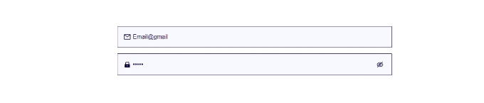

## 사용자 정의 입력과 버튼을 활용한 양식 디자인 최적화


온라인 애플리케이션과 웹사이트는 사용자가 시스템과 데이터를 입력하기 위한 방법을 제공하기 때문에 양식이 필요합니다. 그러나 기본적인 양식 요소는 디자인과 기능 측면에서 제약이 있을 수 있으며, 이는 사용자 경험에 부정적인 영향을 미칠 수 있습니다.

여기서 사용자 정의 입력 디자인이 중요합니다. 양식에 대한 사용자 정의 입력과 버튼을 디자인함으로써 사용자 경험을 개선하고 보다 매력적이고 직관적인 인터페이스를 만들 수 있습니다. 사용자 정의 입력과 버튼을 통해 웹사이트나 애플리케이션의 브랜딩에 맞는 디자인을 수정하고, 사용자가 양식 작성 프로세스를 보다 원활하게 진행할 수 있도록 지원할 수 있습니다.

<!-- ui-log 수평형 -->
<ins class="adsbygoogle"
  style="display:block"
  data-ad-client="ca-pub-4877378276818686"
  data-ad-slot="9743150776"
  data-ad-format="auto"
  data-full-width-responsive="true"></ins>
<component is="script">
(adsbygoogle = window.adsbygoogle || []).push({});
</component>

이 글에서는 React 양식을 위해 재사용 가능한 사용자 정의 입력란과 버튼을 만들 것입니다. 주요 목표는 아이콘이 포함된 입력란과 비밀번호 필드 및 텍스트 값을 볼 수 있는 토글 버튼을 만드는 것입니다.

최종 결과물은 다음과 같이 보일 것입니다:



그리고 "눈" 버튼을 클릭하면 입력의 상태가 "비밀번호"에서 "텍스트"로 토글되어 사용자가 어떤 값을 보고 있는지 볼 수 있습니다.

<!-- ui-log 수평형 -->
<ins class="adsbygoogle"
  style="display:block"
  data-ad-client="ca-pub-4877378276818686"
  data-ad-slot="9743150776"
  data-ad-format="auto"
  data-full-width-responsive="true"></ins>
<component is="script">
(adsbygoogle = window.adsbygoogle || []).push({});
</component>

## 입력 필드 생성하기:

먼저 component 라는 폴더를 만들고 그 안에 CustomInput.jsx 라는 파일을 만듭니다.

```js
import React, { useState } from 'react'
const CustomInput = ({ ...props }) => {
    return (
        <>
            <div className="input_wrapp">
                <input
                    type={type}
                    placeholder={props.placeholder}
                    value={props.value}
                    onChange={props.onChange}
                    name={props.name}
                />
            </div>
        </>
    )
}

export default CustomInput 
```

이 사용자 정의 입력 컴포넌트는 입력 유형, 플레이스홀더 텍스트, 값, onChange 함수 및 이름을 포함한 여러 속성을 받습니다. 이 CustomInput을 앱 어디에서든 가져와서 사용할 수 있으며, 속성으로 이름을 포함하기 때문에 네이티브 Input 태그처럼 작동합니다.

<!-- ui-log 수평형 -->
<ins class="adsbygoogle"
  style="display:block"
  data-ad-client="ca-pub-4877378276818686"
  data-ad-slot="9743150776"
  data-ad-format="auto"
  data-full-width-responsive="true"></ins>
<component is="script">
(adsbygoogle = window.adsbygoogle || []).push({});
</component>

## 입력란에 아이콘 추가하기:

```js
import React, { useState } from 'react'
const CustomInput = ({ ...props }) => {

    return (
        <>
            <div className="input_wrapp">
                <div className='input_container'>
                    {props.icon &&
                        <div className="input_icon">
                            {props.icon}
                        </div>
                    }

                    <input
                        type={text}
                        placeholder={props.placeholder}
                        value={props.value}
                        onChange={props.onChange}
                        name={props.name}
                    />

                </div>
            </div>
        </>
    )
}

export default CustomInput 
```

여기서 input 필드에 input_container 라는 또 다른 div를 만들었고 App.css 파일에 CSS 스타일링을 추가했습니다. 그리고 렌더링 중에 사용하고 싶은 선택적인 {props.icon}을 지정했습니다.

이제 이 CustomInput 컴포넌트를 앱에서 사용할 수 있습니다.

<!-- ui-log 수평형 -->
<ins class="adsbygoogle"
  style="display:block"
  data-ad-client="ca-pub-4877378276818686"
  data-ad-slot="9743150776"
  data-ad-format="auto"
  data-full-width-responsive="true"></ins>
<component is="script">
(adsbygoogle = window.adsbygoogle || []).push({});
</component>

```js
import './App.css'
import CustomInput from './components/CustomInput'
import { AiOutlineMail} from 'react-icons/ai'

function App() {
  return (
    <>
      <main>
        <form >
          <CustomInput icon={<AiOutlineMail />} type={'text'} placeholder={'이메일을 입력하세요'} />
        </form>
      </main>
    </>
  )
}
export default App
```

CustomInput을 가져와서 아이콘으로 AiOutlineMail을 설정했어요. 여기에서는 react-icons 라이브러리를 사용하고 있지만, 원하는 라이브러리를 사용할 수 있어요.


이 아이콘으로 쓸만하고 사용자 친화적으로 보여요.
간단한 텍스트 타입을 위한 커스텀 입력을 생성했으니 이제 비밀번호 타입을 받도록 코드를 수정하고 아이콘을 조건부로 토글해봐요.```

<!-- ui-log 수평형 -->
<ins class="adsbygoogle"
  style="display:block"
  data-ad-client="ca-pub-4877378276818686"
  data-ad-slot="9743150776"
  data-ad-format="auto"
  data-full-width-responsive="true"></ins>
<component is="script">
(adsbygoogle = window.adsbygoogle || []).push({});
</component>

## 패스워드 토글 아이콘 추가:

```js
import React, { useState } from 'react'
import { AiOutlineEye, AiOutlineEyeInvisible } from 'react-icons/ai'

const CustomInput = ({ ...props }) => {

    const [showPassword, setShowPassword] = useState(false)
    const handleTogglePassword = () => {
        setShowPassword(!showPassword);
    };
    return (
        <>
            <div className="input_wrapp">
                <div className='input_container'>
                    {props.icon &&
                        <div className="input_icon">
                            {props.icon}
                        </div>
                    }

                    <input
                        type={showPassword ? 'text' : props.type}
                        placeholder={props.placeholder}
                        value={props.value}
                        onChange={props.onChange}
                        name={props.name}
                    />
                    {
                        props.type === 'password' && (
                            <div className="input_icon" onClick={handleTogglePassword}>
                                {showPassword ? <AiOutlineEye /> : <AiOutlineEyeInvisible />}
                            </div>
                        )
                    }
                </div>
            </div>
        </>
    )
}


export default CustomInput 
```

이제 보시다시피, 입력란의 타입을 조건부로 설정하고 있습니다. 입력 타입이 "password"로 설정된 경우 입력란에 패스워드 가시성 토글 아이콘이 추가됩니다. 이는 입력 타입이 "password"와 같은지를 확인하는 조건문을 사용하여 구현되었습니다. 입력 타입이 "password"와 동일한 경우 “input_icon”이라는 클래스명의 추가적인 `div` 요소가 생성되고, React-icons 패키지를 사용하여 이 요소에 눈 아이콘이 추가됩니다.

패스워드 가시성 토글 아이콘을 클릭하면 handleTogglePassword 함수가 호출됩니다. 이 함수는 패스워드가 표시되는지 숨겨지는지를 결정하는 showPassword 상태 변수의 값을 토글합니다. showPassword 변수의 값은 입력 필드의 타입을 결정하는 데 사용됩니다. showPassword가 true이면 입력 필드가 “text”로 설정되어 패스워드가 표시됩니다. false이면 입력 필드가 “password”로 설정되어 패스워드가 숨겨집니다.

<!-- ui-log 수평형 -->
<ins class="adsbygoogle"
  style="display:block"
  data-ad-client="ca-pub-4877378276818686"
  data-ad-slot="9743150776"
  data-ad-format="auto"
  data-full-width-responsive="true"></ins>
<component is="script">
(adsbygoogle = window.adsbygoogle || []).push({});
</component>

이제 이 사용자 정의 입력 구성 요소를 사용하여 양식을 만들 수 있습니다.

```js
import './App.css'
import CustomInput from './components/CustomInput'
import { AiOutlineMail, AiFillLock, AiOutlineUser } from 'react-icons/ai'
function App() {
  return (
    <>
      <main>
        <form >
          <CustomInput icon={<AiOutlineUser />} type={'text'} placeholder={'사용자 이름을 입력하세요'} />
          <CustomInput icon={<AiOutlineUser />} type={'text'} placeholder={'비즈니스 이름을 입력하세요'} />
          <CustomInput icon={<AiOutlineMail />} type={'text'} placeholder={'이메일을 입력하세요'} />
          <CustomInput icon={<AiFillLock />} type={'password'} placeholder={'비밀번호를 입력하세요'} />
        </form>
      </main>
    </>
  )
}
export default App
```

Output:


```

<!-- ui-log 수평형 -->
<ins class="adsbygoogle"
  style="display:block"
  data-ad-client="ca-pub-4877378276818686"
  data-ad-slot="9743150776"
  data-ad-format="auto"
  data-full-width-responsive="true"></ins>
<component is="script">
(adsbygoogle = window.adsbygoogle || []).push({});
</component>

우리 양식은 사용자 정의 입력란이 준비되었고 이제 앱 브랜딩과 일치하는 사용자 정의 버튼을 만들 수 있습니다.

## 사용자 정의 버튼 만들기:

```js
import React from 'react'
const FormButton = ({ ...props }) => {
  return (
    <div className='form_btn'>
      <button type='submit'>{props.btnText}</button>
    </div>
  )
}

export default FormButton
```

Components 폴더에 FormButton이라는 파일을 만들었습니다.   
이 컴포넌트는 'form_btn' 클래스 이름을 가진 `div` 요소를 반환하는 함수형 컴포넌트로 생성되었습니다. `div` 요소 내부에 실제 버튼을 만들기 위해 `button` 태그가 사용되었습니다. 버튼의 유형은 기본적으로 "submit"으로 설정되어 있어 양식에서 사용하기 적합합니다.

<!-- ui-log 수평형 -->
<ins class="adsbygoogle"
  style="display:block"
  data-ad-client="ca-pub-4877378276818686"
  data-ad-slot="9743150776"
  data-ad-format="auto"
  data-full-width-responsive="true"></ins>
<component is="script">
(adsbygoogle = window.adsbygoogle || []).push({});
</component>

비로소 사용자 정의 버튼 구성 요소가 내보내어지고 필요한 속성을 전달하여 React 애플리케이션에서 사용할 수 있게 됩니다.

```js
import './App.css'
import CustomInput from './components/CustomInput'
import { AiOutlineMail, AiFillLock, AiOutlineUser } from 'react-icons/ai'
import FormButton from './components/FormButton'

function App() {
  return (
    <>
      <main>
        <form>
          <CustomInput icon={<AiOutlineUser />} type={'text'} placeholder={'사용자 이름 입력'} />
          <CustomInput icon={<AiOutlineUser />} type={'text'} placeholder={'기업 이름 입력'} />
          <CustomInput icon={<AiOutlineMail />} type={'text'} placeholder={'이메일 입력'} />
          <CustomInput icon={<AiFillLock />} type={'password'} placeholder={'비밀번호 입력'} />
          <FormButton btnText={'계속하기 클릭'} />
        </form>
      </main>
    </>
  )
}
export default App
```

Css 스타일을 추가한 후 최종 결과는 아래 이미지와 같이 나타날 것입니다:


<!-- ui-log 수평형 -->
<ins class="adsbygoogle"
  style="display:block"
  data-ad-client="ca-pub-4877378276818686"
  data-ad-slot="9743150776"
  data-ad-format="auto"
  data-full-width-responsive="true"></ins>
<component is="script">
(adsbygoogle = window.adsbygoogle || []).push({});
</component>

위 코드는 다음과 같은 CSS 부분을 포함하고 있습니다:

```js
:root {
    --primary_color: #0D0033;
    --primary_lite: #c0bec5;
    --sec_color: #3bed24;
    --bg_color: #F2F2F3;
}

main {
    display: flex;
    padding: 4rem 2rem;
    gap: 25px;
    align-items: center;
    justify-content: center;
}

input {
    border: none;
    box-shadow: none;
    outline: none;
    color: var(--primary_color);
    font-size: 16px;
    flex-grow: 1;
    padding: 1.2rem 0;
    background-color: rgb(248, 248, 255);
}

input::placeholder {
    font-weight: lighter;
    color: var(--primary_lite);
}

.input_wrapp {
    display: flex;
    width: 100%;
}

.input_container:has(input:focus) {
    border: 1px solid var(--sec_color);
}


.input_container {
    border: 1px solid var(--primary_color);
    display: flex;
    align-items: center;
    background-color: rgb(248, 248, 255);
    margin: 0.5rem 0;
    width: 100%;
    padding: 0 1rem;
}

.input_container .input_icon {
    font-size: 20px;
    color: var(--primary_color);
    height: 20px;
    padding-right: 5px;
}


.input_wrapper {
    padding: 1rem 0;
}

.form_btn {
    background-color: var(--sec_color);
    flex-grow: 1;
    position: relative;
    padding: 1.2rem 2rem;
    overflow: hidden;
    text-align: center;
    cursor: pointer;
}

.form_btn button {
    background-color: transparent;
    border: none;
    outline: none;
    font-size: 1.25rem;
    font-weight: 600;
    cursor: pointer;

}

.form_btn::after,
.form_btn::before {
    position: absolute;
    content: '';
    width: 20px;
    height: 20px;
    background-color: white;
    border-radius: 50%;
}

.form_btn::after {
    right: -10px;
}

.form_btn::before {
    left: -10px;
}
```

위의 구성 요소를 사용하면 React 애플리케이션에서 버튼의 외양과 동작에 대한 세부적인 제어를 허용하며 지정된 텍스트와 스타일을 사용하여 사용자 정의 버튼을 쉽게 만들 수 있습니다.

결론적으로, ReactJS에서 사용자 정의 입력 컴포넌트는 동적이고 유연한 사용자 인터페이스를 만들 수 있는 강력한 도구입니다. ReactJS를 사용하면 개발자가 각종 형식과 스타일로 데이터를 입력할 수 있는 복잡하고 사용자 정의 가능한 입력 컴포넌트를 만들 수 있습니다. 간단한 연락처 양식이나 복잡한 데이터 입력 시스템을 구축하더라도 사용자 정의 입력 컴포넌트를 사용하여 더 직관적이고 사용자 친화적인 인터페이스를 만들 수 있습니다.

<!-- ui-log 수평형 -->
<ins class="adsbygoogle"
  style="display:block"
  data-ad-client="ca-pub-4877378276818686"
  data-ad-slot="9743150776"
  data-ad-format="auto"
  data-full-width-responsive="true"></ins>
<component is="script">
(adsbygoogle = window.adsbygoogle || []).push({});
</component>

큰 양식에서 여러 입력 필드의 상태를 관리하는 방법에 대해 더 자세히 알아보겠습니다.

프론트엔드 개발자이시라면 JavaScript의 고급 개념 중 몇 가지를 꼭 확인하고 싶을 것입니다 -

명시적인 바인딩

배열 메서드

<!-- ui-log 수평형 -->
<ins class="adsbygoogle"
  style="display:block"
  data-ad-client="ca-pub-4877378276818686"
  data-ad-slot="9743150776"
  data-ad-format="auto"
  data-full-width-responsive="true"></ins>
<component is="script">
(adsbygoogle = window.adsbygoogle || []).push({});
</component>

자바스크립트에서의 메모이제이션