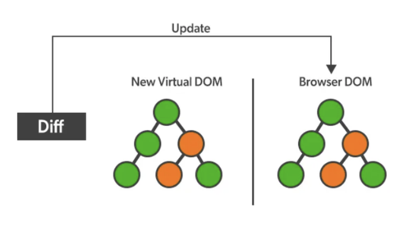

# 다루는 주제:

# React에서의 조정 알고리즘이란 무엇인가요?

- 조정(Reconciliation)은 React가 브라우저 DOM을 업데이트하는 과정입니다.
- React는 가상 DOM과 실제 DOM을 비교합니다. 변경된 노드를 찾아 실제 DOM에서는 변경된 노드만 업데이트하고 나머지 노드는 그대로 둡니다. 이 과정을 조정이라고 합니다.
- 조정 프로세스의 작동 뒤에 중요한 개념은 가상 DOM과 Diffing 알고리즘입니다.

<!-- ui-log 수평형 -->
<ins class="adsbygoogle"
  style="display:block"
  data-ad-client="ca-pub-4877378276818686"
  data-ad-slot="9743150776"
  data-ad-format="auto"
  data-full-width-responsive="true"></ins>
<component is="script">
(adsbygoogle = window.adsbygoogle || []).push({});
</component>

1] Virtual DOM

- 리액트의 Virtual DOM은 실제 DOM의 "가상" 표현입니다. 실제 DOM을 복제하는데 사용되는 객체에 불과합니다.
- 변경사항이나 데이터를 추가할 때마다, 리액트는 새로운 Virtual DOM을 생성하고 이전 것과 비교합니다.
- 비교는 Diffing 알고리즘에 의해 수행됩니다.
- 그런 다음 전체 DOM을 다시 렌더링하지 않고 가능한 한 적은 변경으로 브라우저 DOM을 업데이트합니다.

2] Diffing 알고리즘

리액트는 이 가정을 기반으로 한 조화를 위한 휴리스틱 알고리즘인 Diffing 알고리즘을 사용합니다.

<!-- ui-log 수평형 -->
<ins class="adsbygoogle"
  style="display:block"
  data-ad-client="ca-pub-4877378276818686"
  data-ad-slot="9743150776"
  data-ad-format="auto"
  data-full-width-responsive="true"></ins>
<component is="script">
(adsbygoogle = window.adsbygoogle || []).push({});
</component>

React는 변경 사항을 확인하기 위해 루트 요소를 검사하며 업데이트는 루트 요소의 유형에 따라 달라집니다.

- 서로 다른 유형의 두 요소는 서로 다른 트리를 생성하며 동일한 유형의 두 요소를 비교할 때에는 기존 노드를 유지하고 속성 또는 스타일의 변경 사항만을 업데이트합니다.
- 개발자는 key prop으로 다른 렌더링에서 안정적인 자식 요소를 암시할 수 있습니다.

Preplaced.com에서 만나요! 무료 체험을 예약해보세요!

<!-- ui-log 수평형 -->
<ins class="adsbygoogle"
  style="display:block"
  data-ad-client="ca-pub-4877378276818686"
  data-ad-slot="9743150776"
  data-ad-format="auto"
  data-full-width-responsive="true"></ins>
<component is="script">
(adsbygoogle = window.adsbygoogle || []).push({});
</component>

# React Fiber

## Fiber의 구조

- Fiber는 자바스크립트 객체로 작업의 단위입니다. DOM 트리의 노드나 React 요소를 나타내며, 컴포넌트와 관련된 데이터를 포함합니다.
- Fiber는 컴포넌트의 인스턴스이면서 호출 스택에서의 프레임입니다.
- Fiber는 React 요소와 마찬가지로 유형과 키를 가지고 있습니다. 요소로부터 Fiber가 생성될 때, 이 두 필드가 직접 복사됩니다.
- React는 구성 요소 트리에 대한 추가 정보를 저장하기 위해 "fiber"라는 내부 객체를 사용합니다.

— Fiber의 유형은 해당하는 컴포넌트를 설명합니다. 복합 컴포넌트의 경우, 유형은 함수나 클래스 컴포넌트 자체입니다. 호스트 컴포넌트(예: div, span 등)의 경우, 유형은 문자열입니다.

<!-- ui-log 수평형 -->
<ins class="adsbygoogle"
  style="display:block"
  data-ad-client="ca-pub-4877378276818686"
  data-ad-slot="9743150776"
  data-ad-format="auto"
  data-full-width-responsive="true"></ins>
<component is="script">
(adsbygoogle = window.adsbygoogle || []).push({});
</component>

- 조정 중에 사용되는 키는 파이버를 재사용할 수 있는지를 결정하는 데 사용됩니다.

- React 엘리먼트에서 생성된 파이버는 해당 엘리먼트의 타입과 키를 상속받습니다. 파이버에서 타입과 키의 주요 용도는 조정 중에 해당 파이버를 재사용할 수 있는지 여부를 결정하는 데 있습니다.

# React Fiber의 주요 이점 및 기능:

## 1. 점진적 렌더링:

<!-- ui-log 수평형 -->
<ins class="adsbygoogle"
  style="display:block"
  data-ad-client="ca-pub-4877378276818686"
  data-ad-slot="9743150776"
  data-ad-format="auto"
  data-full-width-responsive="true"></ins>
<component is="script">
(adsbygoogle = window.adsbygoogle || []).push({});
</component>

- 이전 동작: Fiber 이전에 React의 조화 프로세스는 블로킹되어 있을 수 있었습니다. 즉, 구성 요소 및 변경 사항을 재귀적으로 한꺼번에 처리하여 대규모 업데이트에 대한 성능 문제가 발생할 수 있었습니다.
- Fiber로 변경된 동작: React는 이제 작업을 더 작은 조각으로 나누어 여러 프레임에 분산시켜 부드러운 애니메이션 및 상호 작용이 가능해졌습니다.

## 2. 동시성:

- Fiber를 통해 React는 여러 작업을 동시에 수행할 수 있으며(동시 모드), 여러 구성 요소 트리를 독립적으로 렌더링할 수 있습니다.

## 3. 작업 우선순위:

<!-- ui-log 수평형 -->
<ins class="adsbygoogle"
  style="display:block"
  data-ad-client="ca-pub-4877378276818686"
  data-ad-slot="9743150776"
  data-ad-format="auto"
  data-full-width-responsive="true"></ins>
<component is="script">
(adsbygoogle = window.adsbygoogle || []).push({});
</component>

- Fiber를 사용하면 React가 특정 업데이트를 다른 것보다 우선순위를 정할 수 있습니다. 예를 들어, 사용자 상호 작용(클릭 또는 키 입력과 같은)은 중요하지 않은 업데이트보다 높은 우선순위를 갖습니다.
- 이는 높은 우선순위의 업데이트가 낮은 우선순위의 것을 가로채거나 미리 처리할 수 있도록 하여 보다 반응적인 사용자 인터페이스를 제공합니다.

## 4. Time Slicing:

- Time slicing은 React가 Fiber를 활용하여 작업을 작은 시간 조각으로 분해하고 제어를 주기적으로 브라우저 이벤트 루프에 반환하는 기술입니다.
- 이를 통해 UI가 응답성을 유지하는 동안 백그라운드에서 무거운 계산이 수행되어도 됩니다.

## 5. Error Boundaries:

<!-- ui-log 수평형 -->
<ins class="adsbygoogle"
  style="display:block"
  data-ad-client="ca-pub-4877378276818686"
  data-ad-slot="9743150776"
  data-ad-format="auto"
  data-full-width-responsive="true"></ins>
<component is="script">
(adsbygoogle = window.adsbygoogle || []).push({});
</component>

- Fiber는 응용 프로그램에서 오류를 처리하는 보다 견고한 메커니즘을 소개했습니다. 오류 경계는 구성 요소 트리의 어느 곳에서든 JavaScript 오류를 잡아내고 해당 오류를 기록하거나 대체 UI를 표시하거나 다른 조치를 취할 수 있는 구성 요소입니다.
- Fiber 이전에 처리되지 않은 오류는 React의 내부 상태를 손상시키고 전체 응용 프로그램이 충돌하도록 할 수 있었습니다.

# Babel과 Webpack이 무엇인가요?

## Babel:

Babel은 개발자가 최신 ECMAScript (ES) 기능을 사용하여 코드를 작성한 다음, 그것을 브라우저에서 널리 지원되는 이전 버전의 JavaScript로 변환할 수 있는 JavaScript 컴파일러입니다.

<!-- ui-log 수평형 -->
<ins class="adsbygoogle"
  style="display:block"
  data-ad-client="ca-pub-4877378276818686"
  data-ad-slot="9743150776"
  data-ad-format="auto"
  data-full-width-responsive="true"></ins>
<component is="script">
(adsbygoogle = window.adsbygoogle || []).push({});
</component>

Babel의 주요 기능:

- 변환: 최신 JavaScript (ES6+)을 이전 버전인 ES5로 변환하여 호환성 확보.
- 폴리필링: 오래된 환경에서 누락된 기능 제공, 예를 들어 Promise, Array.includes 등.
- JSX 및 TypeScript 지원: Babel은 JSX(React에서 사용)와 TypeScript를 일반 JavaScript로 변환할 수 있음.
- 플러그인 및 프리셋: 플러그인과 프리셋을 사용하여 변환 프로세스를 맞춤화할 수 있음.

# 웹팩:

웹팩은 모듈 번들러이자 작업 실행기로, 종속성이 있는 모듈을 가져와 해당 모듈을 나타내는 정적 자산을 생성함. 매우 유연하며 다양한 리소스나 자산을 변환, 번들 또는 패키징할 수 있음.

<!-- ui-log 수평형 -->
<ins class="adsbygoogle"
  style="display:block"
  data-ad-client="ca-pub-4877378276818686"
  data-ad-slot="9743150776"
  data-ad-format="auto"
  data-full-width-responsive="true"></ins>
<component is="script">
(adsbygoogle = window.adsbygoogle || []).push({});
</component>

웹팩의 주요 기능:

- 번들링: 여러 JavaScript 파일(및 다른 에셋)을 하나 또는 여러 개의 번들로 결합하여 HTTP 요청의 수를 줄입니다.
- 로더: 번들링하기 전에 파일을 변환하고 변환합니다(예: SCSS를 CSS로 또는 TypeScript를 JavaScript로).
- 플러그인: 최소화, 최적화 등과 같은 다양한 기능을 제공합니다.
- 코드 분할: 코드베이스를 작은 청크로 분할하여 사이트 성능을 향상시킬 수 있는 지연 로딩이 가능합니다.
- 개발 서버: 라이브 리로드가 포함된 로컬 개발 서버를 제공합니다.

요약하자면:

- Babel은 최신 구문과 기능을 오래된, 널리 지원되는 JavaScript로 변환하여 다양한 브라우저에서 JavaScript 코드가 호환되도록 합니다.
- 웹팩은 에셋을 번들링하고 HTTP 요청을 줄이며 빠르고 효율적인 애플리케이션을 위한 다양한 최적화를 제공하여 프로젝트를 최적화합니다.

<!-- ui-log 수평형 -->
<ins class="adsbygoogle"
  style="display:block"
  data-ad-client="ca-pub-4877378276818686"
  data-ad-slot="9743150776"
  data-ad-format="auto"
  data-full-width-responsive="true"></ins>
<component is="script">
(adsbygoogle = window.adsbygoogle || []).push({});
</component>

# Transpiling이란 무엇인가요?

Babel은 Transpiling 서비스를 제공하는 특정 구현체입니다.

- Transpiling은 코드를 한 언어나 구문에서 다른 언어나 구문으로 변환하는 프로세스를 일반적으로 가리킵니다.
- Babel은 JavaScript 및 관련 구문 확장을 위한 Transpilation을 수행하는 구체적인 도구입니다.

# 읽어 주셔서 감사합니다

<!-- ui-log 수평형 -->
<ins class="adsbygoogle"
  style="display:block"
  data-ad-client="ca-pub-4877378276818686"
  data-ad-slot="9743150776"
  data-ad-format="auto"
  data-full-width-responsive="true"></ins>
<component is="script">
(adsbygoogle = window.adsbygoogle || []).push({});
</component>

- Preplaced.com에서 연락해요, 무료 체험 신청하세요!
- 👏 이야기에 박수 부탁드려요. 제 소식을 팔로우해 주세요 👉
- 📰 코딩 인터뷰 질문 더 보기
- 🔔 팔로우해 주세요: LinkedIn!

언제나 개선할 부분이 있죠. 의견을 자유롭게 공유해 주세요.