## CSS 작성은 짜증날 필요가 없어요!

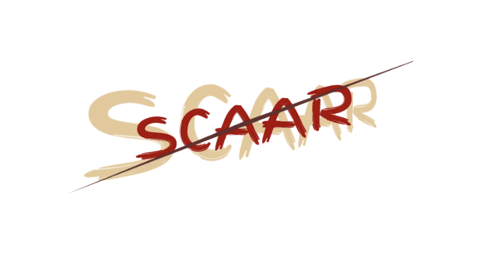

CSS의 세계에 더 깊이 들어가면서, 제 경력과 매우 다른 경력을 가진 개발자들과 더 많은 대화를 나누게 되었어요. CSS에 대한 혐오를 본 적이 없어 놀랐지만, 많은 시니어 개발자들이 신경 쓰지 않는다는 것에 놀랐어요. 시니어와 주니어를 구분하는 다른 점이 시니어가 더 많은 관심을 가진다는 데 있을 텐데 이것과 상반되는 것 같았어요.

CSS 작성을 혐오스럽게 만드는 일반적인 문제를 최소화하는 데 초점을 맞추고 있어요. 이 주제가 언급되면, 개발자들은 종종 이 문제를 제3자 도구의 부재에서 생각하곤 해요. 그래서 거의 산업에서 빠진 것처럼 느껴져서 제 과정을 기록할 필요를 느꼈어요.

<!-- ui-log 수평형 -->
<ins class="adsbygoogle"
  style="display:block"
  data-ad-client="ca-pub-4877378276818686"
  data-ad-slot="9743150776"
  data-ad-format="auto"
  data-full-width-responsive="true"></ins>
<component is="script">
(adsbygoogle = window.adsbygoogle || []).push({});
</component>

SCAAR는 이러한 원칙을 전달하기 위해 내가 만든 이름이지만, 내가 새롭게 발명하는 것은 아닙니다. 이것은 편리함을 위해 한 곳에 개요로 정리된 여러 아이디어의 결합체입니다. 아마도 짐작했겠지만, SCAAR은 머릿글자를 딴 약어이며 아래와 같은 뜻이 있습니다:

- Scoped(범위 지정)
- Composable(구성 가능한)
- Agnostic(중립적인)
- Atomic(원자적인)
- Reusable(재사용 가능한)

# 1. Scoped(범위 지정)

강력한 시작입니다. 이것이 해결책의 가장 중요한 부분일 수도 있습니다. CSS에 대한 가장 일반적인 불평 중 하나는 오버라이드와 이름 충돌의 어려움입니다. 그렇다면 정확히 무엇이 범위 지정된 CSS인가요?

<!-- ui-log 수평형 -->
<ins class="adsbygoogle"
  style="display:block"
  data-ad-client="ca-pub-4877378276818686"
  data-ad-slot="9743150776"
  data-ad-format="auto"
  data-full-width-responsive="true"></ins>
<component is="script">
(adsbygoogle = window.adsbygoogle || []).push({});
</component>

그럼, 명확하게 이야기하려면 시작하기 전에 무엇인지부터 말할게요. 제가 얘기하는 scoped CSS는 .about-section h2와 같이 중첩된 선택자를 의미하는 것이 아니에요. 또는 중첩 구문을 지원하는 전처리기를 선호한다면,

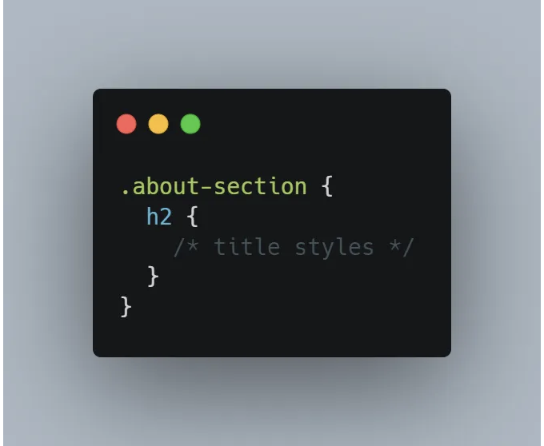

그건 비슷한 결과를 얻을 수 있겠지만, 보통 문제를 일으킬 수 있어요. 예를 들어, .about-section 안에 다른 섹션을 중첩하려면 h2 내부에서 충돌을 해결해야 하는데, 그건 cascade 때문이에요.

일반적으로 cascade를 신경 쓰지 않도록 필요한 요소만 선택하는 것이 좋아요. 예를 들어, BEM을 사용하여 더 구체적인 클래스 이름으로 h2를 선택할 수 있어요: .about-section__title.

<!-- ui-log 수평형 -->
<ins class="adsbygoogle"
  style="display:block"
  data-ad-client="ca-pub-4877378276818686"
  data-ad-slot="9743150776"
  data-ad-format="auto"
  data-full-width-responsive="true"></ins>
<component is="script">
(adsbygoogle = window.adsbygoogle || []).push({});
</component>

이건 scoped CSS인가요? 아직은 아닙니다! 조금씩 나아지고 있지만, 여전히 완벽하지는 않아요. 왜냐하면 이 클래스 이름이 공개적으로 전역적으로 정의되어 있기 때문이에요. JavaScript와 비교하자면, 이것은 window.myModule과 import myModule from `my-module`의 차이랍니다. 그렇다면 CSS에서 동등한 것을 어떻게 달성할 수 있을까요?

CSS 영역에서는 조금 더 어려운데, 이에 관한 노력이 있었어요. 특히, CSS Modules는 CSS 파일을 JavaScript로 가져올 수 있게 해주는데, 밑단에서는 GUID로 클래스 이름을 바꿔서 이름 충돌을 피할 수 있어요.

여러 CSS-in-JS 라이브러리들(예: StyledComponents 또는 Emotion)로도 비슷한 결과를 얻을 수 있어요. 이 방법을 선호하는 사람들은 덜 이름을 짓고 모든 것을 한 파일에 편리하게 유지하기 때문이에요. 여기에는 장단점이 있음을 언급해둘게요. Vanilla-Extract 패키지는 아마도 이 단점에 대한 해답이 될 수도 있겠네요.

<!-- ui-log 수평형 -->
<ins class="adsbygoogle"
  style="display:block"
  data-ad-client="ca-pub-4877378276818686"
  data-ad-slot="9743150776"
  data-ad-format="auto"
  data-full-width-responsive="true"></ins>
<component is="script">
(adsbygoogle = window.adsbygoogle || []).push({});
</component>

마침내, 일부 프레임워크는 기본으로 약간 다른 전략을 사용합니다. 예를 들어 Vue와 Angular가 있습니다. 이 흉내 내는 스코픽은 CSS 모듈 또는 CSS-in-JS보다 약간 약합니다. 왜냐하면 클래스 이름을 변환하지 않고 각 요소에 고유한 속성을 추가하여 .heading을 .heading[_ngcontent-rsm-c42]와 같은 것으로 변환합니다. 이로 인해 잠재적인 충돌 가능성을 남겨두기 때문에, 이는 또한 캐스케이드에서 모든 .heading 스타일을 상속하게 됩니다. 깊은 셀렉터와 제3자 스타일 시트는 이를 특히 위험하게 만들 수 있습니다.

이 모든 것은 대략적으로 스코프가 지정된 CSS입니다. 적절한 접근 방식으로 네이밍 충돌 가능성을 거의 제로로 줄일 수 있지만, 여전히 완벽하진 않습니다. 왜냐하면 전역 레벨에서 정의된 것은 여전히 당신의 마크업을 선택할 수 있기 때문입니다. 예를 들어, 네이밍 규칙은 마크업이 태그 이름에 따라 선택되는 것을 막지 못합니다.

그렇다면 어떻게하면 우리의 마크업이 원하지 않는 스타일을 상속하지 않을 수 있을까요? 다행히 해결책이 있습니다. 그리고 더 편리하게 만들기 위해 완전히 네이티브입니다. 쉐도우 DOM이라는 것을 사용하여 우리의 CSS를 완전히 스코프로 설정할 수 있습니다. 이것은 위에서의 마크업이 영향을 받지 않으며, 그 안의 셀렉터도 외부의 마크업에 영향을 줄 수 없음을 의미합니다. 이것은 지금 당신 앞에 있는 파일 바깥 어디에서도 충돌을 걱정할 필요가 없다는 것을 의미합니다.

물론, 웹 컴포넌트는 약간 성장 과정을 겪어야하지만, 누락된 부분을 해결할 수 있는 도구들이 있습니다. 쉐도우 DOM은 컴포넌트 외부에서도 사용할 수 있으며, 결국, 선언형 쉐도우 DOM도 실용적인 옵션이 될 것입니다. 추가로, Angular와 같은 일부 프레임워크는 배경에서 쉐도우 DOM을 활용할 수 있도록 합니다.

<!-- ui-log 수평형 -->
<ins class="adsbygoogle"
  style="display:block"
  data-ad-client="ca-pub-4877378276818686"
  data-ad-slot="9743150776"
  data-ad-format="auto"
  data-full-width-responsive="true"></ins>
<component is="script">
(adsbygoogle = window.adsbygoogle || []).push({});
</component>

이 기사를 집중하기 위해 그 주변 이야기는 삼가겠습니다. 하지만 여러분이 자신만의 위험과 이점을 조사해보는 것을 권장하며, 아마 나중에 이 주제를 더 상세히 탐구한 또 다른 기사를 쓸 수도 있을 것 같아요! 여기에 한 가지 더 언급해 두려고 해요:

# 2. 조립 가능

범위 지정은 좋지만, 이것만으로는 충분하지 않아요. 대부분의 경우, 스타일은 React, 웹 컴포넌트, 또는 기타 어떤 것이라도 각 컴포넌트 내에서 범위가 지정될 거예요. 스타일을 중복해서 사용하지 않도록 만들기 위해 조합 가능하게 만드는 것이 중요해요.

다음에 여러분이 여러 레이아웃을 요구하는 컴포넌트를 만들 때 이 사항을 염두에 두세요. 한 가지 좋은 예는 제품일 수 있어요:

<!-- ui-log 수평형 -->
<ins class="adsbygoogle"
  style="display:block"
  data-ad-client="ca-pub-4877378276818686"
  data-ad-slot="9743150776"
  data-ad-format="auto"
  data-full-width-responsive="true"></ins>
<component is="script">
(adsbygoogle = window.adsbygoogle || []).push({});
</component>

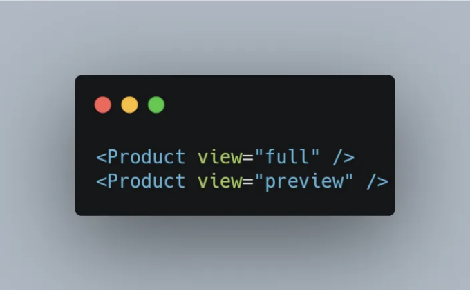

위의 JSX는 뷰를 기반으로 출력을 결정하는 몇 가지 논리가 있다는 것을 나타냅니다. 이런 템플릿에서 가능한 한 논리를 피하는 것이 좋다고 여러 번 들어보셨을 것입니다. 따라서 이러한 부분은 완전히 독립된 컴포넌트로 분리하는 것이 더 좋을 것입니다.

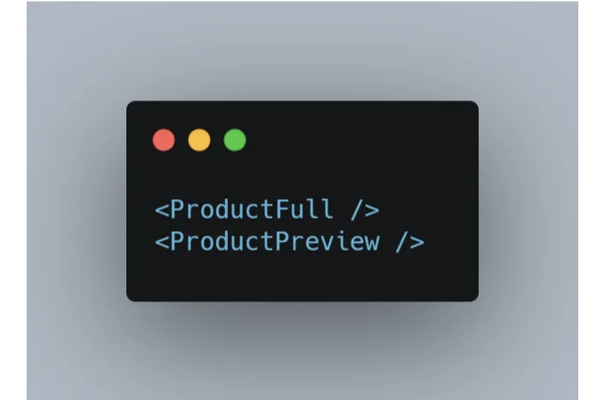

...그러나 이들은 일부 스타일을 공통으로 가지고 있기 때문에 중복 문제가 발생합니다. 이를 해결하기 위해 공유 CSS를 세 번째 컴포넌트로 추출하여 두 컴포넌트의 템플릿에서 재사용해야 합니다.

<!-- ui-log 수평형 -->
<ins class="adsbygoogle"
  style="display:block"
  data-ad-client="ca-pub-4877378276818686"
  data-ad-slot="9743150776"
  data-ad-format="auto"
  data-full-width-responsive="true"></ins>
<component is="script">
(adsbygoogle = window.adsbygoogle || []).push({});
</component>

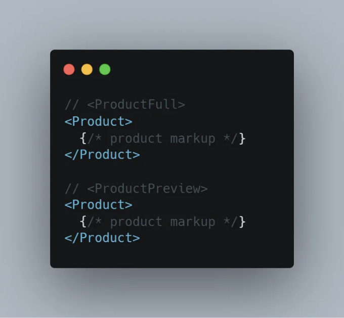

이렇게 함으로써 모든 스타일이 템플릿에 과도한 로직 없이 한 번만 정의되었음을 보장합니다.

# 3. 중립적입니다

다른 도움이 되는 방법은 선택자를 HTML 의미와 구조로부터 멀리 유지하는 것입니다.

<!-- ui-log 수평형 -->
<ins class="adsbygoogle"
  style="display:block"
  data-ad-client="ca-pub-4877378276818686"
  data-ad-slot="9743150776"
  data-ad-format="auto"
  data-full-width-responsive="true"></ins>
<component is="script">
(adsbygoogle = window.adsbygoogle || []).push({});
</component>

이전 예제로 돌아가면, .about-section h2는 제목이 특정 방식으로 중첩되어 있어야 합니다. 다음 스니펫을 살펴보세요. 스코프 설정을 위해 섀도우 DOM을 사용했습니다.

당신의 CSS에 있는 섹션 ` h2:

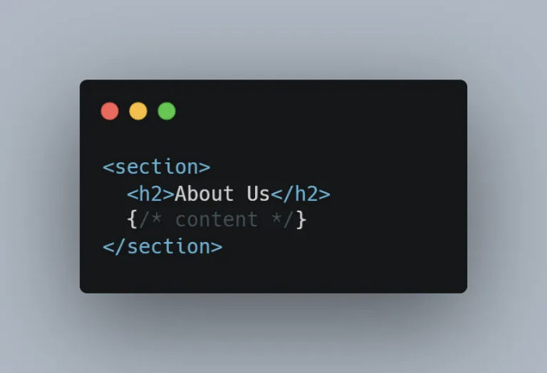

나중에 마크업을 재배열하기로 결정하면, 이 CSS를 다시 확인해야 할 것입니다.

<!-- ui-log 수평형 -->
<ins class="adsbygoogle"
  style="display:block"
  data-ad-client="ca-pub-4877378276818686"
  data-ad-slot="9743150776"
  data-ad-format="auto"
  data-full-width-responsive="true"></ins>
<component is="script">
(adsbygoogle = window.adsbygoogle || []).push({});
</component>

이제 섹션 `header`의 h2로 변경되었습니다:

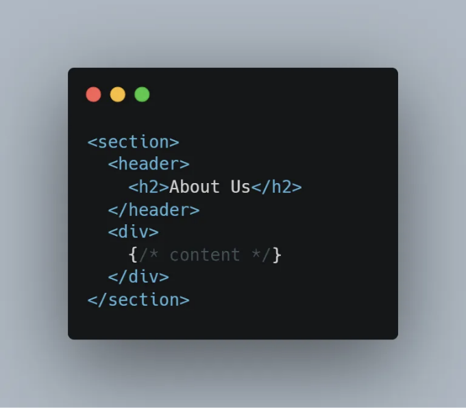

그와는 달리, h2와 같은 직접 선택자를 사용하면 제한 없이 재배열할 수 있습니다.

이 경우, `h2` 태그가 `h1` 또는 다른 제목 수준으로 변경될 수 있도록 클래스 이름을 사용하는 것이 좋을 수 있습니다. 이렇게 함으로써 접근성 기능과 SEO를 미 esthetics로부터 분리할 수 있습니다. 또한 `a` 및 `button` 또는 유사한 형태의 제어 항목 간 스타일을 공유할 때도 동일한 가치를 가질 수 있습니다.

<!-- ui-log 수평형 -->
<ins class="adsbygoogle"
  style="display:block"
  data-ad-client="ca-pub-4877378276818686"
  data-ad-slot="9743150776"
  data-ad-format="auto"
  data-full-width-responsive="true"></ins>
<component is="script">
(adsbygoogle = window.adsbygoogle || []).push({});
</component>

# 4. 원자적

특수성 문제와 중복을 방지하는 가장 좋은 방법을 고려할 때는 각 범위를 가능한 작게 유지하는 것이 가장 좋습니다. 이전 스니펫의 마크업을 다시 살펴 봅시다. 해당 컴포넌트를 여러 작은 컴포넌트로 분할할 수 있을 것으로 보입니다.

 `x-heading` 템플릿은, const Heading = `h${h}` 를 가정합니다:

<!-- ui-log 수평형 -->
<ins class="adsbygoogle"
  style="display:block"
  data-ad-client="ca-pub-4877378276818686"
  data-ad-slot="9743150776"
  data-ad-format="auto"
  data-full-width-responsive="true"></ins>
<component is="script">
(adsbygoogle = window.adsbygoogle || []).push({});
</component>

`x-section` 템플릿:

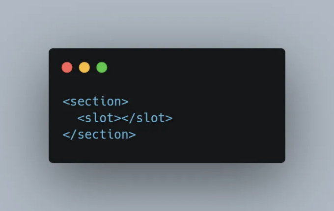

`x-page-section` 템플릿:

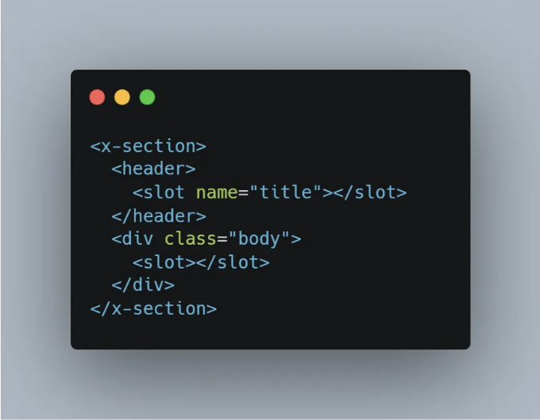

<!-- ui-log 수평형 -->
<ins class="adsbygoogle"
  style="display:block"
  data-ad-client="ca-pub-4877378276818686"
  data-ad-slot="9743150776"
  data-ad-format="auto"
  data-full-width-responsive="true"></ins>
<component is="script">
(adsbygoogle = window.adsbygoogle || []).push({});
</component>

페이지 템플릿에 대해:

이제 "About" 페이지는 스타일과 전혀 관련이 없습니다. 섹션 템플릿은 보다 구성 가능하며, 헤딩 구성 요소는 여러 곳에서 재사용할 수 있으며 제네릭하므로 다양한 시맨틱을 받을 수 있으면서 시각적으로 일관성 있게 나타날 수 있습니다. 이것은 이전에 개요한 모든 원칙과 일치하지만, 이번에는 원자적 범위의 이점에 중점을 둡니다.

이제 각 부분이 분리되어 각 부분마다 아주 작은 템플릿이 있기 때문에 특정성 충돌의 위험을 효과적으로 제거했습니다. 뿐만 아니라 각 구성 요소는 이제 충분히 집중되어 있어서:

<!-- ui-log 수평형 -->
<ins class="adsbygoogle"
  style="display:block"
  data-ad-client="ca-pub-4877378276818686"
  data-ad-slot="9743150776"
  data-ad-format="auto"
  data-full-width-responsive="true"></ins>
<component is="script">
(adsbygoogle = window.adsbygoogle || []).push({});
</component>

- 각 구성 요소를 이해하기 위한 인지 부하를 줄입니다.
- 변경 사항의 영향을 줄여줍니다 (이는 리스크 관리팀을 기쁘게 할 것입니다!)
- 수평 스크롤바나 여러 파일 없이 편리하게 화면에 모두 표시됩니다.

이렇게 하면 파일이 엉망일 것이라고 걱정할 수 있지만, 제 경험상 항상 그렇지는 않습니다. 웹사이트에 필요한 컴포넌트는 한정되어 있으며, 상상한 것보다 너무 많지 않을 것입니다. 게다가 편집기의 키보드 단축키를 사용하여 찾고 있는 파일을 쉽게 찾을 수 있습니다.

# 5. 재사용 가능

앞서 언급한 내용은 재사용성을 향상시킬 수 있는데, 향후 유지보수자들의 경험을 개선하기 위해 추가적인 조치를 취할 수 있습니다.

<!-- ui-log 수평형 -->
<ins class="adsbygoogle"
  style="display:block"
  data-ad-client="ca-pub-4877378276818686"
  data-ad-slot="9743150776"
  data-ad-format="auto"
  data-full-width-responsive="true"></ins>
<component is="script">
(adsbygoogle = window.adsbygoogle || []).push({});
</component>

많은 개발자가 이런 실수를 너무 흔해서 실수라는 것조차 모를 정도로 흔하다는 것에 주목했어요. 정보 은폐는 재사용성을 위해 매우 중요한데, 그 수준의 캡슐화에는 스코프가 지정된 CSS 이상의 것이 필요해요. 예를 들어, 커스텀 속성을 살펴봐야겠네요. CSS를 직접 노출시킬 필요 없이 컴포넌트가 모습 디테일을 누설시키는데요.

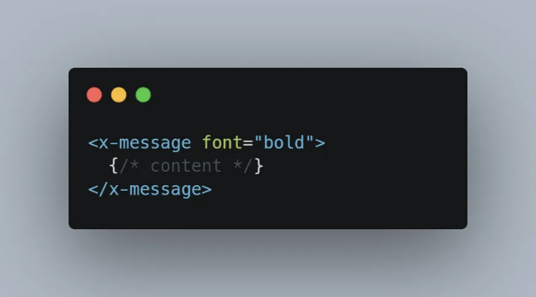

글꼴 속성은 스타일을 외부 세계에 노출한다는 것을 의미하는데, 이는 컴포넌트가 어떻게 표시되는지 완전히 제어하지 못하게 됐음을 뜻해요.

상기 마크업이 73곳에서 사용되었다고 상상해보세요. 제 경험상 비합리적인 수가 아니에요. 이제 요구 사항이 변경되지만 모든 73곳이 시나리오와 일치하지는 않는다고 가정해보죠. 각각을 수동으로 검토한 후, 35곳이 수정이 필요하다는 걸 확인하고 그 변경 사항을 거대한 풀 리퀘스트로 커밋했어요. 그럼 이런 일이 발생하지 않도록 어떻게 할까요?

<!-- ui-log 수평형 -->
<ins class="adsbygoogle"
  style="display:block"
  data-ad-client="ca-pub-4877378276818686"
  data-ad-slot="9743150776"
  data-ad-format="auto"
  data-full-width-responsive="true"></ins>
<component is="script">
(adsbygoogle = window.adsbygoogle || []).push({});
</component>

해답은 사용 사례를 노출하는 것이지 스타일을 노출하는 것이 아닙니다. 왜 그것이 굵게 표시되었는지 생각하는 것이 항상 도움이 됩니다. 스타일의 동기는 변하지 않을 것이며, 실제 스타일 자체가 바뀌더라도요.

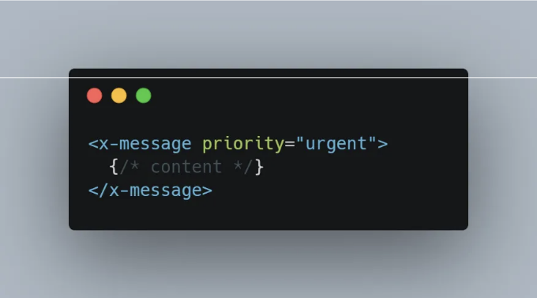

우선순위의 가치는 메시지가 다른 이유로 사용됨에 따라 변할 수 있습니다. 여러 경우가 시각적으로 동일하게 보이는 것은 완전히 수용 가능합니다. 우리가 하는 일은 해당 결정을 구성 요소 내부에 맡기는 것 뿐입니다.

새로운 요구 사항을 되짚어보면, 이제는 보잘것없는 것처럼 느껴지는데, 검토해야 할 파일이 하나뿐이기 때문입니다. 여전히 35군데에서 사용되고 있지만, 이는 진행 중인 작업과 무관합니다. 이전에는 커다란 일이었던 것이 이제는 한 줄의 변경으로 해결됩니다. 이것이 캡슐화의 진정한 힘이죠.

<!-- ui-log 수평형 -->
<ins class="adsbygoogle"
  style="display:block"
  data-ad-client="ca-pub-4877378276818686"
  data-ad-slot="9743150776"
  data-ad-format="auto"
  data-full-width-responsive="true"></ins>
<component is="script">
(adsbygoogle = window.adsbygoogle || []).push({});
</component>

물론 스타일을 노출하는 것이 항상 나쁜 것은 아니에요. 단, 그것이 결정되는 프레젠테이션 레이어 안에서 수행되는지 신중하게 지켜봐야 해요. 저의 '마스터링 프레젠테이션 컴포넌트'라는 글을 읽어보세요. 논의에 대한 더 깊은 통찰력을 얻을 수 있을 거예요.

가장 중요한 점은 재사용성을 극대화하여 이미 작성한 CSS를 변경하는 시간을 줄이고, 그것으로부터 더 많은 시간을 소비하는 것이에요. 

SCAAR의 학습 곡선은 다른 디자인 원칙 세트와 같이 어렵지 않아야 해요. 그리고 같은 방식으로 결과는 그 노력에 값어야 해요. 한편, 인지적 부담은 사라지고 고려해야 하는 좋은 습관으로 대체되어요. 

저는 몇 년 동안 이 원칙을 적용해왔고, !important 해킹과 이름 충돌의 괴로움을 거의 잊을 정도로 효과적으로 CSS 문제를 해결했어요. 이제 더 이상 다른 방식으로 CSS를 작성할 수 없을 정도로요.

<!-- ui-log 수평형 -->
<ins class="adsbygoogle"
  style="display:block"
  data-ad-client="ca-pub-4877378276818686"
  data-ad-slot="9743150776"
  data-ad-format="auto"
  data-full-width-responsive="true"></ins>
<component is="script">
(adsbygoogle = window.adsbygoogle || []).push({});
</component>

항상 당신의 피드백을 듣는 것을 좋아해요! 아무리 비판적인 의견이라도 괜찮아요. 만약 기사 중에 수정이 필요한 부분이 있다면, 기꺼이 수정할게요.