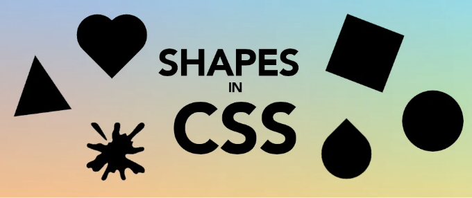

최근 CSS로 코딩된 16개의 도형이 담긴 짧은 비디오를 게시했어요. 비디오를 보완하기 위해 이 글을 추가하고, 어떻게 하는지를 설명하며 (단순히 뭔가 올리는 것뿐 아니라) 코드를 복사하기 쉽도록 만들었어요.

# 직사각형

처음에는 HTML에서 모든 것이 직사각형입니다. 그래서 직사각형을 그리는 것은 간단해요; 너비와 높이를 지정하면 됩니다. 그렇게 해도 작동하지 않으면 인라인 디스플레이를 가진 요소를 사용하거나 블록 또는 인라인 블록 요소로 전환하면 됩니다. 그렇게 하면 잘 될 거예요.

<!-- ui-log 수평형 -->
<ins class="adsbygoogle"
  style="display:block"
  data-ad-client="ca-pub-4877378276818686"
  data-ad-slot="9743150776"
  data-ad-format="auto"
  data-full-width-responsive="true"></ins>
<component is="script">
(adsbygoogle = window.adsbygoogle || []).push({});
</component>

```css
.rectangle {
  width: 500px;
  height: 300px;
  background: black;
}
```

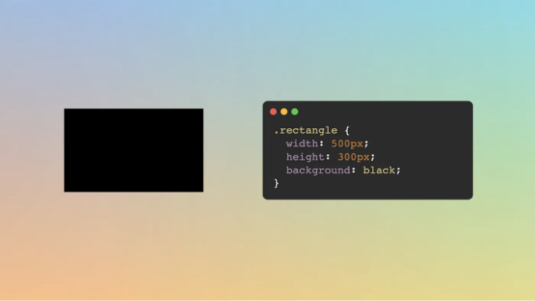

# 정사각형

정사각형은 너비와 높이가 동일한 직사각형입니다. 우리는 직사각형 코드를 가져와서 높이를 너비와 동일한 값으로 변경할 수 있습니다.```

<!-- ui-log 수평형 -->
<ins class="adsbygoogle"
  style="display:block"
  data-ad-client="ca-pub-4877378276818686"
  data-ad-slot="9743150776"
  data-ad-format="auto"
  data-full-width-responsive="true"></ins>
<component is="script">
(adsbygoogle = window.adsbygoogle || []).push({});
</component>

```js
.square {
  width: 300px;
  height: 300px;
  background: black;
}
```

하지만… 우리의 사각형 크기를 변경하려면 매번 두 값 모두 업데이트해야 합니다. 큰 문제는 아니지만, CSS에는 너비와 높이 사이의 관계를 지정할 수 있는 aspect-ratio 속성이 있습니다. 비디오에서처럼 값을 1 또는 (1/1로) 설정하면 동일한 코드 라인으로 사각형이 생성되지만 이제 크기를 조정하기 위해 한 줄의 코드 만 업데이트하면 됩니다:

```js
.square {
  width: 300px;
  aspect-ratio: 1;
  background: black;
}
```

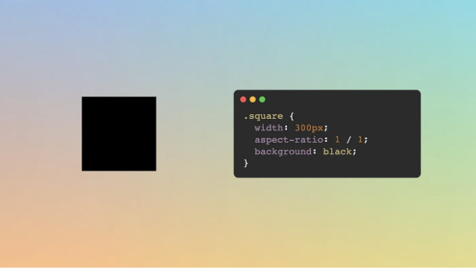
```

<!-- ui-log 수평형 -->
<ins class="adsbygoogle"
  style="display:block"
  data-ad-client="ca-pub-4877378276818686"
  data-ad-slot="9743150776"
  data-ad-format="auto"
  data-full-width-responsive="true"></ins>
<component is="script">
(adsbygoogle = window.adsbygoogle || []).push({});
</component>

# 원

사각형에서 시작하여 둥근 모양을 만들어야 합니다. border-radius를 사용하여 상당한 퍼센트 값을 할당하여 이를 달성할 수 있습니다 (50% 이상이면 충분합니다). 쉽죠.

```js
.circle {
  width: 300px;
  aspect-ratio: 1;
  background: black;
  border-radius: 50%;
}
```

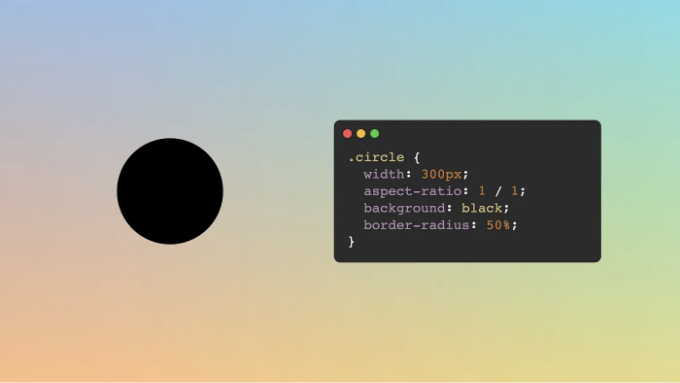

<!-- ui-log 수평형 -->
<ins class="adsbygoogle"
  style="display:block"
  data-ad-client="ca-pub-4877378276818686"
  data-ad-slot="9743150776"
  data-ad-format="auto"
  data-full-width-responsive="true"></ins>
<component is="script">
(adsbygoogle = window.adsbygoogle || []).push({});
</component>

# 타원

타원은 동그란 모양인 원과는 달리 정사각형이 아닌 직사각형을 기반으로 한 둥근 모양이에요. (타원에 대한 더 정확하고 기술적인 정의가 있지만, 일단 이 정의로 만족하도록 할게요.) 그래서 우리는 원과 마찬가지로 border-radius 속성을 추가할 거에요. 다만 정사각형 대신 직사각형에 적용할 거에요.

```js
.ellipse {
  width: 300px;
  height: 400px;
  background: black;
  border-radius: 50%;
}
```

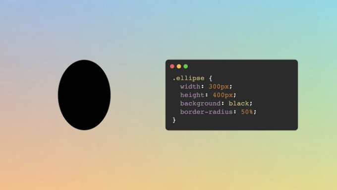

<!-- ui-log 수평형 -->
<ins class="adsbygoogle"
  style="display:block"
  data-ad-client="ca-pub-4877378276818686"
  data-ad-slot="9743150776"
  data-ad-format="auto"
  data-full-width-responsive="true"></ins>
<component is="script">
(adsbygoogle = window.adsbygoogle || []).push({});
</component>

# 타원/타원형

타원과 타원은 같은 것이 아닙니다. 서로 교차하는 내부 원을 기술적으로 정의하는 경우도 있지만, 간단히 말해서 타원은 달걀과 비슷하다고 생각할 수 있습니다. 이 모양은 border-radius 속성의 값 두 세트를 사용하여 만들 수 있습니다. 네 개까지의 수평 반지름 값과 그 다음에는 슬래시(/)로 구분하여 네 개까지의 수직 반지름 값을 입력합니다.

횡반지름 값을 100%로 설정하고, 상단 모서리에 큰 수직 반지름 값을, 하단 모서리에는 작은 값을 지정합니다. 아래와 같이 설정할 수 있습니다:

```js
.oval {
  width: 300px;
  height: 400px;
  background: black;
  border-radius: 100% / 120% 120% 75% 75%;
}
```

<!-- ui-log 수평형 -->
<ins class="adsbygoogle"
  style="display:block"
  data-ad-client="ca-pub-4877378276818686"
  data-ad-slot="9743150776"
  data-ad-format="auto"
  data-full-width-responsive="true"></ins>
<component is="script">
(adsbygoogle = window.adsbygoogle || []).push({});
</component>

사각형의 크기에 따라 값이 달라집니다. 너무 큰 값은 위 부분이 평평해질 수 있고, 너무 작은 값은 아랫부분이 평평해질 수 있습니다. 원하는 모양을 얻기 위해 숫자를 조정해보세요.

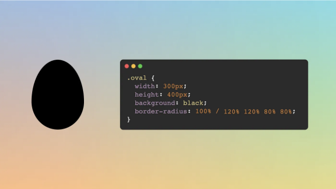

## 종 모양

종 모양은 과장된 타원형으로, 한 쪽은 길고 둥근 모양이고, 다른 한 쪽은 평평합니다(그래도 부드러운 곡선이 있습니다). 이 모양을 얻으려면 원을 가져다가 큰 값은 더 크게, 작은 값은 더 작게 만들어야 합니다.

<!-- ui-log 수평형 -->
<ins class="adsbygoogle"
  style="display:block"
  data-ad-client="ca-pub-4877378276818686"
  data-ad-slot="9743150776"
  data-ad-format="auto"
  data-full-width-responsive="true"></ins>
<component is="script">
(adsbygoogle = window.adsbygoogle || []).push({});
</component>

만약 CSS 아트를 만드신다면, 이 모양은 몸통이나 얼굴을 그리는 데 편리할 수 있어요 (반지름 값을 약간 조절하여).

```js
.bell {
  width: 300px;
  height: 400px;
  background: black;
  border-radius: 100% / 160% 160% 25% 25%;
}
```

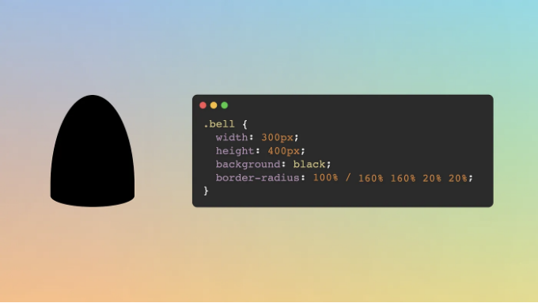

# 아치

<!-- ui-log 수평형 -->
<ins class="adsbygoogle"
  style="display:block"
  data-ad-client="ca-pub-4877378276818686"
  data-ad-slot="9743150776"
  data-ad-format="auto"
  data-full-width-responsive="true"></ins>
<component is="script">
(adsbygoogle = window.adsbygoogle || []).push({});
</component>

타원을 그리는 등장의 변형 버전으로, 아치는 아래쪽이 평평하고 위쪽이 곡선을 이룹니다. 이것에 대해 값들을 조절할 필요가 없습니다; 우리는 border-radius 속성을 고정값으로 설정할 수 있습니다:

```js
.arch {
  width: 300px;
  height: 400px;
  background: black;
  border-radius: 50% / 100% 100% 0% 0%;
}
```

이 접근 방식으로 요소의 너비가 높이보다 두 배 크면, 우리는 아치 모양 대신 반원을 얻을 것입니다.

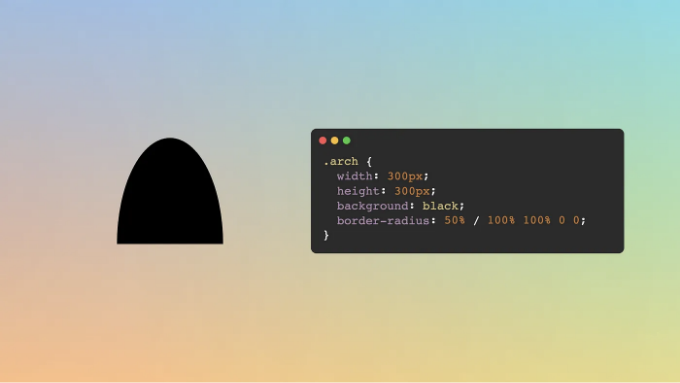

<!-- ui-log 수평형 -->
<ins class="adsbygoogle"
  style="display:block"
  data-ad-client="ca-pub-4877378276818686"
  data-ad-slot="9743150776"
  data-ad-format="auto"
  data-full-width-responsive="true"></ins>
<component is="script">
(adsbygoogle = window.adsbygoogle || []).push({});
</component>

# 눈

세 개 중에서 약간의 회전이 필요한 처음 모양. 우리는 정사각형에서 시작하여 두 모서리에만 테두리 반경을 설정하고 다른 두 모서리는 0으로 남겨둡니다. 일반적으로 저는 항상 왼쪽 위 모서리에서 시작하여 45도 회전을 추가하지만, 다른 모서리를 선택하고 회전을 조정할 수도 있어요.

```js
.tear {
  width: 300px;
  aspect-ratio: 1;
  background: black;
  rotate: 45deg;
  border-radius: 80% 0;
}
```

rotate: 45deg 속성 또는 transform: rotate(45deg)도 사용할 수 있어요. 그 어느 쪽도 잘 작동할 거예요. 테두리 반경은 값이 클수록 눈의 곡률이 부드러워집니다(한 쪽이 다른 쪽보다 더 높아지도록 중복 값을 지정할 수도 있어요: 80% 0 100% 0).

<!-- ui-log 수평형 -->
<ins class="adsbygoogle"
  style="display:block"
  data-ad-client="ca-pub-4877378276818686"
  data-ad-slot="9743150776"
  data-ad-format="auto"
  data-full-width-responsive="true"></ins>
<component is="script">
(adsbygoogle = window.adsbygoogle || []).push({});
</component>

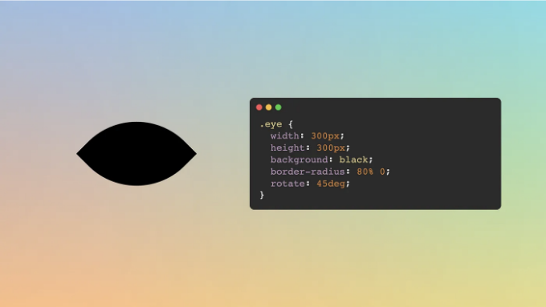

# 눈물 모양

눈물 모양이 눈 모양의 변형이라는 것이 재미있는데요. 동일한 코드를 사용하되, border-radius를 조정하여 세 개의 반지름 중 최대값을 원형 모양으로 만들고 마지막 코너 반지름은 0으로 설정하여 뾰족한 모양을 만들 수 있어요.

```js
.tear {
  width: 300px;
  aspect-ratio: 1;
  background: black;
  rotate: 45deg;
  border-radius: 0 50% 50% 50%;
}
```

<!-- ui-log 수평형 -->
<ins class="adsbygoogle"
  style="display:block"
  data-ad-client="ca-pub-4877378276818686"
  data-ad-slot="9743150776"
  data-ad-format="auto"
  data-full-width-responsive="true"></ins>
<component is="script">
(adsbygoogle = window.adsbygoogle || []).push({});
</component>

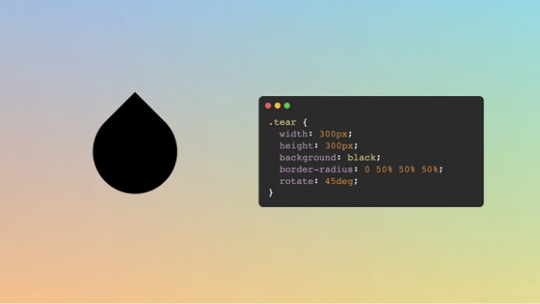

# 하트

하트를 그리는 것은 이전 모양들과 약간 다릅니다. 
요소 및 ::before 및 ::after 가상 요소를 사용할 것이기 때문입니다. 우리는 정사각형에서 시작하여 45도로 회전한 다음 가상 요소를 원으로 추가합니다(위 그림 참조). 
두 번째 가상 요소를 수평으로 하나는 수직으로 이동시킵니다(요소가 회전되었을 때 둘 다 대각선으로 보일 것입니다) 그리고 완료됩니다. 
코드는 "복잡"해 보일 수 있지만, 아이디어는 간단합니다.

```js
.heart {
  width: 300px;
  aspect-ratio: 1;
  background: black;
  rotate: 45deg;
  position: relative;
}

.heart::before,
.heart::after {
  content: "";
  position: absolute;
  width: 100%;
  aspect-ratio: 1;
  border-radius: 50%;
  background: inherit;
  translate: -50% 0;
}

.heart::after {
  translate: 0 -50%;
}
```

<!-- ui-log 수평형 -->
<ins class="adsbygoogle"
  style="display:block"
  data-ad-client="ca-pub-4877378276818686"
  data-ad-slot="9743150776"
  data-ad-format="auto"
  data-full-width-responsive="true"></ins>
<component is="script">
(adsbygoogle = window.adsbygoogle || []).push({});
</component>

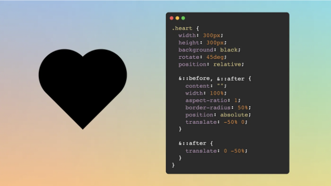

# 삼각형

많은 온라인 기사들이 테두리, 높이/너비가 0인 삼각형을 그리는 방법과 약간의 투명한 색상을 사용하는 방법에 대해 설명합니다. 그 접근 방식을 극도로 비추합니다. 작동은 하지만 구식이며 유연성과 반응 형성을 원할 경우 불편할 수 있습니다. (자세한 내용을 보고 싶다면, CSS로 삼각형을 그리는 다양한 방법, 그들의 장단점을 다룬 기사를 썼습니다).

대신, 삼각형을 그리기 위해 clip-path를 사용하는 것을 권장합니다. 그리고 다음의 다각형 모양 중 일부를 사용합니다. clip-path를 사용하면 우리가 모양을 정의하는 경로(다각형, 이미지, 실제 경로 등)를 지정합니다. 그 모양 바깥의 모든 것이 클립됩니다. 삼각형의 경우, 우리는 단지 3개의 점이 필요합니다.

<!-- ui-log 수평형 -->
<ins class="adsbygoogle"
  style="display:block"
  data-ad-client="ca-pub-4877378276818686"
  data-ad-slot="9743150776"
  data-ad-format="auto"
  data-full-width-responsive="true"></ins>
<component is="script">
(adsbygoogle = window.adsbygoogle || []).push({});
</component>

```js
.triangle {
  width: 300px;
  height: 300px;
  background: black;
  clip-path: polygon(50% 0, 100% 100%, 0 100%);
}
```

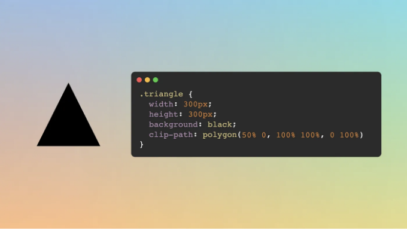

# 사다리꼴

다른 다각형입니다. clip-path의 polygon() 함수를 사용하여 만들기 쉽습니다. 이 경우에는 직사각형이나 정사각형에서 시작하여 네 개의 점이 필요합니다. 아래쪽 점은 모서리에 있고 위쪽 점은 약간 안으로 들어갑니다. 그리고 완료되었습니다!

<!-- ui-log 수평형 -->
<ins class="adsbygoogle"
  style="display:block"
  data-ad-client="ca-pub-4877378276818686"
  data-ad-slot="9743150776"
  data-ad-format="auto"
  data-full-width-responsive="true"></ins>
<component is="script">
(adsbygoogle = window.adsbygoogle || []).push({});
</component>

```js
.trapezoid {
  width: 400px;
  height: 300px;
  background: black;
  clip-path: polygon(20% 0, 80% 0, 100% 100%, 0 100%);
}
```

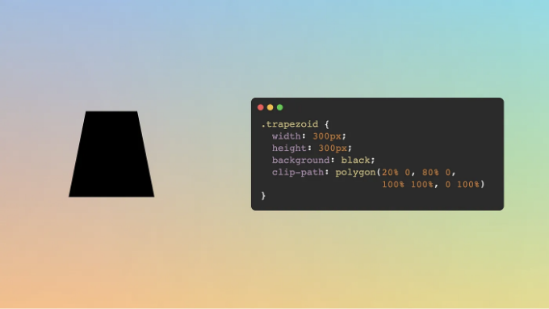

# 팔각형

오늘은 팔각형을 만들었어요! 쉽게 만들 수 있어서 좋아요 (아무것도 계산하거나 삼각함수를 사용할 필요가 없어요). clip-path/polygon() 메소드는 다각형 모양을 만드는 데 사용될 수 있다는 좋은 소식이에요.

<!-- ui-log 수평형 -->
<ins class="adsbygoogle"
  style="display:block"
  data-ad-client="ca-pub-4877378276818686"
  data-ad-slot="9743150776"
  data-ad-format="auto"
  data-full-width-responsive="true"></ins>
<component is="script">
(adsbygoogle = window.adsbygoogle || []).push({});
</component>

동영상에서 모든 내용이 화면을 채우지 않도록 몇 가지 소수점 숫자를 사용했습니다. 사실, 정사각형을 얻으려면 다음과 같은 몇 가지 소수점 숫자를 사용해야 합니다:

```js
.octagon {
  width: 300px;
  height: 300px;
  background: black;
  clip-path: polygon(16.66% 16.66%, 50% 0, 83.33% 16.66%, 100% 50%,
                     83.33% 83.33%, 50% 100%, 16.66% 83.33%, 0 50%);
}
```

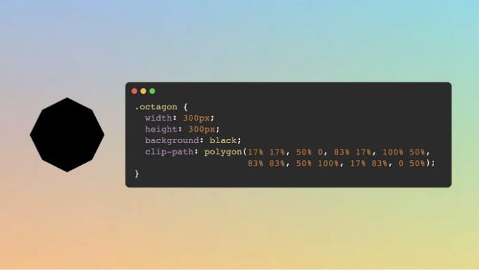

# Spark

<!-- ui-log 수평형 -->
<ins class="adsbygoogle"
  style="display:block"
  data-ad-client="ca-pub-4877378276818686"
  data-ad-slot="9743150776"
  data-ad-format="auto"
  data-full-width-responsive="true"></ins>
<component is="script">
(adsbygoogle = window.adsbygoogle || []).push({});
</component>

스파크는 여덟각형의 변형입니다. 윯이 다른 점은 네 점이 위치하는 곳입니다. 여덟각형에서는 외부로 향하는 데 반해, 스파크에서는 내부로 향할 것입니다(회전된 정사각형을 상상해보세요).

```js
.불꽃 {
  너비: 300px;
  종횡비: 1;
  배경: 검정;
  클립-경로: 다각형(40% 40%, 50% 0, 60% 40%, 100% 50%,
                     60% 60%, 50% 100%, 40% 60%, 0 50%);
}
```

더 멋진 효과를 위해 도형을 요소 자체가 아닌 ::before 및 ::after 가상 요소 양쪽에 적용하십시오. 그런 다음 하나를 45도 회전하십시오(이 회전은 보통 ::before에 적용했을 경우 더 멋있어보입니다).

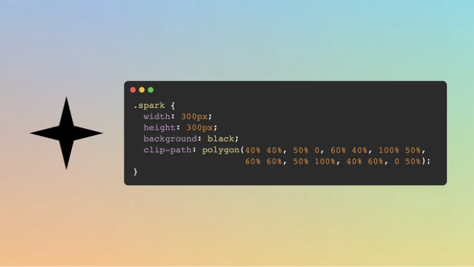

<!-- ui-log 수평형 -->
<ins class="adsbygoogle"
  style="display:block"
  data-ad-client="ca-pub-4877378276818686"
  data-ad-slot="9743150776"
  data-ad-format="auto"
  data-full-width-responsive="true"></ins>
<component is="script">
(adsbygoogle = window.adsbygoogle || []).push({});
</component>

# 달

달은 다양한 형태를 가질 수 있어요. '달 모양'이라 하면 초승달 모양(또는 이감달)을 의미합니다. 원 모양에서 시작하여 상자 그림자를 적용함으로써 쉽게 얻을 수 있어요. 상자 그림자는 수평 이동, 수직 이동, 흐림 정도(선택 사항), 크기(선택 사항), 색상(선택 사항, 텍스트 색상을 기본 값으로 사용) 다섯 가지 값을 허용해요. 초승달이나 이감달을 원하는지에 따라 오른쪽이나 왼쪽에 큰 그림자를 추가할 거예요.

```js
.moon {
  width: 300px;
  aspect-ratio: 1;
  border-radius: 50%;
  box-shadow: -90px 0 0 80px black;
}
```

대안적인 구현으로, 그림자 대신 마스크를 사용하는 것을 추천해요. 이는 마스크 구현을 통해 달의 그림이 페이지 흐름 내에서 명확하게 정의되어 표시되며, 이를 그리는 데 사용된 요소의 크기와 일치하기 때문이에요 (이 문제를 피하기 위해 내부 그림자를 사용할 수 있어요). 게다가, 마스크는 그림자보다 더 많은 유연성을 제공해줘요.

<!-- ui-log 수평형 -->
<ins class="adsbygoogle"
  style="display:block"
  data-ad-client="ca-pub-4877378276818686"
  data-ad-slot="9743150776"
  data-ad-format="auto"
  data-full-width-responsive="true"></ins>
<component is="script">
(adsbygoogle = window.adsbygoogle || []).push({});
</component>

```css
.moon {
  width: 300px;
  aspect-ratio: 1;
  border-radius: 50%;
  -webkit-mask: radial-gradient(circle at 75% 50%, #0000 33%, #000 0);
}
```

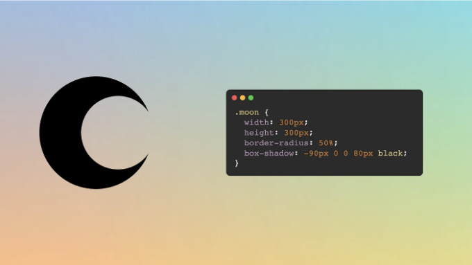

# 얼룩/스플래시

이 모양은 이 목록에 있는 다른 모양들보다 더 복잡합니다. 이 모양을 생성하는 방법에 대해 더 자세히 설명한 기사를 썼습니다(그 안에는 단계별 비디오도 포함되어 있습니다). 반복되는 원뿔 그라데이션을 사용하고 부드럽게 보이도록 필터를 적용하는 것이 아이디어입니다.

<!-- ui-log 수평형 -->
<ins class="adsbygoogle"
  style="display:block"
  data-ad-client="ca-pub-4877378276818686"
  data-ad-slot="9743150776"
  data-ad-format="auto"
  data-full-width-responsive="true"></ins>
<component is="script">
(adsbygoogle = window.adsbygoogle || []).push({});
</component>

많은 다양한 모양으로 변화시키면서 배경의 수나 크기를 변경하여 이 효과를 얻을 수 있어요. 이것과 놀면서 가장 마음에 드는 것을 찾아보세요.

```js
.stain {
  width: 300px;
  height: 300px;
  background:
    repeating-conic-gradient(#000 0 3%, #0000 0 11%),
    repeating-conic-gradient(#0000 0 5%, #000 0 7%) 50% / 60% 60%,
    repeating-conic-gradient(#0000 0 7%, #000 0 9%) 50% / 70% 70%,
    repeating-conic-gradient(#0000 0 11%, #000 0 13%) 50% / 80% 80%,
    radial-gradient(#000 22%, #0000 0),
    #fff;
  mix-blend-mode: darken;
  filter: blur(10px) contrast(100) brightness(1)  grayscale(1);
  box-shadow: 0 0 0 50px #fff;
}
```

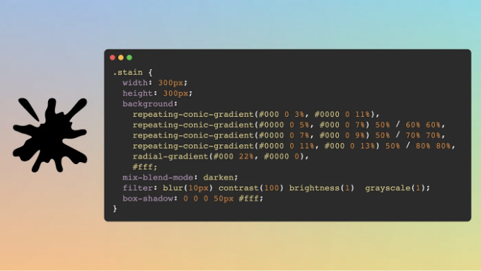

기사를 즐기시고 유익한 정보를 얻으셨기를 바랍니다. 기사를 마무리하며 비디오를 다시 남겨드릴게요, 혹시 모르니까요 ;-)