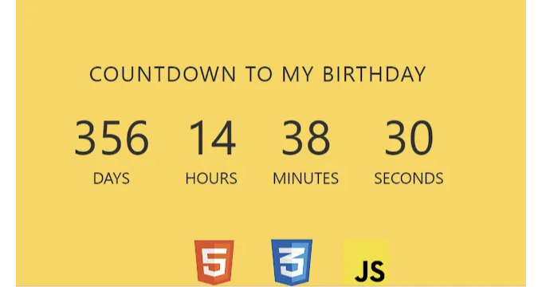
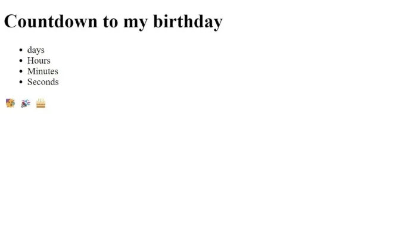
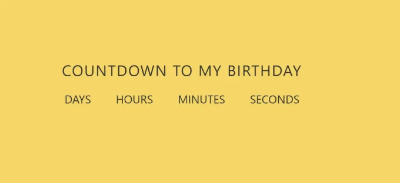
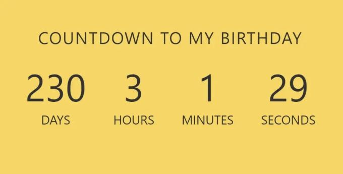

안녕하세요, 코더 여러분! Codewithrandom 블로그에 오신 것을 환영합니다. 이 블로그에서는 HTML, CSS 및 JavaScript를 사용하여 카운트다운 타이머를 만드는 방법을 배웁니다. 카운트다운 타이머는 특정 시간부터 시작하여 제로로 카운트다운되는 기능을 말합니다. 중요한 이벤트가 다가오거나 게임에 남은 시간이 몇 초인 경우, 상황에서 흥미를 더하거나 긴장감을 증가시키는 데 자주 활용됩니다.

카운트다운 타이머는 이벤트, 프레젠테이션, 게임 뿐만 아니라 일상 생활에서도 시간 관리에 활용되는 다양한 상황에서 사용됩니다. 
카운트다운 타이머는 사용자들이 생산성을 높이고 더 효율적으로 작업할 수 있도록 도와줍니다.



카운트다운 타이머 프로젝트는 경주나 수영 경기처럼 시간이 중요한 상황에서 항상 보는데, 우리의 카운트다운 타이머는 특별합니다. 왜냐하면 우리는 날, 시간, 분 그리고 초를 세는 기능을 추가했기 때문입니다. 그러니 카운트다운 타이머 만들기를 시작해봅시다.

<!-- ui-log 수평형 -->
<ins class="adsbygoogle"
  style="display:block"
  data-ad-client="ca-pub-4877378276818686"
  data-ad-slot="9743150776"
  data-ad-format="auto"
  data-full-width-responsive="true"></ins>
<component is="script">
(adsbygoogle = window.adsbygoogle || []).push({});
</component>

우리 블로그를 즐기시기를 바랍니다, 그러면 이제 카운트다운 타이머를 위한 기본 HTML 구조로 시작해 봅시다.

# 카운트다운 타이머 HTML 코드:-

```js
<div class="container">
<h1 id="headline">내 생일까지 카운트다운</h1>
<div id="countdown">
<ul>
<li><span id="days"></span>일</li>
<li><span id="hours"></span>시간</li>
<li><span id="minutes"></span>분</li>
<li><span id="seconds"></span>초</li>
</ul>
</div>
<div id="content" class="emoji">
<span>🥳</span>
<span>🎉</span>
<span>🎂</span>
</div>
</div>
```

카운트다운 타이머를 위한 컨테이너를 만들기 위해 div 태그와 클래스 "container"를 사용할 것입니다. 카운트다운 타이머의 제목은 `h1` 태그를 사용하여 만들 것입니다. 이제 일, 시간, 분 및 초로 카운트다운되는 타이머를 만들어 보겠습니다. 비순차 목록을 활용하여 카운트다운을 만들 것입니다.

<!-- ui-log 수평형 -->
<ins class="adsbygoogle"
  style="display:block"
  data-ad-client="ca-pub-4877378276818686"
  data-ad-slot="9743150776"
  data-ad-format="auto"
  data-full-width-responsive="true"></ins>
<component is="script">
(adsbygoogle = window.adsbygoogle || []).push({});
</component>

새로운 div 태그에 "emoji" 클래스가 추가됩니다. 각기 다른 이모지를 위한 span 태그는 세 가지 태그로 만들 것입니다.

카운트다운 타이머는 모든 HTML 코드가 준비되어 있습니다. 현재 JavaScript 및 CSS는 출력에 포함되어 있지 않습니다. countdown 타이머의 스타일링은 CSS로 처리되며, 기능은 JavaScript로 구성되어 있습니다.

HTML 코드 출력:



<!-- ui-log 수평형 -->
<ins class="adsbygoogle"
  style="display:block"
  data-ad-client="ca-pub-4877378276818686"
  data-ad-slot="9743150776"
  data-ad-format="auto"
  data-full-width-responsive="true"></ins>
<component is="script">
(adsbygoogle = window.adsbygoogle || []).push({});
</component>

# 카운트다운 타이머 CSS 코드:-

```js
/* 일반 스타일링 */
:root {
--smaller: .75;
}
* {
box-sizing: border-box;
margin: 0;
padding: 0;
}
html, body {
height: 100%;
margin: 0;
}
body {
align-items: center;
background-color: #ffd54f;
display: flex;
font-family: -apple-system,
BlinkMacSystemFont,
"Segoe UI",
Roboto,
Oxygen-Sans,
Ubuntu,
Cantarell,
"Helvetica Neue",
sans-serif;
}
.container {
color: #333;
margin: 0 auto;
text-align: center;
}
h1 {
font-weight: normal;
letter-spacing: .125rem;
text-transform: uppercase;
}
li {
display: inline-block;
font-size: 1.5em;
list-style-type: none;
padding: 1em;
text-transform: uppercase;
}
li span {
display: block;
font-size: 4.5rem;
}
.emoji {
display: none;
padding: 1rem;
}
.emoji span {
font-size: 4rem;
padding: 0 .5rem;
}
@media all and (max-width: 768px) {
h1 {
font-size: calc(1.5rem * var(--smaller));
}
li {
font-size: calc(1.125rem * var(--smaller));
}
li span {
font-size: calc(3.375rem * var(--smaller));
}
}
```

- 이 코드에서는 "border-box"로 box-sizing을 설정하고, 모든 여백과 안쪽 여백은 body 태그 셀렉터를 사용하여 리셋합니다. 또한, margin을 "zero"로 설정하고 body의 배경색을 "yellow"로 지정합니다.
- 또한, 표시에 "inline-block"을 사용하고 li 태그 셀렉터를 사용하여 글꼴 크기를 1.5em으로 설정합니다.

이것이 카운트다운 타이머를 위한 모든 CSS 코드입니다. 여기에 Html + Css를 사용한 최신 출력이 있습니다.

<!-- ui-log 수평형 -->
<ins class="adsbygoogle"
  style="display:block"
  data-ad-client="ca-pub-4877378276818686"
  data-ad-slot="9743150776"
  data-ad-format="auto"
  data-full-width-responsive="true"></ins>
<component is="script">
(adsbygoogle = window.adsbygoogle || []).push({});
</component>

CSS 출력:



# JavaScript 카운트 다운 타이머 코드:-

```js
(function () {
const second = 1000,
minute = second * 60,
hour = minute * 60,
day = hour * 24;
// 매년이 변경하고 싶어서 이 섹션을 추가했어요. :-)
// 필요하지 않다면 제거하세요
let today = new Date(),
dd = String(today.getDate()).padStart(2, "0"),
mm = String(today.getMonth() + 1).padStart(2, "0"),
yyyy = today.getFullYear(),
nextYear = yyyy + 1,
dayMonth = "05/29/",
birthday = dayMonth + yyyy;
today = mm + "/" + dd + "/" + yyyy;
if (today > birthday) {
birthday = dayMonth + nextYear;
}
// end
const countDown = new Date(birthday).getTime(),
x = setInterval(function() {
const now = new Date().getTime(),
distance = countDown - now;
document.getElementById("days").innerText = Math.floor(distance / (day)),
document.getElementById("hours").innerText = Math.floor((distance % (day)) / (hour)),
document.getElementById("minutes").innerText = Math.floor((distance % (hour)) / (minute)),
document.getElementById("seconds").innerText = Math.floor((distance % (minute)) / second);
// 날짜가 도달되면 나중에 뭔가를 처리하세요
if (distance < 0) {
document.getElementById("headline").innerText = "오늘은 내 생일이에요!";
document.getElementById("countdown").style.display = "none";
document.getElementById("content").style.display = "block";
clearInterval(x);
}
// 초
}, 0)
}());
```

<!-- ui-log 수평형 -->
<ins class="adsbygoogle"
  style="display:block"
  data-ad-client="ca-pub-4877378276818686"
  data-ad-slot="9743150776"
  data-ad-format="auto"
  data-full-width-responsive="true"></ins>
<component is="script">
(adsbygoogle = window.adsbygoogle || []).push({});
</component>

이 코드는 먼저 dayMonth라는 변수를 선언하여 값은 "09/30/"입니다. 이는 9월이고 연도가 30임을 의미합니다. 다음으로 birthday라는 변수를 선언하여 값은 "09/30/2015"입니다.

그런 다음 현재 날짜와 시간을 저장하는 today라는 변수와 생일부터 현재 시간까지 카운트다운을 위한 간격을 저장할 변수를 선언합니다. setInterval() 함수를 사용하여 매 초마다 텍스트 요소를 업데이트하여 생일이 생성된 이후 경과한 일, 시간, 분 또는 초가 얼마나 지났는지 표시할 수 있습니다.

이 코드는 특정 날짜까지 남은 시간을 계산하는 데 사용됩니다. 코드는 먼저 today라는 변수를 선언하여 "09/30/"로 설정합니다. 다음으로 dayMonth + yyyy로 설정된 birthday라는 또 다른 변수를 선언합니다. 그런 다음 today를 계산하여 mm + "/" + dd + "/" + yyyy으로 설정합니다. 마지막으로, today가 birthday와 같으면 프로그램은 birthday를 dayMonth + nextYear로 설정합니다.

# Html 및 JavaScript 코드를 사용한 카운트다운 타이머의 최종 결과:-

<!-- ui-log 수평형 -->
<ins class="adsbygoogle"
  style="display:block"
  data-ad-client="ca-pub-4877378276818686"
  data-ad-slot="9743150776"
  data-ad-format="auto"
  data-full-width-responsive="true"></ins>
<component is="script">
(adsbygoogle = window.adsbygoogle || []).push({});
</component>



카운트다운 타이머를 완료했습니다. 이제 Html, Css 및 JavaScript를 사용한 사용자 정의된 출력물을 확인해보세요. 카운트다운 타이머 프로젝트를 좋아하셨기를 바랍니다. 출력 영상과 프로젝트 스크린샷을 확인하실 수 있습니다. 다른 블로그를 읽고 프런트엔드 개발에 대한 지식을 쌓아보세요.

감사합니다!

이 포스트는 Html, Css 및 JavaScript를 사용하여 카운트다운 타이머를 만드는 방법을 가르쳐줍니다. 만약 실수나 혼란이 있으면 언제든 댓글을 남겨 질문하거나 쉽게 배울 수 있도록 도와드리겠습니다.

<!-- ui-log 수평형 -->
<ins class="adsbygoogle"
  style="display:block"
  data-ad-client="ca-pub-4877378276818686"
  data-ad-slot="9743150776"
  data-ad-format="auto"
  data-full-width-responsive="true"></ins>
<component is="script">
(adsbygoogle = window.adsbygoogle || []).push({});
</component>

작성자 — Code With Random/Anki

작성 코드 — Silver Drop