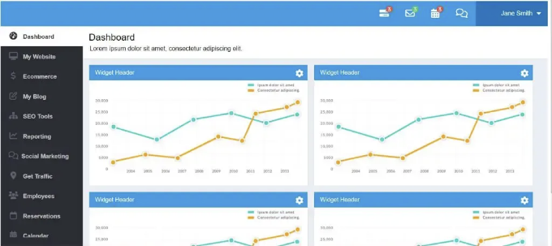

안녕하세요 학습자 여러분……. Codewithrandom 블로그에 오신 것을 환영합니다… 오늘 이 블로그에서는 HTML과 CSS 코드만을 사용하여 대시보드 디자인을 어떻게 만드는지 배우게 될 거에요. 이 대시보드 디자인 프로젝트에서 많은 것을 배울 거예요.

그리고 이 블로그를 읽은 후에는 HTML과 CSS를 사용해 자신만의 대시보드를 만들 수 있을 거라고 명백히 확신합니다.

대시보드란 무엇인가요?

대시보드는 시간 내에 시각적 데이터를 의미 있게 표시하고 쉽게 참조하고 빠르게 추론할 수 있도록 도와주는 차트를 제공하는 짧은 보고서입니다.

<!-- ui-log 수평형 -->
<ins class="adsbygoogle"
  style="display:block"
  data-ad-client="ca-pub-4877378276818686"
  data-ad-slot="9743150776"
  data-ad-format="auto"
  data-full-width-responsive="true"></ins>
<component is="script">
(adsbygoogle = window.adsbygoogle || []).push({});
</component>

대시보드는 모든 데이터를 시각적으로 표시하는 것입니다. 여러 가지 방식으로 사용될 수 있지만, 주요 목적은 주요 성과 지표(KPI)와 같은 정보를 한 눈에 제공하는 것입니다.

대시보드는 일반적으로 페이지에서 정보를 받아 연결된 데이터베이스로부터 정보를 받습니다. 많은 경우 구성 가능하며, 어떤 데이터를 보고 싶은지 선택하고 숫자를 시각화하기 위해 차트나 그래프를 포함할지 여부를 선택할 수 있습니다.

# 대시보드 HTML 코드:-

여기서 sidebar div 클래스가 white label인 섹션 id를 추가하려고 합니다. 그런 다음 대시보드를 하나씩 나열하려 합니다.

<!-- ui-log 수평형 -->
<ins class="adsbygoogle"
  style="display:block"
  data-ad-client="ca-pub-4877378276818686"
  data-ad-slot="9743150776"
  data-ad-format="auto"
  data-full-width-responsive="true"></ins>
<component is="script">
(adsbygoogle = window.adsbygoogle || []).push({});
</component>

여기 우리가 사용 중인 기본적인 스타일링이 있어요. CSS를 사용하고 있고 아이콘은 Font Awesome를 사용하고 있어요. 그리고 그들의 cdn(콘텐츠 전송 네트워크)을 HTML 파일의 제목 태그에 삽입하고 있어요.

자세한 내용과 사용 방법은 font-awesome 웹사이트를 참조해볼 수 있어요 Link

사이드바 내비게이션을 위한 한 가지, 메인 내용을 위한 다른 한 가지 주요 섹션을 만들고 있어요. 그래서 우리는 의미 있는 태그인 section 태그를 사용하여 두 개의 섹션을 만들었어요.

의미 있는 요소 = 의미를 갖는 요소들이에요.

<!-- ui-log 수평형 -->
<ins class="adsbygoogle"
  style="display:block"
  data-ad-client="ca-pub-4877378276818686"
  data-ad-slot="9743150776"
  data-ad-format="auto"
  data-full-width-responsive="true"></ins>
<component is="script">
(adsbygoogle = window.adsbygoogle || []).push({});
</component>

# 시멘틱 요소란 무엇인가요?

시멘틱 요소는 브라우저와 개발자 모두에게 그 의미를 명확히 전달하는 요소입니다.

비-시멘틱 요소의 예: `div`와 `span` - 내용에 대해 아무 정보도 전달하지 않습니다.

시멘틱 요소의 예: `form`, `table`, `article` - 내용을 명확히 정의합니다.

<!-- ui-log 수평형 -->
<ins class="adsbygoogle"
  style="display:block"
  data-ad-client="ca-pub-4877378276818686"
  data-ad-slot="9743150776"
  data-ad-format="auto"
  data-full-width-responsive="true"></ins>
<component is="script">
(adsbygoogle = window.adsbygoogle || []).push({});
</component>

HTML에서 의미론적 요소많은 웹사이트에는 네비게이션, 헤더 및 푸터를 나타내는 HTML 코드가 포함되어 있습니다.
HTML에서는 웹 페이지의 다른 부분을 정의하는 데 사용할 수 있는 의미론적 요소가 있습니다:

- `article`
- `aside`
- `details`
- `figure`
- `footer`
- `header`
- `main`
- `mark`
- `nav`
- `section`
- `summary`

섹션 태그가 무엇인지 확실히 이해했으면 당신의 내용을 진행해보세요. 먼저 div 태그, span 태그, image 태그, 의미론적 태그, 클래스 및 아이디와 같은 HTML의 기본 개념을 익혀보세요.

<!-- ui-log 수평형 -->
<ins class="adsbygoogle"
  style="display:block"
  data-ad-client="ca-pub-4877378276818686"
  data-ad-slot="9743150776"
  data-ad-format="auto"
  data-full-width-responsive="true"></ins>
<component is="script">
(adsbygoogle = window.adsbygoogle || []).push({});
</component>

위 코드에서는 Amazon AWS에 업로드된 일부 사진도 사용하고 있어. 걱정 마. 기본 정보를 위해 Amazon AWS 서비스에 대해 알 필요는 없어. AWS 서비스는 아마존에서 제공하는 클라우드 서비스야.

```js
<section id="sidebar">
<div class="white-label">
</div>
<div id="sidebar-nav">
<ul>
<li class="active"><a href="#"><i class="fa fa-dashboard"></i> 대시보드</a></li>
<li><a href="#"><i class="fa fa-desktop"></i> 내 웹사이트</a></li>
<li><a href="#"><i class="fa fa-usd"></i> 전자상거래</a></li>
<li><a href="#"><i class="fa fa-pencil-square-o"></i> 내 블로그</a></li>
<li><a href="#"><i class="fa fa-sitemap"></i> SEO 도구</a></li>
<li><a href="#"><i class="fa fa-line-chart"></i> 보고서</a></li>
<li><a href="#"><i class="fa fa-comments-o"></i> 소셜 마케팅</a></li>
<li><a href="#"><i class="fa fa-map-marker"></i> 트래픽 얻기</a></li>
<li><a href="#"><i class="fa fa-users"></i> 직원</a></li>
<li><a href="#"><i class="fa fa-calendar-o"></i> 예약</a></li>
<li><a href="#"><i class="fa fa-calendar"></i> 캘린더</a></li>
</ul>
</div>
</section>
```

- 먼저 `section` 태그를 사용하여 id가 "sidebar"인 대시보드 구조용 섹션을 만들 거야.
- 이제 섹션 태그 안에 대시보드의 사이드바에 대한 다른 리스트 아이템을 생성할 거야. 순서 없는 목록 태그를 사용하여 사이드바 메뉴 항목 목록을 만들 거야. 사이드바의 메뉴 리스트 아이템을 만들기 위해 아이콘 클래스와 일부 항목을 추가할 거야.
- 사이드바의 메뉴 항목은 `a` 태그 내에 위치해 있어서 대시보드 텍스트에 하이퍼링크를 추가할 거야.

대시보드 디자인을 위한 더 많은 HTML 코드

<!-- ui-log 수평형 -->
<ins class="adsbygoogle"
  style="display:block"
  data-ad-client="ca-pub-4877378276818686"
  data-ad-slot="9743150776"
  data-ad-format="auto"
  data-full-width-responsive="true"></ins>
<component is="script">
(adsbygoogle = window.adsbygoogle || []).push({});
</component>

```js
<section id="content">
    <div id="header">
        <div class="header-nav">
            <div class="menu-button"><!--<i class="fa fa-navicon"></i>--></div>
            <div class="nav">
                <ul>
                    <li class="nav-settings">
                        <div class="font-icon"><i class="fa fa-tasks"></i></div>
                    </li>
                    <li class="nav-mail">
                        <div class="font-icon">
                            <i class="fa fa-envelope-o"></i>
                        </div>
                    </li>
                    <li class="nav-calendar">
                        <div class="font-icon">
                            <i class="fa fa-calendar"></i>
                        </div>
                    </li>
                    <li class="nav-chat">
                        <div class="font-icon">
                            <i class="fa fa-comments-o"></i>
                        </div>
                    </li>
                    <li class="nav-profile">
                        <div class="nav-profile-image">
                            
                            <div class="nav-profile-name">
                                Jane Smith<i class="fa fa-caret-down"></i>
                            </div>
                        </div>
                    </li>
                </ul>
            </div>
        </div>
    </div>
    <div class="content">
        <div class="content-header">
            <h1>대시보드</h1>
            <p>Lorem ipsum dolor sit amet, consectetur adipiscing elit.</p>
        </div>
        <div class="widget-box sample-widget">
            <div class="widget-header">
                <h2>위젯 헤더</h2>
                <i class="fa fa-cog"></i>
            </div>
            <div class="widget-content">
                
            </div>
        </div>
        <div class="widget-box sample-widget">
            <div class="widget-header">
                <h2>위젯 헤더</h2>
                <i class="fa fa-cog"></i>
            </div>
            <div class="widget-content">
                
            </div>
        </div>
        <div class="widget-box sample-widget">
            <div class="widget-header">
                <h2>위젯 헤더</h2>
                <i class="fa fa-cog"></i>
            </div>
            <div class="widget-content">
                
            </div>
        </div>
        <div class="widget-box sample-widget">
            <div class="widget-header">
                <h2>위젯 헤더</h2>
                <i class="fa fa-cog"></i>
            </div>
            <div class="widget-content">
                
            </div>
        </div>
    </div>
</section>
```

- 이제 콘텐츠 영역의 프레임워크를 구축하기 시작할 것입니다. section 태그를 사용하여 id가 "content"인 새 섹션을 만들 것입니다.
- 먼저 대시보드의 헤더를 만들기 위해 섹션 내부에 navbar 태그를 사용할 것입니다. 그다음 대시보드의 navbar를 디자인할 것입니다.
- font-awesome 클래스를 활용하여 목록 안에 아이콘을 추가할 것입니다.
- 이제 대시보드 내용에 다양한 그래프를 추가하기 위해 div와 image 태그를 사용할 것입니다.

HTML 코드 출력 :-

# 대시보드 CSS 코드:-```

<!-- ui-log 수평형 -->
<ins class="adsbygoogle"
  style="display:block"
  data-ad-client="ca-pub-4877378276818686"
  data-ad-slot="9743150776"
  data-ad-format="auto"
  data-full-width-responsive="true"></ins>
<component is="script">
(adsbygoogle = window.adsbygoogle || []).push({});
</component>

페이지 대시보드의 기본 레이아웃은 완료되었지만 여전히 지루하고 노골적입니다. 그래서 이제 어떻게 해야할까요?

만약 몇 가지 색상과 정렬을 추가한다면 어떨까요? 아래를 확인해 보세요:-

우리는 HTML 콘텐츠를 스타일링하기 위해 기본적인 CSS 개념을 사용할 것입니다. 클래스와 아이디 그리고 선택자에 대한 개념을 제대로 이해하고 있다면 CSS 코드로 나아가세요. 우리는 Border-Box 모델, Flex-box를 사용하여 스타일을 적용하고, 여백(padding), 외부 여백(margin), 플로트(float)와 같은 기본적인 개념을 사용할 것입니다.

```js
여기에 CSS 코드가 입력됩니다.
```

<!-- ui-log 수평형 -->
<ins class="adsbygoogle"
  style="display:block"
  data-ad-client="ca-pub-4877378276818686"
  data-ad-slot="9743150776"
  data-ad-format="auto"
  data-full-width-responsive="true"></ins>
<component is="script">
(adsbygoogle = window.adsbygoogle || []).push({});
</component>

Step1: body 태그 선택기(body)를 사용하여 대시보드의 글꼴을 "Open Sans"로, 높이 속성을 본문 높이를 "100%"로, 배경 속성을 배경 색상을 "연한 파랑"으로 설정하여 대시보드에 기본 스타일을 추가할 수 있습니다.

이미지의 최대 너비는 (img) 태그 선택기를 사용하여 100%로 설정되며, 목록 스타일은 (ul) 태그 선택기를 사용하여 "없음"으로 설정됩니다.

```js
body {
    font-family: "Open Sans", sans-serif;
    height: 100%;
    background: #FFFFFF;
}
img {
    max-width: 100%;
}
ul {
    list-style: none;
    margin: 0;
    padding: 0;
}
a {
    text-decoration: none;
}
```

Step2: 이제 (#header)를 사용하여 요소와 대시보드 헤더를 스타일링할 것입니다. 헤더의 왼쪽과 오른쪽을 왼쪽으로 정렬하고 너비를 100%로 설정할 것입니다. 자식 구성 요소와 메뉴 목록 항목에도 스타일이 적용됩니다.

<!-- ui-log 수평형 -->
<ins class="adsbygoogle"
  style="display:block"
  data-ad-client="ca-pub-4877378276818686"
  data-ad-slot="9743150776"
  data-ad-format="auto"
  data-full-width-responsive="true"></ins>
<component is="script">
(adsbygoogle = window.adsbygoogle || []).push({});
</component>

```js
#header {
    float: left;
    width: 100%;
    background: #ffffff;
    position: relative;
}
.white-label {
    float: left;
    background: #33373B;
    max-width: 210px;
    padding: 10px;
    min-height: 44px;
    background: #279BE4;
    width: 100%;
    max-height: 44px;
}
.white-label img {
    max-height: 43px;
}
.header-nav {
    min-height: 64px;
    -webkit-box-sizing: border-box;
    -moz-box-sizing: border-box;
    box-sizing: border-box;
    background: #279BE4;
}
.menu-button {
    float: left;
    font-size: 29px;
    color: #fff;
    padding: 12px 19px;
}
.nav ul {
    height: 64px;
    float: right;
}
.nav ul li {
    float: left;
    position: relative;
    padding: 11px;
}
.nav > ul > li:first-child {
    border-left: none;
}
.nav ul li a {
    color: #fff;
    padding: 1px;
    float: left;
}
.nav ul li i {
    color: #fff;
}
.nav ul li:hover {
    background: #01A9F0;
    color: #fff;
}
.user-profile {
    float: right;
}
.user-profile > div {
    float: left;
    padding: 20px 8px;
    position: relative;
}
.user-profile i {
    font-size: 1.2em;
    color: #5F6F86;
}
.user-profile i:hover {
    color: #397AC5;
}
.font-icon i:after {
    position: absolute;
    content: "3";
    background: #E74C3C;
    color: #fff;
    font-size: 12px;
    border-radius: 50%;
    width: 10px;
    height: 10px;
    padding: 3px 4px 4px 3px;
    text-align: center;
    top: 12px;
    right: 11px;
}
.font-icon {
    padding: 8px 10px;
}
.font-icon i {
    font-size: 24px;
}
.nav-mail .font-icon i:after {
    background: #2ECC71;
}
div.user-image {
    padding: 9px 5px;
    margin: 0 5px;
    border-left: 1px solid #ccc;
    border-right: 1px solid #ccc;
}
.nav-profile {
    background: #0274BD;
}
.nav-profile-image img {
    width: 39px;
    height: 41px;
    border-radius: 50%;
    float: left;
}
.nav-profile-name {
    float: right;
    margin: 11px 7px 8px 14px;
    color: #fff;
}
.nav-profile-name i {
    padding: 0 0 0 11px;
}
.nav-chat i:after {
    display: none;
}
```

<<<<<<<./img/SimpleDashboardUsingHTMLandCSSSourceCode_0.png

Step3: 사이드바에 스타일이 적용됩니다. overflow 속성을 사용하여 overflow를 "hidden"으로 설정합니다. 사이드바는 float 속성을 사용하여 왼쪽으로 떠 있으며 다음과 같은 설정이 있습니다: 너비 210px，높이 100%，기타. 우리의 사이드바 요소는 이제 스타일링을 받고 글꼴 색상이 회색으로 변경됩니다.

```js
#sidebar {
    overflow: hidden;
    width: 210px;
    height: 100%;
    float: left;
    background: #2A2D33;
}
#sidebar-nav {
    width: 106%;
    height: calc(100% - 95px);
    padding: 0;
    background: #2A2D33;
    border-right: 1px solid #E0E0E0;
    overflow-y: scroll;
}
#sidebar-nav h2 {
    color: #60636B;
    float: left;
    width: 100%;
    font-size: 0.8em;
    font-family: "Open Sans", sans-serif;
    font-weight: 600;
    text-transform: uppercase;
    padding: 3px 0 2px 20px;
    border-top: 1px solid #4D4C4C;
    box-sizing: border-box;
    margin: 10px 0;
}
#sidebar-nav ul {
}
#sidebar-nav ul li {
}
#sidebar-nav ul li a {
    color: #C2C2C2;
    font-size: 0.95em;
    padding: 15px 20px;
    float: left;
    width: 100%;
    font-weight: 600;
    -webkit-box-sizing: border-box;
    -moz-box-sizing: border-box;
    box-sizing: border-box;
}
#sidebar-nav ul li:hover a,
#sidebar-nav ul li:hover a i,
#sidebar-nav li.active a,
#sidebar-nav li.active a i {
    color: #333;
}
#sidebar-nav ul li:hover a {
    background: #fff;
    color: #333;
}
#sidebar-nav ul li.active a {
    background: #fff;
    color: #333;
}
#sidebar-nav ul li.active a i {
    background: #fff;
}
#sidebar-nav i {
    padding-right: 8px;
    font-size: 1.3em;
    color: #60636B;
    width: 25px;
    text-align: center;
}
```

<!-- ui-log 수평형 -->
<ins class="adsbygoogle"
  style="display:block"
  data-ad-client="ca-pub-4877378276818686"
  data-ad-slot="9743150776"
  data-ad-format="auto"
  data-full-width-responsive="true"></ins>
<component is="script">
(adsbygoogle = window.adsbygoogle || []).push({});
</component>

단계4: 이제 남은 일은 콘텐츠를 스타일링하고 왼쪽으로 플로트 속성을 설정하는 것입니다. 저희 콘텐츠는 높이를 100%로 설정했습니다. 웹 사이트의 다양한 요소에 클래스 셀렉터를 사용하여 스타일링을 적용할 것입니다. 선택한 위젯 헤더의 배경색은 "파란색"입니다. 스타일링에 익숙해지면 코드를 읽는 것이 좋습니다.

```js
.content {
    float: left;
    background: #E9EEF4;
    width: 100%;
    height: calc(100% - 64px);
    -webkit-box-sizing: border-box;
    -moz-box-sizing: border-box;
    box-sizing: border-box;
}
.content-header {
    background: #fff;
    float: left;
    width: 100%;
    margin-bottom: 15px;
    padding: 15px;
    -webkit-box-sizing: border-box;
    -moz-box-sizing: border-box;
    box-sizing: border-box;
    border-bottom: 1px solid #ccc;
}
.content-header h1 {
    margin: 0;
    font-weight: normal;
    padding-bottom: 5px;
}
.content-header p {
    margin: 0;
    padding-left: 2px;
}
.widget-box {
    background: #fff;
    border: 1px solid #E0E0E0;
    float: left;
    width: 100%;
    margin: 0 0 15px 15px;
}
.widget-header {
    background: #279BE4;
}
.widget-header h2 {
    font-size: 15px;
    font-weight: normal;
    margin: 0;
    padding: 11px 15px;
    color: #F9F9F9;
    display: inline-block;
}
.sample-widget {
    max-width: 47%;
}
.widget-box .fa-cog {
    float: right;
    color: #fff;
    margin: 11px 11px 0 0;
    font-size: 20px;
}
```

# Html 및 Css를 사용한 대시보드 최종 출력:-


```

<!-- ui-log 수평형 -->
<ins class="adsbygoogle"
  style="display:block"
  data-ad-client="ca-pub-4877378276818686"
  data-ad-slot="9743150776"
  data-ad-format="auto"
  data-full-width-responsive="true"></ins>
<component is="script">
(adsbygoogle = window.adsbygoogle || []).push({});
</component>

간단한 대시보드 디자인 코드를 HTML 및 CSS로 제공했어요.

이 튜토리얼이 마음에 들었으면 좋겠고, HTML 및 CSS를 사용하여 대시보드 디자인을 할 수 있어서 프론트엔드 개발 효율을 향상시킬 수 있기를 바라요.

문제가 발생하면 언제든지 연락해주시거나 문제에 대해 댓글을 남겨주세요.

또한, 감사의 댓글을 아래에 남겨주셔도 좋아요. 이렇게 하면 더 많은 유용한 콘텐츠를 제작할 동기부여가 될 거예요.

<!-- ui-log 수평형 -->
<ins class="adsbygoogle"
  style="display:block"
  data-ad-client="ca-pub-4877378276818686"
  data-ad-slot="9743150776"
  data-ad-format="auto"
  data-full-width-responsive="true"></ins>
<component is="script">
(adsbygoogle = window.adsbygoogle || []).push({});
</component>

감사합니다.....

## 이 대시보드를 위해 어떤 코드 편집기를 사용하시나요?

이 대시보드를 만들 때는 VS Code Studio를 사용하는 것을 추천합니다. 사용하기 쉽고 간편합니다.

## 이 프로젝트는 반응형인가요?

<!-- ui-log 수평형 -->
<ins class="adsbygoogle"
  style="display:block"
  data-ad-client="ca-pub-4877378276818686"
  data-ad-slot="9743150776"
  data-ad-format="auto"
  data-full-width-responsive="true"></ins>
<component is="script">
(adsbygoogle = window.adsbygoogle || []).push({});
</component>

네, 이 대시보드 디자인 프로젝트는 반응형으로 제작되었어요.

**이 프로젝트를 만들기 위해 외부 링크를 사용하나요?**

네, 대시보드 디자인에서 아이콘을 보여주기 위해 폰트 어썸 아이콘 CDN 링크를 사용했어요.