## 앱 성능 향상하기

안녕하세요! 이 짧은 안내서에서는 CSS를 212kB에서 32.1kB로 줄이면서 (84.91%의 코드 감소) 여전히 3rd-party 스타일 라이브러리를 사용하고 앱의 미학을 완전히 유지하는 방법을 공유하고 싶어요.

이 예제 프로젝트는 Astro를 사용하여 만들어졌어요.

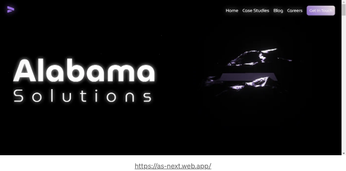

<!-- ui-log 수평형 -->
<ins class="adsbygoogle"
  style="display:block"
  data-ad-client="ca-pub-4877378276818686"
  data-ad-slot="9743150776"
  data-ad-format="auto"
  data-full-width-responsive="true"></ins>
<component is="script">
(adsbygoogle = window.adsbygoogle || []).push({});
</component>

우리는 이런 과정을 거치게 될 거에요:

- 3rd-party CSS에서 필요할 때만 사용하는 맞춤 CSS로 변경하기.
- 다른 CSS 코드 리소스를 검토하고 개선하기.
- CSS 구조 작성 방법을 다시 생각해보기.

시작해볼까요? ✨

# 1. 3rd-party CSS에서 필요할 때만 사용하는 맞춤 CSS로 변경하기.

<!-- ui-log 수평형 -->
<ins class="adsbygoogle"
  style="display:block"
  data-ad-client="ca-pub-4877378276818686"
  data-ad-slot="9743150776"
  data-ad-format="auto"
  data-full-width-responsive="true"></ins>
<component is="script">
(adsbygoogle = window.adsbygoogle || []).push({});
</component>

일일 프론트엔드 개발자의 일상에서 스타일 라이브러리(예: 부트스트랩, Tailwind)를 사용하는 것은 흔한 작업입니다.

만약 여러분이 Lighthouse에 의해 보고된 사이트 성능을 향상시켜본 적이 있다면, 몇 가지 권장 사항 중에는 사용되지 않는 스타일/스크립트 코드를 줄이라는 것을 알고 계실 겁니다.

Chrome의 개발자 도구에는 Coverage라는 매우 흥미로운 도구가 제공되는데, 이는 앱과의 완전한 상호작용 이후에 전혀 사용되지 않은 코드 섹션이 무엇인지 알 수 있도록 도와줍니다.*

*이에 대해 자세히 이해하려면 Coverage 도구 사용 설명서를 확인해 보세요.

<!-- ui-log 수평형 -->
<ins class="adsbygoogle"
  style="display:block"
  data-ad-client="ca-pub-4877378276818686"
  data-ad-slot="9743150776"
  data-ad-format="auto"
  data-full-width-responsive="true"></ins>
<component is="script">
(adsbygoogle = window.adsbygoogle || []).push({});
</component>

## 우리가 있는 곳.

이 예제를 부트스트랩을 사용하여 공유하려고 합니다. 우선 주목해야 할 첫 번째 것은 프로젝트 종속성으로 사용하지 않고 CDN을 통해 사용한다는 것이며, 그 이유가 있습니다. 왜냐하면 그 이유를 알게 될 것입니다.

부트스트랩의 CDN을 사용하여 우리가 무엇을 하는지 간단히 되짚어보겠습니다.

공식 부트스트랩 문서에서는 전체 미니파이드 패키지(225.97 kB)를 설치하라고 안내합니다.

<!-- ui-log 수평형 -->
<ins class="adsbygoogle"
  style="display:block"
  data-ad-client="ca-pub-4877378276818686"
  data-ad-slot="9743150776"
  data-ad-format="auto"
  data-full-width-responsive="true"></ins>
<component is="script">
(adsbygoogle = window.adsbygoogle || []).push({});
</component>

```js
<link href="https://cdn.jsdelivr.net/npm/bootstrap@5.3.0-alpha3/dist/css/bootstrap.min.css" rel="stylesheet" integrity="sha384-KK94CHFLLe+nY2dmCWGMq91rCGa5gtU4mk92HdvYe+M/SXH301p5ILy+dN9+nJOZ" crossorigin="anonymous">
```

하지만 이 경우에는 Bootstrap 라이브러리 전체를 가져오고 싶지 않습니다. 필요한 것만 가져오려고 합니다. 필요한 내용을 확인하려면 루트 CSS CDN의 제공 페이지로 이동하세요:

```js
https://cdn.jsdelivr.net/npm/bootstrap@5.3.0-alpha2/dist/css/
```

내 경우에는 유틸리티.css (104.09 kB)와 그리드.css (68.28 kB)만 필요하다는 것을 알고 있습니다.```

<!-- ui-log 수평형 -->
<ins class="adsbygoogle"
  style="display:block"
  data-ad-client="ca-pub-4877378276818686"
  data-ad-slot="9743150776"
  data-ad-format="auto"
  data-full-width-responsive="true"></ins>
<component is="script">
(adsbygoogle = window.adsbygoogle || []).push({});
</component>

이 시점에서, 우리는 다음과 같은 커버리지를 가지고 있어요. 사용되지 않는 스타일이 92%라구요.

너무 많아요.

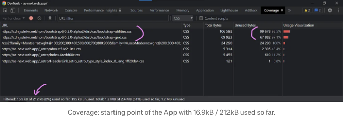

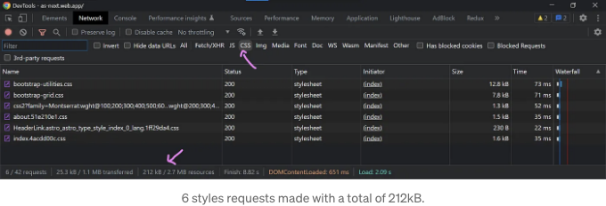

<!-- ui-log 수평형 -->
<ins class="adsbygoogle"
  style="display:block"
  data-ad-client="ca-pub-4877378276818686"
  data-ad-slot="9743150776"
  data-ad-format="auto"
  data-full-width-responsive="true"></ins>
<component is="script">
(adsbygoogle = window.adsbygoogle || []).push({});
</component>

지금은 부트스트랩에 집중해보죠. 🧙‍♂️ 마법 같은 기술이 나옵니다.

## 실습

사이트에서 사용된 CSS만 내보내려고 애썼는데.. 가능할까요?

그렇게 된다면 좋겠죠?

<!-- ui-log 수평형 -->
<ins class="adsbygoogle"
  style="display:block"
  data-ad-client="ca-pub-4877378276818686"
  data-ad-slot="9743150776"
  data-ad-format="auto"
  data-full-width-responsive="true"></ins>
<component is="script">
(adsbygoogle = window.adsbygoogle || []).push({});
</component>

여기 내 최신 기여물이 있어요:

**'Sniper CSS'**:

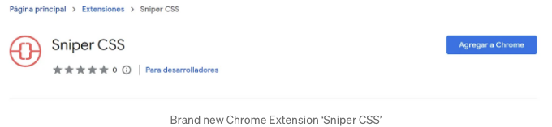

설치한 후 사용하기 정말 쉬워요. 사이트를 열고 확장 프로그램을 클릭한 후 '스나이퍼 활성화' 버튼을 클릭하면 플러그인이 작업을 수행해줄 거에요!

<!-- ui-log 수평형 -->
<ins class="adsbygoogle"
  style="display:block"
  data-ad-client="ca-pub-4877378276818686"
  data-ad-slot="9743150776"
  data-ad-format="auto"
  data-full-width-responsive="true"></ins>
<component is="script">
(adsbygoogle = window.adsbygoogle || []).push({});
</component>

이 확장 프로그램은 사이트의 모든 가능한 시나리오를 수집하려고 합니다: 다양한 클라이언트 디스플레이, 사용자 에이전트, 다크 및 라이트 테마, 전체 페이지 스크롤, 각 요소의 가상 상태 등등.

자동으로 최적화된 CSS 파일을 생성하고 다운로드할 것입니다.

```js
// Astrojs와 VSCode를 사용 중이라면 이 정규식을 사용해 :where(.astro-whatever)를 모두 빈 공간으로 교체하세요.
// 이렇게 하면 Astro가 추가한 모든 사용자 정의 클래스를 제거하여 스타일을 깨지 않게 합니다.
:where\(\.+([aA-zZ])+-+([aA-zZ])+\)
```

## 결과

<!-- ui-log 수평형 -->
<ins class="adsbygoogle"
  style="display:block"
  data-ad-client="ca-pub-4877378276818686"
  data-ad-slot="9743150776"
  data-ad-format="auto"
  data-full-width-responsive="true"></ins>
<component is="script">
(adsbygoogle = window.adsbygoogle || []).push({});
</component>

우리는 여전히 기본 Astro 스타일을 사용하고 있지만 이제는 Sniper-CSS bootstrap_custom.css 파일을 갖고 있어요. 

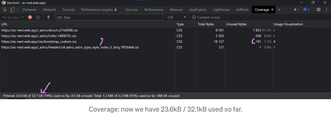

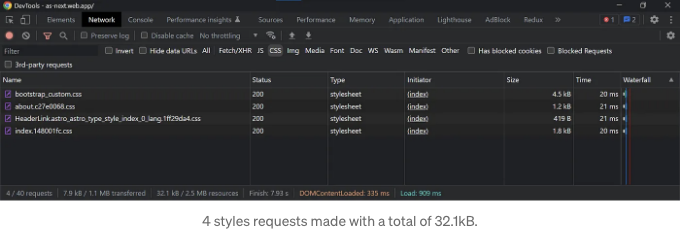

우리는 212kB의 스타일로 시작했지만 지금은 딱 32.1kB만 남았어요. 🔥

<!-- ui-log 수평형 -->
<ins class="adsbygoogle"
  style="display:block"
  data-ad-client="ca-pub-4877378276818686"
  data-ad-slot="9743150776"
  data-ad-format="auto"
  data-full-width-responsive="true"></ins>
<component is="script">
(adsbygoogle = window.adsbygoogle || []).push({});
</component>

작업 후 스타일이 약간 증가했습니다. 이는 일부 인라인 코드나 로컬 스타일이 중복되었을 수 있기 때문입니다.

## 2. 다른 CSS 코드 리소스를 검토하고 개선하기

스크린샷에서 본바와 같이, 우리가 개선할 수 있는 다른 CSS 리소스가 있다는 것을 알 수 있었습니다. 예를 들어, 구글 폰트 등이 있습니다.

구글 폰트 사용에 대한 커버리지 탭의 내용을 확인해보세요.

<!-- ui-log 수평형 -->
<ins class="adsbygoogle"
  style="display:block"
  data-ad-client="ca-pub-4877378276818686"
  data-ad-slot="9743150776"
  data-ad-format="auto"
  data-full-width-responsive="true"></ins>
<component is="script">
(adsbygoogle = window.adsbygoogle || []).push({});
</component>

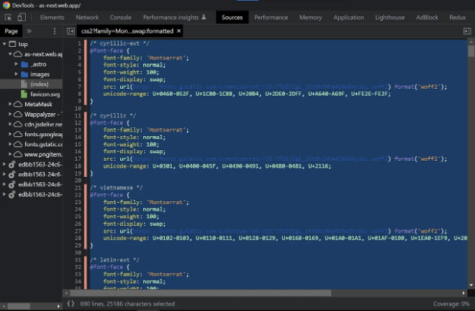

사용되고 있지 않은 코드들이 있는 것 같네요. 이건 옳지 않죠. 하지만 우리가 얼마나 많은 코드가 불필요한지 확인할 수 있어요.

이 경우에는 Google Fonts가 다른 언어를 위해 Montserrat와 MuseoModerno를 지원하고 있습니다.

더 많은 정보를 알고 싶다면 Quora를 확인해보세요. 또는 Google이 이에 대해 어떻게 생각하는지 읽어볼 수도 있어요.

<!-- ui-log 수평형 -->
<ins class="adsbygoogle"
  style="display:block"
  data-ad-client="ca-pub-4877378276818686"
  data-ad-slot="9743150776"
  data-ad-format="auto"
  data-full-width-responsive="true"></ins>
<component is="script">
(adsbygoogle = window.adsbygoogle || []).push({});
</component>

다시 한번 이 예시 사이트에서 전 세계 모든 언어에 대한 완전한 지원을 원하지 않는다는 것을 알았어요. 라틴어만 지원하면 돼요.

라틴어 언어를 지원하는 모든 글꼴 무게를 사용하는 "fonts.css"라는 새 파일을 만드세요. 차이는 여기 있어요:

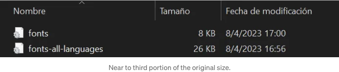

### 3. CSS 구조를 어떻게 다시 작성할지 다시 생각해보세요.

<!-- ui-log 수평형 -->
<ins class="adsbygoogle"
  style="display:block"
  data-ad-client="ca-pub-4877378276818686"
  data-ad-slot="9743150776"
  data-ad-format="auto"
  data-full-width-responsive="true"></ins>
<component is="script">
(adsbygoogle = window.adsbygoogle || []).push({});
</component>

만약 CSS를 개선하고 싶다면, 여기 몇 가지 조언이 있어요:

## 서버에서 로컬 콘텐츠로 변환하기

개발 단계에서는 보통 3rd-party 콘텐츠를 사용하겠지만, 프로젝트를 완료하면 라이브러리와 함께 작업한 내용에 기반한 사용자 정의 CSS 파일과 구성을 사용하게 될 거예요.

이것을 기억해두세요. 이것은 사이트 메트릭스를 개선하려고 시도할 때 이상적으로 한 번 해야 하는 작업이에요.

<!-- ui-log 수평형 -->
<ins class="adsbygoogle"
  style="display:block"
  data-ad-client="ca-pub-4877378276818686"
  data-ad-slot="9743150776"
  data-ad-format="auto"
  data-full-width-responsive="true"></ins>
<component is="script">
(adsbygoogle = window.adsbygoogle || []).push({});
</component>

## 어떤 규칙을 잃어버리셨나요? 혹은 반복된 규칙을 발견하셨나요?

'Sniper CSS' 확장 프로그램은 모든 가능한 CSS를 내보냅니다. 그 역할을 충분히 잘 하지만 향후 업그레이드를 통해 더 개선해야 할 부분이 있습니다. 따라서 스타일을 교체하고 무엇이 누락되었는지 확인해보세요.

스타일 손실을 피하기 위해 Keyframes 및 기타 At-Rules를 따로 파일에 보관해두는 것이 좋습니다.

# 마무리

<!-- ui-log 수평형 -->
<ins class="adsbygoogle"
  style="display:block"
  data-ad-client="ca-pub-4877378276818686"
  data-ad-slot="9743150776"
  data-ad-format="auto"
  data-full-width-responsive="true"></ins>
<component is="script">
(adsbygoogle = window.adsbygoogle || []).push({});
</component>

Coverage를 비교해보겠습니다. 이전과 이후에 어떻게 변화되었는지 살펴보죠.

## 이전:

사용하지 않는 코드의 92%를 포함한 212kB의 스타일이 있었습니다.

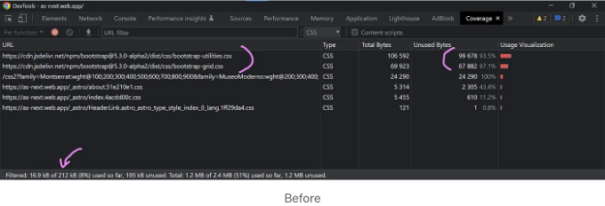

<!-- ui-log 수평형 -->
<ins class="adsbygoogle"
  style="display:block"
  data-ad-client="ca-pub-4877378276818686"
  data-ad-slot="9743150776"
  data-ad-format="auto"
  data-full-width-responsive="true"></ins>
<component is="script">
(adsbygoogle = window.adsbygoogle || []).push({});
</component>

## 이후:

이제 사용하지 않는 코드의 비율이 26%인 스타일 시트가 32.1kB 있습니다. 🔥

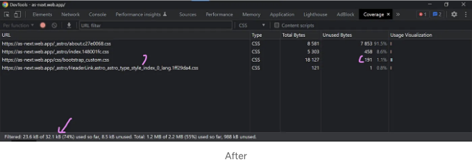

전체 CSS 양을 84.91% 줄였습니다. 🎉

<!-- ui-log 수평형 -->
<ins class="adsbygoogle"
  style="display:block"
  data-ad-client="ca-pub-4877378276818686"
  data-ad-slot="9743150776"
  data-ad-format="auto"
  data-full-width-responsive="true"></ins>
<component is="script">
(adsbygoogle = window.adsbygoogle || []).push({});
</component>

하지만 더 줄일 수도 있어요!

만일 여러분이 사이트에서 사용되지 않는 스타일을 0%로 만드는 방법을 알고 있다면, 여러분의 글을 공유해 주세요!!!

참고로, 이 글은 Three.js, GSAP, 그리고 Scrollbooster와 같은 리치 인터랙션 라이브러리를 사용하여 앱의 성능을 상당히 향상시키는 방법에 대해 쓰는 시리즈 중 일부에요.

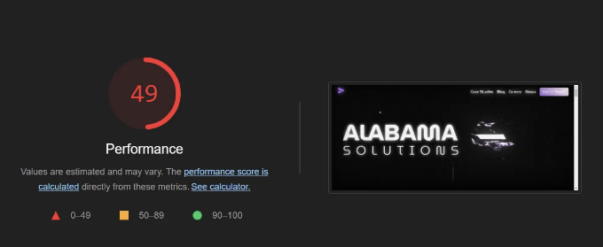

<!-- ui-log 수평형 -->
<ins class="adsbygoogle"
  style="display:block"
  data-ad-client="ca-pub-4877378276818686"
  data-ad-slot="9743150776"
  data-ad-format="auto"
  data-full-width-responsive="true"></ins>
<component is="script">
(adsbygoogle = window.adsbygoogle || []).push({});
</component>

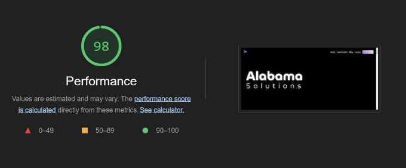

프로젝트 저장소: [https://github.com/GiustiRo/as-next-astro](https://github.com/GiustiRo/as-next-astro)