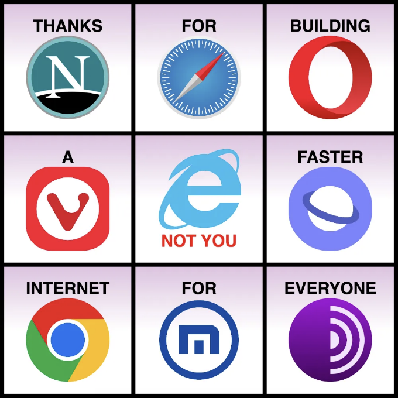
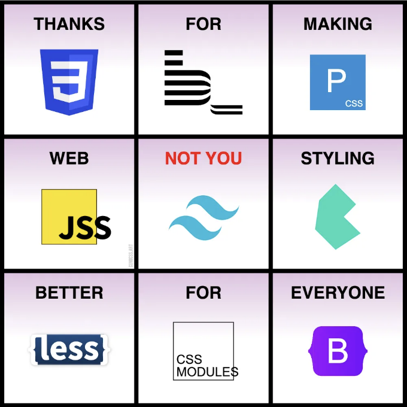

# 어떤 배경

지난 주에 Nerdearla 컨퍼런스에서 CSS로 그림 그리는 워크샵을 진행했어. CSS로 어떻게 아트를 만들고, comiCSS에 적용하는 방법, 그리고 배운 점들에 대해 이야기했지.

워크샵 끝에 참가자들이 직접 만들어보라고 만화를 그리기를 권유했어, 그리고 나도 빠르게 하나 만들어 봤지. 이미 브라우저 로고 몇 개를 코드로 만들어 둔 게 있어서, "not you" 밈을 만들어 보았어:

<!-- ui-log 수평형 -->
<ins class="adsbygoogle"
  style="display:block"
  data-ad-client="ca-pub-4877378276818686"
  data-ad-slot="9743150776"
  data-ad-format="auto"
  data-full-width-responsive="true"></ins>
<component is="script">
(adsbygoogle = window.adsbygoogle || []).push({});
</component>

또 무례한 버전을 만들어 놨는데, Tailwind를 조롱하는 거야. 개인적인 것은 전혀 아니야. 현재 인기 있는 CSS 프레임워크고, 그 커뮤니티는 농담이나 비판을 잘 받아들이지 못해... 나한테는 재밌지!

그런데 그런 댓글들이 오기 시작했어: "어떻게 이 글이 Tailwind를 반대하고 Bootstrap을 옹호하는 건데?" 이건 내게는 문제의 핵심을 빗나가는 질문인데. 하지만 그 질문에 대답하자면: 이 농담은 Bootstrap을 옹호하거나 Tailwind에 반대하는 것이 아니야 (그래, 아마 조금 그래). Tailwind나 Bootstrap에 뭔가 본질적으로 잘못된 것은 없거든 (사실 말이야).

그래서 나는 생각해 보게 되었어...

<!-- ui-log 수평형 -->
<ins class="adsbygoogle"
  style="display:block"
  data-ad-client="ca-pub-4877378276818686"
  data-ad-slot="9743150776"
  data-ad-format="auto"
  data-full-width-responsive="true"></ins>
<component is="script">
(adsbygoogle = window.adsbygoogle || []).push({});
</component>

# 나의 생각

부트스트랩이 지금 나쁜 것으로 여겨질 수 있지만, 이는 웹 개발 및 스타일링에 대해 테일윈드보다 더 많은 일을 해 왔습니다 (그리고 앞으로도 할 수 있을까요?)

부트스트랩은 지루할 수 있고, 모든 사이트가 매우 유사해 보일 수 있지만, 웹 스타일링을 모르는 사람들에게 그것을 가르쳤습니다. 개발자들뿐만 아니라 웹사이트를 구축하는 누구에게나. 웹 개발에 대해 잘 알지 못하는 사람들도 멋지게 보이는 웹사이트를 구축할 수 있었습니다 (이것은 추정 20%의 웹이 부트스트랩을 사용한다고 반영됩니다).

한편, 테일윈드는 개발자에게만 스타일링을 더 쉽게 제공합니다. 사용하려면 CSS/스타일에 대해 알아야 합니다: 마진과 패딩, 단위, 요소 상태 등의 차이...

<!-- ui-log 수평형 -->
<ins class="adsbygoogle"
  style="display:block"
  data-ad-client="ca-pub-4877378276818686"
  data-ad-slot="9743150776"
  data-ad-format="auto"
  data-full-width-responsive="true"></ins>
<component is="script">
(adsbygoogle = window.adsbygoogle || []).push({});
</component>

풀리는 거엔다 이용법, 특히 개발자가 아닌 분들은 가지지 않거나 원치 않을 수 있는 학습곡선이 존재합니다. 이런 점에서 Tailwind는 "실용성이 적고" 좀 더 특수한 것으로 여겨질 수 있습니다 (Google에 따르면, 이를 사용하는 사이트는 0.5%밖에 되지 않지만, 출시 일자를 고려하면 공정한 비교라고는 할 수 없습니다).

내 의견으로는, 개발자들은 결국 Tailwind를 떠나게 될 것입니다... 그리고 많은 이점으로 여겨지는 것들이 나중에는 단점으로 여겨질 것입니다. 그것이 유머로운 점일 겁니다.

이전에 언급했듯이, 당신과 당신의 프로젝트에 맞는 Tailwind를 사용하는 데 문제가 없습니다. 저는 Tailwind를 “소수를 위한 프레임워크”로 보는데, “대중을 위한 프레임워크”가 아닌 것 같습니다 (Bootstrap이었거나 하였던 것을 생각해보면).

하지만 아마도 저는 틀릴 것입니다.