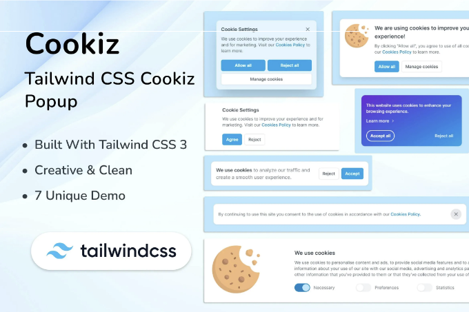
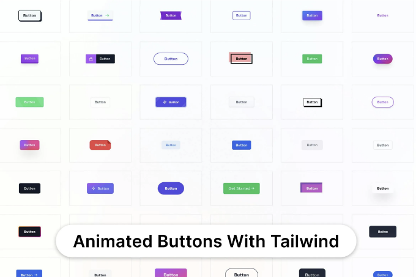
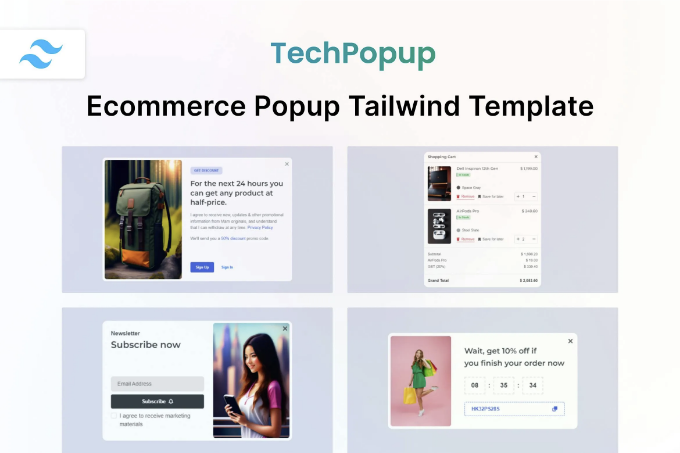
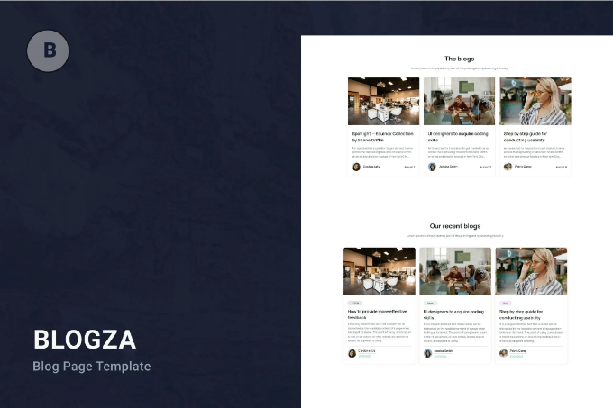
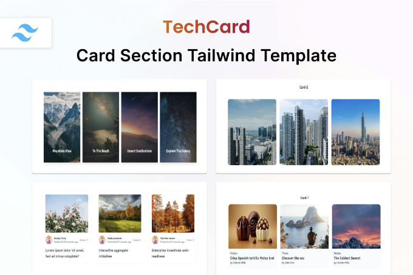
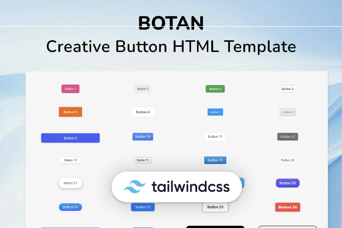
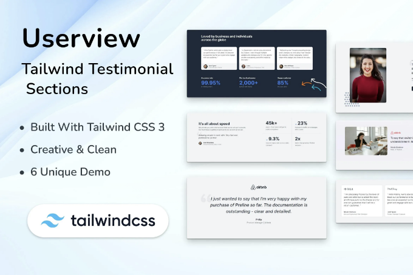
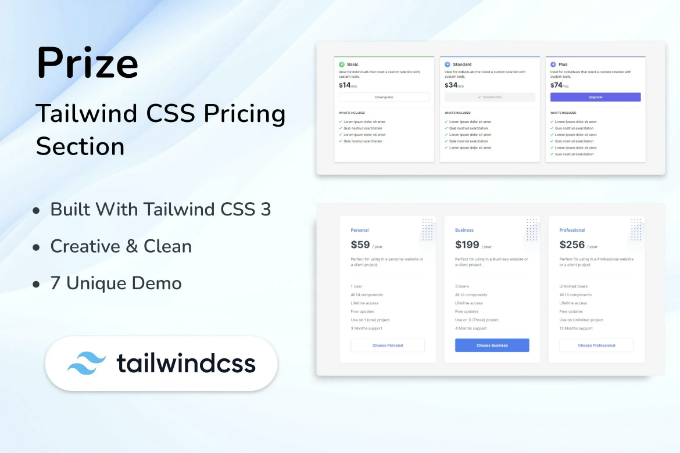

🔍 지금 Tailwind CSS 3 쿠키 팝업 Cookiz를 확인해보세요! 이 📁랜딩 페이지 템플릿 웹 템플릿을 탐험하고 여기서 🆓 무료 다운로드를 요청하세요. 함께 공작을 시작합시다! 🚀

실시간 미리보기

Cookiz - 서로 다른 화면 크기에 매끄럽게 적응하는 쿠키를 위해 세심하게 설계된 Tailwind CSS 3 템플릿. 이 템플릿은 100% W3C 웹 표준을 준수하기 위해 세심하게 제작된 포괄적인 HTML 및 CSS 파일 세트와 함께 제공됩니다. Tailwind UI로 귀사의 다양한 제공물을 완전히 반응형, 모바일 중심으로 우아하게 전시합니다.

<!-- ui-log 수평형 -->
<ins class="adsbygoogle"
  style="display:block"
  data-ad-client="ca-pub-4877378276818686"
  data-ad-slot="9743150776"
  data-ad-format="auto"
  data-full-width-responsive="true"></ins>
<component is="script">
(adsbygoogle = window.adsbygoogle || []).push({});
</component>

주요 속성:

- 7가지 독특하고 응답성 있는 Tailwind CSS 3 쿠키 데모
- Tailwind CSS로 구현되었습니다.
- 즉시 구현할 준비가 되어 있습니다.
- 최신 Tailwind CSS 3 기술로 구축되었습니다.
- W3C 표준에 따라 유효성이 검증되었습니다.
- HTML 및 CSS 전문 기술을 사용하여 개발되었습니다.
- 주의 깊게 주석이 달린 정리된 코드베이스
- 사용자 친화적이고 편리한 통합
- 포괄적이고 상세한 문서
- Tailwind CSS v3.3.2를 기반으로 함
- 깨끗한 코드
- HTML5 및 CSS3 마크업
- W3C 유효 마크업
- 깨끗하고 현대적이며 최소한의 창의적인 디자인
- 완전히 응답형 레이아웃
- 사용자 정의 가능한 카운트다운 표시
- Google 글꼴 사용
- 자세히 문서화됨
- 쉬운 사용자 정의
- Retina 화면 대응
- 다중 브라우저 지원
- flowbite
- preline
- material-tailwind
- daisyui
- 개발자를 위한: HTML 및 CSS 전문 팀의 능력을 활용하여 개발을 간소화합니다.
- 설치가 필요하지 않음: 복잡한 설치 절차를 잊고 간단히 클릭하여 실행할 수 있는 문제없는 설정을 제공합니다.
- 관리자 권한 호환성: 관리자 권한을 사용하여 필요한 권한을 부여할 수 있는 유연성을 제공합니다.
- Tailwind CSS 3 통합: 새로운 기능과 기능을 스타일링 도구상자에 제공하는 최신 버전인 Tailwind CSS 3으로 스타일을 맞춤화합니다.
- 순수한 CSS, JavaScript, HTML 구성 요소: 웹 개발을 위한 기본 구성 요소인 순수 CSS, JavaScript, HTML로 구성된 패키지. 이를 통해 프로젝트에 가벼우면서도 효율적인 기반을 제공합니다.
- 서비스 간 다양성: 대기관, 부동산, 교육, 포트폴리오, 블로그, 여행, 이벤트, 패션, 호텔, 사진 등에 포함되는 스펙트럼의 서비스에 맞춰져 있습니다. 산업 간의 적응성을 고려하여 다양한 산업에서 다재다능한 선택지가 됩니다.
- 다양한 사용 사례: 디지털 마케팅, 뉴스, 의료, 이메일, NFT, 스파, 산업, 양식, 창의적인 노력, 스포츠, 그래픽, 앱, 암호화폐, 모바일, 게임, 이력서, 이력서, 뉴스 레터, 웹 개발, 체육관, SEO, Airbnb, 비정부 기구 및 기술 관련 프로젝트에 이 기능이 확장됩니다.
- CSS 라이브러리 호환성: Bulma, Bootstrap 5, Bootstrap 4, Tailwind UI 등 인기 있는 CSS 라이브러리와의 시행착오 없는 통합. 기본적으로 선호하는 라이브러리에 따라 스타일링 옵션의 유연성을 보장합니다.
- 언어 지원: ASP, PHP, Python, Java, Node, React, Vue, WordPress, Angular, Remix, Svelte, CakePHP, Express, RedwoodJS 등 다양한 프로그래밍 언어를 지원합니다.
- 프레임워크 통합: Next, Laravel, Nuxt, Svelte Kit, Qwik, Ruby on Rails, Meteor, Astro, Shopify, .NET, Vue.js, Django, Spring, Flask, nextui, CodeIgniter, Symfony, Native, React Native, Ionic, Framework 7 등 주요 프레임워크와 쉽게 통합할 수 있도록 설계되었습니다. 이러한 다양한 프레임워크 지원으로 다양한 개발자 선호도에 맞춰져 있습니다.
- 번들러 호환성: Vite, Parcel, Yarn, NPM, Gulp과 같은 인기 있는 번들러 지원. 이 솔루션은 다양한 번들링 도구와 호환되어 원활하고 효율적인 개발 워크플로우를 지원합니다.

그리고 그 이외의 기능들... 

## 항목 태그

#html #css #tailwind #e커머스 #tailwindcss #원페이지 #UI #쿠키 #팝업 #버튼 #쿠키팝업 #TaiwindUI #TailwindComponents #무료 #FreeTailwindUI

<!-- ui-log 수평형 -->
<ins class="adsbygoogle"
  style="display:block"
  data-ad-client="ca-pub-4877378276818686"
  data-ad-slot="9743150776"
  data-ad-format="auto"
  data-full-width-responsive="true"></ins>
<component is="script">
(adsbygoogle = window.adsbygoogle || []).push({});
</component>

## 파일 유형

HTML, CSS, SASS, JS

## 추가 항목

Retina 지원
반응형
문서 포함

<!-- ui-log 수평형 -->
<ins class="adsbygoogle"
  style="display:block"
  data-ad-client="ca-pub-4877378276818686"
  data-ad-slot="9743150776"
  data-ad-format="auto"
  data-full-width-responsive="true"></ins>
<component is="script">
(adsbygoogle = window.adsbygoogle || []).push({});
</component>

## 상업적 라이선스

추가 정보

## 비슷한 웹 템플릿

더 보기

<!-- ui-log 수평형 -->
<ins class="adsbygoogle"
  style="display:block"
  data-ad-client="ca-pub-4877378276818686"
  data-ad-slot="9743150776"
  data-ad-format="auto"
  data-full-width-responsive="true"></ins>
<component is="script">
(adsbygoogle = window.adsbygoogle || []).push({});
</component>

TechButton — Tailwind CSS 3 Button HTML 템플릿 by Techzaa

TechPopup — Ecommerce Popup HTML 템플릿 by Techzaa

<!-- ui-log 수평형 -->
<ins class="adsbygoogle"
  style="display:block"
  data-ad-client="ca-pub-4877378276818686"
  data-ad-slot="9743150776"
  data-ad-format="auto"
  data-full-width-responsive="true"></ins>
<component is="script">
(adsbygoogle = window.adsbygoogle || []).push({});
</component>

- Blogza by Zoyo-Themes

- Techzaa

<!-- ui-log 수평형 -->
<ins class="adsbygoogle"
  style="display:block"
  data-ad-client="ca-pub-4877378276818686"
  data-ad-slot="9743150776"
  data-ad-format="auto"
  data-full-width-responsive="true"></ins>
<component is="script">
(adsbygoogle = window.adsbygoogle || []).push({});
</component>

## MyraStudio 더보기

더 보기

MyraStudio에서 제작한 곧 출시될 HTML Tailwind 템플릿 - VibeUp

<!-- ui-log 수평형 -->
<ins class="adsbygoogle"
  style="display:block"
  data-ad-client="ca-pub-4877378276818686"
  data-ad-slot="9743150776"
  data-ad-format="auto"
  data-full-width-responsive="true"></ins>
<component is="script">
(adsbygoogle = window.adsbygoogle || []).push({});
</component>

Creative CSS Button HTML Template — Botan by MyraStudio

Tailwind Templates & Testimonial UI Kit — Userview by MyraStudio

<!-- ui-log 수평형 -->
<ins class="adsbygoogle"
  style="display:block"
  data-ad-client="ca-pub-4877378276818686"
  data-ad-slot="9743150776"
  data-ad-format="auto"
  data-full-width-responsive="true"></ins>
<component is="script">
(adsbygoogle = window.adsbygoogle || []).push({});
</component>

MyraStudio에서 새로운 창의적인 Tailwind CSS 요금 부문 - MyraStudio의 상금