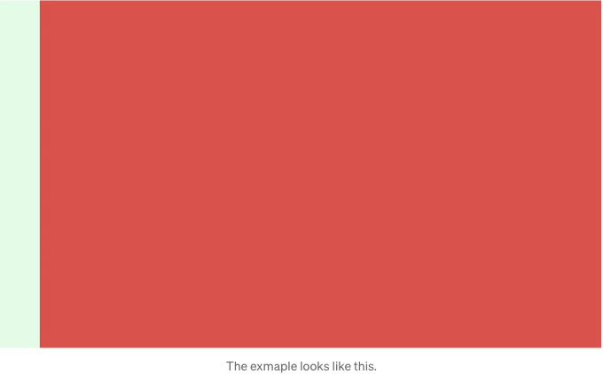

내 수업 프로젝트에서 VSCode와 유사한 코드 편집기를 디자인하고 있던 중, 편집기의 우측 상단에 실행 및 디버그 버튼을 어떻게 표시할지에 문제가 발생했어요.

구글에서 몇 가지 Q&A를 찾아보고 해결 방법을 알아내게 되었어요. Q&A의 링크는 이 글 하단에 있어요.

```js
<div id="parent" class="relative h-screen w-screen">
  <div id="child-bottom" class="h-full w-full bg-red-100 hover:bg-red-500"/>
  <div id="child-top" class="absolute t-0 left-0 w-16 h-full bg-green-100 hover:bg-green-500"/>
</div>
```

하나의 부모 div가 바깥에 있어요. 부모 div 안에는 두 개의 자식이 있어요: 아래쪽 자식과 위쪽 자식이에요.

<!-- ui-log 수평형 -->
<ins class="adsbygoogle"
  style="display:block"
  data-ad-client="ca-pub-4877378276818686"
  data-ad-slot="9743150776"
  data-ad-format="auto"
  data-full-width-responsive="true"></ins>
<component is="script">
(adsbygoogle = window.adsbygoogle || []).push({});
</component>

부모 div에는 "relative"를 클래스에 넣어주세요.

상위 자식 div에는 "absolute"를 클래스에 넣어주세요. 그리고 위치("t-0"와 "left-0")도 할당되어야 합니다.



예제 코드는 Tailwind Play에서 확인할 수 있습니다.

<!-- ui-log 수평형 -->
<ins class="adsbygoogle"
  style="display:block"
  data-ad-client="ca-pub-4877378276818686"
  data-ad-slot="9743150776"
  data-ad-format="auto"
  data-full-width-responsive="true"></ins>
<component is="script">
(adsbygoogle = window.adsbygoogle || []).push({});
</component>

유용한 링크:

Tailwind CSS를 사용하여 다른 div 위에 div 배치하기 - 스택 오버플로우

Tailwind CSS로 div를 겹치는 방법 - 스택 오버플로우

또한 이 이야기는 내 블로그에서도 찾아볼 수 있어요:

<!-- ui-log 수평형 -->
<ins class="adsbygoogle"
  style="display:block"
  data-ad-client="ca-pub-4877378276818686"
  data-ad-slot="9743150776"
  data-ad-format="auto"
  data-full-width-responsive="true"></ins>
<component is="script">
(adsbygoogle = window.adsbygoogle || []).push({});
</component>

TailwindCSS: 다른 div 위에 div를 겹쳐 놓는 방법이 있나요? (xavieryuhanliu.com)