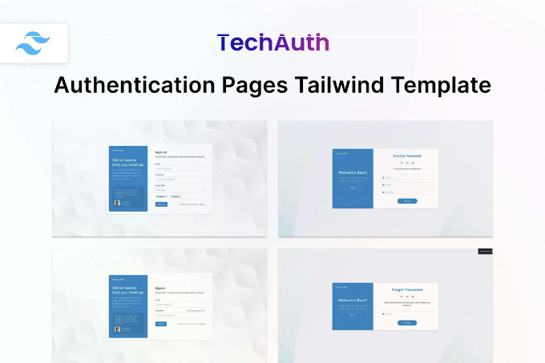
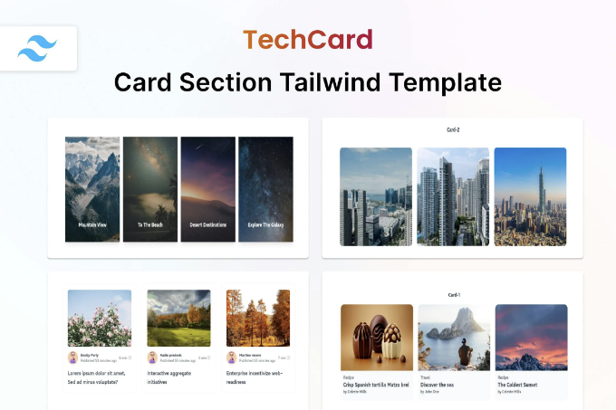
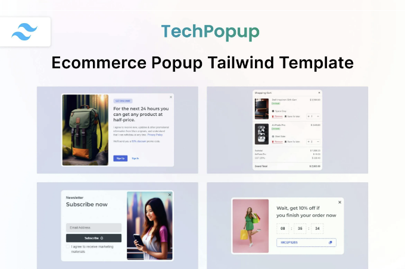
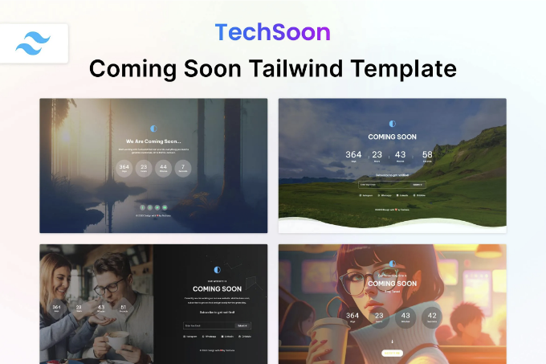
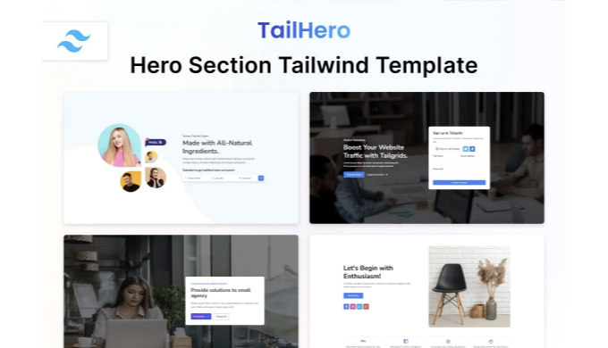
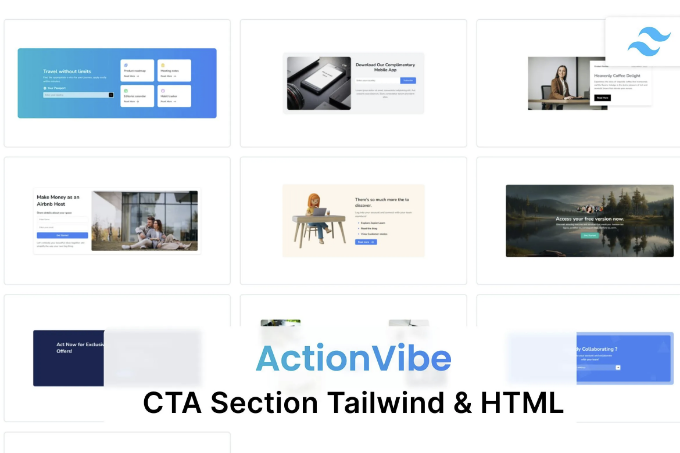
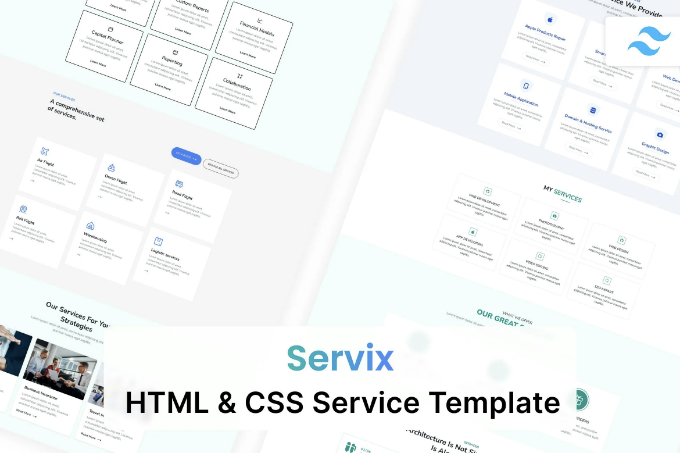

🔍 지금 TechAuth Auth Pages Tailwind CSS 3 HTML 템플릿을 확인해보세요! 이 📁 사이트 템플릿 웹 템플릿을 탐험하고 여기에서 🆓 무료 다운로드를 받으세요. 함께 제작을 시작해봅시다! 🚀

라이브 미리보기

TechAuth는 로그인, 회원가입, 비밀번호 잊어버림 등 인증 목적의 세련되고 간단한 HTML 페이지 세트입니다. 소스 코드는 깨끗하고 간결합니다. Tailwind CSS의 최신 버전(v3.3.3)을 이용해 HTML5, SCSS 및 CSS3로 구축되어 완전히 반응형입니다. 이 템플릿은 사용자 친화적이고 구현하기 쉬우며 성능이 향상되었습니다. 다음 프로젝트를 위해 특정 요구 사항에 맞게 손쉽게 사용자 정의할 수 있습니다.

<!-- ui-log 수평형 -->
<ins class="adsbygoogle"
  style="display:block"
  data-ad-client="ca-pub-4877378276818686"
  data-ad-slot="9743150776"
  data-ad-format="auto"
  data-full-width-responsive="true"></ins>
<component is="script">
(adsbygoogle = window.adsbygoogle || []).push({});
</component>

주요 기능

- 로그인, 가입, 비밀번호 잊기 등
- Tailwind CSS v3.3.3 기반
- HTML5 및 CSS3로 제작
- SCSS 지원
- 완전히 반응형
- 쉽게 사용자 정의 가능
- 크로스 브라우저 최적화
- 깨끗한 코드
- 픽셀 완벽한 디자인
- 현대적이고 깨끗한 디자인
- Google 폰트로 제작
- 그 외 다양한 기능

기능

- 아무것도 설치할 필요가 없습니다. 클릭해서 실행하세요.
- 어드민과 함께 사용 가능
- Tailwind CSS 3과 함께 사용할 수 있습니다.
- 순수한 CSS, 자바스크립트, HTML로 구성되어 있습니다.
- 다음 서비스와 함께 사용할 수 있습니다: 기관, 부동산, 교육, 포트폴리오, 블로그, 여행, 이벤트, 패션, 호텔, 사진 촬영
- 몇 가지 사용 사례: 디지털 마케팅, 뉴스, 의료, 이메일, NFT, 스파, 산업, 양식, 크리에이티브, 스포츠, 그래픽, 앱, 암호화폐, 모바일, 게임, 이력서, 뉴스레터, 웹, 체육관, SEO, 에어비앤비, 비영리 단체, 기술
- 다음 CSS 라이브러리와 함께 사용할 수 있습니다: Bulma, Bootstrap 5, Bootstrap 4, Tailwind UI,
- 다음 언어와 함께 사용할 수 있습니다: ASP, PHP, Python, Java, Node, React, Vue, WordPress, Angular, Remix, Svelte, CakePHP, Express, RedwoodJS
- 쉽게 사용할 수 있는 다음 프레임워크도 함께 사용할 수 있습니다: Next, Laravel, Nuxt, Svelte Kit, Qwik, Ruby on Rails, Meteor, Astro, Shopify, .NET, Vue.js, Django, Spring, Flask, CodeIgniter, Symfony, Native, React Native, Ionic, Framework 7,
- 다음 번들러도 사용할 수 있습니다: Vite, Parcel, Yarn, NPM, Gulp

<!-- ui-log 수평형 -->
<ins class="adsbygoogle"
  style="display:block"
  data-ad-client="ca-pub-4877378276818686"
  data-ad-slot="9743150776"
  data-ad-format="auto"
  data-full-width-responsive="true"></ins>
<component is="script">
(adsbygoogle = window.adsbygoogle || []).push({});
</component>

## 항목 태그

#html #css #tailwind #page #ecommerce #tailwindcss #onepage #ui #agency #portfolio #app #mobile #auth #login #register

## 파일 유형

HTML, CSS, JS

<!-- ui-log 수평형 -->
<ins class="adsbygoogle"
  style="display:block"
  data-ad-client="ca-pub-4877378276818686"
  data-ad-slot="9743150776"
  data-ad-format="auto"
  data-full-width-responsive="true"></ins>
<component is="script">
(adsbygoogle = window.adsbygoogle || []).push({});
</component>

## 추가 기능

레티나 준비됨
반응형
문서 포함됨

## 상업 라이센스

더 많은 정보

<!-- ui-log 수평형 -->
<ins class="adsbygoogle"
  style="display:block"
  data-ad-client="ca-pub-4877378276818686"
  data-ad-slot="9743150776"
  data-ad-format="auto"
  data-full-width-responsive="true"></ins>
<component is="script">
(adsbygoogle = window.adsbygoogle || []).push({});
</component>

## 비슷한 웹 템플릿

더 보기

테크자의 TechButton — Tailwind CSS 3 버튼 HTML 템플릿

<!-- ui-log 수평형 -->
<ins class="adsbygoogle"
  style="display:block"
  data-ad-client="ca-pub-4877378276818686"
  data-ad-slot="9743150776"
  data-ad-format="auto"
  data-full-width-responsive="true"></ins>
<component is="script">
(adsbygoogle = window.adsbygoogle || []).push({});
</component>

<!-- ui-log 수평형 -->
<ins class="adsbygoogle"
  style="display:block"
  data-ad-client="ca-pub-4877378276818686"
  data-ad-slot="9743150776"
  data-ad-format="auto"
  data-full-width-responsive="true"></ins>
<component is="script">
(adsbygoogle = window.adsbygoogle || []).push({});
</component>

TechService — Techzaa에서 만든 HTML & CSS 서비스 템플릿

## Techzaa의 더 많은 콘텐츠

더 보기

<!-- ui-log 수평형 -->
<ins class="adsbygoogle"
  style="display:block"
  data-ad-client="ca-pub-4877378276818686"
  data-ad-slot="9743150776"
  data-ad-format="auto"
  data-full-width-responsive="true"></ins>
<component is="script">
(adsbygoogle = window.adsbygoogle || []).push({});
</component>

Techzaa사의 Coming Soon HTML Tailwind 템플릿 — Techsoon

Techzaa사의 TailHero — 창의적인 히어로 섹션 템플릿

<!-- ui-log 수평형 -->
<ins class="adsbygoogle"
  style="display:block"
  data-ad-client="ca-pub-4877378276818686"
  data-ad-slot="9743150776"
  data-ad-format="auto"
  data-full-width-responsive="true"></ins>
<component is="script">
(adsbygoogle = window.adsbygoogle || []).push({});
</component>

ActionVibe — Techzaa가 제작한 Tailwind Call to Action HTML 템플릿

Servix — Techzaa가 제작한 HTML & CSS 서비스 템플릿